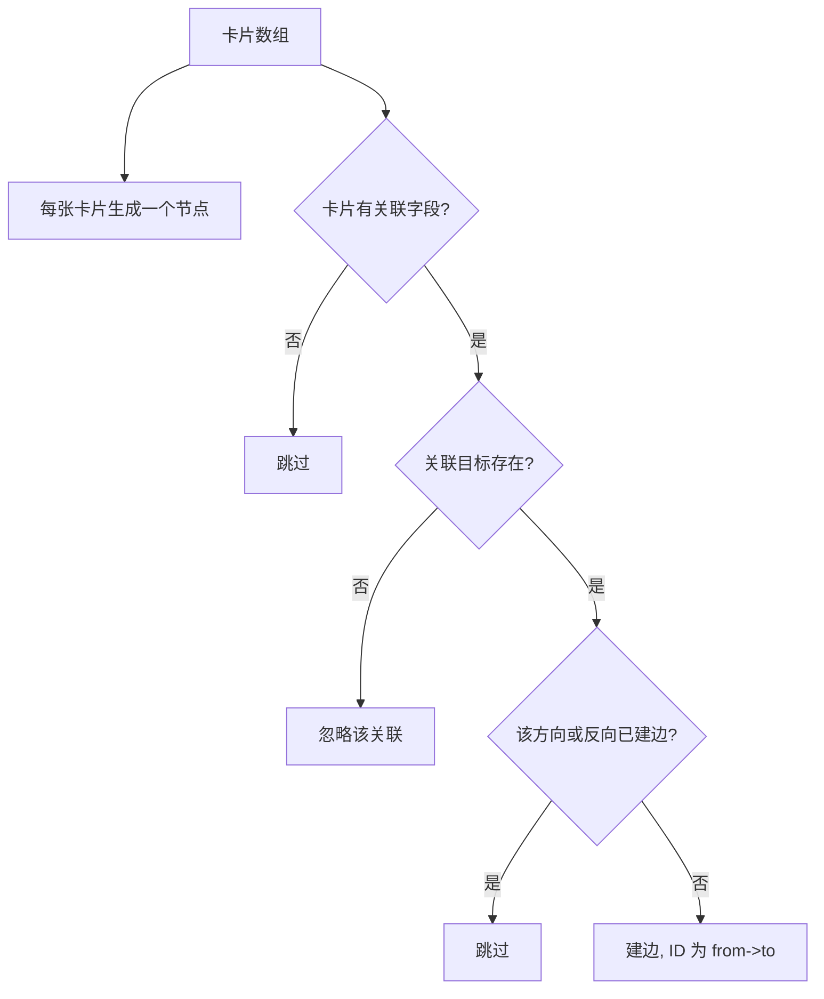
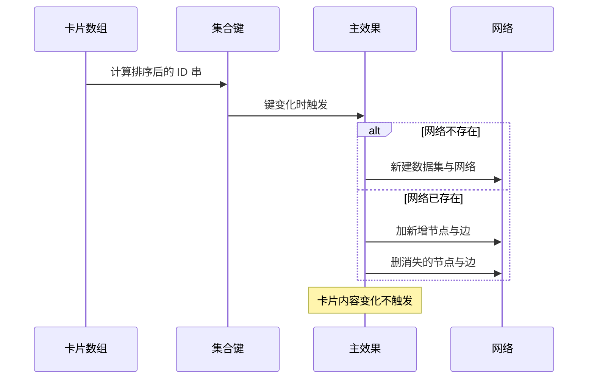

# 图谱数据模型与增量更新

知识图谱组件 `src/components/GraphView.tsx`（336 行）直接把渲染交给 `vis-network`：节点与边先由纯函数从卡片数组转换出来（`src/utils/graph.ts`），再交给 `DataSet` 与 `Network` 渲染（`src/components/GraphView.tsx:2`）。

数据进入组件后有两道关卡：一道决定"卡片集合是否变化"，另一道决定"哪些节点与边需要增删"。这两道关卡的存在，使图谱在卡片标题变化时不会重建整个网络，而在卡片增删时只动差异部分。 转换规则与差分逻辑是下面两段的核心。

## 卡片到节点与边的转换

转换函数只依赖卡片数组（`src/utils/graph.ts:15-47`）。每张卡片变成一个有向节点，标签是卡片标题，节点大小固定为 25（`src/utils/graph.ts:16-21`）：

```tsx
const nodes: GraphNode[] = cards.map((card) => ({
  id: card.id,
  label: card.title,
  color: undefined,
  size: 25,
}))
```

边来自卡片之间的关联。关联字段是 ID 数组，只有指向当前卡片集合中真实存在的 ID 才会生成边（`src/utils/graph.ts:35-42`），也就是指向已删除卡片的关联会被忽略（`src/utils/graph.ts:38-40`）。

边的去重考虑了两个方向（`src/utils/graph.ts:24-32`）：

```tsx
const key = `${from}->${to}`
const reverseKey = `${to}->${from}`
if (!edgeSet.has(key) && !edgeSet.has(reverseKey)) {
  edgeSet.add(key)
  edges.push({ id: key, from, to, color: '#9aa5b1' })
}
```

一张卡关联另一张、对方也反向关联时只保留先遇到的那条边。边的 ID 用"起点指向终点"的字符串，这是为了让增量更新能跨渲染匹配到同一条边，注释里写明了这个目的（`src/utils/graph.ts:28-29`）。



## 集合变化的两级判断

组件先用一个排序拼接的键描述卡片集合（`src/components/GraphView.tsx:31-33`）：

```tsx
const cardIdsKey = useMemo(() => cards.map(c => c.id).sort().join(','), [cards])
const cardIds = useMemo(() => new Set(cards.map(c => c.id)), [cardIdsKey])
```

排序保证顺序变化不会改变键；第二个 `useMemo` 依赖键而不是数组，因此卡片内容或顺序变化时不会新建集合对象（`src/components/GraphView.tsx:35-38`）。主效果只依赖这个键（`src/components/GraphView.tsx:229`），卡片标题或正文变化不会触发图谱重建。

需要说明的是，节点标签取自标题，所以标题变化时图谱上的文字不会立刻更新：集合未变，效果不执行。这属于当前的取舍，图谱以"结构变化"为更新触发条件。

## 首次构建与增量差分

主效果有两条分支。网络还不存在时走构建路径：清空容器、建立两个数据集、从根元素的计算样式里取主题色、组装选项并创建网络（`src/components/GraphView.tsx:59-153`）。

网络已存在时走差分路径（`src/components/GraphView.tsx:198-228`）：

| 步骤 | 判断依据 | 动作 |
| --- | --- | --- |
| 新增节点 | 新集合有、旧集合没有 | `nodesRef.add`（`src/components/GraphView.tsx:202-208`） |
| 删除节点 | 旧集合有、新集合没有 | `nodesRef.remove`（`src/components/GraphView.tsx:210-212`） |
| 新增边 | 转换结果里有、数据集里没有 | `edgesRef.add`（`src/components/GraphView.tsx:214-221`） |
| 删除边 | 数据集里有、转换结果里没有 | `edgesRef.remove`（`src/components/GraphView.tsx:222-225`） |

边的比较把数据集里的 ID 转成字符串再比对（`src/components/GraphView.tsx:217`），因为数据集返回的 ID 类型不保证与字符串一致。差分完成后把当前集合存进引用，作为下一次比较的基准（`src/components/GraphView.tsx:227`）。

卡片清空时网络会被销毁并把四个引用复位（`src/components/GraphView.tsx:45-54`），组件同时返回空状态界面（`src/components/GraphView.tsx:316-324`）。



## 易错点

| 位置 | 问题 | 建议 |
| --- | --- | --- |
| `src/components/GraphView.tsx:31-33` | 集合键只含 ID 与顺序，标题变化不会更新节点标签 | 需要实时标签时把标题并入键，或单独更新标签 |
| `src/utils/graph.ts:16-21` | 每个节点写死大小 25，与选项里的全局节点大小 20 并存，实际以节点自身值为准 | 想统一调整时改一处，避免两个数值互相掩盖 |
| `src/utils/graph.ts:24-32` | 反向去重让边的方向信息丢失，先遇到的方向被保留 | 需要方向语义时改用有向边并保留箭头 |
| `src/components/GraphView.tsx:217` | 边 ID 比对依赖字符串转换，数据集类型变化可能漏匹配 | 统一在转换函数里把 ID 定为字符串并保持 |
| `src/components/GraphView.tsx:45-54` | 卡片清空会销毁网络，再新建时物理布局重新计算 | 短时空态可保留网络，或缓存节点位置 |
| `src/utils/graph.ts:39` | 判断关联目标存在用线性查找，卡片多时是平方级 | 预先把 ID 收进集合再判断 |

## 小结

### 核心概念

* 图谱由 `vis-network` 的 `DataSet` 与 `Network` 渲染，节点与边先用纯函数转换（`src/components/GraphView.tsx:2`、`src/utils/graph.ts:15-47`）。
* 每张卡片对应一个节点，标签为标题，大小固定 25（`src/utils/graph.ts:16-21`）。
* 关联只在本卡片集合内成立，边按两方向去重，ID 为起点指向终点（`src/utils/graph.ts:24-42`）。
* 集合键是排序后的 ID 串，决定图谱是否更新（`src/components/GraphView.tsx:31-38`）。
* 首次构建创建网络，之后按新增与删除差分更新（`src/components/GraphView.tsx:59-153`、`:198-228`）。
* 卡片清空时销毁网络并展示空状态（`src/components/GraphView.tsx:45-54`、`:316-324`）。

### 设计权衡

| 选择 | 收益 | 代价 |
| --- | --- | --- |
| 用现成图谱库 | 力导布局、缩放与平移开箱可用 | 依赖库的选项体系，样式要通过计算样式注入 |
| 集合键只含 ID | 内容编辑不重建图谱，避免布局跳动 | 标题变化不会即时反映到节点标签 |
| 边按两方向去重 | 双向关联不会画成两条 | 方向信息丢失，语义被简化 |
| 差分更新而非全量替换 | 增删卡片时布局稳定 | 需要维护上一轮集合与边 ID 匹配 |
| 空态销毁网络 | 释放画布与模拟器 | 回到空再恢复时布局重算 |

## 练习

### 基础题

1. 说明一张卡片如何变成节点，哪些关联会被忽略。
2. 集合键为什么用排序后的 ID 串，它带来的取舍是什么。
3. 差分更新分别比较哪四类元素，边 ID 为什么用那个形式。

### 挑战题

4. 让节点标签随标题变化更新，写出需要修改的依赖与更新方式，并说明如何避免每次输入都重建网络。
5. 支持有向边与双向边同时存在，列出转换函数与去重逻辑的改动，并说明如何保持增量匹配仍能命中旧边。

## 附：本页引用的路径

| 路径 | 用途 |
| --- | --- |
| /mnt/d/KnowledgeDiver/frontend/ | 前端工程根目录，文中相对路径均相对它 |
| `src/utils/graph.ts` | 卡片到节点与边的转换、相邻节点查询 |
| `src/components/GraphView.tsx` | 图谱组件与增量更新 |
| `src/types/card.ts` | 卡片的关联与反链字段 |
| `src/components/GraphView.css` | 图谱容器与空状态样式 |
| `package.json` | `vis-network` 与 `vis-data` 依赖 |
