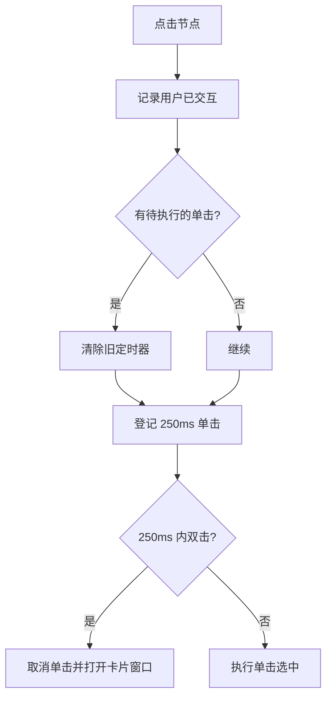
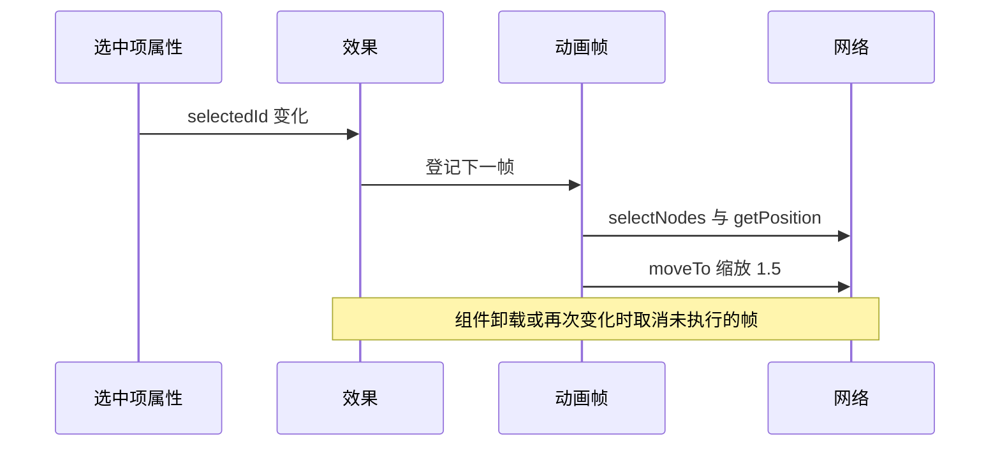

# 图谱交互与视口适配

图谱画布由库托管，交互却由组件定义。`GraphView` 给画布挂了四段交互逻辑：单击与双击的分工、物理模拟稳定后的自动适配、选中节点后的相机移动，以及面板变可见时的尺寸与适配。

这四段代码都围绕同一个约束：不能让相机动画与布局模拟互相打断。注释里有两次明确说明——一次解释为什么单击要延迟，一次解释为什么去掉了动画守卫（`src/components/GraphView.tsx`）。 四段交互代码各自处理一个问题，逐个说明。

## 单击延迟与双击抢跑

单击选中卡片，双击打开窗口。库在双击时会先发一次单击事件，如果单击立即处理，相机开始移动后马上又被双击的窗口打断，出现抖动（`src/components/GraphView.tsx`）。处理方式是给单击加二百五十毫秒延迟：

```tsx
if (clickTimerRef.current) clearTimeout(clickTimerRef.current)
clickTimerRef.current = setTimeout(() => {
  clickTimerRef.current = null
  onSelectCardRef.current(nodeId)
}, 250)
```

双击处理里先取消待执行的单击（`src/components/GraphView.tsx`），然后直接调用打开窗口的回调，该回调是可选的。两个回调都先存进引用并在每次渲染时更新，因此交互回调变化不会重建网络。

组件卸载时也会清掉未执行的单击定时器（`src/components/GraphView.tsx`），避免在销毁后调用回调。



## 稳定后自动适配视口

物理模拟第一次稳定时，网络会把全部节点放进视野（`src/components/GraphView.tsx`）：

```tsx
network.once('stabilized', () => {
  if (userInteractedRef.current) return
  network.fit({ animation: { duration: 500, easingFunction: 'easeInOutQuad' } })
})
```

适配只在用户没有交互过时执行。交互标记在单击与双击里都会置真（`src/components/GraphView.tsx`），因此用户在布局稳定前点过节点，自动适配就不会把视野拉回全局，避免覆盖用户的选择。

## 选中节点时移动相机

选中项变化时，组件在下一帧选中该节点并把相机移过去（`requestAnimationFrame` 的回调在下一次重绘前执行，把相机移动推迟到布局更新之后）：

```tsx
const raf = requestAnimationFrame(() => {
  const net = networkRef.current
  if (!net) return
  net.selectNodes([selectedId])
  const pos = net.getPosition(selectedId)
  net.moveTo({ position: { x: pos.x, y: pos.y }, scale: 1.5, animation: { duration: 400, easingFunction: 'easeInOutQuad' } })
})
return () => cancelAnimationFrame(raf)
```

注释说明这里没有使用"动画进行中"的守卫（`src/components/GraphView.tsx`）：库自身的移动动画能处理连续改目标，而守卫一旦在动画窗口内被置真又没有复位，会永久挡住后续聚焦。

需要提醒的是，这个效果没有先检查节点是否存在于图谱中。选中项指向的卡片若不在当前图谱数据集里，`getPosition` 的返回值可能为空，移动会带着无效坐标。



## 面板可见时的尺寸与适配

图谱在桌面、移动端与 Hub 页三处都用"保持挂载"的方式存在，因此画布尺寸变化不会自动发生。组件在可见时建立尺寸观察器（`ResizeObserver` 监听元素自身的尺寸变化并触发回调，比监听窗口 resize 更贴近容器）：

```tsx
const observer = new ResizeObserver((entries) => {
  for (const entry of entries) {
    const { width, height } = entry.contentRect
    if (width > 0 && height > 0) {
      network.setSize(`${width}px`, `${height}px`)
      network.redraw()
    }
  }
})
observer.observe(container)
const fitTimer = setTimeout(() => network.fit({ animation: { duration: 200, ... } }), 100)
```

观察器的回调只在宽高都大于零时更新尺寸，过滤掉面板收起时的零尺寸状态。除了观察器，还会在一百毫秒后做一次适配，让刚展开的画布重新居中。

三处复用的差别：

| 使用方 | 可见性来源 | 位置 |
| --- | --- | --- |
| 桌面主区 | 恒定可见 | `src/App.tsx` |
| Hub 页图谱标签 | 标签切换，组件保持挂载 | `src/components/HubPage.tsx` |
| 移动端图谱页 | 底部导航切换，传入可见性 | `src/components/mobile/MobileGraphPage.tsx` |

Hub 页的注释明确写了保持挂载的理由：避免图谱库重新初始化（`src/components/HubPage.tsx`）。

## 易错点

| 位置 | 问题 | 建议 |
| --- | --- | --- |
| `src/components/GraphView.tsx` | 移动相机前不校验节点是否在数据集里，无效坐标会产生一次无意义动画 | 先判断数据集里是否存在该 ID |
| `src/components/GraphView.tsx` | 效果只依赖可见性，画布尺寸变化由观察器兜底；观察器建立时若容器已可见则不会重新触发 | 面板尺寸变化频繁时同时观察父容器 |
| `src/components/GraphView.tsx` | 自动适配只监听一次稳定事件，之后新增卡片不会重新适配 | 需要时在节点数量变化后主动适配一次 |
| `src/components/GraphView.tsx` | 单击延迟 250 毫秒让选中反馈变慢 | 单击时先做轻量高亮，延迟后只做相机移动 |
| `src/components/HubPage.tsx` | 保持挂载意味着隐藏时仍在渲染画布 | 隐藏期间暂停物理模拟，减少无谓计算 |
| `src/components/mobile/MobileGraphPage.tsx` | 移动端卡片清空时组件不挂载，图谱状态丢失 | 与 Hub 页一致地保持挂载并展示空态 |

## 小结

### 核心概念

* 单击延迟二百五十毫秒，双击先取消待执行的单击再打开窗口（`src/components/GraphView.tsx`）。
* 交互回调存进引用，变化不会重建网络（`src/components/GraphView.tsx`）。
* 物理模拟稳定且用户未交互时自动适配视口（`src/components/GraphView.tsx`）。
* 选中项变化时在下一帧选中节点并移动相机，缩放固定为 1.5（`src/components/GraphView.tsx`）。
* 面板可见时用尺寸观察器更新画布并在百毫秒后适配（`src/components/GraphView.tsx`）。
* 三处复用都保持组件挂载，可见性由属性传入（`src/App.tsx`、`src/components/mobile/MobileGraphPage.tsx`）。

### 设计权衡

| 选择 | 收益 | 代价 |
| --- | --- | --- |
| 单击延迟区分双击 | 避免相机抖动与窗口抢跑 | 选中反馈慢半拍 |
| 稳定事件只监听一次 | 不打扰用户后续操作 | 新增节点后不再自动适配 |
| 不用动画守卫 | 连续选中都能聚焦 | 快速连点会产生多次相机动画 |
| 保持挂载并传可见性 | 切换标签不重建图谱 | 隐藏时仍占用渲染资源 |
| 尺寸观察器加延时适配 | 展开后画布立即正确 | 固定延时在慢设备上可能不够 |

## 练习

### 基础题

1. 说明单击为什么要延迟，双击做了哪些补救动作。
2. 自动适配视口在什么条件下执行，交互标记在哪里被置真。
3. 面板变可见后组件做了哪两件事来恢复画布。

### 挑战题

4. 让新增卡片后图谱自动适配一次，写出触发条件与判断逻辑，并说明如何避免用户正在查看局部时被打断。
5. 在隐藏期间暂停物理模拟，列出需要调用的库方法与恢复时机，并说明恢复后如何保持节点位置。

## 附：本页引用的路径

| 路径 | 用途 |
| --- | --- |
| /mnt/d/KnowledgeDiver/frontend/ | 前端工程根目录，文中相对路径均相对它 |
| `src/components/GraphView.tsx` | 交互、相机与视口适配 |
| `src/components/mobile/MobileGraphPage.tsx` | 移动端图谱页 |
| `src/components/HubPage.tsx` | Hub 页标签内的图谱复用 |
| `src/App.tsx` | 桌面图谱装配点 |
| `src/tests/GraphView.test.tsx` | 图谱组件的测试与库替身 |
