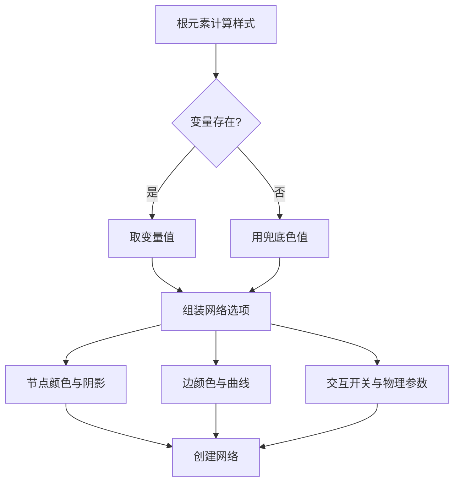
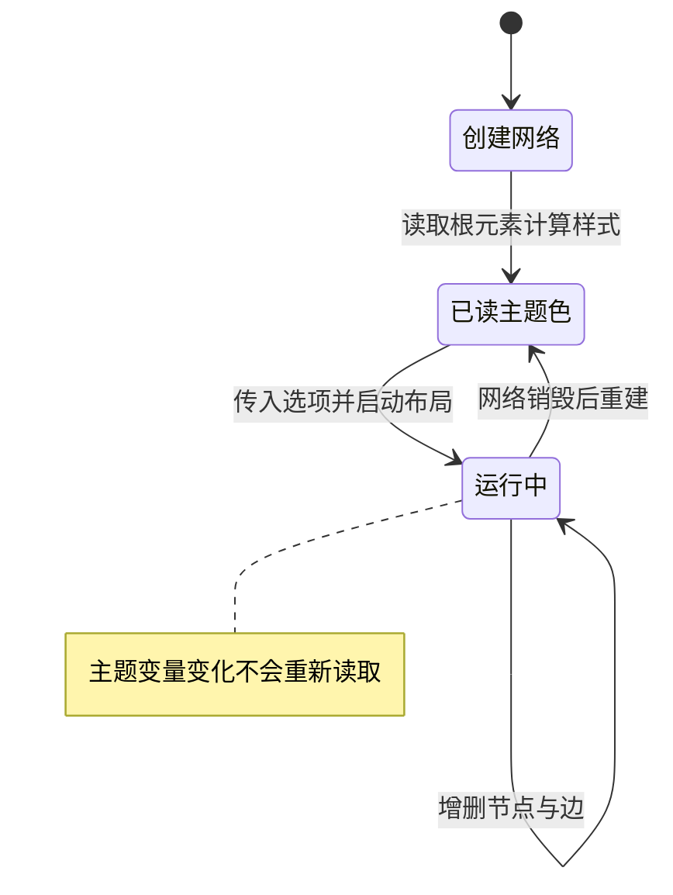

# 图谱样式与主题适配

图谱画布由库绘制，样式不来自 CSS 类，而是来自创建网络时传入的选项对象（`src/components/GraphView.tsx`）。组件在创建前先读取根元素的计算样式（`getComputedStyle` 返回元素最终生效的样式，用它能把 CSS 变量 `--accent` 一类的值读出来），把主题变量转成具体色值塞进选项：

```tsx
const style = getComputedStyle(document.documentElement)
const accent = style.getPropertyValue('--accent').trim() || '#8b5cf6'
const accentLight = style.getPropertyValue('--accent-light').trim() || '#a78bfa'
const accentHover = style.getPropertyValue('--accent-hover').trim() || '#7c3aed'
const textColor = style.getPropertyValue('--text').trim() || '#e4e2f0'
const bgColor = style.getPropertyValue('--bg').trim() || '#05050f'
const textMuted = style.getPropertyValue('--text-muted').trim() || '#5c5878'
```

六个变量覆盖强调色三档、正文色、背景色与弱化文字色，每个都带兜底色值，保证变量缺失时仍能渲染。 这些色值落到节点、边与物理参数上的方式，以及主题切换时的更新边界，是下面的重点。

## 节点与边的视觉参数

图谱的样式写死在 CSS 里就没法与主题色联动，所以这类库通常要求把颜色、尺寸作为选项在创建网络时传入；代价是样式散在 JS 选项里，改一处要读选项代码。本项目中节点是圆点，全局大小写二十（`src/components/GraphView.tsx`），但转换函数给每个节点写死了二十五（`src/utils/graph.ts`），因此实际尺寸以节点自身值为准。标签字体指定颜色、描边色与字号，字号十二，描边宽度为零。

颜色分四个状态（`src/components/GraphView.tsx`）：

| 状态 | 背景 | 边框 |
| --- | --- | --- |
| 默认 | 强调色深档 | 浅强调色 |
| 高亮 | 浅强调色 | 强调色 |
| 悬停 | 浅强调色 | 强调色 |

高亮与悬停使用同一组颜色，边框宽度二，并加一层以强调色加透明度后缀的阴影（`src/components/GraphView.tsx`）。后缀 `4d` 是十六进制透明度，属于库接受的 CSS 颜色写法。

边默认用弱化文字色，高亮与悬停分别换成浅强调色与强调色，宽度一点五，形状为连续曲线，圆度零点五（`src/components/GraphView.tsx`）。



## 物理参数与交互开关

布局用基于力的求解器（力导布局把节点当成互相排斥的粒子、把边当成弹簧，靠反复迭代求稳定位置），参数集中在六项（`src/components/GraphView.tsx`）：

| 参数 | 值 | 作用 |
| --- | --- | --- |
| `gravitationalConstant` | -80 | 节点间斥力强度 |
| `centralGravity` | 0.001 | 向中心的拉力 |
| `springLength` | 180 | 边的目标长度 |
| `springConstant` | 0.04 | 边的刚度 |
| `damping` | 0.7 | 阻尼，越大越稳 |
| `stabilization.iterations` | 800 | 初始稳定迭代次数 |

稳定过程每二十五毫秒更新一次，且不限定只对有动态边的节点生效（`src/components/GraphView.tsx`）。交互开关打开悬停、导航按钮、缩放与拖拽，画布高度宽度都设为百分之百并允许自动调整。

## 容器与空状态样式

组件自己的样式表只有五十二行，负责三件事（`src/components/GraphView.css`）：外层容器相对定位并铺满，内层画布绝对定位到四边，画布获得焦点时不显示轮廓。空状态用一个纵向居中的容器加图标、主文案与提示文案（`src/components/GraphView.css`），并带一个淡入上移的动画。

背景色统一用全局背景变量（`src/components/GraphView.css`），与读进选项的背景色同源，所以画布底色和容器底色在深色与浅色主题下都能对齐。

空状态的三段文案与图标在样式表里给定字号与透明度（`src/components/GraphView.css`），组件只在卡片为空时返回这段结构。也就是说是否显示空态由组件判断，怎么显示由样式表决定。

## 主题切换时的更新边界

选项对象只在创建网络时传一次（`src/components/GraphView.tsx`），色值也是那一刻从计算样式里读出来的。组件没有监听主题变化去更新选项，因此在运行期间主题变量变化不会重新读取。



卡片清空会导致网络销毁（`src/components/GraphView.tsx`），再次有卡片时重新创建并重新读取主题色。也就是说，主题切换要生效需要一次重建，或者显式调用更新选项的接口。

## 易错点

| 位置 | 问题 | 建议 |
| --- | --- | --- |
| `src/components/GraphView.tsx` | 色值只在创建时读取，切换主题后图谱仍用旧色 | 订阅主题，或在主题键变化时重建网络 |
| `src/utils/graph.ts` | 节点写死大小 25，覆盖选项里的全局 20 | 删掉其中一个，保持单一来源 |
| `src/components/GraphView.tsx` | 阴影色用拼接透明度后缀，主题色本身带透明度时会失效 | 用颜色函数或预定义带透明度的变量 |
| `src/components/GraphView.tsx` | 初始稳定迭代八百次，节点多时首次渲染等待明显 | 节点规模大时降低迭代次数或先显示骨架 |
| `src/components/GraphView.tsx` | 导航按钮与缩放同时开启，移动端可能出现两套缩放入口 | 移动端关掉导航按钮，只保留手势 |
| `src/components/GraphView.css` | 只去掉了画布轮廓，键盘可达性没有额外处理 | 需要键盘操作时补焦点样式与说明 |
| `src/components/GraphView.tsx` | 选项对象每次创建网络都重新构造，大量常量与依赖主题的色值混在一起 | 常量提到组件外，只保留主题相关部分 |

## 小结

### 核心概念

* 主题色在创建网络前从根元素计算样式读取，六个变量各带兜底值（`src/components/GraphView.tsx`）。
* 节点是圆点，颜色分默认、高亮、悬停三态，边框宽度二并带阴影（`src/components/GraphView.tsx`）。
* 边默认弱化色，悬停与高亮用强调色，形状为连续曲线（`src/components/GraphView.tsx`）。
* 布局用基于力的求解器，六项参数控制斥力、边长度与稳定迭代（`src/components/GraphView.tsx`）。
* 组件样式表只有容器、画布与空状态三部分（`src/components/GraphView.css`）。
* 选项只在创建时传入，主题变化不会重新读取色值（`src/components/GraphView.tsx`）。

### 设计权衡

| 选择 | 收益 | 代价 |
| --- | --- | --- |
| 色值从 CSS 变量读取 | 主题色与全局样式同源 | 读取时机固定在创建时 |
| 每项都带兜底色值 | 变量缺失也能渲染 | 兜底色与主题色不一致时难以发现 |
| 高亮与悬停共用颜色 | 配置更少 | 两种状态在视觉上不可区分 |
| 初始迭代八百次 | 布局更稳定 | 节点多时首次出现更慢 |
| 样式只用少量 CSS | 视觉集中在选项里 | 改样式需要读 JS 选项而不是 CSS |

## 练习

### 基础题

1. 列出从计算样式读取的六个变量与各自用途。
2. 说明节点颜色三个状态的取值来源，以及阴影色的写法。
3. 力导布局的六项参数分别控制什么。

### 挑战题

4. 让图谱在主题切换后立即换色，列出可用的库接口与需要订阅的上下文，并说明如何避免重建网络导致布局重置。
5. 为不同节点按关联数量设置不同大小，写出数据来源、取值范围与图例呈现方式，并说明如何兼顾现有的固定大小。

## 附：本页引用的路径

| 路径 | 用途 |
| --- | --- |
| /mnt/d/KnowledgeDiver/frontend/ | 前端工程根目录，文中相对路径均相对它 |
| `src/components/GraphView.tsx` | 网络选项、物理与交互参数 |
| `src/components/GraphView.css` | 容器、画布与空状态样式 |
| `src/utils/graph.ts` | 节点大小来源 |
| `src/styles.css` | 全局主题变量与浅色覆盖 |
| `package.json` | 图谱库依赖版本 |
