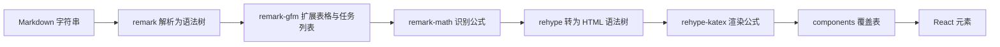
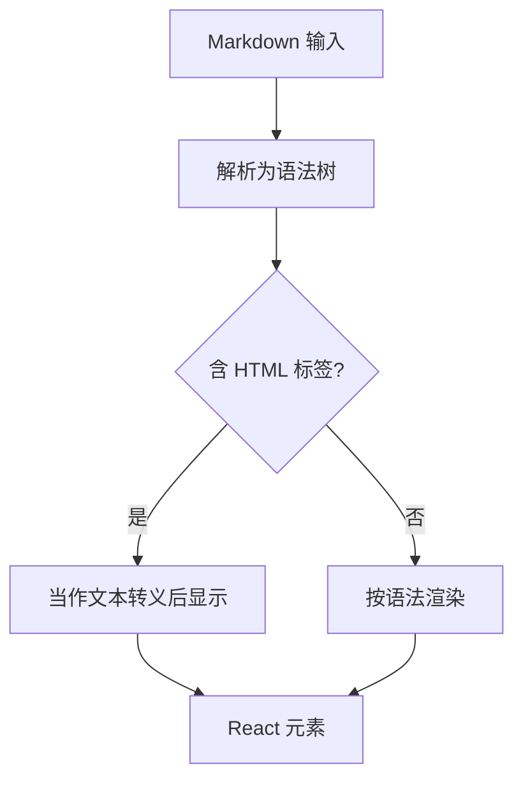

# Markdown 渲染的管线与插件

卡片正文、Agent 回复与分析结果都以 Markdown 存储，展示时有五处渲染点：桌面内容区、浮动窗口、移动端内容页、桌面 Agent 栏与移动端 Agent 抽屉。五处用的都是同一个渲染器 `react-markdown`，插件组合也完全一致（`src/App.tsx`、`src/components/FloatingCardWindow.tsx`、`src/components/mobile/MobileContentPage.tsx`、`src/components/AgentPanel.tsx`、`src/components/AgentDrawer.tsx`）。

差别只在自定义元素与样式：桌面与浮动窗口各自覆盖了一套元素的渲染方式，Agent 两处只包了一层表格。 五个渲染点的配置差异、插件各自解决的语法，以及没有启用原始 HTML 这一安全默认，是下面的重点。

## 渲染管线的三个阶段

`react-markdown` 的输入是字符串，输出是 React 元素。中间经过解析、语法树转换与再序列化三个阶段（这是该渲染器的通用管线）：

| 阶段 | 输入与输出 | 参与的插件 |
| --- | --- | --- |
| 解析 | 字符串转 Markdown 语法树 | `remark-gfm`、`remark-math` |
| 再处理 | 语法树转 HTML 语法树 | `rehype-katex` |
| 渲染 | HTML 语法树转 React 元素 | `components` 覆盖表 |

属性名对应阶段：`remarkPlugins` 接收解析与语法树阶段的插件，`rehypePlugins` 接收 HTML 阶段的插件（`src/App.tsx`）。五个渲染点传的都是同一组：GFM 与数学语法作为解析插件，KaTeX 作为 HTML 阶段插件。



## 五个渲染点的配置对照

同一套渲染器用在多处时，通常有两种组织方式：每处各写一份配置，或抽成共享配置再按需覆盖。前者改一处不影响别处、便于局部微调，代价是同一份逻辑被复制多份、行为容易分叉；后者一致性好，代价是每次微调都要先设计覆盖点。本项目选了前者，所以下表每处都有一套自己的自定义元素：

| 渲染点 | 位置 | 自定义元素 |
| --- | --- | --- |
| 桌面内容区 | `src/App.tsx` | 标题三档、加粗、链接、有序与无序列表、行内与块级代码 |
| 浮动卡片窗口 | `src/components/FloatingCardWindow.tsx`、 | 同上一套，另加引用块 |
| 移动端内容页 | `src/components/mobile/MobileContentPage.tsx` | 与桌面内容区一致，色值带兜底 |
| 桌面 Agent 栏 | `src/components/AgentPanel.tsx` | 仅表格外层加滚动容器 |
| 移动端 Agent 抽屉 | `src/components/AgentDrawer.tsx` | 与面板一致 |

同一个渲染器的五份配置意味着：改一处样式不会影响其他四处。浮动窗口与移动端各自定义了一套带兜底色值的样式，桌面内容区则直接用全局变量（`src/App.tsx`）。

## 自定义元素的实现方式

桌面内容区把每个元素映射成一个带内联样式的标签（`src/App.tsx`）：

```tsx
h1: ({ children }) => <h1 style={{ color: 'var(--text-h)', borderBottom: '1px solid var(--border)', paddingBottom: 8 }}>{children}</h1>,
strong: ({ children }) => <strong style={{ color: 'var(--accent)' }}>{children}</strong>,
code: ({ className, children }) => {
  const isInline = !className
  return isInline
    ? <code style={{ background: 'var(--bg-secondary)', padding: '2px 6px', borderRadius: 4 }}>{children}</code>
    : <pre style={{ background: 'var(--bg-secondary)', padding: 12, borderRadius: 8, overflow: 'auto' }}><code>{children}</code></pre>
},
```

行内代码与块级代码用 `className` 是否为空区分：语法高亮插件会给块级代码加类名，行内代码没有（`src/App.tsx`）。同一份判断在浮动窗口与移动端内容页里各写了一遍（`src/components/FloatingCardWindow.tsx`、`src/components/mobile/MobileContentPage.tsx`）。

表格的处理只做了一层包裹，让宽表可以横向滚动（`src/components/AgentPanel.tsx`）。引用块只在浮动窗口里定制，加了左侧强调色竖线（`src/components/FloatingCardWindow.tsx`）。

## GFM 与数学公式

两个语法插件各自负责一类扩展。GFM（GitHub Flavored Markdown，GitHub 对 Markdown 的一组扩展语法）带来表格、任务列表、删除线与自动链接（这是 `remark-gfm` 的通用能力）；数学语法插件让行内公式与独立公式被识别为数学节点，再由 KaTeX 插件转成渲染后的结构。

公式的样式需要单独引入 KaTeX（把 LaTeX 数学语法渲染成 HTML 与 CSS 的排版库）的样式表，五个渲染点在导入区都写了同一行（`src/App.tsx`、`src/components/FloatingCardWindow.tsx`、`src/components/mobile/MobileContentPage.tsx`、`src/components/AgentPanel.tsx`、`src/components/AgentDrawer.tsx`）。依赖版本在 `package.json`、`package.json`，渲染器与两个语法插件分别在 `package.json`、`package.json`。

公式的书写分隔符沿用通用约定：行内公式用一对美元符号包裹，独立公式用两对（这是 `remark-math` 的通用语法）。渲染器把公式转成 KaTeX 结构，具体字号与间距由 KaTeX 样式和容器决定，因此那行样式引入不能省。

代码块没有启用语法高亮插件（`package.json`），块级代码只按统一底色与等宽字体显示，语言标记不会着色。

## 不启用原始 HTML

五个渲染点都没有引入把原始 HTML 转成节点的插件（在 `src` 下检索无命中），因此 Markdown 里的 HTML 标签会被当作文本转义后显示。这是该渲染器的默认行为，也让"正文里混入脚本"这类输入无法直接生效。

把 HTML 字符串插入页面的只有一处：轻量预览组件用 `dangerouslySetInnerHTML` 注入自己解析的结果（`src/components/MarkdownPreview.tsx`）。这个属性是 React 留的逃生口——直接把字符串当作 HTML 插进节点、绕过 React 自带的转义，名字里的 dangerously 就是这个提醒——因此它的安全性完全依赖解析器内部的转义顺序。




## 易错点

| 位置 | 问题 | 建议 |
| --- | --- | --- |
| `src/App.tsx` | 自定义元素用内联样式，与其他组件的样式策略不一致 | 需要复用时抽成共享的组件映射 |
| `src/components/AgentPanel.tsx` | Agent 消息里的标题与代码没有样式覆盖，与卡片正文观感不同 | 复用同一份元素映射，保持五处一致 |
| `src/components/FloatingCardWindow.tsx` | 元素映射里参数类型写成 `any`，类型检查失效 | 用渲染器提供的组件类型 |
| `src/App.tsx` | 用类名是否存在判断行内代码，未来启用高亮插件时行为会变 | 改为判断父节点或使用渲染器给出的内联标记 |
| `package.json` | 渲染器与两个语法插件分散在多处声明 | 升级时同时检查五处配置 |
| 五处渲染点 | 插件数组每次渲染都新建，属于常见写法但仍有开销 | 数组提到组件外，减少无谓的对象创建 |
| `package.json` | 未启用语法高亮插件，代码块不着色 | 需要高亮时引入对应插件，并在元素映射里区分语言 |
| 五处导入区 | 同一个 KaTeX 样式表被引入五次，依赖打包去重 | 保持现状但避免在其他地方重复引入 |

## 小结

### 核心概念

* 五处渲染点共用 `react-markdown`，插件组合一致（`src/App.tsx`、`src/components/AgentPanel.tsx`）。
* 管线分解析、再处理与渲染三段，属性名对应插件阶段（这是该渲染器的通用约定）。
* `remark-gfm` 提供表格与任务列表，数学语法插件加 KaTeX 提供公式（`package.json`）。
* 行内代码与块级代码用类名是否存在区分（`src/App.tsx`）。
* KaTeX 样式表在五个文件的导入区各引入一次（`src/App.tsx`）。
* 未启用原始 HTML，Markdown 里的标签会被转义显示。

### 设计权衡

| 选择 | 收益 | 代价 |
| --- | --- | --- |
| 每处渲染点各写一套元素映射 | 各界面样式独立，随时可调 | 同一份判断被复制多份，行为容易分叉 |
| 用内联样式 | 不新增 CSS 文件，改动就地可见 | 样式集中度低，主题变量要逐个带兜底 |
| 不启用原始 HTML | 默认安全，脚本无法注入 | 不能直接写 HTML 片段，复杂排版受限 |
| KaTeX 样式按文件引入 | 每处独立可用 | 同一个样式表被引入五次，靠打包去重 |
| 表格只加滚动容器 | 改动最小 | 宽表在移动端的可读性没有进一步处理 |

## 练习

### 基础题

1. 说出渲染管线的三个阶段与对应属性，五个渲染点传的插件组合是什么。
2. 行内代码与块级代码如何区分，这个判断在几处被写了一遍。
3. 公式要正确显示需要哪两类插件与一项样式引入。

### 挑战题

4. 把五处元素映射抽成一份共享配置并允许局部覆盖，写出接口设计与迁移步骤，并说明如何保持各处现有样式不变。
5. 在不引入原始 HTML 的前提下支持提示块（例如自定义的注意段落语法），设计语法与插件实现路径，并说明如何避免与既有引用块冲突。

## 附：本页引用的路径

| 路径 | 用途 |
| --- | --- |
| /mnt/d/KnowledgeDiver/frontend/ | 前端工程根目录，文中相对路径均相对它 |
| `src/App.tsx` | 桌面内容区的渲染配置 |
| `src/components/FloatingCardWindow.tsx` | 浮动窗口的元素映射 |
| `src/components/mobile/MobileContentPage.tsx` | 移动端内容页渲染 |
| `src/components/AgentPanel.tsx` | 桌面 Agent 消息渲染 |
| `src/components/AgentDrawer.tsx` | 移动端 Agent 消息渲染 |
| `src/components/MarkdownPreview.tsx` | 轻量解析器的注入点 |
| `package.json` | 渲染器、语法插件与 KaTeX 版本 |
