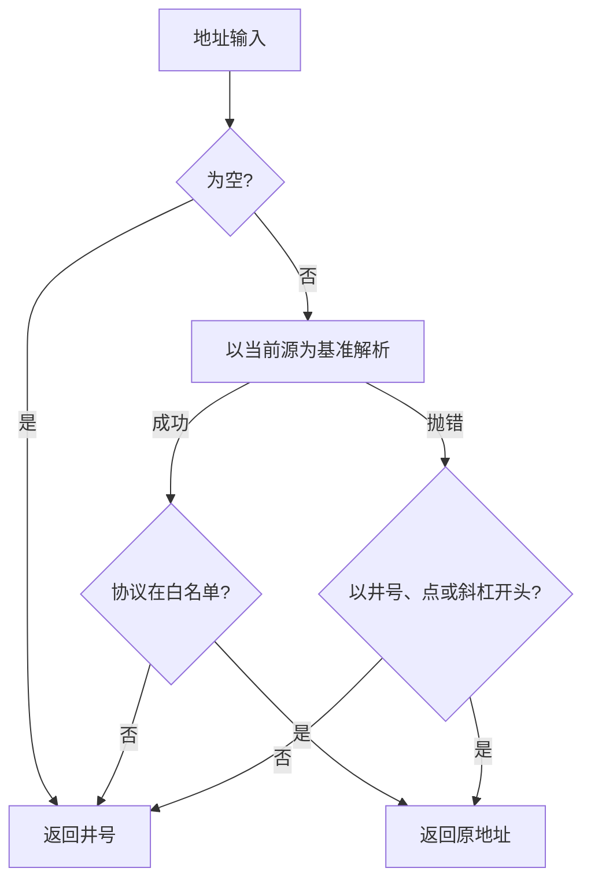
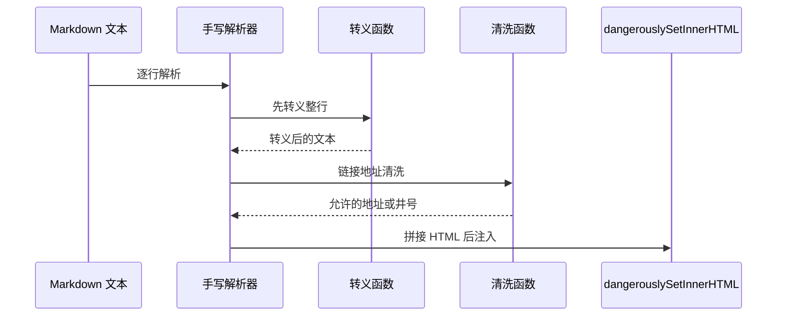

# 链接安全与地址清洗

Markdown 里的链接地址来自用户输入或模型输出，渲染成 `a` 标签前需要判断协议是否允许。这个前端只有一个清洗函数：`src/utils/markdown.ts` 里的 `sanitizeUrl`，配套十条例测试（`src/tests/markdown.test.ts`）。

它解决的是"危险协议"这一类问题，不负责转义 HTML 属性，也不处理链接文字。了解它的判定顺序与使用范围，才能判断哪些入口是安全的。

## 协议白名单与两次判定

函数的判定分成两步（`src/utils/markdown.ts`）：

```tsx
export function sanitizeUrl(url: string): string {
  if (!url) return '#'
  try {
    const u = new URL(url, window.location.origin)
    if (['http:', 'https:', 'mailto:'].includes(u.protocol)) return url
  } catch {
    if (/^[#./]/.test(url)) return url
  }
  return '#'
}
```

第一步用当前页面的源作为基准解析地址（`window.location.origin`，即协议 + 域名 + 端口；有了基准，相对路径才能被解析成绝对地址）。解析成功且协议属于三项白名单时返回原地址；这一步同时覆盖了绝对地址、以斜杠开头的站点内路径、以点开头的相对路径与纯锚点，因为它们都会被解析成允许的协议。

第二步只在解析抛错时执行：地址以井号、点或斜杠开头时放行。抛错通常来自畸形输入，这个分支是兜底。

任何不满足上述条件的输入都返回井号，即"点了不跳转"。



这个判定有一个副作用需要知道：不带协议的域名会被当作相对路径解析，最终仍属于允许的协议，因此会被放行并渲染成一个站点内的相对链接（这是地址解析的通用行为）。

## 三处使用点与两处遗漏

清洗函数被用在两个渲染点的链接元素上。浮动窗口的元素映射里，链接是唯一经过清洗的标签（摘自 `src/components/FloatingCardWindow.tsx`）：

```tsx
a: ({ href, children }: any) => (
  <a href={sanitizeUrl(href || '')} target="_blank" rel="noopener noreferrer">
    {children}
  </a>
),
```

两处使用点如下：

| 渲染点 | 引入位置 | 使用位置 |
| --- | --- | --- |
| 浮动卡片窗口 | `src/components/FloatingCardWindow.tsx` | `src/components/FloatingCardWindow.tsx` |
| 移动端内容页 | `src/components/mobile/MobileContentPage.tsx` | `src/components/mobile/MobileContentPage.tsx` |

桌面内容区也覆盖了链接元素，但直接把原地址赋给 `href`（`src/App.tsx`），没有经过清洗。两个 Agent 渲染点没有覆盖链接元素，走的是渲染器默认行为，同样没有清洗。

也就是说：同一个卡片正文，在桌面内容区与浮动窗口里可能得到不同的链接处理结果。安全边界目前依赖"Markdown 渲染器不会执行脚本"这一点，危险协议在桌面入口仍有机会进入 `href`。

## 十条例测试固定的契约

给一个纯函数写测试，价值在于把行为契约固定下来，覆盖率是副产品：哪些输入放行、哪些拒绝、拒绝时返回什么。契约写清楚后，重构实现（例如换一种解析方式）不必动测试，只有行为真的变了才会红。清洗函数的契约用一个用例对应一类输入（`src/tests/markdown.test.ts`）：

| 类别 | 输入形态 | 期望 | 位置 |
| --- | --- | --- | --- |
| 脚本协议 | `javascript:` | 井号 | `src/tests/markdown.test.ts` |
| 数据协议 | `data:text/html` | 井号 | `src/tests/markdown.test.ts` |
| 旧脚本协议 | `vbscript:` | 井号 | `src/tests/markdown.test.ts` |
| 加密与普通网页 | `https:` 与 `http:` | 原地址 | `src/tests/markdown.test.ts` |
| 邮件 | `mailto:` | 原地址 | `src/tests/markdown.test.ts` |
| 站点内路径 | 以斜杠开头 | 原地址 | `src/tests/markdown.test.ts` |
| 锚点 | 以井号开头 | 原地址 | `src/tests/markdown.test.ts` |
| 相对路径 | 以点斜杠开头 | 原地址 | `src/tests/markdown.test.ts` |
| 空串 | 空字符串 | 井号 | `src/tests/markdown.test.ts` |

十条例里没有覆盖"大小写混合的协议名"与"带协议的相对写法"，这两类由地址解析器统一归一到小写协议后判定，属于实现依赖而非显式契约。

## 与手写解析器的关系

清洗函数同时被手写解析器用在链接替换里（`src/utils/markdown.ts`）。那条路径先把整行做 HTML 转义，再替换 Markdown 语法并调用清洗函数，因此地址里的引号在进入属性前已经变成了实体。

顺序很重要：先替换后转义会把生成的标签一起转成文本，先转义后替换才既能显示标签又能阻止输入破坏结构。这一点在下一篇展开。



## 易错点

| 位置 | 问题 | 建议 |
| --- | --- | --- |
| `src/App.tsx` | 桌面内容区的链接未清洗，与浮动窗口行为不一致 | 与其他两处一样调用清洗函数 |
| `src/components/AgentPanel.tsx` | Agent 消息的链接走默认渲染，未清洗 | 在元素映射里覆盖链接 |
| `src/utils/markdown.ts` | 解析依赖 `window.location.origin`，无浏览器环境时会抛错进入兜底分支 | 抽出基准地址或允许传入源 |
| `src/utils/markdown.ts` | 无协议域名被当作相对路径放行 | 需要严格模式时要求带协议 |
| `src/utils/markdown.ts` | 只判断协议，不校验地址是否可点、是否为自跳转 | 按需要补长度与域名限制 |
| `src/utils/markdown.ts` | 清洗结果直接拼进属性，安全性依赖上游转义 | 保持"先转义后拼接"的顺序，不要调换 |

## 小结

### 核心概念

* 清洗函数先以当前源为基准解析地址，再判断协议是否属于三项白名单（`src/utils/markdown.ts`）。
* 解析抛错时只放行以井号、点或斜杠开头的地址。
* 不满足条件的输入统一返回井号，链接不跳转。
* 清洗被用在浮动窗口与移动端内容页的链接元素上（`src/components/FloatingCardWindow.tsx`、`src/components/mobile/MobileContentPage.tsx`）。
* 桌面内容区与两个 Agent 渲染点没有清洗（`src/App.tsx`、`src/components/AgentPanel.tsx`）。
* 十条例测试覆盖脚本、数据、旧脚本协议与允许的四类地址（`src/tests/markdown.test.ts`）。

### 设计权衡

| 选择 | 收益 | 代价 |
| --- | --- | --- |
| 白名单而非黑名单 | 未知协议默认被拒绝 | 新增合法协议需要改代码 |
| 相对路径放行 | 站点内跳转与锚点可用 | 无协议域名也会被当作相对路径 |
| 统一回落井号 | 界面不会出现死链跳转 | 用户无法区分"被拒绝"与"原作者写错" |
| 只清洗部分渲染点 | 改动面小 | 同一份内容在不同入口行为不一致 |
| 清洗函数依赖浏览器全局 | 实现最短 | 非浏览器环境需要额外处理 |

## 练习

### 基础题

1. 说明清洗函数的两次判定分别何时执行、各放行哪些地址。
2. 列出当前使用清洗函数的两处与未使用的三处渲染点。
3. 测试覆盖了哪些危险协议，哪些情况没有覆盖。

### 挑战题

4. 给所有渲染点统一接上清洗，设计一个共享的链接元素映射，列出迁移步骤与回归验证方式。
5. 让清洗函数在缺少浏览器全局时仍可用，写出参数设计与兜底策略，并说明如何扩展测试用例覆盖该分支。

## 附：本页引用的路径

| 路径 | 用途 |
| --- | --- |
| /mnt/d/KnowledgeDiver/frontend/ | 前端工程根目录，文中相对路径均相对它 |
| `src/utils/markdown.ts` | 地址清洗与手写解析器 |
| `src/tests/markdown.test.ts` | 清洗函数的十条例测试 |
| `src/components/FloatingCardWindow.tsx` | 使用清洗的渲染点 |
| `src/components/mobile/MobileContentPage.tsx` | 使用清洗的移动端渲染点 |
| `src/App.tsx` | 桌面内容区链接未清洗 |
| `src/components/AgentPanel.tsx` | Agent 消息链接未清洗 |
