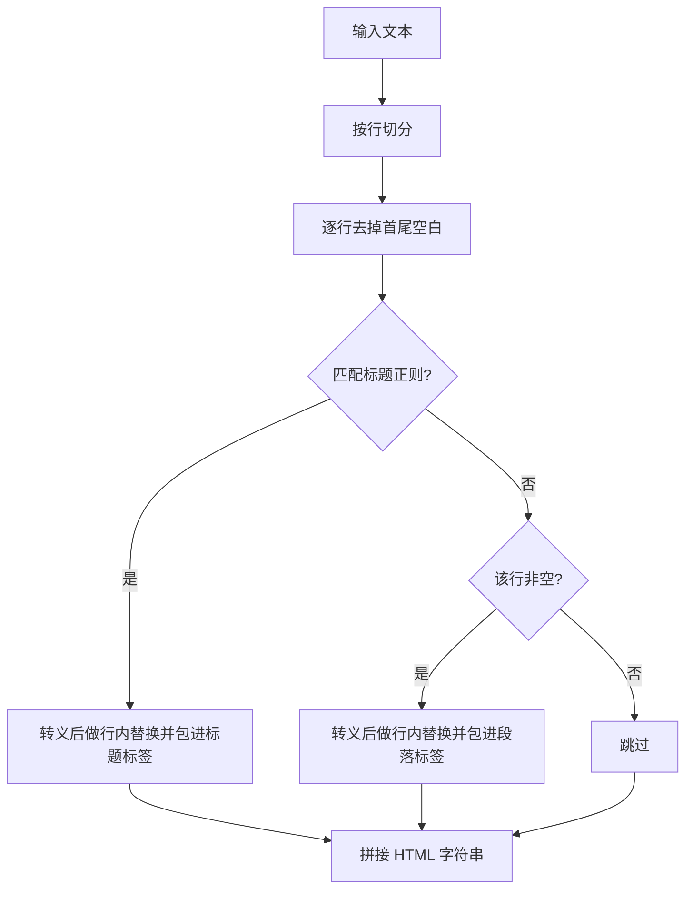
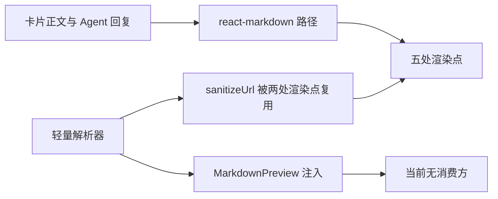

# 手写解析器与预览注入

除了 `react-markdown` 那条路径，仓库里还有一个不依赖任何库的 Markdown 解析器：`src/utils/markdown.ts`，76 行，包含地址清洗、双括号链接提取、HTML 转义、行内替换与逐行解析五个部分（`src/utils/markdown.ts:7-76`）。

它的输出是 HTML 字符串，需要一个注入点呈现，对应组件是 `src/components/MarkdownPreview.tsx`（12 行）。 它能解析什么、转义与替换的先后为什么重要、以及这条路径现在的接入状态，是下面的重点。

## 支持的语法与实现位置

解析器按行处理，支持标题与段落两类块级语法，行内支持四类标记（`src/utils/markdown.ts:40-75`）：

| 语法 | 实现位置 | 输出 |
| --- | --- | --- |
| 一到六级标题 | `src/utils/markdown.ts:59-66` | 对应级别的标题标签 |
| 段落 | `src/utils/markdown.ts:67-70` | 一段一个段落标签 |
| 加粗 | `src/utils/markdown.ts:42` | 加粗标签 |
| 斜体 | `src/utils/markdown.ts:44` | 斜体标签 |
| 行内代码 | `src/utils/markdown.ts:46` | 代码标签 |
| 链接 | `src/utils/markdown.ts:48` | 经清洗的链接标签 |
| 双括号卡片链接 | `src/utils/markdown.ts:50` | 带数据属性的链接标签 |

标题级别由井号前缀长度决定（`src/utils/markdown.ts:60-62`），匹配正则限定一到六个井号加空格。不属于上述任何语法的非空行统一变成段落（`src/utils/markdown.ts:67-70`）。

## 先转义再替换的顺序

解析前先对整行做 HTML 转义，五类字符各替换成实体（`src/utils/markdown.ts:31-38`）：

```tsx
function escapeHtml(str: string): string {
  return str
    .replace(/&/g, "&amp;")
    .replace(/</g, "&lt;")
    .replace(/>/g, "&gt;")
    .replace(/"/g, '&quot;')
    .replace(/'/g, '&#039;')
}
```

随后把转义后的文本交给行内替换，替换函数内部再调用地址清洗（`src/utils/markdown.ts:40-51`）。调用点在标题与段落两处（`src/utils/markdown.ts:64`、`src/utils/markdown.ts:69`）。

顺序的意义在于：先替换后转义会把生成的标签本身转成文本，页面显示的是源码而不是渲染结果；先转义后替换则让用户输入里的尖括号失去作用，同时保留替换函数生成的标签。地址里的引号在进入属性前也已经被转成实体（`src/utils/markdown.ts:36`、`src/utils/markdown.ts:48`）。



## 解析器的能力边界

这份实现覆盖的语法很少，缺少常见块级元素：

| 缺口 | 表现 |
| --- | --- |
| 列表 | 有序与无序列表都变成普通段落 |
| 引用块 | 行首大于号原样显示 |
| 表格 | 竖线与分隔行原样显示 |
| 代码块 | 三反引号围栏不识别，只按行内代码处理单个片段 |
| 公式 | 数学语法完全没有处理 |
| 段落合并 | 每个非空行各自成段，软换行不会合并 |
| 链接文字 | 支持，但嵌套标记不处理 |

这些缺口正是当前展示路径统一使用完整渲染器的原因。

## 注入点与未接入状态

预览组件把解析结果字符串直接注入容器（`src/components/MarkdownPreview.tsx:8-12`）：

```tsx
const html = parseMarkdown(content)
return (
  <div className="markdown-preview" dangerouslySetInnerHTML={{ __html: html }} />
)
```

这段代码目前没有消费方：在 `src` 下检索组件名，除自身文件外没有引入（`src/components/MarkdownPreview.tsx`）。它使用的样式类在样式表里也检索不到定义。与之对应，解析器里的双括号链接提取函数同样没有调用点（`src/utils/markdown.ts:21-28`），卡片链接语法生成的链接带有数据属性，但没有任何地方绑定点击处理（`src/utils/markdown.ts:50`）。



也就是说，两条路径共用的是地址清洗函数（`src/utils/markdown.ts:7-19`），其余部分各自独立。轻量路径整体处于未接入状态，读代码时不要误以为它是当前展示路径。

## 易错点

| 位置 | 问题 | 建议 |
| --- | --- | --- |
| `src/components/MarkdownPreview.tsx:11` | 直接注入 HTML 字符串，安全性完全依赖解析器的转义顺序 | 保持先转义后替换，改动时同步加测试 |
| `src/utils/markdown.ts:21-28` | 链接提取函数没有调用点 | 删除或接入到卡片链接跳转逻辑 |
| `src/utils/markdown.ts:50` | 生成的卡片链接没有点击处理，点击默认跳到井号 | 接入路由跳转或去掉该语法 |
| `src/utils/markdown.ts:67-70` | 每行自成段落，中文长文按硬换行分段 | 需要整段渲染时用完整渲染器 |
| `src/utils/markdown.ts:55-58` | 解析前对每行做首尾去空白，缩进语义丢失 | 有意保留缩进时不要先去掉空白 |
| `src/utils/markdown.ts:44` | 斜体正则用负向断言避开加粗，嵌套星号仍会误判 | 复杂输入交给完整渲染器 |

## 小结

### 核心概念

* 轻量解析器共 76 行，包含清洗、提取、转义、行内替换与逐行解析五部分（`src/utils/markdown.ts:7-76`）。
* 支持一到六级标题、段落与四类行内标记（`src/utils/markdown.ts:42-70`）。
* 处理顺序是先对整行转义，再做行内替换（`src/utils/markdown.ts:31-51`）。
* 缺少列表、引用、表格、代码块与公式等块级语法。
* 预览组件用注入方式呈现解析结果，当前没有消费方（`src/components/MarkdownPreview.tsx:8-12`）。
* 两条路径共用地址清洗函数，其余实现互不影响（`src/utils/markdown.ts:7-19`）。

### 设计权衡

| 选择 | 收益 | 代价 |
| --- | --- | --- |
| 手写解析器 | 无依赖、体积小 | 语法覆盖少，边界情况多 |
| 先转义后替换 | 输入无法破坏页面结构 | 需要自己维护转义字符集 |
| 逐行解析 | 实现直白 | 无法支持跨行语法与段落合并 |
| 输出 HTML 字符串 | 注入即可显示 | 依赖注入，安全审计集中在解析器 |
| 保留未接入的路径 | 需要时可快速启用 | 增加理解成本，容易误判为在用 |

## 练习

### 基础题

1. 列出解析器支持的块级与行内语法及各自实现位置。
2. 说明先转义后替换与相反顺序的结果差异。
3. 举出三个解析器缺口的例子，并说明完整渲染器如何覆盖它们。

### 挑战题

4. 给轻量解析器补上列表与代码块，写出解析状态机与转义策略，并说明如何保持既有标题与段落行为不变。
5. 把卡片链接语法接入路由跳转，列出数据属性、事件绑定与安全校验的改动，并说明如何避免与地址清洗冲突。

## 附：本页引用的路径

| 路径 | 用途 |
| --- | --- |
| /mnt/d/KnowledgeDiver/frontend/ | 前端工程根目录，文中相对路径均相对它 |
| `src/utils/markdown.ts` | 轻量解析器、转义与地址清洗 |
| `src/components/MarkdownPreview.tsx` | 解析结果的注入点 |
| `src/tests/markdown.test.ts` | 清洗函数的行为测试 |
| `src/components/FloatingCardWindow.tsx` | 完整渲染器路径的对照 |
| `package.json` | 渲染器与插件的依赖版本 |
