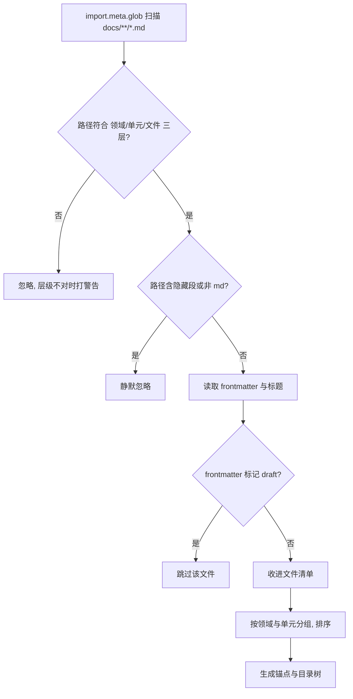
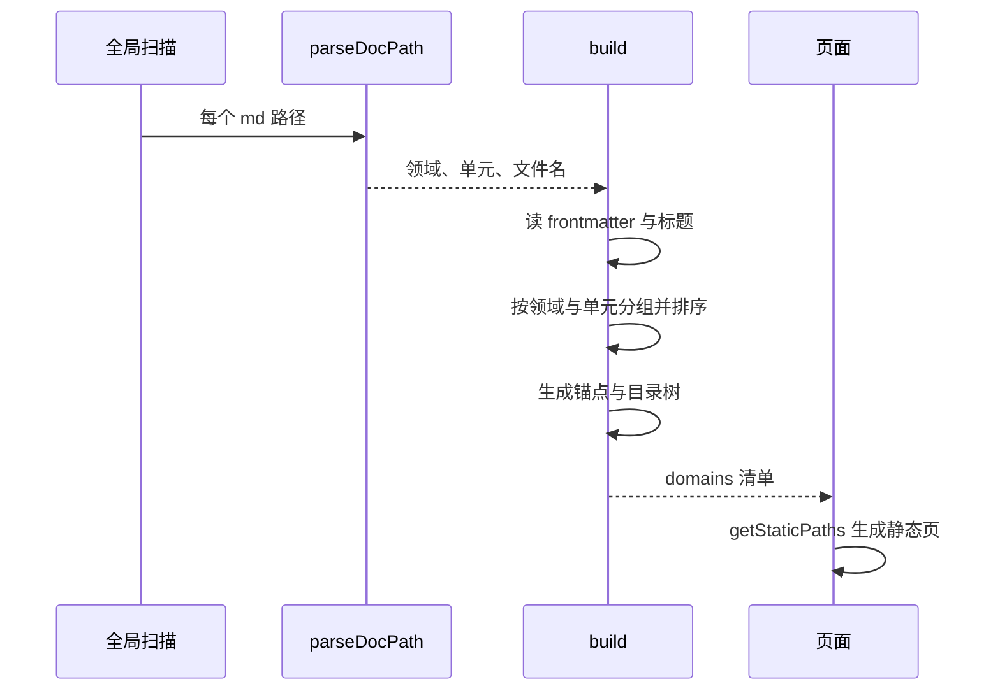

# 目录结构就是索引

你在 `docs/` 下新建一个文件夹 `docs/32-某主题/01-某单元/`，往里面放两个 md 文件，启动开发服务器——左栏目录树、领域页、单元页与搜索索引里会同时出现这个单元，没有改过任何配置。这是这套文档区最核心的一条设计：目录结构本身就是索引，页面上的一切都由构建期扫描推导出来。

负责这件事的是 `src/lib/docs.ts`。它在模块加载时做一次全量扫描，随后所有页面、组件与搜索引擎接口都只读它产出的清单。规则决定一个文件能否出现在站点上，组装决定它落在哪一层、用什么锚点。

## 一次扫描，一张清单

扫描用构建工具的全局导入能力，一次性把 `docs/` 下所有 md 的编译结果收进内存。`src/lib/docs.ts` 顶部这段就是唯一入口：

```ts
type MdModule = {
  frontmatter?: Frontmatter;
  getHeadings?: () => { depth: number; slug: string; text: string }[];
};

const modules = import.meta.glob('/docs/**/*.md', { eager: true }) as Record<string, MdModule>;
```

`import.meta.glob` 是 Vite（Astro 底层的构建器）提供的编译期 API：打包时把匹配到的文件全部静态引入，运行时不读文件系统——这是"目录结构能当索引"的前提。`eager` 表示构建时就全部加载，而不是等某个页面访问才按需加载；每个 md 编译后交出的 `frontmatter` 与 `getHeadings()`，正好是清单需要的全部信息。清单在模块顶层直接构建并导出（`docs.ts` 的 `build()` 与 `domains`），因此一次构建里只算一次，多个页面共用同一份结果。

这里没有内容集合（content collections）配置文件，也没有手写的索引表。内容集合是 Astro 官方那套带 schema 校验的目录约定，字段有类型检查，代价是要多维护一份 `content.config.ts`；目录扫描这条路省掉了配置，代价是每个 md 的编译结果都会进入构建产物，需要按需加载时应改用非 `eager` 的写法。



## 收下哪些路径

路径解析只认一种形状：`/docs/` 后面正好三段，最后一段以 `.md` 结尾（`parseDocPath`）。三段分别是领域、单元与文件名；更深一层的 md 会被忽略，那一层留给图片等资源（文件头部注释写明了这条规则）。判断全在下面这十几行里：

```ts
const DOCS_ROOT = '/docs/';
const HIDDEN_RE = /^[_.]/;

export function parseDocPath(key: string): { domain: string; unit: string; file: string } | null {
  if (!key.startsWith(DOCS_ROOT)) return null;
  const parts = key.slice(DOCS_ROOT.length).split('/');
  if (parts.length !== 3) return null;
  const [domain, unit, file] = parts;
  if (!domain || !unit || !file) return null;
  if (HIDDEN_RE.test(domain) || HIDDEN_RE.test(unit) || HIDDEN_RE.test(file)) return null;
  if (!file.endsWith('.md')) return null;
  return { domain, unit, file: file.slice(0, -3) };
}
```

用字符串切片加段数判断而不是一条大正则：多一层和少一层都会落到 `parts.length !== 3` 上，失败原因单一，排查时不用猜。

以 `_` 或 `.` 开头的段会让整条路径被静默忽略（`isHiddenPath`），所以 `docs/_template/` 这类模板目录不会出现在站点上。区分在于：隐藏是有意为之，静默忽略；层级不对则是使用错误，构建时会打印一条包含全部被忽略路径的警告（`docs.ts` 的 `build()` 里的 `ignored` 分支）。

`frontmatter` 是 md 文件开头用两行 `---` 夹住的一段 YAML 元数据，构建器把它解析成对象挂到编译结果上；这里读的就是这个对象上的 `draft` 字段。写 `draft: true` 的文件会被跳过，页面与导航一起消失——这是"先写一半、暂时不发布"的开关。

## 顺序怎么定

排序权重由一个函数统一决定（`orderOf`）：先看 frontmatter 里的显式 `order`，再取文件名（或文件夹名）开头的数字前缀，都没有就排到最后。前缀形式支持 `01-`、`01.`、`01_` 与空格分隔（正则 `/^(\d+)[\s._-]+/`）。文件、单元、领域三级都调用同一个函数：

```ts
const PREFIX_RE = /^(\d+)[\s._-]+/;

export function orderOf(name: string, explicit?: unknown): number {
  if (typeof explicit === 'number' && Number.isFinite(explicit)) return explicit;
  if (typeof explicit === 'string' && /^\d+$/.test(explicit.trim())) return Number(explicit.trim());
  const m = PREFIX_RE.exec(name);
  return m ? Number(m[1]) : Number.POSITIVE_INFINITY;
}
```

显式值同时接受数字与纯数字字符串，是因为 YAML 里 `order: 3` 是数字、`order: "3"` 是字符串，两种写法都得能用；没有前缀时返回 `Infinity`，自然排到末尾。

展示名会把前缀剥掉（`displayOf`）：`01-基础` 显示成 `基础`，剥完为空时回落到原名。同权重时用中文拼音排序，并开启数字感知（`compareOrder`），这样 `02` 会排在 `10` 前面而不是按字符比较：

```ts
function compareOrder(a: { order: number; orderKey: string }, z: { order: number; orderKey: string }): number {
  if (a.order !== z.order) return a.order < z.order ? -1 : 1;
  return a.orderKey.localeCompare(z.orderKey, 'zh-Hans-CN', { numeric: true });
}
```

`localeCompare` 的第二个参数指定中文排序规则（`zh-Hans-CN`），`numeric: true` 让其中的数字按数值而不是逐个字符比较。少了这两个选项，`"10"` 会排在 `"2"` 前面——这是目录编号能保持自然顺序的原因。

数字前缀同时承担两个作用：决定顺序，和给读者一个稳定的编号。文件名里的中文不会被改写，URL 里出现的也是原样的中文，页面链接在生成时逐段编码（`docsHref`）——它用 `encodeURIComponent` 对每一段单独转义（只动中文，不碰作为分隔符的 `/`），再套上部署基路径。

## 三级结构如何组装

扫描结果按三级聚合。每个文件对象保留源码路径、展示标题、顺序、摘要、标签、更新日期与标题列表（`DocFile`）；单元把同文件夹的文件按顺序收在一起，并额外算出文件数、单元摘要、合并标签与最新更新日期（`DocUnit`）；领域再收单元（`DocDomain`）。

两个细节需要单独说。

锚点按文件在单元内的位置生成，形如 `file-1`、`file-2`（`build()` 里的 `anchor` 赋值）——"锚点"就是页面里某个元素的 `id`，URL 末尾的 `#file-2` 靠它直接跳过去。因此搜索深链、目录树跳转与页内小节都用同一个锚点，不依赖标题文本：

```ts
files.forEach((f, i) => {
  f.anchor = 'file-' + (i + 1);
});
...
toc: files.map((f) => ({
  anchor: f.anchor,
  file: f.title,
  headings: f.headings.filter((h) => h.depth >= 2 && h.depth <= 3),
})),
```

目录树只取二三级标题（上面 `toc` 里那行过滤），并排除脚注区的固定标题 `footnote-label`——那是一条 GFM 脚注自动生成的标题，出现在目录里没有意义。



清单是构建期产物，不参与运行时数据请求，所以页面打开速度与文档数量没有直接关系；内容规模带来的成本在构建阶段体现，扫描与编译都要过一遍全部 md。内容越多，构建时间越长，但页面自身的加载不受影响。清单只在构建期算一次，运行时没有额外请求。

## 清单另外导出的三样东西

除了三级树，模块还导出拉平的单元列表（用于上一篇与下一篇）、统计对象（领域数、单元数、文件数与最新更新日期）与按领域或单元查找的函数。

拉平列表的用途是跨领域的连续阅读：上一个领域的最后一个单元与下一个领域的第一个单元之间也接得上，读者的"下一篇"不会在领域边界断掉。统计对象只做展示，文档首页用它显示总数与最近更新时间。

## 被忽略时怎么排查

三种忽略的表现不同，混在一起会很难找：

| 情况 | 表现 | 排查方向 |
| --- | --- | --- |
| 路径段数不对 | 构建日志出现被忽略路径清单 | 确认 md 是否正好在领域/单元两层目录下 |
| 段以 `_` 或 `. ` 开头 | 完全静默，页面里找不到 | 检查文件与目录名是否被当成草稿区 |
| frontmatter 写了 `draft: true` | 文件不出现，但目录与单元仍在 | 去掉 draft 或确认是否只想临时下线 |

警告只在路径层级写错时打印，内容是一条前缀加若干行路径（`docs.ts` 的 `build()`）：

```ts
for (const key of Object.keys(modules)) {
  const parsed = parseDocPath(key);
  if (!parsed) {
    // 隐藏项的忽略是规则内的，只有"层级不对"才值得提醒
    if (key.startsWith(DOCS_ROOT) && !isHiddenPath(key)) ignored.push(key);
    continue;
  }
  ...
}

if (ignored.length) {
  console.warn('[docs] 这些 md 不在 docs/<领域>/<单元>/ 这一层，已忽略：\n  ' + ignored.join('\n  '));
}
```

这条日志是排查的第一入口：看到它就说明有文件放错了层，而不是配置有问题。

另外两个容易误判的点：单元文件夹里的图片不会出现在清单里，因为它们没有 md 扩展名；空文件夹不会生成单元，因为没有文件可供分组（`build()` 里对文件数做了判断）。

## 小结

### 核心概念

* 清单由一次全局扫描推导，没有手写索引或内容集合配置。
* 只认 `docs/领域/单元/文件.md` 三层，隐藏段与草稿被过滤。
* 顺序由 frontmatter 的 order、文件名数字前缀依次决定，最后按中文拼音稳定排序。
* 单元内每个文件一个锚点，形如 `file-N`，目录树只取二三级标题。
* 三级对象分别是文件、单元与领域，各自带上摘要、标签与更新日期。
* 模块另外导出拉平列表与统计对象，分别服务连续阅读与首页展示。
* 忽略有三种来源：层级不对会打警告，隐藏段与草稿静默跳过。

### 设计权衡

| 选择 | 收益 | 代价 |
| --- | --- | --- |
| 目录即索引 | 新增内容不用改配置 | 目录命名成了事实上的接口 |
| 构建期全量扫描 | 页面与搜索共用一份清单 | 所有 md 都进构建，内容多时构建变慢 |
| 隐藏段静默忽略 | 模板目录不会漏出 | 拼写错误导致的隐藏不易察觉 |
| 数字前缀排序 | 顺序与编号统一 | 重命名会影响 URL 与顺序 |
| 锚点用位置编号 | 与标题文本解耦 | 插入文件会让后面所有锚点位移 |
| 目录名参与 URL | 链接可读、与目录一致 | 改名会让外链失效，中文需要编码 |
| 空单元直接消失 | 清单里没有空壳 | 想保留占位时要放一个 md |
| 目录即数据源 | 内容与导航天然一致 | 目录结构变化需要当作接口变更来看 |

## 练习

### 基础题

1. 描述一次构建里清单从扫描到导出的过程。
2. 哪些路径会被收下，哪些会被忽略，忽略时有没有提示。
3. 顺序与展示名分别怎么算，数字前缀起什么作用。

### 挑战题

4. 让某个单元支持"只发布其中一部分文件"，给出配置位置与过滤时机，并说明对搜索索引的影响。
5. 把锚点从位置编号改成稳定标识，列出需要改动的位置与迁移方式，并说明旧链接如何兼容。

## 附：本页引用的路径

| 路径 | 用途 |
| --- | --- |
| `src/lib/docs.ts` | 扫描、路径解析、排序与三级清单组装 |
| `src/lib/url.ts` | 站内链接统一出口 |
| `src/pages/docs/index.astro` | 文档首页 |
| `docs/` | 文档源目录 |
| `README.md` | 文档区规则说明 |
