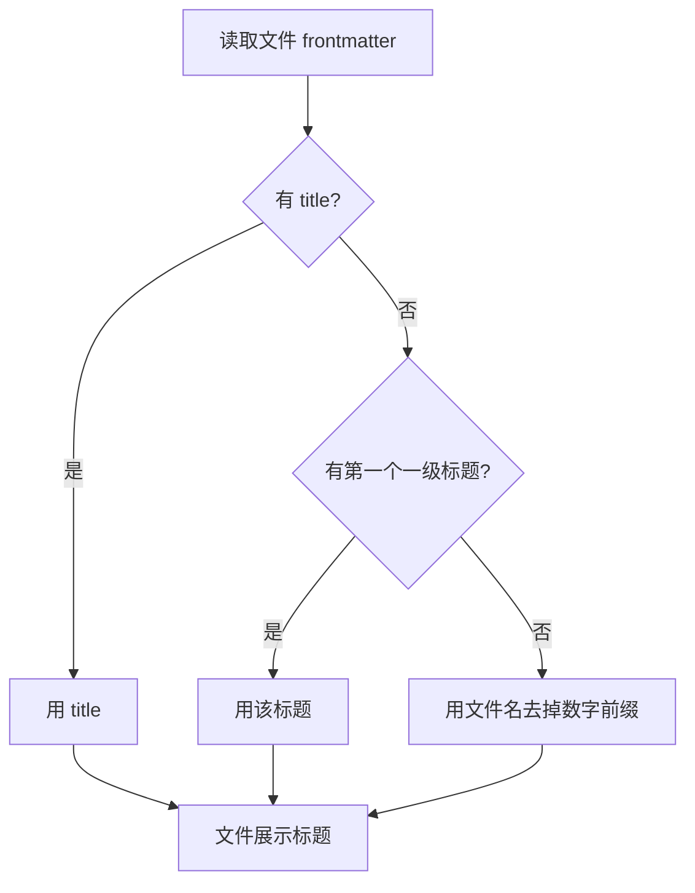
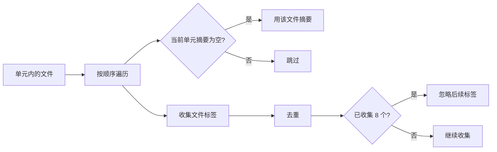

# frontmatter 与单元元数据

一个新单元写完了，你想让页面显示"更新 2026-10-07"，标签栏出现"控制理论"，单元标题是"PID 整定"而不是文件夹名的 `01-PID整定与抗饱和`，同时这个单元排在其它单元前面。这四件事都由 frontmatter 决定，而且全部可选——一个字段都不写，页面照样能出来，只是标题回落到文件名、顺序回落到数字前缀。

字段解析集中在 `src/lib/docs.ts` 的几段小函数里：取字符串、取标签数组、取日期，以及在组装阶段按优先级挑选：

```ts
function str(value: unknown): string {
  if (value === null || value === undefined) return '';
  if (value instanceof Date) return value.toISOString().slice(0, 10);
  return String(value).trim();
}

function tagList(value: unknown): string[] {
  if (Array.isArray(value)) return value.map((v) => str(v)).filter(Boolean);
  if (typeof value === 'string' && value.trim()) return value.split(/[,\s，、]+/).filter(Boolean);
  return [];
}

function dateOf(fm: Frontmatter): string {
  return str(fm.updated ?? fm.date).slice(0, 10);
}
```

`??` 是空值合并运算符：只在前一个值是 `null` 或 `undefined` 时才取后一个，所以 `updated` 写成了空串也不会被 `date` 顶掉。`instanceof Date` 那一支是给 YAML 解析器准备的——`updated: 2026-10-07` 不加引号时会被解析成日期对象，得先转回 ISO 字符串再截取。字段之间没有依赖，只写其中一两个也能正常发布。

## 可选字段一览

| 字段 | 作用 | 缺省行为 |
| --- | --- | --- |
| `title` | 文件展示标题 | 取第一个一级标题，再退回文件名 |
| `order` | 文件排序权重 | 取文件名数字前缀 |
| `summary` | 文件摘要，或单元摘要的候选 | 依次尝试 `description`、`desc` |
| `tags` | 标签，可写数组或字符串 | 无标签 |
| `updated` | 更新日期 | 尝试 `date`，再退回空串 |
| `draft` | 标记为草稿 | 假，文件正常收录 |
| `unit` | 单元展示名 | 文件夹名去掉数字前缀 |
| `unitOrder` | 单元排序权重 | 文件夹名数字前缀 |
| `domain` | 领域展示名 | 领域文件夹名去掉数字前缀 |
| `domainOrder` | 领域排序权重 | 领域文件夹名数字前缀 |

文件名里的层级与草稿标记不需要额外声明，前一篇讲过路径规则。这里所有字段都是"写在某个文件上、对整个单元生效"的，因为单元是文件夹，而 frontmatter 属于文件。



## 标题与展示名的优先级

文件标题的挑选顺序是：frontmatter 的 `title`、文中第一个一级标题、文件名剥掉数字前缀（`toFile`）。三处回落就写在一个对象字面量里：

```ts
const h1 = headings.find((h) => h.depth === 1);
return {
  path: key,
  name,
  title: str(fm.title) || h1?.text || displayOf(name),
  order: orderOf(name, fm.order),
  summary: str(fm.summary ?? fm.description ?? fm.desc),
  tags: tagList(fm.tags ?? fm.tag),
  updated: dateOf(fm),
  headings,
  anchor: '',
};
```

第二个来源依赖编译器给出的标题列表，因此标题写在正文里也能被识别，但只有第一个一级标题会被用到。`h1?.text` 里的 `?.` 是可选链：找不到一级标题时得到 `undefined` 而不是抛错，后面的 `||` 才有机会回落到文件名。

单元与领域的展示名走另一条路：取同一单元或领域里某个文件的 frontmatter（`build()` 取的是清单收集顺序里最先出现的那个文件），读 `unit` 或 `domain`，没有就退回文件夹名去掉前缀。也就是说，一个单元里只要有一个文件写了 `unit`，整个单元的标题就按它显示。

## 顺序的三个来源

排序权重由 `orderOf` 统一计算，优先级从高到低是：显式传入的顺序值、名称开头的数字前缀、无穷大（排在最后）。显式值既接受数字也接受纯数字字符串，方便 YAML 里写 `"3"`。

文件用 `order`，单元用 `unitOrder`，领域用 `domainOrder`，三个字段各自喂给同一个 `orderOf`：

```ts
title: str(fm.unit) || displayOf(unitSlug),
order: orderOf(unitSlug, fm.unitOrder),
```

同一层里权重相同时，用带拼音与数字感知的比较器稳定排序（`compareOrder`），因此 `10-` 不会跑在 `02-` 前面。

## 字段冲突时谁说了算

一个单元里有多个文件，字段可能互相矛盾。当前的取舍是按"第一个"取，`build()` 里就是这么挑的：

```ts
const fm = (modules[mine.find((e) => e.unit === unitSlug)!.key]?.frontmatter ?? {}) as Frontmatter;
if (!domainTitle) domainTitle = str(fm.domain);
if (domainOrder === undefined && fm.domainOrder !== undefined) domainOrder = orderOf(domainSlug, fm.domainOrder);
...
title: str(fm.unit) || displayOf(unitSlug),
```

单元标题、领域标题与 `domainOrder` 取自 `mine.find(...)` 找到的那个文件，也就是**清单收集顺序里最先出现的文件**——`entries` 是按 `Object.keys(modules)` 的顺序生成的，这个顺序与展示顺序无关。相比之下，单元摘要、标签与更新日期来自另一条路径：排序后的 `files` 列表（`compareOrder`）逐个遍历。两条路径的"第一个"含义不同，这是同名结论容易读错的地方。冲突结果因此既不是显式优先级，也不能指望由 `01-` 前缀决定。

| 冲突 | 结果 |
| --- | --- |
| 两个文件都写 `unit` | 取清单里先出现的那个文件；这与展示顺序无关，别指望按 `01-` 前缀决定 |
| 两个文件摘要不同 | 排序后第一个非空摘要成为单元摘要 |
| 文件标题与一级标题不同 | frontmatter 优先 |
| `updated` 与 `date` 都写 | `updated` 优先 |

想让结果确定，最简单的办法是只在一个固定文件里写单元级字段，例如单元里在清单中最先出现的那个文件，或者干脆不写、依靠命名。

## 摘要与标签怎么合并

单元的摘要与标签是从它的文件里汇总的（`build()` 的循环）：摘要取第一个非空值，标签按文件顺序收集、去重，最多八个。三件事在同一个循环里完成：

```ts
const tags: string[] = [];
let summary = '';
let updated = '';
for (const f of files) {
  for (const t of f.tags) if (!tags.includes(t) && tags.length < 8) tags.push(t);
  if (!summary && f.summary) summary = f.summary;
  if (f.updated > updated) updated = f.updated;
}
```

`tags.length < 8` 是硬上限，超出的标签在 `includes` 检查后就被静默丢掉，所以重要标签要写在靠前的文件里。日期则是逐个比较字符串取最大值。



标签字段既接受数组，也接受用逗号、空格、中文顿号或斜杠分隔的字符串（`tagList`）。八个的上限意味着标签栏不会无限变长，代价是后面的标签会静默丢失，需要排序时要把重要的写在前面。

领域的摘要没有单独字段，领域页用的是它的第一个单元的摘要（`src/pages/docs/[domain]/index.astro` 里取 `domain.units[0]?.summary`）：

```astro
description={domain.units[0]?.summary ?? domain.title + ' · 文档'}
```

`?.` 保证空领域不会在这里抛错，`??` 则在摘要为空时回落到领域标题——两级兜底写在同一个表达式里。

## 更新日期与统计

日期字段优先取 `updated`，再取 `date`，统一截取前十位形成 `YYYY-MM-DD`；如果 YAML 解析器把值解析成日期对象，会先转成 ISO 字符串再截取（`str`）。

汇总规则是取最大值：单元的更新日期取文件里最大的那个字符串，领域取单元里最大的，首页统计再取领域里最大的（`docs.ts` 底部导出的 `docsStats`）：

```ts
export const docsStats = {
  domains: domains.length,
  units: flatUnits.length,
  files: flatUnits.reduce((n, u) => n + u.count, 0),
  updated: domains.reduce((d, x) => (x.updated > d ? x.updated : d), ''),
};
```

`reduce` 把数组折叠成一个值，这里用它在每层逐个比较日期字符串留下最大的那个。字符串按字典序比较的前提是格式统一为 `YYYY-MM-DD`，这也是为什么解析时强制截取。

写 `draft: true` 的文件在 `toFile` 里被直接过滤掉，不进入任何汇总：它的标签、摘要与日期都不会影响单元。

## 易错点

| 位置 | 问题 | 建议 |
| --- | --- | --- |
| `toFile` | 标题只认第一个一级标题，正文里写了多个时以第一个为准 | 需要以 frontmatter 为准时显式写 title |
| `build()` | 单元与领域元数据取清单收集顺序里最先出现的那个文件，与展示顺序无关；新增文件改变收集顺序时会改变结果 | 关键字段在每个文件里保持一致，或只写在一个固定文件上 |
| `orderOf` | 前缀正则要求数字后跟分隔符，`01abc` 不生效 | 命名统一用 `01-` 形式 |
| `tagList` | 字符串标签按多种分隔符切分，标签内含空格会被拆开 | 需要带空格的标签时用数组写法 |
| `build()` | 标签上限八，超出静默丢弃 | 把重要标签写在前面 |
| `dateOf` | 日期只截前十位，写成年月形式会得到不完整字符串 | 统一写完整日期 |

## 小结

### 核心概念

* frontmatter 全部可选，解析集中在几个小函数里（`src/lib/docs.ts`）。
* 文件标题按 frontmatter 标题、首个一级标题、文件名依次回落。
* 单元与领域展示名从组内文件的 `unit`、`domain` 取，缺省剥数字前缀。
* 顺序由显式权重、数字前缀、无穷大三级决定，同权重按拼音稳定排序。
* 单元摘要取第一个非空值，标签去重且上限八个。
* 多数文件不写字段时，命名习惯实际上决定了标题、顺序与展示名。
* 更新日期按前后缀取字段并截取前十位，逐级向上取最大值。

### 设计权衡

| 选择 | 收益 | 代价 |
| --- | --- | --- |
| 字段全部可选 | 新增文件零配置 | 标题与顺序依赖命名习惯 |
| 单元元数据写在文件上 | 不必额外建配置文件 | 同组文件字段不一致时结果取决于顺序 |
| 标签上限八 | 界面稳定 | 溢出标签无提示 |
| 日期统一截取十位 | 可直接比较与展示 | 更细的时间信息丢失 |
| 摘要取第一个非空值 | 无需为单元单独维护摘要 | 想改摘要要找到那个首个文件 |

## 练习

### 基础题

1. 列出与文件、单元、领域分别相关的 frontmatter 字段。
2. 说明文件标题的三个来源与先后顺序。
3. 单元摘要与标签各是怎么汇总的。

### 挑战题

4. 让标签超出上限时给出构建警告，写出检测位置与提示内容，并说明如何不影响现有页面。
5. 给领域增加独立的摘要字段，列出字段名、回落顺序与页面改动，并说明与单元摘要冲突时如何取舍。

## 附：本页引用的路径

| 路径 | 用途 |
| --- | --- |
| `src/lib/docs.ts` | frontmatter 解析与元数据汇总 |
| `src/pages/docs/[domain]/index.astro` | 领域页取摘要的位置 |
| `src/pages/docs/index.astro` | 首页统计展示 |
| `docs/_plan/` | 文档写作约定与自检脚本 |
