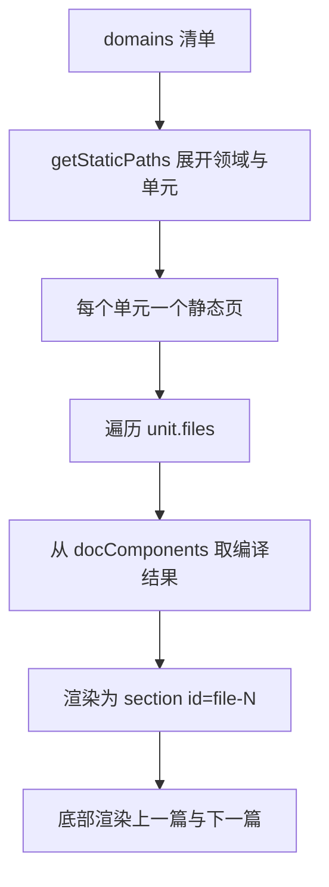
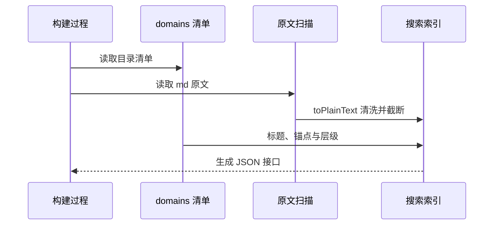

# 页面如何消费清单

打开 `/docs/控制理论/PID整定与抗饱和/`，一页里从上到下排着这个单元的全部 md，每篇带一个"FILE 01"标记与来源路径，底部是上一篇与下一篇。这些页面在构建时就全部生成好了，没有运行时的目录查询；搜索框输入一个词，命中的是正文，而不只是标题。

前一篇讲的清单在这里被三种方式消费：生成静态路由、提供页面拼装所需的数据、生成搜索索引。三条路径用的都是同一份扫描结果，区别只在要不要正文原文。

## 路由在构建时就定完

两个动态路由各自导出一个生成函数。单元页按领域与单元两级展开（`src/pages/docs/[domain]/[unit].astro` 的 `getStaticPaths`）：

```tsx
export function getStaticPaths() {
  return domains.flatMap((d) =>
    d.units.map((u) => ({ params: { domain: d.slug, unit: u.slug }, props: { unit: u, domain: d } })),
  )
}
```

领域页同理只展开一级（`src/pages/docs/[domain]/index.astro`）。参数用的是文件夹名，包含中文，构建器会把它编码成目录名，链接则统一由 `docsHref` 生成，保证编码方式一致。

清单里没有的路径不会生成页面，访问它们会落到 404。这也是"目录即索引"的直接后果：写错文件夹名不会有空白页，而是根本不存在这个路由。

## 一页怎么拼多个文件

单元页按顺序遍历文件清单，每个文件渲染成一个区块（`[unit].astro` 中的 `unit.files.map`）：

```tsx
const Comp = docComponents[f.path]
return (
  <section class="dfile" id={f.anchor} data-file={f.name}>
    ...
    <Comp />
  </section>
)
```

`docComponents` 是清单模块导出的另一张表：源码路径对应到该 md 编译出的组件（`docs.ts` 里由扫描结果生成）。因此页面拼装不需要重新读取文件，编译结果在构建期已经就绪；区块的 `id` 就是前一篇提到的 `file-N` 锚点，搜索深链与目录树都指到它。

区块头部显示的来源路径由领域名、单元名与文件名拼出，读者可以据此在仓库里定位原文。



## 上下篇跨领域连续

相邻单元用拉平列表计算（`docs.ts` 的 `neighbours`）：先在 `flatUnits` 里找到当前单元的位置，再取前后一项。因此阅读顺序是"领域内按单元顺序，领域之间也接得上"，一个领域的最后一个单元会指向下一个领域的第一个单元。

领域页也维护了自己的上一篇与下一篇，用的是同一份领域数组（`[domain]/index.astro` 的生成函数）。这样从任意入口进来都能顺着走，不用回目录。

## 首页与领域页的数字

文档首页从清单里取统计与最近更新的单元（`src/pages/docs/index.astro`）：把有更新日期的单元按日期倒序取前六个，再用统计对象显示领域数、单元数与文件数。领域页显示单元数与文件数，以及该领域里最新的更新日期。

这些数字都来自构建期计算，不需要查数据库，也不会随着访客变化。

## 搜索索引单独取原文

标题与锚点已经够用了，但搜索要匹配正文，所以索引接口再取一次 md 原文（`src/pages/docs/search-index.json.ts`）：

```tsx
const rawFiles = import.meta.glob('/docs/**/*.md', { query: '?raw', import: 'default', eager: true })
...
t: toPlainText(rawFiles[file.path] ?? '').slice(0, BODY_LIMIT),
```

第二条扫描用原始文本模式（`?raw`），只为了拿到正文；`toPlainText` 会去掉 frontmatter、代码围栏、链接语法与常见符号，把 Markdown 变成一段可搜索的纯文本，并截断到四千字符（`BODY_LIMIT`）。

索引项里保留了领域名、单元名、文件名、跳转地址（单元地址加锚点）、不超过三级的标题文本与正文片段。响应带一个版本号与条目数，字段名压得很短，因为这份 JSON 会被浏览器整份下载。



## 站内链接与部署前缀

所有以斜杠开头的站内链接都经过一个函数（`src/lib/url.ts`）：它读取构建时注入的基路径，去掉尾斜杠后与传入路径拼接。站点部署在子路径下时（配置里的 `base`），资源与页面链接才不会打到域名根上的其它应用。

配置注释里写明：新增链接要调用这个函数，不要再写以斜杠开头的硬编码地址（`astro.config.mjs`）。

## 易错点

| 位置 | 问题 | 建议 |
| --- | --- | --- |
| `[unit].astro` | 页面直接依赖 `docComponents` 里有对应路径的组件，缺一个就渲染空白 | 保持清单与组件表同源，不要手工构造路径 |
| `neighbours` | 拉平顺序由清单排序决定，改文件夹名会改变相邻关系 | 重命名时把链接与顺序一起检查 |
| `search-index.json.ts` | 正文截断到四千字符，长文后半段搜不到 | 需要全文检索时提高上限或分片 |
| `search-index.json.ts` | 索引整份下发，文档变多后体积持续增长 | 内容规模上去后改按领域拆分 |
| `url.ts` | 漏用该函数的硬编码链接在子路径部署下会失效 | 新增链接统一走该函数 |
| `index.astro` | 最近更新只取六个 | 需要更多时改数字并评估首屏内容 |

## 小结

### 核心概念

* 单元页与领域页在构建期由清单生成静态路由。
* 一个单元页把多个 md 的编译结果按顺序拼成区块，锚点为 `file-N`。
* 上一篇与下一篇用拉平列表计算，跨领域连续。
* 首页与领域页的统计数字都来自构建期。
* 搜索索引第二次扫描 md 原文，清洗成纯文本并截断。
* 站内链接统一经过带基路径的拼接函数。

### 设计权衡

| 选择 | 收益 | 代价 |
| --- | --- | --- |
| 构建期生成全部页面 | 打开即静态 HTML | 内容多时构建时间上升 |
| 一页拼多个文件 | 一个单元连续阅读 | 页面变长，首屏内容需要滚动 |
| 索引随站点下发 | 不依赖服务端搜索 | 索引体积与文档量同步增长 |
| 正文截断四千字符 | 索引体积可控 | 长文后半段不可搜 |
| 链接统一拼接基路径 | 子路径部署免改代码 | 必须记得使用该函数 |

## 练习

### 基础题

1. 描述单元页从清单到 HTML 的过程。
2. 上下篇的顺序是怎么算出来的，领域边界处会发生什么。
3. 搜索索引为什么要再扫描一次 md 原文。

### 挑战题

4. 把搜索索引按领域拆分，写出接口划分方式与前端请求改动，并说明如何保持搜索体验不变。
5. 给单元页加一个"只显示某个文件"的视图，列出路由或查询参数设计，并说明与锚点跳转如何共存。

## 附：本页引用的路径

| 路径 | 用途 |
| --- | --- |
| `src/lib/docs.ts` | 清单、组件表与相邻单元计算 |
| `src/lib/url.ts` | 站内链接与基路径 |
| `src/pages/docs/[domain]/[unit].astro` | 单元页与静态路由 |
| `src/pages/docs/[domain]/index.astro` | 领域页 |
| `src/pages/docs/index.astro` | 文档首页与统计 |
| `src/pages/docs/search-index.json.ts` | 搜索索引接口 |
| `astro.config.mjs` | 站点基路径与构建配置 |
