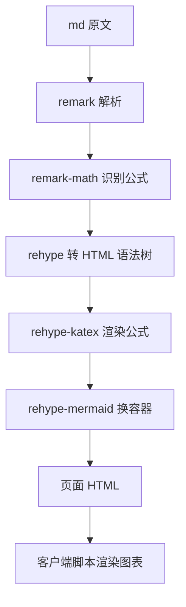
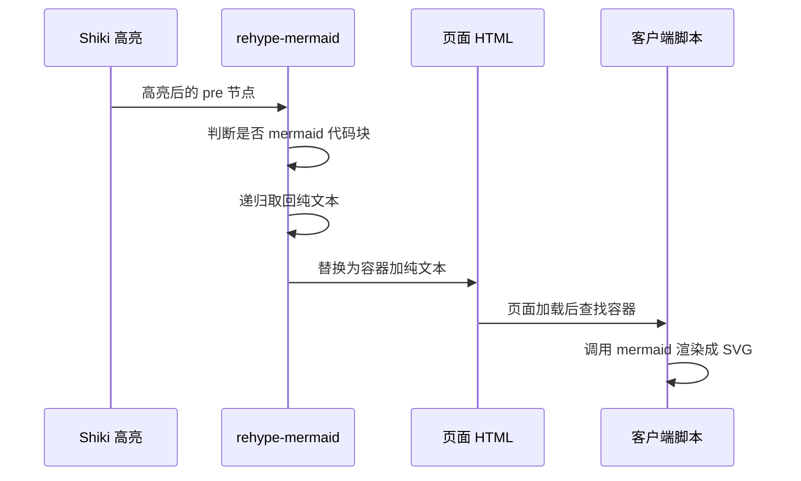

# 构建期渲染管线

文档里写下一个独立的公式行，刷新页面时公式已经排好版，文字不闪一下再变样；同一页里放一个 mermaid 流程图，打开时图表才出现，网络面板里能看到多出一个请求。两种语法在同一套 Markdown 管线里被分别处理，公式走构建期，图表走客户端。

管线配置在 `astro.config.mjs` 的 `markdown` 段。配置注释写明了取舍：公式在构建期渲染成 HTML，首屏不闪、不加载额外 JS；图表还原成纯文本容器，交给页面里懒加载的脚本。

## 为什么要换掉默认解析器

Astro 自带 Markdown 解析器，但公式与图表的开源生态主要围绕 remark 与 rehype 两套插件。因此配置里显式替换处理器（`astro.config.mjs`）：

```tsx
processor: unified({
  remarkPlugins: [remarkMath],
  rehypePlugins: [rehypeKatex, rehypeMermaid],
}),
shikiConfig: { theme: 'github-light' },
```

`unified` 是这两套插件的公共管线实现，来自 `@astrojs/markdown-remark`。替换之后，Astro 仍然负责调用时机与产物，只是内部的转换步骤换成了这三个插件。

换管线的代价是需要自己维护插件版本与顺序。顺序在这里有意义：公式必须先在语法树阶段被识别，才轮到 HTML 阶段的渲染插件处理。



## 三个插件各管一段

| 插件 | 阶段 | 作用 |
| --- | --- | --- |
| `remark-math` | 语法树 | 把行内与独立公式识别成数学节点 |
| `rehype-katex` | HTML | 把数学节点渲染成公式 HTML，构建期完成 |
| `rehype-mermaid` | HTML | 把 mermaid 代码块换成可被客户端接管的容器 |

公式由 `katex` 渲染，样式表需要在页面里引入，文档区在布局或样式层引入一次即可。图表插件是仓库自己的实现（`src/lib/rehype-mermaid.mjs`），只有八十行。

## 代码高亮排在插件前面

这里有一个容易踩的点：Astro 的管线里，代码高亮（Shiki）在用户的 rehype 插件之前执行。插件作者把这条顺序写进了文件头注释（`rehype-mermaid.mjs`），因为插件拿到的节点来自高亮之后，原始的 `pre` 加纯文本已经被拆成带 span 的结构：

```tsx
<pre class="astro-code" dataLanguage="mermaid"><code><span>...</span></code></pre>
```

而 mermaid 需要的是原始纯文本。所以插件不能只认一种形态，必须把 span 里的文本重新拼回来。

## 插件如何还原图表文本

插件做三件事：判断一个 `pre` 是不是 mermaid、递归取回纯文本、替换成容器（`src/lib/rehype-mermaid.mjs`）。

判断兼顾两种形态：高亮后看 `pre` 的数据属性，高亮前看内部 `code` 的类名（`isMermaidPre`）。数据属性在语法树里会被规范化，两种写法都做了兼容。

取文本用一个递归函数把所有文本节点拼接起来，因此高亮产生的 `span` 不影响结果（`textOf`）。替换后的结构是外层容器加一个纯文本 `pre`（`toDiagram`）：

```tsx
<div class="diagram">
  <pre class="mermaid" data-diagram="mermaid">原始文本</pre>
</div>
```

外层容器负责边框与图号样式，内层元素带固定的类名与数据属性，供客户端脚本查找。遍历是递归的，代码块出现在列表或引用里也能被发现（`transformChildren`）。



## 不在构建期画图的原因

构建期把 mermaid 渲染成 SVG 需要浏览器环境（注释里提到 playwright 这类工具），会让构建变重、变慢，并且图表就固定成了图片。当前做法把渲染放在客户端，浏览器空闲或滚动到可见时再执行，页面先出一段可读的源码。

代价是关闭 JavaScript 时看到的是源码而不是图。对一份留档文档来说，源码本身仍然可读，这个取舍是可接受的。

## 易错点

| 位置 | 问题 | 建议 |
| --- | --- | --- |
| `astro.config.mjs` | 插件顺序写反会导致公式或图表不生效 | 识别类插件放语法树阶段，渲染类放 HTML 阶段 |
| `rehype-mermaid.mjs` | 只判断高亮后的形态，管线顺序变化后会失效 | 保持两种形态兼容 |
| `rehype-mermaid.mjs` | 取文本依赖递归拼接，嵌套结构改变时要一并检查 | 改动后用一份含列表与引用的样张验证 |
| `astro.config.mjs` | 代码高亮主题固定为浅色，与深色模式不匹配时对比度不足 | 需要深色主题时配置双主题 |
| 客户端脚本 | 图表渲染依赖脚本，关掉脚本只剩源码 | 关键图另附文字说明 |
| `katex` 样式 | 公式 HTML 已生成，样式没引入会显示成乱排的文字 | 在布局层统一引入一次 |

## 小结

### 核心概念

* 文档区用经典 remark 与 rehype 管线替换了默认解析器，公式与图表插件都在这一侧。
* 公式在构建期由 KaTeX 渲染成 HTML，页面不需要额外 JS。
* 图表代码块由自定义插件还原成容器，渲染交给客户端懒加载。
* 代码高亮排在用户插件之前，因此插件拿到的是高亮后的节点。
* 插件兼容高亮前后两种形态，并用递归方式取回纯文本。
* 关闭脚本时图表退化为可读源码。

### 设计权衡

| 选择 | 收益 | 代价 |
| --- | --- | --- |
| 换用经典管线 | 公式与图表生态成熟 | 需要自己维护插件与顺序 |
| 公式构建期渲染 | 首屏稳定，不依赖脚本 | 公式内容是构建期产物 |
| 图表客户端渲染 | 构建轻、图表可交互 | 依赖脚本，首次出现有延迟 |
| 兼容两种节点形态 | 管线顺序变化时不易失效 | 判断逻辑更啰嗦 |
| 图表退化为源码 | 无脚本仍可读 | 视觉呈现丢失 |

## 练习

### 基础题

1. 说出管线里三个插件各自的阶段与作用。
2. 为什么插件不能只依据一种节点形态做判断。
3. 图表为什么不在构建期渲染成 SVG。

### 挑战题

4. 给代码高亮配置深浅两套主题并按用户偏好切换，列出配置改动与样式接入点，并说明对公式与图表的影响。
5. 增加一个自定义代码块语法（例如提示框），设计插件与语法识别方式，并说明如何避免与 mermaid 判断冲突。

## 附：本页引用的路径

| 路径 | 用途 |
| --- | --- |
| `astro.config.mjs` | Markdown 管线与代码高亮配置 |
| `src/lib/rehype-mermaid.mjs` | mermaid 代码块转换插件 |
| `src/styles/docs.css` | 文档区样式（图表容器外观） |
| `src/scripts/docs.js` | 文档区客户端脚本（图表懒加载） |
| `package.json` | 插件与 KaTeX 依赖版本 |
