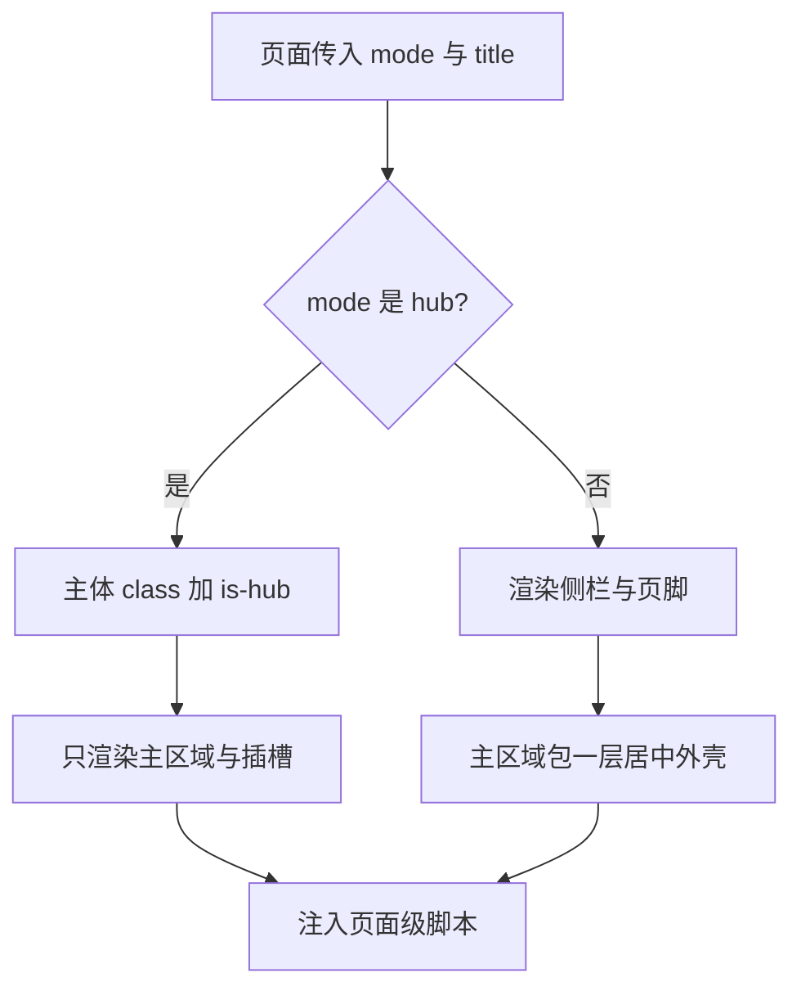
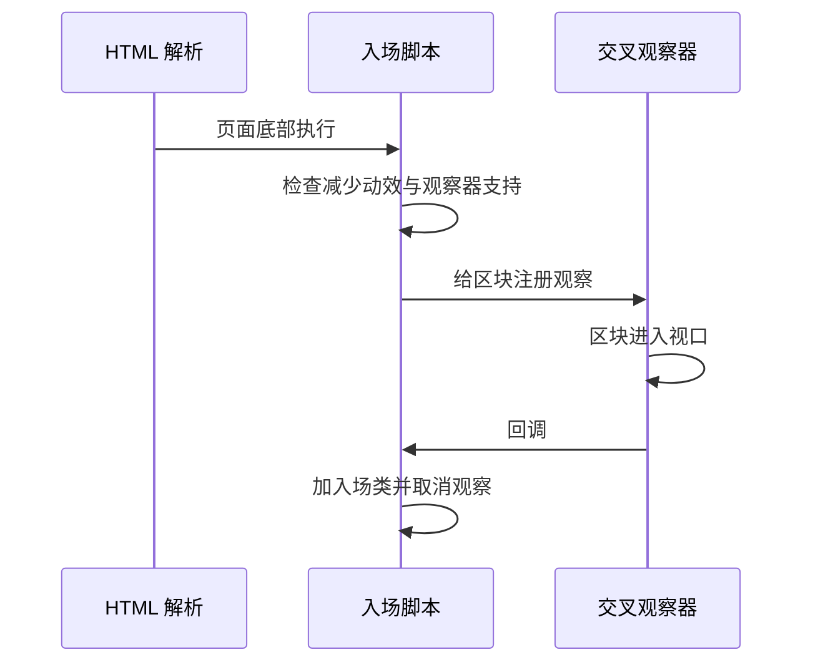

# 两套布局与导航装配

首页与站内子页看起来是两种东西：首页整屏沉浸、没有滚动、没有侧栏；项目页与关于页是常规的"左侧竖栏 + 内容 + 页脚"结构。实现上它们共用同一个布局文件 `src/layouts/BaseLayout.astro`（146 行），由传入的模式决定走哪一支。

除了外壳结构，这个文件还负责一批容易散落各处的页面级工作：标题拼接、分享卡片的元数据、当前导航高亮、无脚本环境下的入场动效降级。

这些工作本来每页都要重复一遍：写标题标签、写分享卡片、判断当前导航项。集中到一处之后，新增页面只传标题与描述即可，导航与页脚改一次全站生效；代价是布局文件同时承担两类页面的差异，读它时要先分清当前走的是哪一支。


两种模式共享同一套样式表与同一份站点配置，差异只体现在结构分支上。首页的调整不会波及子页的侧栏，反过来也一样，因为两者的类名与选择器各自作用在自己的外层容器上。
## 一个布局，两种模式

布局接收五个属性，其中模式只有两个取值（`BaseLayout.astro` 的属性声明）。Astro 组件用 `Props` 接口声明入参，页面传的值从 `Astro.props` 取：

```astro
interface Props {
  title?: string;
  description?: string;
  ogImage?: string;
  /** page = 常规子页（左侧竖栏 + 页脚）；hub = 首页单屏终端（无竖栏、无滚动） */
  mode?: 'page' | 'hub';
  /** 追加到 <body> 的类名，例如文档区的 'is-docs'（对应 docs.css 里的作用域） */
  bodyClass?: string;
}
const { title, description = site.description, ogImage = url('/og.png'), mode = 'page', bodyClass } = Astro.props;
const isHub = mode === 'hub';
```

解构时直接写了默认值，所以描述与分享图缺省时来自站点配置（`src/config/site.ts`），新增页面只写标题也能得到完整的元数据。

样式与字体的引入顺序也在这个文件里定死，后面 CSS 单元会用到这份顺序（上游令牌契约 → 字体包 → 本站样式表，同名变量以后引入的为准）：

```astro
import '@yunyoujun/ak-ui/tokens.css';
import '@fontsource/oswald/400.css';
import '@fontsource/jetbrains-mono/400.css';
import '../styles/global.css';
```

标题按模式拼：给了 `title` 就拼成"标题 · 站点名"，否则用"站点名 · 定位语"。这个拼接是全站唯一的标题来源，页面里不要再写第二个 `<title>`。

## 两种外壳的差别

模式为 `hub` 时，页面只有一个主区域，直接把插槽内容铺满，不渲染侧栏与页脚；模式为 `page` 时渲染侧栏、带外壳的内层主区域与页脚。分支写在 `body` 里（`BaseLayout.astro`）：

```astro
<body class={[isHub ? 'is-hub' : null, bodyClass].filter(Boolean).join(' ') || undefined}>
  <a class="skip" href="#main">跳到主要内容</a>

  {isHub ? (
    <main id="main"><slot /></main>
  ) : (
    <>
      <header class="rail">...站点标识、导航、版权...</header>
      <main id="main"><div class="shell"><slot /></div></main>
      <footer class="foot">...社交入口、素材署名...</footer>
    </>
  )}
</body>
```

`<slot />` 是 Astro 的插槽：布局里留出位置，调用页面写在标签之间的内容会填进去，两种模式因此共用同一个布局文件。`<>...</>` 是 Fragment，用来把多个兄弟节点当成一个整体放进三元分支。`body` 的类名由数组过滤后拼接，文档区要追加 `is-docs` 时只改传入的 `bodyClass`，不必改布局。

| 部分 | 首页模式 | 子页模式 |
| --- | --- | --- |
| 主区域 | 单屏铺满 | 包在居中外壳里 |
| 左侧竖栏 | 无 | 站点标识、主导航、版权 |
| 页脚 | 无 | 站点信息、社交入口、素材署名 |
| 滚动 | 由页面自己控制 | 正常文档流 |

两种模式都保留了一个"跳到主要内容"的链接，键盘用户可以跳过导航直达正文。首页模式下它同样存在，因为单屏页面的交互元素集中在主区域。



## 元数据与站内链接

规范链接与分享图地址都用站点配置里的域名拼绝对地址，避免子路径部署时出现半截相对路径：

```ts
const pageTitle = title ? title + ' · ' + site.name : site.name + ' · ' + site.tagline;
const canonical = new URL(Astro.url.pathname, site.url).href;
const ogImageUrl = new URL(ogImage, site.url).href;
```

`new URL(路径, 域名)` 用域名做基准把路径解析成绝对地址，所以 `canonical` 与 `ogImageUrl` 一定以 `https://` 开头——搜索引擎和分享卡片抓取时不会因为相对路径而取不到图。`Astro.url` 是当前请求的地址对象，在页面里只读。

导航高亮有一段专门的判断（`isActive`）。注释解释了原因：站点部署在子路径下时首页地址不是斜杠，如果继续用斜杠当判据，每个页面都会把"终端"点亮：

```ts
const path = Astro.url.pathname;
// 子路径部署时首页 href 是 /tc63/，不能再用 '/' 当判据，否则每个页面都会点亮"终端"
const home = url('/');
const isActive = (href: string) => (href === home ? path === home : path.startsWith(href));
```

先算出首页的完整地址，再对首页做全等比较、对其它地址做前缀比较。导航标记再把结果写进语义属性：

```astro
{site.nav.map((item) => (
  <a href={item.href} aria-current={isActive(item.href) ? 'page' : undefined}>{item.label}</a>
))}
```

`aria-current="page"` 是 ARIA 里表示"当前项"的语义属性，屏幕阅读器会读出来；样式层用 `[aria-current='page']` 选择器上高亮，不需要额外的类名。图标与站内链接则统一走 `src/lib/url.ts` 的拼接函数，把部署基路径带进去。

## 首页的自检浮层

首页模式会在 `head` 里插入一段内联脚本，在页面解析前决定要不要给根元素加一个类（`BaseLayout.astro` 的 `isHub` 分支）：

```js
var reduce = window.matchMedia('(prefers-reduced-motion: reduce)').matches;
var seen = false;
try { seen = sessionStorage.getItem('hub-boot') === '1'; } catch (e) {}
if (!seen && !reduce) {
  document.documentElement.classList.add('js-boot');
  try { sessionStorage.setItem('hub-boot', '1'); } catch (e) {}
  // 兜底：万一交互脚本挂了，6 秒后强制撤掉遮罩
  setTimeout(function () {
    document.documentElement.classList.remove('js-boot');
  }, 6000);
}
```

脚本带 `is:inline`，Astro 因此原样输出、不打包也不延迟执行——这是它能在 `body` 解析之前跑起来的前提；放到页面底部会有"先闪一帧完整页面再盖上遮罩"的观感。`sessionStorage` 是随标签页存活的浏览器存储，关掉标签页就重置，所以"本次会话看过"天然按标签页计；两层 `try/catch` 是为了在隐私模式等禁止存储的环境里静默跳过。`prefers-reduced-motion` 是用户系统里的"减少动效"偏好，用 `matchMedia` 就能读到。

## 入场动效与降级

子页模式在页面底部挂了一段脚本，用交叉观察器给滚动进入视口的区块加入场类（`BaseLayout.astro` 末尾的脚本）：

```js
const reduceMotion = window.matchMedia('(prefers-reduced-motion: reduce)').matches;
if (!reduceMotion && 'IntersectionObserver' in window) {
  const targets = Array.from(
    document.querySelectorAll('.sec, .pj, .grid-3 > *, .metrics > *, .hero__meta > *'),
  );
  targets.forEach((el) => el.classList.add('reveal-ready'));
  const io = new IntersectionObserver(
    (entries) => {
      entries.forEach((entry) => {
        if (entry.isIntersecting) {
          entry.target.classList.add('reveal-in');
          io.unobserve(entry.target);   // 只播一次，之后不再观察
        }
      });
    },
    { rootMargin: '0px 0px -8% 0px', threshold: 0.04 },
  );
  targets.forEach((el) => io.observe(el));
}
```

交叉观察器是浏览器自带的"元素是否进入视口"回调 API，比监听滚动事件省性能；`'IntersectionObserver' in window` 是能力检测，老浏览器里整段跳过。默认情况下这些元素是可见的，只有脚本运行成功才添加 `reveal-ready`（先隐藏）再逐个显示。因此脚本加载失败或用户禁用脚本时，内容照常显示，不会因为等不到观察器回调而留白。



## 页脚里的第三方署名

页脚固定放两行信息：一行是站名与定位语、社交入口；另一行是素材署名，写明流体背景改编自哪个开源项目（MIT 许可）以及视觉语言参考（`BaseLayout.astro` 的页脚部分）。署名写进布局而不是页面，保证任何页面都不会漏掉。

社交入口来自站点配置的数组，新增一个入口只改配置，导航与页脚会同时更新：

```astro
{site.socials.map((s) => (
  <a href={s.href} target="_blank" rel="me noopener">{s.label}</a>
))}
```

`target="_blank"` 开新标签页，`rel="noopener"` 让新页面拿不到 `window.opener`（避免外链页面反向操纵本站），`me` 则声明这是本人的账号链接。

## 易错点

| 位置 | 问题 | 建议 |
| --- | --- | --- |
| `BaseLayout.astro` | 标题拼接只在布局里做，页面里再写一个标题标签会重复 | 标题统一走属性传入 |
| `BaseLayout.astro` | 首页浮层脚本依赖会话存储，隐私模式或存储被拒时会静默跳过 | 接受该降级，浮层不是必需内容 |
| `BaseLayout.astro` | 六秒兜底是无条件移除遮罩，慢设备上可能闪一下 | 需要更稳可改成事件确认后再移除 |
| `BaseLayout.astro` | 导航高亮用前缀比较，父路径会同时点亮 | 需要精确匹配时改成全等 |
| `BaseLayout.astro` | 入场动效的目标选择器写死在脚本里，新增区块类名不会被观察到 | 新增区块时同步更新选择器 |
| `src/config/site.ts` | 社交数组与导航数组都直接进页面，写错协议不会在构建期报错 | 提交前点一遍外链 |

## 小结

### 核心概念

* 全站只有一个基础布局，靠模式开关分出首页单屏与常规子页两种外壳。
* 标题、描述与分享图的默认值都来自站点配置。
* 规范链接与分享图用站点域名拼绝对地址，站内链接统一经过基路径拼接。
* 导航高亮对首页做全等比较、对其它地址做前缀比较。
* 首页自检浮层在文档解析前用内联脚本决定是否显示，并带超时兜底。
* 入场动效在脚本可用时才隐藏元素，禁用脚本时内容照常显示。

### 设计权衡

| 选择 | 收益 | 代价 |
| --- | --- | --- |
| 单布局双模式 | 元数据与页脚只维护一份 | 布局文件承担两类页面的差异 |
| 默认值集中在站点配置 | 新页面零配置 | 配置写错影响全站元数据 |
| 内联脚本决定浮层 | 避免首屏闪一帧 | 与样式类名强耦合 |
| 动效默认可见 | 无脚本环境不丢内容 | 脚本执行前会看到一次完整内容 |
| 页脚固定署名 | 许可信息不会漏 | 每个页面都多两行内容 |

## 练习

### 基础题

1. 两种模式在结构上的差别有哪些，哪些部分是共用的。
2. 标题与分享图地址分别是怎样得到的。
3. 入场动效在什么条件下才会隐藏元素。

### 挑战题

4. 增加第三种模式用于打印或嵌入视图，列出需要改动的分支与属性，并说明如何避免影响现有两种模式。
5. 把首页浮层的开关改成由页面显式声明，设计属性与脚本读取方式，并说明与"只显示一次"策略如何共存。

## 附：本页引用的路径

| 路径 | 用途 |
| --- | --- |
| `src/layouts/BaseLayout.astro` | 基础布局、导航、页脚与页面级脚本 |
| `src/config/site.ts` | 站点身份、导航与社交入口 |
| `src/lib/url.ts` | 基路径拼接 |
| `src/styles/global.css` | 外壳样式 |
| `astro.config.mjs` | 站点域名与部署基路径 |
