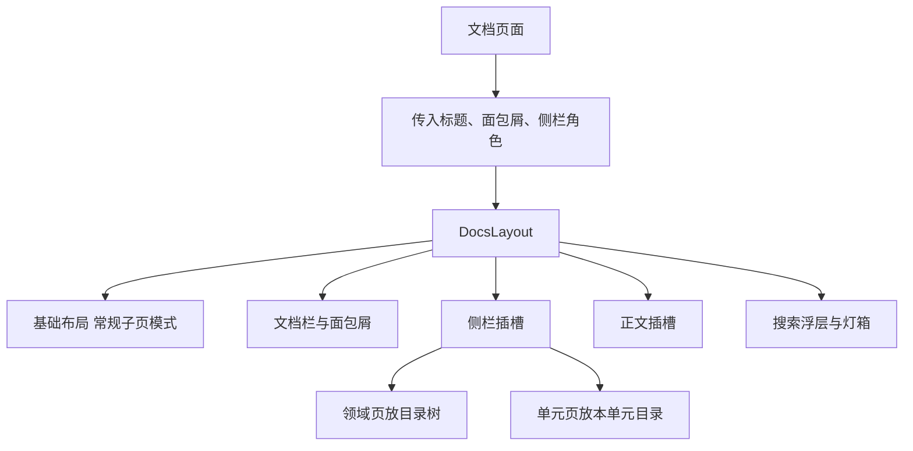
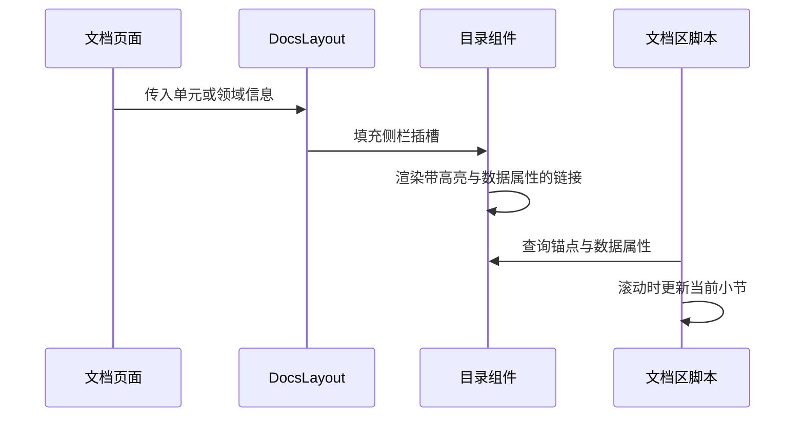

# 文档区布局与目录组件

打开任意一个文档页面，会看到几件固定出现的东西：顶部一条文档栏，左边是可折叠的侧栏，侧栏在领域页显示全站目录树、在单元页显示本单元目录，正文右下角可能有一条阅读进度条，按 `Ctrl K` 会弹出搜索浮层。这些都来自同一个专用布局的统一装配，各个页面不必自己拼。

`src/layouts/DocsLayout.astro`（119 行）在基础布局之上包了一层：它把基础布局切到常规子页模式，再补上文档区自己的外壳、浮层与脚本入口。


文档栏在滚动时保持可见，页面的其余部分正常滚动。文档区自己的样式表负责这套表现，布局只提供结构与标识。

文档区的样式表单独引入，与站点其它页面互不影响；调整文档排版时不会波及首页与项目页。

窄屏下侧栏收起后，正文宽度与该领域的其它页面保持一致，折叠状态只影响侧栏本身，不改变正文排版。
## 布局接收什么

文档布局的属性分成两类：一类是给元数据与文档栏用的标题、描述与面包屑；另一类是给侧栏与正文用的角色信息（`DocsLayout.astro` 的属性声明）：

```tsx
interface Props {
  title?: string
  description?: string
  crumbs?: { label: string; href?: string }[]
  railTitle?: string
  railCount?: string
  reading?: boolean
}
```

`reading` 为真时页面顶部会多一条阅读进度元素，单元正文页把它打开，领域页与文档首页不开。`railTitle` 与 `railCount` 决定窄屏折叠按钮上显示什么，宽屏下侧栏常驻，这两个值只影响折叠状态。

布局还把公式排版样式与文档区样式表一并引入（`DocsLayout.astro` 顶部），因此文档区不需要在页面里重复引入样式。正文与侧栏分别用两个具名插槽填充：默认插槽进正文，名为 `rail` 的插槽进侧栏。



## 文档栏与面包屑

文档栏由三部分组成：左侧是回到文档区首页的标识，中间是面包屑，右侧是搜索按钮（`DocsLayout.astro` 的页头部分）。

面包屑是一段数组映射：有地址的项渲染成链接，没有地址的最后一项渲染成当前项，项之间插入分隔符。这个约定写在属性注释里——最后一项不写地址就是当前页。因此调用方只需按层级给出数组，不用关心高亮。

搜索按钮带有对话框语义属性，并显示快捷键提示。它只负责打开浮层，查询与键盘交互在脚本里。

## 侧栏与折叠

侧栏分两层：外层是一个折叠按钮，内层是一个带标识的容器，具名插槽就放在容器里（`DocsLayout.astro` 的侧栏部分）。

折叠按钮带 `aria-expanded` 与 `aria-controls`，初始为收起状态，由脚本在点击时翻转。宽屏样式下按钮隐藏、容器常驻；窄屏样式下按钮可见，容器默认收起。这套表现完全由样式表控制，布局只给出语义与标识。

## 两级目录组件

侧栏里放什么由页面决定。领域页与文档首页放目录树（`src/components/DocsTree.astro`，41 行），单元页放本单元目录（`src/components/DocsToc.astro`，35 行）。

目录树遍历三级清单里的领域与单元，每一项带两位序号，并用当前领域与单元两个属性决定高亮（`DocsTree.astro` 的 `is-current` 类）。它同时统计全站的领域数与单元数显示在表头，因此这个组件只读清单，不需要页面传数据。

单元目录按文件分组，每个文件一个锚点链接，下面列出该文件的二三级标题（`DocsToc.astro` 的映射）。标题链接上带了深度与序号两个数据属性，滚动定位的脚本靠它们判断当前读到哪一节。



## 搜索浮层与图片灯箱

搜索浮层与灯箱都写在布局末尾，初始带隐藏属性（`DocsLayout.astro` 的浮层部分）。

浮层的关键标识是索引地址：布局把一个指向搜索索引接口的地址挂在容器上，脚本第一次打开时才按这个地址拉取。这样文档首页与所有领域页都不需要为搜索做额外工作，浮层里的"共多少个文件"直接来自清单统计。

灯箱准备了两条通道：一条图片元素、一条媒体容器。图片走前者，图表走后者由脚本克隆渲染结果。标题里的小标签与说明文字也给了标识，供脚本填充分类与图注。

布局最后用一段脚本调用文档区的初始化函数（`src/scripts/docs.js`），折叠、滚动定位、搜索与灯箱的运行时行为都在那个函数里注册。

## 易错点

| 位置 | 问题 | 建议 |
| --- | --- | --- |
| `DocsLayout.astro` | 侧栏内容靠具名插槽，页面忘记填充时会得到空侧栏 | 需要侧栏的页面都放一个目录组件 |
| `DocsLayout.astro` | 阅读进度元素只在单元页打开，其他页面按 `reading` 判断 | 新增长页面时显式打开 |
| `DocsTree.astro` | 高亮同时比较领域与单元，只传其一会高亮到同名的另一个单元 | 两个属性成对传入 |
| `DocsToc.astro` | 只列出二三级标题，一级标题与更深标题不进目录 | 需要时调整过滤深度 |
| `DocsLayout.astro` | 浮层与灯箱常驻 DOM，靠隐藏属性控制 | 关注首屏体积时改为按需渲染 |
| `src/scripts/docs.js` | 折叠状态由脚本管理，无脚本时窄屏侧栏可能占位 | 样式里给无脚本兜底 |

## 小结

### 核心概念

* 文档布局在基础布局之上再包一层外壳，并切成常规子页模式。
* 标题、面包屑与侧栏角色都通过属性传入，正文与侧栏用两个插槽填充。
* 窄屏折叠按钮与侧栏容器的状态由样式与脚本配合控制。
* 目录树遍历三级清单，单元目录按文件与标题两级生成锚点。
* 搜索浮层把索引地址挂在容器上，首次打开才拉取。
* 灯箱支持图片与图表两条通道，运行时行为集中在初始化函数里。

### 设计权衡

| 选择 | 收益 | 代价 |
| --- | --- | --- |
| 文档区独立布局 | 外壳与浮层只维护一份 | 多一层布局嵌套 |
| 侧栏用插槽 | 领域页与单元页各取所需 | 页面必须自己填插槽 |
| 目录数据直接读清单 | 组件无需参数 | 组件与清单模块耦合 |
| 浮层按需拉索引 | 首屏不带搜索数据 | 首次搜索有等待 |
| 折叠状态由脚本控制 | 宽窄屏共用一套结构 | 无脚本时依赖样式兜底 |

## 练习

### 基础题

1. 文档布局相比基础布局多做了哪几件事。
2. 目录树与单元目录分别需要什么输入，显示内容有什么差别。
3. 搜索浮层是怎样知道去哪里取索引的。

### 挑战题

4. 给侧栏加一个"只看当前领域"的筛选，设计状态保存方式与脚本改动，并说明刷新后如何恢复。
5. 让阅读进度条支持点击跳转到任意小节，列出需要的锚点数据与交互实现，并说明与滚动定位如何互不干扰。

## 附：本页引用的路径

| 路径 | 用途 |
| --- | --- |
| `src/layouts/DocsLayout.astro` | 文档区外壳、浮层与脚本入口 |
| `src/layouts/BaseLayout.astro` | 基础布局 |
| `src/components/DocsTree.astro` | 全站目录树 |
| `src/components/DocsToc.astro` | 单元内目录 |
| `src/scripts/docs.js` | 文档区运行时行为 |
| `src/styles/docs.css` | 文档区样式 |
