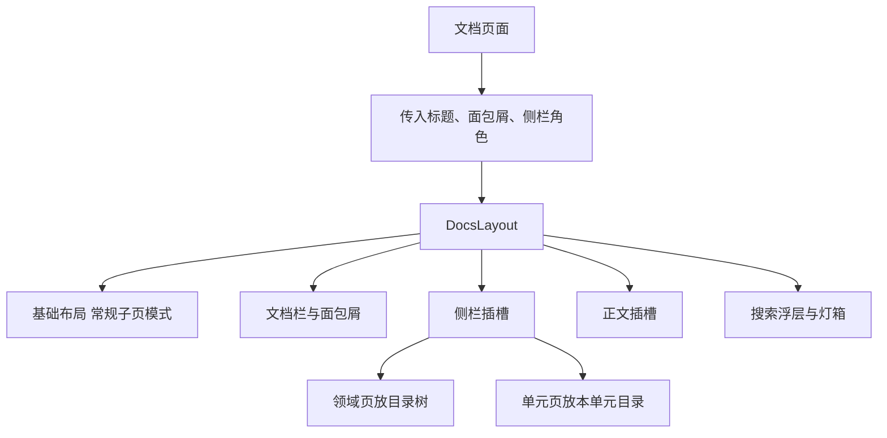
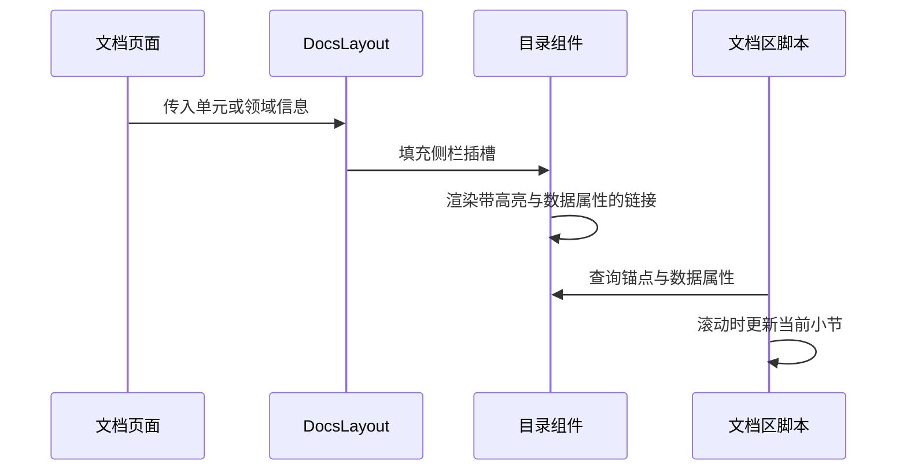

# 文档区布局与目录组件

打开任意一个文档页面，会看到几件固定出现的东西：顶部一条文档栏，左边是可折叠的侧栏，侧栏在领域页显示全站目录树、在单元页显示本单元目录，正文右下角可能有一条阅读进度条，按 `Ctrl K` 会弹出搜索浮层。这些都来自同一个专用布局的统一装配，各个页面不必自己拼。

`src/layouts/DocsLayout.astro`（119 行）在基础布局之上包了一层：它把基础布局切到常规子页模式，再补上文档区自己的外壳、浮层与脚本入口。

文档页面数量最多、结构又几乎一样，外壳、侧栏、搜索与灯箱如果由每个页面自己拼，改一次就得全站翻一遍。专用布局把这些固定件收在一处，页面只负责给出标题与侧栏内容；基础布局则继续服务首页与项目页，两类页面互不牵扯。


文档栏在滚动时保持可见，页面的其余部分正常滚动。文档区自己的样式表负责这套表现，布局只提供结构与标识。

文档区的样式表单独引入，与站点其它页面互不影响；调整文档排版时不会波及首页与项目页。

窄屏下侧栏收起后，正文宽度与该领域的其它页面保持一致，折叠状态只影响侧栏本身，不改变正文排版。
## 布局接收什么

文档布局的属性分成两类：一类是给元数据与文档栏用的标题、描述与面包屑；另一类是给侧栏与正文用的角色信息（`DocsLayout.astro` 的属性声明）：

```astro
interface Props {
  title?: string;
  description?: string;
  /** 面包屑：最后一项不写 href 就是当前页 */
  crumbs?: { label: string; href?: string }[];
  /** 窄屏折叠按钮上的标题 */
  railTitle?: string;
  railCount?: string;
  /** 单元正文页：挂上阅读进度条 */
  reading?: boolean;
}
```

`reading` 为真时页面顶部会多一条阅读进度元素，单元正文页把它打开，领域页与文档首页不开。`railTitle` 与 `railCount` 决定窄屏折叠按钮上显示什么，宽屏下侧栏常驻，这两个值只影响折叠状态。

布局顶部还把公式排版样式与文档区样式表一并引入：

```astro
import 'katex/dist/katex.min.css';
import '../styles/docs.css';
import { docsStats } from '../lib/docs';
import { url } from '../lib/url';
```

因此文档区页面不需要自己重复引入样式。正文与侧栏分别用两个插槽填充：默认插槽进正文，具名插槽 `rail` 进侧栏——具名插槽就是给插槽起个名字，调用方用 `slot="rail"` 指定内容投递到哪一个。



## 文档栏与面包屑

文档栏由三部分组成：左侧是回到文档区首页的标识，中间是面包屑，右侧是搜索按钮。面包屑就是一段数组映射：

```astro
{crumbs.map((c, i) => (
  <>
    {i > 0 ? <span class="sep" aria-hidden="true">/</span> : null}
    {c.href ? <a href={c.href}>{c.label}</a> : <span class="now">{c.label}</span>}
  </>
))}
```

有地址的项渲染成链接，没有地址的最后一项渲染成当前项，项之间插入分隔符。这个约定写在属性注释里——最后一项不写地址就是当前页；调用方只需按层级给出数组，不用关心高亮。

搜索按钮带有对话框语义属性，并显示快捷键提示：

```astro
<button class="docsearch-btn" type="button" data-search-open aria-haspopup="dialog">
  <span aria-hidden="true">⌕</span>
  <span>搜索文档</span>
  <kbd>Ctrl K</kbd>
</button>
```

`aria-haspopup="dialog"` 预告点击后会弹出一个对话层，`<kbd>` 是表示按键的语义标签。按钮只负责打开浮层，查询与键盘交互在脚本里。

## 侧栏与折叠

侧栏分两层：外层是一个折叠按钮，内层是一个带标识的容器，具名插槽就放在容器里：

```astro
<aside class="docs__rail">
  <button class="railtoggle" type="button" data-railtoggle aria-expanded="false" aria-controls="doc-rail">
    <b>{railTitle}</b>
    {railCount ? <span>{railCount}</span> : null}
    <span class="chev" aria-hidden="true">›</span>
  </button>
  <div class="railbox" id="doc-rail" data-railbox>
    <slot name="rail" />
  </div>
</aside>
```

`aria-expanded` 表示"当前是展开还是收起"，`aria-controls` 指向它控制的那块内容的 `id`（这里是 `doc-rail`），屏幕阅读器靠这两个属性理解按钮与侧栏的关系。初始为收起状态，由脚本在点击时翻转这个属性；样式表则用属性选择器切换箭头方向，脚本不需要碰类名。宽屏样式下按钮隐藏、容器常驻；窄屏样式下按钮可见，容器默认收起。

## 两级目录组件

侧栏里放什么由页面决定。领域页与文档首页放目录树（`src/components/DocsTree.astro`，41 行），单元页放本单元目录（`src/components/DocsToc.astro`，35 行）。目录树直接导入清单，两层循环渲染：

```astro
{domains.map((d, di) => (
  <li class:list={['tree__domain', { 'is-current': d.slug === currentDomain }]}>
    <a href={d.href}><span class="n">{pad(di + 1)}</span><span>{d.title}</span></a>
    <ul class="tree__units">
      {d.units.map((u, ui) => (
        <li class:list={['tree__unit', { 'is-current': u.slug === currentUnit && d.slug === currentDomain }]}>
          <a href={u.href}><span class="n">{pad(ui + 1)}</span><span>{u.title}</span></a>
        </li>
      ))}
    </ul>
  </li>
))}
```

`class:list` 是 Astro 的条件类名指令：数组里的假值会被丢掉，`is-current` 只在条件成立时出现。高亮同时比较领域与单元，所以两个属性要成对传入。表头的领域数与单元数也来自这份清单，组件不需要页面另传数据。

单元目录按文件分组，每个文件一个锚点链接，下面列出该文件的二三级标题：

```astro
{unit.toc.map((f, fi) => (
  <div class="toc__file" data-fi={fi}>
    <a href={'#' + f.anchor}><span class="n">{pad(fi + 1)}</span><span>{f.file}</span></a>
    {f.headings.length > 0 ? (
      <ul class="toc__heads">
        {f.headings.map((h, j) => (
          <li><a href={'#' + h.slug} data-depth={h.depth} data-heading-j={j}>{h.text}</a></li>
        ))}
      </ul>
    ) : null}
  </div>
))}
```

标题链接上的 `data-depth` 与 `data-heading-j` 是自定义数据属性：滚动定位的脚本靠它们把目录项和正文里的标题对应起来，判断当前读到哪一节。



## 搜索浮层与图片灯箱

搜索浮层与灯箱都写在布局末尾，初始带 `hidden` 属性：

```astro
<div class="dsearch" data-search data-index={url('/docs/search-index.json')} hidden>
  <div class="dsearch__panel" role="dialog" aria-modal="true" aria-label="搜索文档" data-search-panel>
    ...
    <span data-search-count aria-live="polite">共 {stats.files} 个文件</span>
    <ul class="dsearch__results" data-search-results></ul>
  </div>
</div>
```

`hidden` 是 HTML 自带的隐藏属性，元素不进渲染树；`role="dialog"` 与 `aria-modal="true"` 告诉辅助技术"这是一个模态对话层"；`aria-live="polite"` 让结果条数变化时被读出来而不打断用户。关键标识是挂在容器上的 `data-index`：脚本第一次打开时才按这个地址拉取搜索索引，所以文档首页与所有领域页都不需要为搜索做额外工作，"共多少个文件"直接来自构建期统计。

灯箱准备了两条通道——一个媒体容器和一个图片元素：

```astro
<div class="dlightbox" data-lightbox hidden>
  <div class="dlightbox__tools">
    <button class="dlightbox__btn" type="button" data-lightbox-zoom aria-pressed="false">放大 ×1.8</button>
    <button class="dlightbox__btn" type="button" data-lightbox-close>关闭 ESC</button>
  </div>
  <figure class="dlightbox__fig">
    <div class="dlightbox__media" data-lightbox-media></div>
    
    <figcaption class="dlightbox__cap">...<span data-lightbox-cap></span></figcaption>
  </figure>
</div>
```

图片走 `img`，图表走媒体容器（由脚本把渲染出的 SVG 克隆进去）；`aria-pressed` 记录放大按钮的开合状态。布局最后用一段脚本调用文档区的初始化函数（`src/scripts/docs.js`）：

```astro
<script>
  import { initDocs } from '../scripts/docs.js';
  initDocs();
</script>
```

折叠、滚动定位、搜索与灯箱的运行时行为都在 `initDocs` 里注册。

## 易错点

| 位置 | 问题 | 建议 |
| --- | --- | --- |
| `DocsLayout.astro` | 侧栏内容靠具名插槽，页面忘记填充时会得到空侧栏 | 需要侧栏的页面都放一个目录组件 |
| `DocsLayout.astro` | 阅读进度元素只在单元页打开，其他页面按 `reading` 判断 | 新增长页面时显式打开 |
| `DocsTree.astro` | 高亮同时比较领域与单元，只传其一会高亮到同名的另一个单元 | 两个属性成对传入 |
| `DocsToc.astro` | 只列出二三级标题，一级标题与更深标题不进目录 | 需要时调整过滤深度 |
| `DocsLayout.astro` | 浮层与灯箱常驻 DOM，靠隐藏属性控制 | 关注首屏体积时改为按需渲染 |
| `src/scripts/docs.js` | 折叠状态由脚本管理，无脚本时窄屏侧栏可能占位 | 样式里给无脚本兜底 |

## 小结

### 核心概念

* 文档布局在基础布局之上再包一层外壳，并切成常规子页模式。
* 标题、面包屑与侧栏角色都通过属性传入，正文与侧栏用两个插槽填充。
* 窄屏折叠按钮与侧栏容器的状态由样式与脚本配合控制。
* 目录树遍历三级清单，单元目录按文件与标题两级生成锚点。
* 搜索浮层把索引地址挂在容器上，首次打开才拉取。
* 灯箱支持图片与图表两条通道，运行时行为集中在初始化函数里。

### 设计权衡

| 选择 | 收益 | 代价 |
| --- | --- | --- |
| 文档区独立布局 | 外壳与浮层只维护一份 | 多一层布局嵌套 |
| 侧栏用插槽 | 领域页与单元页各取所需 | 页面必须自己填插槽 |
| 目录数据直接读清单 | 组件无需参数 | 组件与清单模块耦合 |
| 浮层按需拉索引 | 首屏不带搜索数据 | 首次搜索有等待 |
| 折叠状态由脚本控制 | 宽窄屏共用一套结构 | 无脚本时依赖样式兜底 |

## 练习

### 基础题

1. 文档布局相比基础布局多做了哪几件事。
2. 目录树与单元目录分别需要什么输入，显示内容有什么差别。
3. 搜索浮层是怎样知道去哪里取索引的。

### 挑战题

4. 给侧栏加一个"只看当前领域"的筛选，设计状态保存方式与脚本改动，并说明刷新后如何恢复。
5. 让阅读进度条支持点击跳转到任意小节，列出需要的锚点数据与交互实现，并说明与滚动定位如何互不干扰。

## 附：本页引用的路径

| 路径 | 用途 |
| --- | --- |
| `src/layouts/DocsLayout.astro` | 文档区外壳、浮层与脚本入口 |
| `src/layouts/BaseLayout.astro` | 基础布局 |
| `src/components/DocsTree.astro` | 全站目录树 |
| `src/components/DocsToc.astro` | 单元内目录 |
| `src/scripts/docs.js` | 文档区运行时行为 |
| `src/styles/docs.css` | 文档区样式 |
