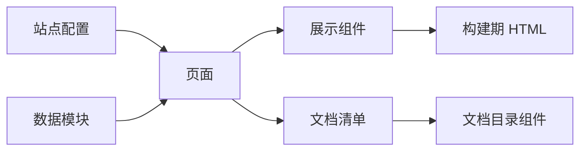
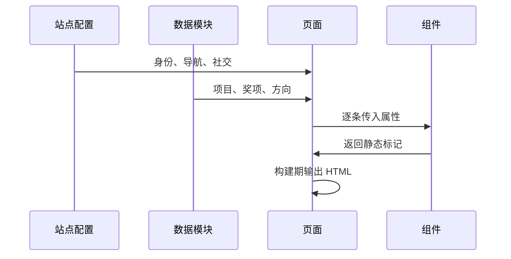

# 组件清单与数据真源

想在首页加一个奖项、把某个项目的标题改一下，或者调整自我介绍里的那句话——这些改动都不发生在组件里。首页与项目页由七八个展示组件拼成，组件只管把拿到的数据渲染出来，内容分别放在站点配置与数据模块里。

这样安排的好处是同一段文案能同时出现在多个页面：站点定位语在首页大字下面、页脚与关于页都用同一份，自我介绍在首页面板与关于页共用同一段。改一处，用到它的地方一起变。

## 组件都有哪些

站点只有八个组件，每个都很短（`src/components/` 下，最长 50 行）：

| 组件 | 行数 | 职责 |
| --- | --- | --- |
| `FluidBackground.astro` | 41 | 首屏流体背景的挂载点与参数 |
| `ProjectRow.astro` | 50 | 项目列表的行式展示 |
| `ProjectCard.astro` | 34 | 项目卡片的封面与要点 |
| `AwardList.astro` | 33 | 奖项条目的列表 |
| `AboutIntro.astro` | 36 | 关于页的自我介绍区块 |
| `DocsTree.astro` | 41 | 文档区全站目录树 |
| `DocsToc.astro` | 35 | 文档单元内目录 |

组件里没有数据请求，也没有跨组件的共享状态。需要什么就通过属性传进去，渲染完就结束。这种写法在静态站点里足够：页面在构建期把数据展开成 HTML，浏览器不需要为这些区块执行任何脚本。

## 站点配置是真源

`src/config/site.ts`（45 行）集中放全站身份信息：显示名、学校专业年级、定位语、方向关键词、自我介绍段落、站点描述、语言、正式域名、社交入口、其它联系方式与主导航。

文件头注释把它定义为"全站唯一真源"：改这里一处，页头、首屏、页脚与分享卡片元数据会一起变。它同时被基础布局与多个页面引用，因此改动的传播范围是全站。

导航数组里的地址在配置里就经过基路径拼接（`src/config/site.ts` 引用 `url()`），页面直接用结果，不会出现忘记加前缀的情况。社交入口是带标签的地址数组，页脚按数组渲染。

联系方式里留了一个"只展示不跳转"的类别：没有可点网页的账号只展示值，点击可整段选中复制。邮箱字段留空时页面不显示邮箱入口——空值即隐藏，而不是渲染一个空链接。

## 数据模块

内容量大的部分单独放在 `src/data/` 下：

| 模块 | 行数 | 内容 |
| --- | --- | --- |
| `projects.ts` | 277 | 项目条目：标题、简介、要点、封面与示意图 |
| `awards.ts` | 41 | 奖项条目：名称、时间与说明 |
| `directions.ts` | 19 | 方向关键词与简介 |

项目条目同时被首页与项目页使用，示意图路径指向 `src/assets/` 下的图形资源。数据模块是普通 TypeScript 文件，导出数组或对象，页面在构建期直接导入——没有接口调用，也没有运行时加载。

数据里出现的图片与图形资源由构建器处理：引用路径写在条目上，页面把地址交给图片组件或拼接函数。改图时替换资源文件即可，条目结构不变。

## 页面如何拼装

首页最长（434 行），它把首屏、方向、项目行、指标区等区块顺序排开，数据来自配置与数据模块，流体背景组件挂在首屏。关于页（82 行）用自我介绍组件加一段做法说明，做法段落直接读配置里的字段。项目总览页只有 32 行，把项目条目映射成卡片或行；项目详情页（134 行）按地址参数取条目，再渲染封面、要点与示意图。

文档区页面走的是另一套数据来源：文档首页、领域页与单元页都从文档清单读数据，再交给目录组件与正文插槽。两条数据流在这个项目里是分开的：站点内容是手写数据模块，文档内容来自目录扫描。

## 两条数据流的边界

站点内容的改动走提交与构建：改配置或数据模块，重新构建，页面才会变。文档内容只要往 `docs/` 目录里放 md，下次构建就自动出现，不需要动任何 TypeScript。

两条数据流都不参与运行时。页面在构建期就已经是完整的静态 HTML，搜索引擎拿到的是全部正文，不依赖脚本执行。需要交互的部分——文档区的折叠、搜索与灯箱，以及首屏背景——才由页面自己挂脚本。

这也是为什么组件可以写得这么短：数据在构建期就位，组件只做一次展开，不需要考虑加载中、失败与重试这些状态。

## 易错点

| 位置 | 问题 | 建议 |
| --- | --- | --- |
| `src/config/site.ts` | 配置同时被多页引用，改文案会影响全站 | 改前搜一遍字段名 |
| `src/data/projects.ts` | 项目条目结构较长，字段写错只会在构建时报错 | 新增条目时复制现有条目再改 |
| `src/components/ProjectRow.astro` | 行式与卡片式两种展示并存，样式容易分叉 | 共用同一份数据与要点结构 |
| `src/components/FluidBackground.astro` | 组件只挂载背景，参数写错会影响首屏观感 | 调整参数后在本机核对一次 |
| `src/pages/index.astro` | 首页 434 行，区块顺序与数据映射混在一起 | 新增区块时抽成组件 |
| 数据模块 | 图形资源路径与资源文件名强耦合 | 替换资源时同步改条目 |
| 文档目录 | 放错层级只会在构建日志里提示 | 新单元写完核对一次页面 |

## 小结

### 核心概念

* 站点只有八个短组件，组件不做数据请求，只按属性渲染。
* 站点身份与导航放在配置里，是全站唯一真源。
* 项目、奖项与方向数据放在数据模块里，构建期直接导入。
* 文档区页面从文档清单取数据，与站点内容两条数据流分开。
* 空配置值即隐藏对应入口，不渲染空链接。
* 首页最长，区块顺序与数据映射混在一个文件里。
* 两条数据流都不参与运行时，构建产物是完整静态 HTML。

### 设计权衡

| 选择 | 收益 | 代价 |
| --- | --- | --- |
| 数据集中在配置与数据模块 | 一处改、多处生效 | 改动的传播范围大 |
| 组件无状态 | 构建期直接输出 HTML | 需要交互的区块得单独挂脚本 |
| 内容手写为 TypeScript | 类型检查可用、无接口依赖 | 非技术编辑者不易直接改 |
| 站点内容与文档内容分开 | 两套数据互不干扰 | 两处都要维护各自的约定 |
| 首页不拆分 | 区块顺序一眼可见 | 文件长，新增区块成本上升 |
| 构建期展开数据 | 页面无需加载状态 | 内容更新必须重新构建 |

## 练习

### 基础题

1. 列出站点组件的职责划分，说明组件与数据的分工。
2. 站点配置里有哪些信息，哪些页面在用它。
3. 项目条目与图形资源是如何关联的。

### 挑战题

4. 把首页的长文件按区块拆成组件，写出拆分边界与属性设计，并说明如何保持最终 HTML 不变。
5. 让项目条目支持草稿状态，设计字段、过滤位置与页面表现，并说明对文档搜索索引没有影响的原因。

## 附：本页引用的路径

| 路径 | 用途 |
| --- | --- |
| `src/config/site.ts` | 站点身份、导航与联系方式 |
| `src/data/projects.ts` | 项目条目 |
| `src/data/awards.ts` | 奖项条目 |
| `src/data/directions.ts` | 方向关键词 |
| `src/components/` | 展示组件 |
| `src/pages/index.astro` | 首页装配 |
| `src/pages/about.astro` | 关于页 |
| `src/pages/projects/` | 项目总览与详情 |
