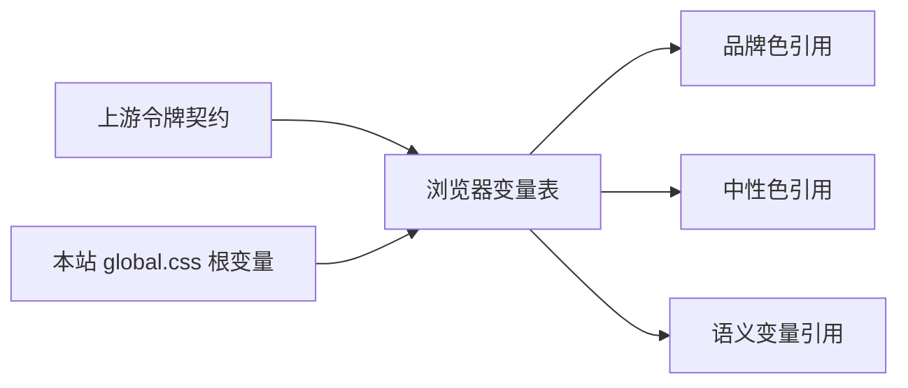
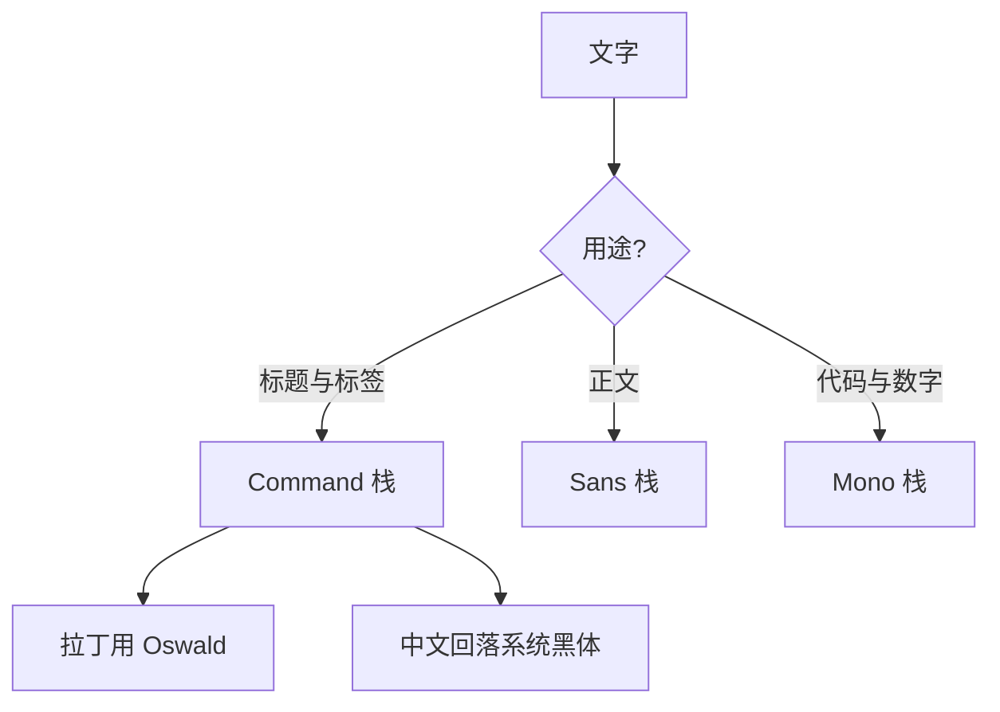

# 设计令牌与语义覆盖

想把站点主色从紫色换成另一种，或者把内容区最宽从 1360 像素改成 1200，改的地方都在一个文件的一段声明里（`src/styles/global.css` 的根变量）。其余样式规则只引用变量名，不写具体色值——这是整站能保持一致的前提。

这里说的"令牌"（design token）就是把颜色、字号、间距这些具体值起个名字存进变量，样式规则只引用名字。它由 CSS 自带的变量语法实现（写 `--名字: 值` 声明，用 `var(--名字)` 取值），不需要预处理器；好处是同一个值全站只有一处定义，换主题时只改这个名字指向的值。

这套令牌分成三层：品牌色板、本站的中性色、以及对上游设计语言语义变量的覆盖。上游的令牌文件在基础布局里先引入，本站文件随后引入并覆盖它，顺序决定了谁能生效。

令牌层的改动不需要重启开发服务器，浏览器会即时刷新。改动后需要快速过一遍首页、文档页与项目详情页，因为这三类页面对令牌的引用最集中。

## 令牌的三层结构

| 层 | 例子 | 谁在用 |
| --- | --- | --- |
| 品牌色板 | `--violet-500` 到 `--violet-900` | 强调色、边框、悬停状态 |
| 本站中性色 | `--paper`、`--ink`、`--line` | 背景、正文、分割线 |
| 语义覆盖 | `--ak-surface-*`、`--ak-text-*` | 上游组件与通用规则 |

上游设计语言的令牌契约在基础布局里引入（`src/layouts/BaseLayout.astro` 先引入上游令牌契约，随后引入本站样式表），本站样式表紧跟其后。同一个变量名被本站覆盖后，所有引用它的规则都会用新值，包括来自上游组件的规则。



## 品牌色板与中性色

紫色板给了八个档位，从几乎白色的背景紫到深紫，中间几档承担不同语义：浅档用于悬停底色与浅描边，中间档用于正文强调，深档用于链接与主按钮。中性色用一个"纸与墨"的隐喻命名。两层都声明在 `:root` 里：

```css
:root {
  /* ---- 品牌色板（白 + 紫）---- */
  --violet-50:  #F7F4FE;
  --violet-100: #F0EAFE;
  --violet-200: #DED2FB;
  --violet-300: #C4B0F7;
  --violet-500: #8B5CF6;
  --violet-600: #7C3AED;
  --violet-700: #6D28D9;
  --violet-900: #4C1D95;

  --paper:   #FFFFFF;
  --paper-2: #FAFAFB;
  --paper-3: #F1F1F4;
  --ink:     #14151A;
  --ink-2:   #5B5D68;
  --ink-3:   #8A8C97;
  --line:    #E3E3EA;
  --line-2:  #CFCFD8;
}
```

`:root` 匹配文档根元素，声明在里面的变量全站任何规则都能读到。中性色命名不带颜色词（`paper`、`ink` 而不是 `white`、`black`），换成别的主题时不需要改名——这也是为什么样式规则里看不到 `#FFFFFF` 这类值。

| 变量 | 角色 |
| --- | --- |
| `--paper` / `--paper-2` / `--paper-3` | 画布、面板、浅底 |
| `--ink` / `--ink-2` / `--ink-3` | 正文、次要文字、弱化文字 |
| `--line` / `--line-2` | 细分割线、较重的描边 |

## 覆盖语义层

第三层把中性色与品牌色接进上游的语义变量：表面色分画布、面板、弱化、抬起与反色五个；文字色分主、次与反色三个；状态色分基础、主、次、进阶、强调与弱化；信号色分信息、动作与强调。写法就是把本站色板赋给 `--ak-*` 变量：

```css
/* ---- 覆盖 ak-ui 语义层 ---- */
--ak-surface-canvas: var(--paper);
--ak-surface-panel: var(--paper-2);
--ak-surface-muted: var(--paper-3);
--ak-surface-raised: var(--paper);
--ak-surface-inverse: var(--ink);
--ak-text-primary: var(--ink);
--ak-text-secondary: var(--ink-2);
--ak-text-inverse: var(--paper);
--ak-color-basic: var(--violet-700);
--ak-color-primary: var(--violet-700);
--ak-color-secondary: var(--violet-300);
--ak-color-advanced: var(--violet-600);
--ak-color-accent: var(--violet-500);
--ak-color-low: var(--ink-3);
--ak-signal-info: var(--violet-700);
--ak-signal-action: var(--violet-600);
--ak-signal-accent: var(--violet-500);
```

CSS 变量遵循层叠规则：同名变量后声明的覆盖先声明的，所以本站文件必须排在上游令牌之后引入。这样做的好处是上游组件不需要改代码就能换主题——组件引用的是语义变量，本站只把语义变量指向自己的色板；坏处是语义变量名与色板名形成一张映射表，读样式时要在两个名字之间跳一次。

## 三套字体栈

字体分成三栈，并通过字体包自托管引入，不依赖外部字体服务：

| 变量 | 用途 | 组成 |
| --- | --- | --- |
| `--ak-font-command` | 标题与微标签 | Oswald + 中文黑体回落 |
| `--ak-font-sans` | 正文 | 系统字体栈 + 中文黑体回落 |
| `--ak-font-mono` | 代码与数字 | JetBrains Mono + 等宽回落 |

三个变量的值都是字体栈——一串按优先级排列的字体名，浏览器从左到右挑第一个装了的：

```css
--ak-font-command: 'Oswald', 'PingFang SC', 'Hiragino Sans GB', 'Microsoft YaHei', system-ui, sans-serif;
--ak-font-sans: system-ui, -apple-system, 'Segoe UI', Roboto, 'PingFang SC', 'Hiragino Sans GB', 'Microsoft YaHei', sans-serif;
--ak-font-mono: 'JetBrains Mono', ui-monospace, SFMono-Regular, Menlo, Consolas, monospace;
```

Oswald 只覆盖拉丁字母，遇到中文时前面的字体没有对应字形，自然落到栈里的系统黑体。字体文件来自 `@fontsource/*` 包——它们把字体作为 npm 依赖提供，在基础布局里按字重逐个引入，构建时随站点一起发布，因此不会像引用 Google Fonts 那样多一次外部请求：

```astro
import '@fontsource/oswald/400.css';
import '@fontsource/oswald/500.css';
import '@fontsource/jetbrains-mono/400.css';
```

标题走"命令字"风格：窄体、大写、宽字距，中文回落时字距归零（`src/styles/global.css` 的命令字样式，三级的字距单独归零）。等宽栈用于所有需要对齐的数字与代码片段。



## 站点自己的补充变量

令牌段末尾还有三个只属于本站的变量：

```css
/* ---- 本站补充 ---- */
--rail-w: 88px;
--shell-max: 1360px;
--shadow-none: none;
```

前两个直接决定布局几何：竖栏宽度同时用于固定侧栏的宽度与正文的左内边距，外壳最大宽度决定内容在宽屏上的铺开范围。

第三个变量看起来奇怪——一个值固定为"无"的阴影变量。它的作用是显式表达视觉约定：这套风格不使用软浮阴影，与其在各处零散地写"不要阴影"，不如留一个变量说明这条规则。

## 令牌的命名约定

变量名分三套前缀：品牌色用色名加序号，语义变量统一带上游前缀，站点自己的几何变量不带前缀。根声明只出现一次，任何新变量都加在这一段里，避免变量散落在各选择器中。

同名变量后声明的生效，因此本站文件必须在上游令牌之后引入。基础布局的导入顺序固定为上游令牌、字体包、本站样式表。

## 设计原则写在文件注释里

样式表开头用一段注释固定了视觉语言：

```css
/* ============================================================================
 * 视觉系统 —— 白 + 紫 · 简约平面（明日方舟式工业几何）
 * 基础：ak-ui 设计语言（@yunyoujun/ak-ui 的 token 契约）
 *   · 层级优先于装饰 · 非对称几何（切角/偏移线/一条斜轴）· 颜色即信号
 *   · 避免圆角卡片、胶囊、软浮阴影
 * 本文件在其语义 token 之上，把配色改为「白纸 + 紫色信号」并搭出横向布局。
 * ========================================================================== */
```

层级优先于装饰、采用非对称几何、颜色承担信号作用，不使用圆角卡片、胶囊标签与软浮阴影——这些约束解释了后面为什么大量使用切角、细线与单侧强调边。

把原则写在注释里不会被执行，但改样式的人会先看到它，减少"随手加一个圆角卡片"这类偏离。

## 易错点

| 位置 | 问题 | 建议 |
| --- | --- | --- |
| `global.css` | 覆盖语义变量后，上游组件的观感跟着变，排查困难 | 改覆盖段时全站扫一眼 |
| `global.css` | 变量名与色值分离，改色只看一处但影响面大 | 改主色后核对链接、按钮与悬停 |
| `global.css` | 中文回落到系统字体，不同系统字重观感不同 | 关键标题固定字重 |
| `global.css` | 自托管字体增加首屏请求，引入的字重越多越重 | 只保留用到的字重 |
| `global.css` | 中性色命名不含颜色词，新增颜色时容易放错层 | 新颜色先判断属于色板还是语义 |
| 样式规则 | 直接写具体色值会绕过主题 | 新增规则统一引用变量 |
| 上游令牌 | 变量被本地覆盖后行为不直观 | 需要时读上游令牌文件的默认值 |
| `global.css` | 三套前缀混用（色板、语义、本站几何），新增变量容易放错归属 | 新增变量先确定属于哪一层，再按对应前缀命名 |
| 令牌集中在根作用域 | 全局一致、易查找 | 任何改动都是全局影响 |

## 小结

### 核心概念

* 全站视觉由一份根变量声明定义，样式规则只引用变量。
* 令牌分品牌色板、本站中性色与上游语义覆盖三层。
* 覆盖层把中性色与品牌色接进上游语义变量，实现换主题不改组件。
* 三套字体栈分别服务标题、正文与代码，字体自托管。
* 站点补充变量负责竖栏宽度与外壳最大宽度，并显式声明不使用阴影。
* 视觉原则写在文件头注释里，约束装饰方式。
* 变量名分三套前缀，且只在根作用域声明一次。

### 设计权衡

| 选择 | 收益 | 代价 |
| --- | --- | --- |
| 颜色只出现在令牌段 | 换色只改一处 | 读规则时需要两次跳转 |
| 覆盖上游语义变量 | 上游组件免改代码 | 影响面大、排查成本高 |
| 自托管字体 | 不依赖外部服务 | 首屏请求增加 |
| 中性色用纸墨命名 | 换主题不改名 | 新成员需要先熟悉隐喻 |
| 原则写进注释 | 降低风格漂移 | 不可执行，只能靠自觉 |

## 练习

### 基础题

1. 令牌的三层分别放什么，为什么要有覆盖层。
2. 三套字体栈各自的用途与回落顺序。
3. 站点补充变量解决了哪些几何问题。

### 挑战题

4. 增加一套深色主题，列出变量覆盖的落点与切换方式，并说明如何避免改动所有样式规则。
5. 把品牌色板替换为另一组色相，列出需要检查的引用点与验证方式，并说明如何保证对比度仍达标。

## 附：本页引用的路径

| 路径 | 用途 |
| --- | --- |
| `src/styles/global.css` | 令牌声明与全站基础样式 |
| `src/layouts/BaseLayout.astro` | 令牌文件与字体包的引入顺序 |
| `package.json` | 字体包与设计语言包版本 |
| `src/styles/docs.css` | 文档区样式（引用同一套令牌） |
| `src/styles/hub.css` | 首页样式（引用同一套令牌） |
