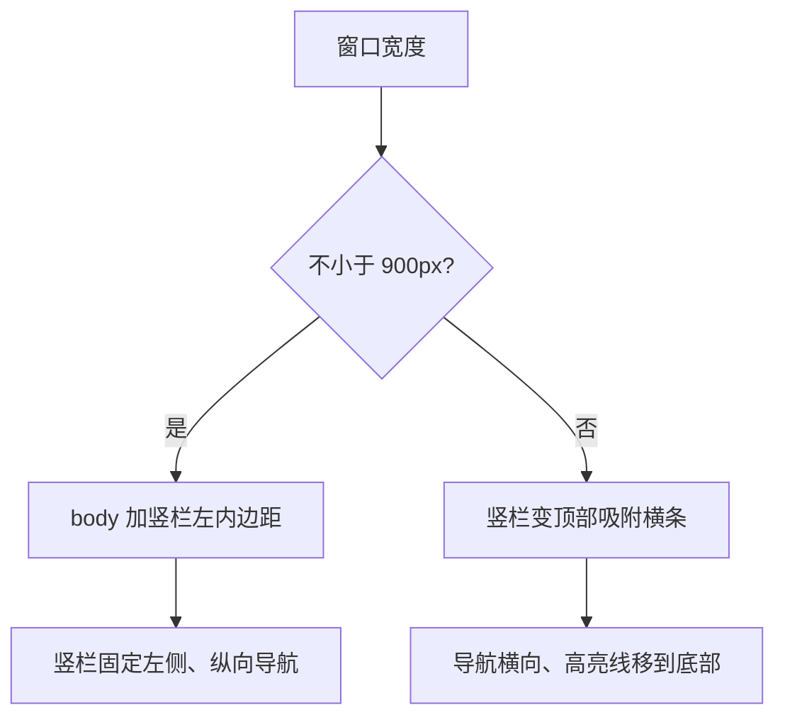
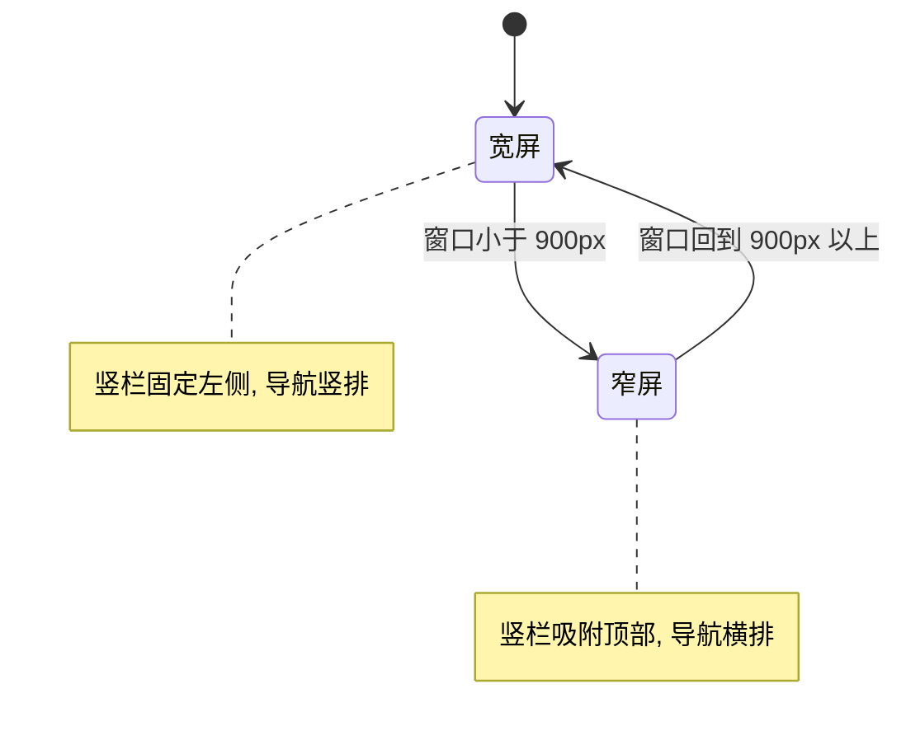

# 外壳与响应式布局

把浏览器窗口从宽拖到窄，会看到一件事发生：左侧那条写法的竖直导航在某个宽度突然变成顶部横条，同时正文的左边距消失。这个切换点是 900 像素，由两条互补的媒体查询完成（`src/styles/global.css` 的外壳段）。

除这个翻转之外，外壳还有一套统一的几何：居中容器、区块间距、区块头、主视觉两栏栅格与切角面板。它们都用变量或 `clamp()` 表达，随窗口连续变化，而不是在每个断点写一套尺寸。

窗口在两个断点之间时，页面保持最近一次形态，不会出现中间态。这也意味着窄屏与宽屏的观感差距只在跨过断点的那一刻补上。

## 重置与基础排版

文件开头做了最低限度的重置：所有元素用边框盒模型、页面内锚点滚动平滑、图片与图形块级显示且不超过容器宽度、链接去掉下划线（`global.css` 的基础段）。

正文排版规定在 `body` 上：字号十六像素、行高 1.75、字体走正文栈，并开启字体抗锯齿。标题使用命令字栈与紧行高，其中一级标题字号用上游的字号变量，二级用 `clamp()` 在 1.5 到 2.25 倍根字号之间连续变化——这样标题不会在某个断点突然跳变。

行内代码有浅底与细边框，微标签统一成大写宽字距的样式，还有一条紫色短线作为层级标记。这套基础规则被后面的所有区块复用。

## 居中容器与竖栏

内容容器限制最大宽度并水平居中，左右内边距用 `clamp()` 在 20 到 56 像素之间变化（`global.css` 的容器规则）。宽屏下 `body` 会加上等于竖栏宽度的左内边距，避免内容被固定竖栏盖住。

竖栏本身固定定位在左侧，宽度与变量一致，右侧一条细分割线，内部纵向排列站点标识、导航与版权（`global.css` 的竖栏规则）。导航文字用竖排书写模式，鼠标悬停变深色，当前页在顶部加一段紫色短线——高亮用的是属性选择器匹配 `aria-current`，因此高亮状态由语义属性决定，不额外加类名。

## 窄屏下的翻转

窄屏媒体查询把竖栏从固定改成吸附、从纵向改成横向，导航文字恢复横排，高亮线从顶边移到底边（`global.css` 的窄屏段）。标识图形也缩小一档。

同一套标记在两种形态下都能用，因为布局差异全部写在媒体查询里，结构不变。这也是为什么导航组件不需要判断屏幕宽度——它只负责渲染语义正确的链接。

## 区块头与主视觉栅格

内容区块用统一的上下留白类，分常规与紧凑两档，间距同样用 `clamp()` 随窗口变化。区块头是"序号 + 标题 + 一条伸展的细线 + 右侧更多链接"的横向结构，细线用弹性伸缩占满剩余空间（`global.css` 的区块头段）。

主视觉区默认单列，窗口到一千像素以上变成两栏，比例是一点零四比零点九六——接近均分但略有偏向，用来让文字栏稍宽一点。姓名用超大字号与负字距，定位语用命令字栈并着强调色，下面一排指标用等宽字体显示数值、用大写宽字距显示标签。

## 切角几何与按钮

面板与按钮的"切角"效果用裁剪路径实现：从左下到右上切掉一个角，其余三个角保持直角（`global.css` 的切角面板规则）。切角尺寸来自上游变量，分大中小三档，面板用大档、按钮用小档，形成一致的斜轴。

按钮是行内弹性盒子，带最小高度、大写宽字距的标签与过渡动画，悬停时文字与边框变成强调色。主按钮用深紫底白字。标签与徽章是更小的同类元素，左侧加一条短竖线或描边区分状态——徽章里"进行中"与"私人"用不同的描边与文字色表达，颜色承担信号作用。

## 断点一览

全站外壳的断点很少，每个负责一件事：

| 断点 | 作用 |
| --- | --- |
| 620px 以下 | 获奖列表与紧凑面板压成纵向 |
| 760px 以上 | 两栏与三栏栅格启用 |
| 900px 以上 | 竖栏固定左侧、正文留左边距；项目行分两栏 |
| 1000px 以上 | 主视觉分两栏；详情页分元信息与正文两栏 |

断点之外的尺寸变化交给连续函数，所以窗口拖动时只有形态切换是突变的。

## 首屏图像与装饰层

主视觉的图形容器固定四比三比例并裁掉溢出，流体背景的载体绝对定位铺满，画布用混合模式与白底相乘，让颜色落成浅紫而不是实色块（⟨BT⟩global.css⟨BT⟩ 的主视觉段）。

容器之上还叠了一层装饰图形，绝对定位、不接收指针事件，图形内部的括号、刻度、圆弧与十字分别用不同变量描边，构成工业感的辅助线。项目示意图里的文字样式也在这份样式表里统一规定，图形内文字与页面使用同一套字体与色板。

## 焦点与动效降级

焦点样式只对键盘可见焦点生效，轮廓宽度、颜色与偏移都来自上游变量（`global.css` 的基础段）。这意味着换主题时焦点样式跟着变，不需要单独维护。

动效方面有两条保护：一条媒体查询在用户要求减少动效时把过渡与动画时长压到最短（`global.css` 的减少动效段）；入场动效那组类只在脚本执行后才隐藏元素（上一单元已说明）。样式表里还有若干栅格类的断点，把两栏与三栏布局在窄屏压成单列。

## 易错点

| 位置 | 问题 | 建议 |
| --- | --- | --- |
| `global.css` | 竖栏宽度同时用于固定宽度与正文左内边距，只改一处会错位 | 改动时两处一起核对 |
| `global.css` | 断点分散在多个媒体查询里，新增布局容易漏掉窄屏 | 新组件先在小窗口下看一遍 |
| `global.css` | 裁剪路径切掉的角在不同尺寸下观感不同 | 用统一的三档变量 |
| `global.css` | 高亮依赖语义属性，缺属性时看不出当前位置 | 导航项都带上属性 |
| `global.css` | 减少动效只压时长，仍有布局位移的动画 | 位移类动效一并处理 |
| `global.css` | 正文行高按中文调的，插入大段英文时略松 | 需要时局部收紧 |

## 小结

### 核心概念

* 外壳几何用变量与连续函数表达，断点只处理形态翻转。
* 居中容器限制最大宽度，宽屏下给正文留出竖栏的左边距。
* 竖栏在 900 像素以下从固定侧栏翻成顶部吸附横条。
* 导航高亮通过语义属性选择器实现，结构不随形态变化。
* 切角由裁剪路径实现，尺寸分三档，与按钮共享同一条斜轴。
* 焦点样式与动效降级都接到上游变量和用户偏好上。
* 主视觉容器固定比例并裁掉溢出，装饰层不接收指针事件。

### 设计权衡

| 选择 | 收益 | 代价 |
| --- | --- | --- |
| 间距用连续函数 | 不同窗口下过渡自然 | 无法精确预期某个宽度的数值 |
| 单一断点翻转竖栏 | 移动端与桌面差异清晰 | 中间尺寸下侧栏已消失 |
| 切角代替圆角 | 风格统一、辨识度高 | 裁剪会裁掉溢出内容 |
| 高亮用语义属性 | 无需额外类名 | 忘记属性就没有高亮 |
| 动效降级压时长 | 尊重用户偏好 | 复杂动画仍需单独处理 |
| 画布用相乘混合 | 颜色自然融进白底 | 深色底上需要另调 |
| 形态由断点切换 | 实现简单、行为可预期 | 断点两侧存在一次视觉跳变 |

## 练习

### 基础题

1. 竖栏在两种形态下的差异有哪些，结构为什么不用改。
2. 居中容器与正文左边距分别由什么变量决定。
3. 切角是怎么实现的，三档尺寸分别用在哪里。

### 挑战题

4. 增加一个 1200 像素以上的宽屏布局，列出需要调整的栅格与间距，并说明如何避免影响现有断点。
5. 给竖栏加一个折叠成图标条的状态，设计状态存储与样式切换方式，并说明无脚本时如何降级。

## 附：本页引用的路径

| 路径 | 用途 |
| --- | --- |
| `src/styles/global.css` | 重置、外壳、栅格与按钮样式 |
| `src/layouts/BaseLayout.astro` | 外壳结构与导航标记 |
| `src/config/site.ts` | 导航项数据 |
| `src/styles/hub.css` | 首页外壳样式 |
| `astro.config.mjs` | 部署基路径 |
