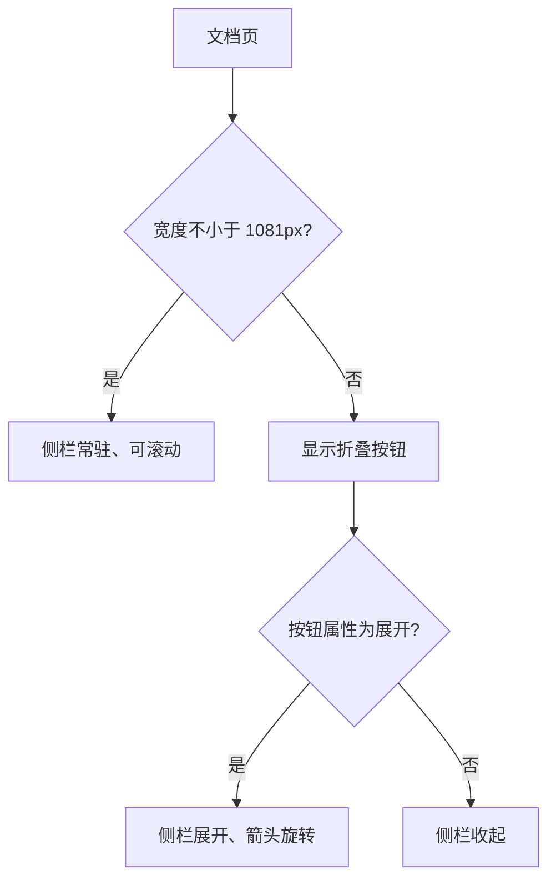
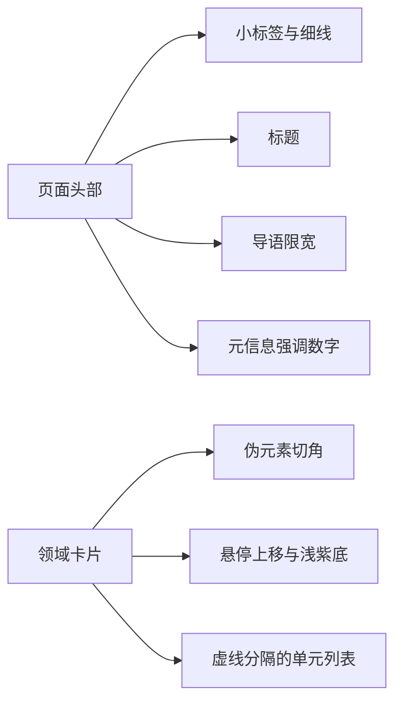

# 文档区视觉系统

文档页看起来和站内其它页面不太一样：更密的行距、更窄的阅读宽度、标题旁有编号和分隔线、代码块与表格有独立配色。这些差异来自 `src/styles/docs.css`（996 行）在 `is-docs` 作用域下的统一规定，页面自己没有写这些规则。

它同时管着文档区特有的几件东西：顶部工具条与阅读进度条、可折叠的两栏骨架、侧栏的目录树与单元目录、正文排版、搜索浮层与图片灯箱。整个文件分成十三个小节，每节对应外壳的一块。

## 工具条与阅读进度

工具条吸顶显示，内部横向排列文档区标识、面包屑、弹性空隙与搜索按钮（`docs.css` 的顶部工具条小节）。面包屑每项之间插入一个浅紫色分隔符，当前项用较深的文字色；搜索按钮是带细描边的矩形，悬停时底色变浅紫、边框变强调色，快捷键提示用等宽小字。阅读进度条固定在页面顶部，宽度由脚本更新。

工具条的层级高于正文，滚动时保持可见，让搜索入口始终可达。

## 两栏骨架与折叠断点

文档区的主体是"侧栏 + 正文"两栏（`docs.css` 的两栏骨架小节）。宽屏在一千零八十一像素以上时，侧栏固定宽度并从视口顶部铺到底部，内部可滚动；正文栏允许收缩，避免长代码块把布局撑破。

窄于该断点时侧栏不再常驻，改成一个折叠按钮，按钮上显示当前上下文标题与文件数，右侧的箭头在展开时旋转九十度。展开状态由按钮的属性表达，样式用属性选择器切换箭头方向，脚本只翻转属性。

## 侧栏的两级列表

侧栏表头是"标签 + 计数"的横向结构，计数用等宽小字右对齐（`docs.css` 的左栏小节）。目录树是嵌套列表：领域行左侧有一条透明边框，当前领域把边框染成强调色并让文字变色；单元行缩进一级，悬停时底色变浅紫。单元目录是另一种两级结构：文件行加标题行，标题行按深度属性分两档缩进，滚动定位时当前小节会拿到高亮状态。

两套列表共用同一套交互语言：左侧强调边、浅紫悬停底、等宽序号。这也是侧栏看起来风格统一的原因。

## 页面头部与领域卡片

页面头部由小标签、大标题、导语与元信息组成。小标签后面接一条伸展的细线，把标题区与右侧空间连起来；导语限制在阅读宽度内；元信息里的数字用强调色。

领域卡片是网格布局，每张卡片右上角有一个三角形切角（用伪元素实现），悬停时上移两像素、边框变浅紫、底色变浅。卡片内部依次是序号与标题、统计数字、单元列表（与主体之间用一条虚线分隔）。

## 单元正文与文件区块

一个单元页里每个文件渲染成一个区块，区块头横向排列"FILE 编号"、文件名、一条伸展细线与来源路径，正文跟在下面（`docs.css` 的单元正文小节）。区块之间有统一的间距，长文读起来仍有分隔感。

区块底部是上一篇与下一篇的导航：两个可点击块左右分列，各自显示方向标签、标题与所属领域信息；没有相邻项时用等宽占位块撑住布局，避免单个块占满整行。清单为空时显示空状态：居中的提示图标与两行说明，告诉读者新建目录后导航会自动出现。

## 行式列表

单元列表与最近更新共用行式列表样式（`docs.css` 的行式列表小节）：每行左侧是编号、中间是标题与摘要、右侧是统计数字，行与行之间用细线分隔，悬停时底色变浅紫。行式列表比卡片更紧凑，适合一页里排很多条目。

## 正文排版

正文段落是最长的一节（`docs.css` 的正文排版小节），它规定阅读宽度、标题层级、列表、引用块、表格、代码块、行内代码与图表容器。

阅读宽度用变量限制，比全站正文更窄，长文在一行里能容纳的字数因此更合适。标题层级用左侧短竖线或编号区分，表格有细边框与斑马纹，代码块有浅底、细边框与横向滚动。图表容器给出居中与最大宽度，灯箱放大时沿用同一套配色。

这一节的规则只作用于文档作用域，因此改文档排版不会影响首页与项目页。

## 搜索浮层与灯箱

搜索浮层是覆盖全屏的遮罩加居中面板（`docs.css` 的搜索浮层小节）：顶部一行输入框与提示键，中间是结果列表，底部是索引来源与状态文字。结果行有标题、路径与匹配片段三层信息，键盘选中项有高亮底色。

灯箱同样由遮罩、工具按钮、媒体容器与图注组成（`docs.css` 的灯箱小节）。工具按钮支持放大与关闭，放大的实现是给媒体容器加一个状态类，图注里的小标签与说明分别用等宽与正文字体。

## 响应式与减少动效

文件末尾两小节处理窄屏与用户偏好（`docs.css` 的响应式与减少动效小节）：窄屏下侧栏改折叠、正文内边距收窄、表格允许横向滚动；用户要求减少动效时，过渡与动画被压到最短。

整个样式表用的都是同一套令牌，所以文档区的紫色、字体与线条和站点其它部分一致，差异只在密度与排版规则。

样式表按外壳的组成部分分节，新增一块外壳时先决定它属于哪一节。分节的价值在于改一处时能快速判断影响范围，避免在近千行里搜索选择器。

## 易错点

| 位置 | 问题 | 建议 |
| --- | --- | --- |
| `docs.css` | 折叠断点是 1081 像素，与站点外壳的 900 像素不同 | 调整断点时两类页面分别验证 |
| `docs.css` | 侧栏内部独立滚动，长目录在矮屏上可能出现双滚动条 | 矮屏下限制侧栏高度 |
| `docs.css` | 正文排版只作用于文档作用域，站点正文不会同步 | 需要统一时抽公共规则 |
| `docs.css` | 代码块横向滚动依赖容器可收缩 | 两栏骨架里给正文栏留最小宽度 |
| `docs.css` | 浮层与灯箱样式常驻，规则量不小 | 关注样式体积时按需拆分 |
| `docs.css` | 卡片切角用伪元素，边框与切角拼接处可能出现缝 | 用同一颜色覆盖拼接点 |
| `docs.css` | 空状态的提示文案写死在页面里 | 新增空状态时同步检查样式类 |
| `docs.css` | 分节注释与选择器前缀不总是一一对应 | 新增规则时沿用同节命名 |

## 小结

### 核心概念

* 文档区视觉集中在 `is-docs` 作用域下的样式表里，与站点其它页面互不影响。
* 工具条吸顶，内部是标识、面包屑、空隙与搜索按钮。
* 两栏骨架在 1081 像素以下变成折叠按钮，箭头随属性旋转。
* 侧栏目录树与单元目录共用强调边与浅紫悬停的交互语言。
* 正文排版单独一节，控制阅读宽度、标题、表格与代码块。
* 搜索浮层与灯箱都常驻 DOM，由隐藏属性与状态类控制显示。
* 单元页的每个文件是一个区块，底部承接上一篇与下一篇。
* 行式列表用于单元列表与最近更新，比卡片更紧凑。
* 样式表按外壳分节，新增块先归类再写规则。

### 设计权衡

| 选择 | 收益 | 代价 | 
| --- | --- | --- |
| 文档区独立样式表 | 排版可以单独调优 | 与站点规则存在重复 |
| 侧栏独立滚动 | 长目录不挤压正文 | 矮屏下出现双滚动 |
| 折叠用属性选择器 | 脚本只翻转状态 | 样式与属性耦合 |
| 浮层常驻 | 打开速度快 | 首屏样式与 DOM 体积增加 |
| 与站点共用令牌 | 视觉统一 | 改动令牌会同时影响两类页面 |
| 按外壳分节 | 改动影响范围清晰 | 文件长，定位要靠检索 |

## 练习

### 基础题

1. 文档区样式表管了哪几块，作用域是怎么限定的。
2. 折叠断点是多少，展开状态由什么驱动。
3. 正文排版与站点其它页面的排版有哪些差异。

### 挑战题

4. 给文档正文加一个可切换的紧凑模式，设计状态保存与作用范围，并说明如何避免影响侧栏。
5. 把搜索浮层改成分栏布局，列出需要调整的选择器与键盘交互影响，并说明窄屏如何降级。

## 附：本页引用的路径

| 路径 | 用途 |
| --- | --- |
| `src/styles/docs.css` | 文档区全部样式 |
| `src/styles/global.css` | 全站令牌与基础样式 |
| `src/layouts/DocsLayout.astro` | 文档区标记结构 |
| `src/components/DocsTree.astro` | 目录树标记 |
| `src/scripts/docs.js` | 折叠、定位、搜索与灯箱行为 |
