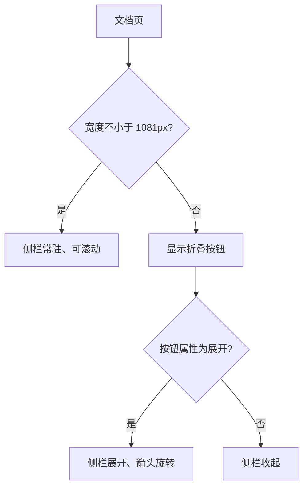
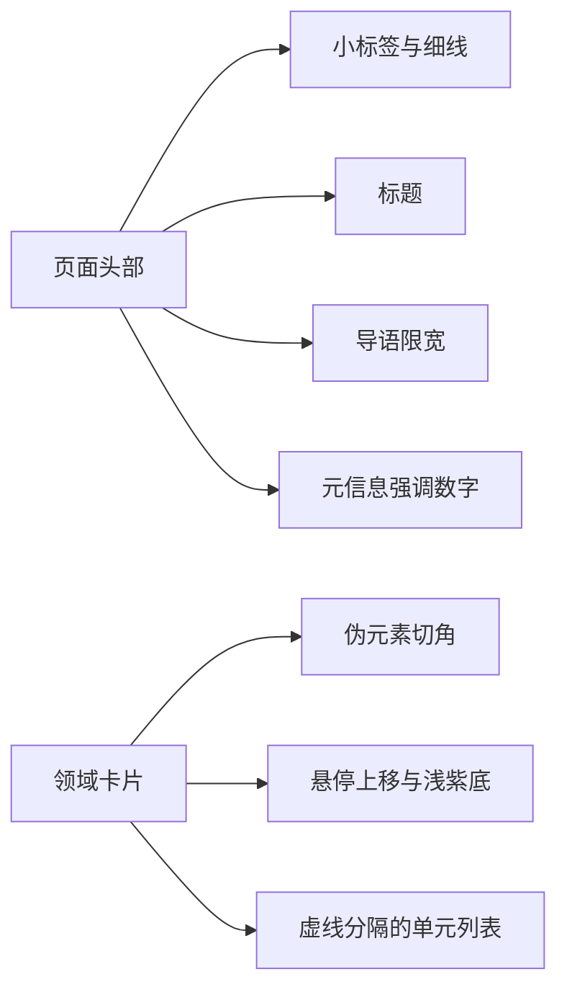

# 文档区视觉系统

文档页看起来和站内其它页面不太一样：更密的行距、更窄的阅读宽度、标题旁有编号和分隔线、代码块与表格有独立配色。这些差异来自 `src/styles/docs.css`（996 行）在 `is-docs` 作用域下的统一规定，页面自己没有写这些规则。

它同时管着文档区特有的几件东西：顶部工具条与阅读进度条、可折叠的两栏骨架、侧栏的目录树与单元目录、正文排版、搜索浮层与图片灯箱。整个文件分成十三个小节，每节对应外壳的一块。

"作用域"的做法是给 `body` 加一个类，所有规则都挂在它下面，同时在那里定义文档区专用变量：

```css
body.is-docs {
  --doc-cut: 12px;
  --doc-rail: 224px;
  --doc-read: min(100%, 1080px);
  --doc-media-max: min(80vh, 900px);
}
body.is-docs .shell { max-width: 1600px; padding-inline: clamp(16px, 2.2vw, 36px); }
```

变量声明在 `body.is-docs` 上而不是 `:root`，所以它们只在文档页里可见、不会影响首页与项目页；这是"文档区独立样式表"能互不干扰的机制。

长文阅读与展示型首页的目标不同，文档区因此需要一套自己的密度与排版规则；把这份样式表限定在文档作用域，调整文档排版不会波及首页与项目页，反过来也一样。

## 工具条与阅读进度

工具条吸顶显示，内部横向排列文档区标识、面包屑、弹性空隙与搜索按钮（`docs.css` 的顶部工具条小节）：

```css
.docbar {
  /* 撑满视口宽度（父级 .shell 有内边距），内容仍与站点栅格对齐 */
  margin-inline: calc(-1 * clamp(16px, 2.2vw, 36px));
  padding-inline: clamp(16px, 2.2vw, 36px);
  border-bottom: 1px solid var(--line);
  background: var(--paper);
  position: sticky;
  top: 0;
  z-index: 40;
}
```

负的 `margin-inline` 把工具条从父容器里"拉"到视口两侧，再用等量的 `padding` 把内容推回栅格线，因此它看起来是一条通栏、内容却仍然对齐。`position: sticky; top: 0` 让它在滚动时吸附在顶部，`z-index` 保证盖在正文之上。

阅读进度条则是固定定位，宽度由脚本更新：

```css
.docprogress {
  position: fixed;
  inset: 0 0 auto 0;
  height: 2px;
  background: var(--violet-600);
  transform: scaleX(0);
  transform-origin: 0 50%;
  opacity: 0;
  transition: opacity .3s ease;
}
body.is-reading .docprogress { opacity: 1; }
```

进度用 `transform: scaleX()` 而不是改宽度——缩放交给合成层处理，每帧更新不会触发布局重排。只有单元正文页在 `body` 上带 `is-reading` 时它才显形。面包屑每项之间插入一个浅紫色分隔符，当前项用较深的文字色；搜索按钮是带细描边的矩形，悬停时底色变浅紫、边框变强调色，快捷键提示用等宽小字。

## 两栏骨架与折叠断点

文档区的主体是"侧栏 + 正文"两栏（`docs.css` 的两栏骨架小节）：

```css
.docs {
  display: grid;
  grid-template-columns: var(--doc-rail) minmax(0, 1fr);
  gap: clamp(14px, 1.8vw, 30px);
  align-items: start;
}
.docs__rail { position: relative; align-self: stretch; }
@media (min-width: 1081px) {
  .docs__rail > .railbox {
    position: sticky;
    top: calc(var(--docbar-h, 56px) + 18px);
    max-height: calc(100dvh - var(--docbar-h, 56px) - 42px);
    overflow-y: auto;
    overscroll-behavior: contain;
  }
}
.docs__main { min-width: 0; }
```

两处细节值得留意。`minmax(0, 1fr)` 给正文栏一个"最小可以收缩到 0"的约束——栅格项默认不会小于内容宽度，长代码块会把布局撑破，写成 0 才允许它自己横向滚动。侧栏 `overflow-y: auto` 并在滚动链上 `overscroll-behavior: contain`，目录滚到底不会把整页一起带走；`100dvh` 是动态视口高度，移动端地址栏收起时它跟着变，比 `100vh` 稳。

侧栏能靠 sticky 跟随滚动，前提是父项 `align-self: stretch` 把左栏撑满整行，sticky 才有可移动的行程（源码注释写明了这一点）。窄于该断点时侧栏不再常驻，改成一个折叠按钮：

```css
@media (max-width: 1080px) {
  .docs { grid-template-columns: minmax(0, 1fr); }
  .docs__rail > .railbox { display: none; }
  .docs__rail > .railbox.is-open { display: block; margin-bottom: 18px; }
}
.railtoggle[aria-expanded='true'] .chev { transform: rotate(90deg); }
@media (max-width: 1080px) { .railtoggle { display: flex; } }
```

按钮上显示当前上下文标题与文件数，右侧的箭头在展开时旋转九十度。展开状态由按钮的 `aria-expanded` 属性表达，样式用属性选择器切换箭头方向，脚本只翻转属性——两者通过语义属性解耦，脚本不碰类名。



## 侧栏的两级列表

侧栏表头是"标签 + 计数"的横向结构，计数用等宽小字右对齐（`docs.css` 的左栏小节）。目录树是嵌套列表，交互语言集中在左侧那条 2 像素边框上：

```css
.tree__domain > a,
.tree__unit > a {
  display: block;
  color: var(--ink-2);
  border-left: 2px solid transparent;          /* 平时透明，先占住位置 */
  transition: color .16s ease, border-color .16s ease, background-color .16s ease;
}
.tree__domain.is-current > a { border-left-color: var(--violet-600); color: var(--violet-700); }
.tree__unit > a:hover { color: var(--violet-700); background: var(--violet-50); border-left-color: var(--violet-300); }
.tree__unit.is-current > a { color: var(--violet-700); border-left-color: var(--violet-600); background: var(--violet-50); font-weight: 600; }
```

边框平时是透明而不是不存在，所以高亮出现时文字不会左右跳一下。领域行由 `is-current` 类驱动（上一单元讲了它由组件里的 `class:list` 条件添加），单元行缩进一级，悬停时底色变浅紫。单元目录是另一种两级结构：文件行加标题行，标题行按 `data-depth` 属性分两档缩进，滚动定位时当前小节会拿到高亮状态。

两套列表共用同一套交互语言：左侧强调边、浅紫悬停底、等宽序号。这也是侧栏看起来风格统一的原因。

## 页面头部与领域卡片

页面头部由小标签、大标题、导语与元信息组成。小标签后面接一条伸展的细线，把标题区与右侧空间连起来；导语限制在阅读宽度内；元信息里的数字用强调色。

领域卡片是网格布局，每张卡片右上角有一个三角形切角（用伪元素实现），悬停时上移两像素、边框变浅紫、底色变浅。卡片内部依次是序号与标题、统计数字、单元列表（与主体之间用一条虚线分隔）。



## 单元正文与文件区块

一个单元页里每个文件渲染成一个区块，区块头横向排列"FILE 编号"、文件名、一条伸展细线与来源路径，正文跟在下面（`docs.css` 的单元正文小节）：

```css
.dfile { scroll-margin-top: calc(var(--docbar-h, 56px) + 18px); }
.dfile + .dfile { margin-top: clamp(38px, 5vw, 64px); }
.dfile__head { display: flex; align-items: center; gap: 12px; margin-bottom: 22px; }
.dfile__idx { font-family: var(--ak-font-mono); font-size: .66rem; color: #fff; background: var(--violet-700); padding: 3px 7px; letter-spacing: .1em; }
.dfile__name { font-family: var(--ak-font-command); text-transform: uppercase; color: var(--ink-3); white-space: nowrap; overflow: hidden; text-overflow: ellipsis; }
.dfile__rule { flex: 1; height: 1px; background: var(--line); }
.dfile__src { font-family: var(--ak-font-mono); font-size: .62rem; color: var(--ink-3); }
```

`scroll-margin-top` 给吸顶工具条留出高度：跳到 `#file-N` 锚点时浏览器会把目标顶到视口顶部，这个值让标题不会藏在工具条下面；`var(--docbar-h, 56px)` 的第二个参数是回退值，脚本还没量出真实栏高时用 56 像素兜底。区块之间用相邻兄弟选择器 `+` 给统一间距，第一个区块不会多出上边距。

区块底部是上一篇与下一篇的导航：两个可点击块左右分列，各自显示方向标签、标题与所属领域信息；没有相邻项时用等宽占位块撑住布局，避免单个块占满整行。清单为空时显示空状态：居中的提示图标与两行说明，告诉读者新建目录后导航会自动出现。

## 行式列表

单元列表与最近更新共用行式列表样式（`docs.css` 的行式列表小节）：每行左侧是编号、中间是标题与摘要、右侧是统计数字，行与行之间用细线分隔，悬停时底色变浅紫。行式列表比卡片更紧凑，适合一页里排很多条目。

## 正文排版

正文段落是最长的一节（`docs.css` 的正文排版小节），它规定阅读宽度、标题层级、列表、引用块、表格、代码块、行内代码与图表容器。阅读宽度是一行变量：

```css
.dfile__body { max-width: var(--doc-read); color: var(--ink); }
```

`--doc-read` 在作用域顶部定义成 `min(100%, 1080px)`，比全站正文更窄，长文一行里能容纳的字数因此更合适。行内代码与代码块各有自己的规则：

```css
.dfile__body :not(pre) > code {
  font-family: var(--ak-font-mono);
  font-size: .84em;
  background: var(--paper-3);
  border: 1px solid var(--line);
  padding: 1px 5px;
  color: var(--violet-900);
}
.codeblock {
  position: relative;
  margin: 0 0 22px;
  border: 1px solid var(--line);
  background: #fff;
  clip-path: polygon(0 0, calc(100% - var(--doc-cut)) 0, 100% var(--doc-cut), 100% 100%, 0 100%);
}
```

`:not(pre) > code` 的意思是"父元素不是 `pre` 的 code"，用来把行内代码与代码块里的代码分开，两种样式不会互相污染。代码块沿用本站的切角语言（右上角削掉 `--doc-cut`），带细边框与横向滚动。

标题层级用左侧短竖线或编号区分，表格有细边框与斑马纹。图表容器给出居中与最大宽度，灯箱放大时沿用同一套配色。这一节的规则都写在 `body.is-docs` 作用域下，因此改文档排版不会影响首页与项目页。

## 搜索浮层与灯箱

搜索浮层是覆盖全屏的遮罩加居中面板（`docs.css` 的搜索浮层小节）：

```css
.dsearch {
  position: fixed;
  inset: 0;
  z-index: 80;
  display: none;
  background: rgba(20, 21, 26, .42);
  backdrop-filter: blur(2px);
}
.dsearch.is-open { display: block; }
body.is-locked { overflow: hidden; }
.dsearch__panel {
  width: min(720px, calc(100vw - 28px));
  margin: max(64px, 12vh) auto 0;
  background: var(--paper);
  clip-path: polygon(0 0, calc(100% - 20px) 0, 100% 20px, 100% 100%, 20px 100%, 0 calc(100% - 20px));
}
```

`backdrop-filter: blur(2px)` 让遮罩后面的正文轻微失焦，面板因此更聚焦；`body.is-locked { overflow: hidden }` 在浮层打开时锁住页面滚动（"滚动穿透"是弹层的常见毛病）。`min(720px, calc(100vw - 28px))` 表示宽屏最多 720 像素、窄屏留出两侧边距。面板切的是两个对角，和按钮、代码块共用同一套斜轴语言。

灯箱结构类似（`docs.css` 的灯箱小节）：

```css
.dlightbox { position: fixed; inset: 0; z-index: 90; display: none; background: rgba(20, 21, 26, .82); overflow: auto; }
.dlightbox.is-open { display: grid; place-items: center; }
.dlightbox__media { display: none; width: 100%; }
.dlightbox.is-diagram .dlightbox__media { display: block; }
.dlightbox.is-diagram .dlightbox__fig > img { display: none; }
.dlightbox.is-zoom .dlightbox__media { width: 180%; max-width: none; }
```

`place-items: center` 是栅格布局的居中简写，一行同时管两个方向。放大不靠额外的 DOM，而是给容器换一个状态类 `is-zoom` 把宽度改成 180%；`is-diagram` 决定显示媒体容器还是图片元素。图注里的小标签与说明分别用等宽与正文字体。

## 响应式与减少动效

文件末尾两小节处理窄屏与用户偏好（`docs.css` 的响应式与减少动效小节）：窄屏下侧栏改折叠、正文内边距收窄、表格允许横向滚动，来源路径这类次要信息直接隐藏：

```css
@media (max-width: 1080px) {
  .dfile__src { display: none; }
}
```

用户要求减少动效时，过渡与动画被逐一关掉：

```css
@media (prefers-reduced-motion: reduce) {
  .dcard:hover, .unitnav a:hover { transform: none; }
  .dsearch__panel { animation: none; }
  .drow__link, .docsearch-btn, .codeblock__copy { transition: none; }
}
```

这里不只是把时长调短，而是把位移类效果（悬停上移）直接取消、入场动画关掉——减少动效偏好针对的正是这类运动，光压时长仍然会晃。

整个样式表用的都是同一套令牌，所以文档区的紫色、字体与线条和站点其它部分一致，差异只在密度与排版规则。

样式表按外壳的组成部分分节，新增一块外壳时先决定它属于哪一节。分节的价值在于改一处时能快速判断影响范围，避免在近千行里搜索选择器。

## 易错点

| 位置 | 问题 | 建议 |
| --- | --- | --- |
| `docs.css` | 折叠断点是 1081 像素，与站点外壳的 900 像素不同 | 调整断点时两类页面分别验证 |
| `docs.css` | 侧栏内部独立滚动，长目录在矮屏上可能出现双滚动条 | 矮屏下限制侧栏高度 |
| `docs.css` | 正文排版只作用于文档作用域，站点正文不会同步 | 需要统一时抽公共规则 |
| `docs.css` | 代码块横向滚动依赖容器可收缩 | 两栏骨架里给正文栏留最小宽度 |
| `docs.css` | 浮层与灯箱样式常驻，规则量不小 | 关注样式体积时按需拆分 |
| `docs.css` | 卡片切角用伪元素，边框与切角拼接处可能出现缝 | 用同一颜色覆盖拼接点 |
| `docs.css` | 空状态的提示文案写死在页面里 | 新增空状态时同步检查样式类 |
| `docs.css` | 分节注释与选择器前缀不总是一一对应 | 新增规则时沿用同节命名 |

## 小结

### 核心概念

* 文档区视觉集中在 `is-docs` 作用域下的样式表里，与站点其它页面互不影响。
* 工具条吸顶，内部是标识、面包屑、空隙与搜索按钮。
* 两栏骨架在 1081 像素以下变成折叠按钮，箭头随属性旋转。
* 侧栏目录树与单元目录共用强调边与浅紫悬停的交互语言。
* 正文排版单独一节，控制阅读宽度、标题、表格与代码块。
* 搜索浮层与灯箱都常驻 DOM，由隐藏属性与状态类控制显示。
* 单元页的每个文件是一个区块，底部承接上一篇与下一篇。
* 行式列表用于单元列表与最近更新，比卡片更紧凑。
* 样式表按外壳分节，新增块先归类再写规则。

### 设计权衡

| 选择 | 收益 | 代价 | 
| --- | --- | --- |
| 文档区独立样式表 | 排版可以单独调优 | 与站点规则存在重复 |
| 侧栏独立滚动 | 长目录不挤压正文 | 矮屏下出现双滚动 |
| 折叠用属性选择器 | 脚本只翻转状态 | 样式与属性耦合 |
| 浮层常驻 | 打开速度快 | 首屏样式与 DOM 体积增加 |
| 与站点共用令牌 | 视觉统一 | 改动令牌会同时影响两类页面 |
| 按外壳分节 | 改动影响范围清晰 | 文件长，定位要靠检索 |

## 练习

### 基础题

1. 文档区样式表管了哪几块，作用域是怎么限定的。
2. 折叠断点是多少，展开状态由什么驱动。
3. 正文排版与站点其它页面的排版有哪些差异。

### 挑战题

4. 给文档正文加一个可切换的紧凑模式，设计状态保存与作用范围，并说明如何避免影响侧栏。
5. 把搜索浮层改成分栏布局，列出需要调整的选择器与键盘交互影响，并说明窄屏如何降级。

## 附：本页引用的路径

| 路径 | 用途 |
| --- | --- |
| `src/styles/docs.css` | 文档区全部样式 |
| `src/styles/global.css` | 全站令牌与基础样式 |
| `src/layouts/DocsLayout.astro` | 文档区标记结构 |
| `src/components/DocsTree.astro` | 目录树标记 |
| `src/scripts/docs.js` | 折叠、定位、搜索与灯箱行为 |
