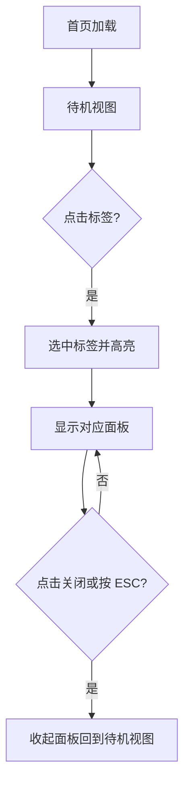
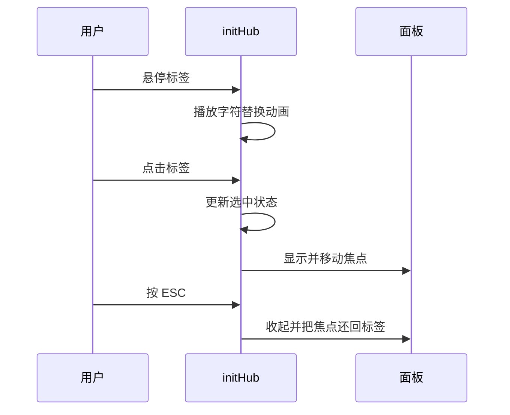

# 首页终端与视觉动效

首页打开时会先看到一层自检提示，随后出现一屏带顶栏、标签与光标准星的界面：切换标签会打开对应面板，面板里是项目行、文档入口与联系方式，鼠标移动时准星跟着走，右下角还有一个走字的时钟。这套界面把首页做成了终端拟态，与常规页面排版完全不同。

样式在 `src/styles/hub.css`（741 行）里，交互在 `src/scripts/hub.js`（318 行）里。首页模式不给基础布局渲染侧栏与页脚，因此这一屏的所有结构都由首页自己给出。

这样设计是为了让首页在一屏之内把身份、项目与文档入口同时亮出来，并用终端拟态贴合工程背景；常规子页可以靠滚动容纳内容，首页只能把要点挑出来放进一屏，这也是它必须另写一套外壳的原因。

## 环境层与顶栏

文件开头先铺环境层：一屏高的容器、深色或纸色的背景、若干装饰性的网格与刻度（`hub.css` 的环境层小节）。首页禁止页面级滚动，整屏高度用 `dvh`：

```css
body.is-hub { height: 100dvh; overflow: hidden; padding-left: 0; }
body.is-hub.is-reticle, body.is-hub.is-reticle * { cursor: none; }

.hub {
  position: relative;
  height: 100dvh;
  display: grid;
  /* 单列必须锁死为容器宽度：否则跑马灯这类 nowrap 内容的 min-content 会把整条轨道撑到 5000px+ */
  grid-template-columns: minmax(0, 1fr);
}
```

`overflow: hidden` 实现了"一屏不滚动"；`100dvh` 是动态视口高度，移动端地址栏收起时高度跟着变。`grid-template-columns: minmax(0, 1fr)` 那行注释记着一个真实踩坑：不锁死这一列，`nowrap` 内容的 min-content 会把栅格撑出屏幕。`cursor: none` 则把系统光标藏起来，交给脚本自绘的准星（后面会讲）。

顶栏横跨整屏，放标识、标签按钮与状态信息。标签按钮有两套状态：

```css
.tab:not([aria-selected='true']):hover .tab__label { color: var(--violet-700); }
.tab:not([aria-selected='true']):hover .tab__idx { background: var(--violet-600); color: #fff; border-color: var(--violet-600); }
.tab[aria-selected='true'] .tab__label { color: #fff; }
.tab[aria-selected='true'] .tab__meta { color: rgba(255, 255, 255, .8); border-left-color: rgba(255, 255, 255, .35); }
```

普通时文字是弱化色，选中或悬停时变强调色并出现指示线。`[aria-selected='true']` 与 `:not(...)` 都是属性选择器——状态存在语义属性里，样式只读它，脚本只负责切换。

## 主舞台与待机视图

主舞台是标签下方的区域，负责放置各个面板（`hub.css` 的主舞台小节）。初始状态显示待机视图：一段大字号的名字、一行定位语与提示文字，让读者知道可以点哪里。待机视图与面板共用同一块区域，切换由脚本改 `hidden` 与 `is-open` 完成：

```js
current = id;
setSelected(id);
panel.hidden = false;
panel.classList.remove('is-open');
void panel.offsetWidth; // 重新触发入场动画
panel.classList.add('is-open');
```

`hidden` 是 HTML 原生属性，`panel.hidden = false` 就把它放回渲染树；`void panel.offsetWidth` 读一次布局属性，强制浏览器把"移除类"这步先结算掉（触发一次重排），否则紧接着加回 `is-open` 会被合并成同一次样式更新，入场动画不会重播。这样不需要卸载与重建 DOM，切换成本很低。



## 面板与标签交互

面板是覆盖在主舞台上的可滚动容器（`hub.css` 的面板小节），内部按内容类型分成几块：项目行、文档入口、联系方式与底部四模块。

脚本 `initHub` 先取到根容器，再收集标签元素、提示条与各个面板（`src/scripts/hub.js`）：

```js
export function initHub() {
  const hub = document.querySelector('[data-hub]');
  if (!hub) return;

  const reduce = window.matchMedia('(prefers-reduced-motion: reduce)').matches;
  const tabEls = Array.from(hub.querySelectorAll('[data-tab]'));
  ...
}
```

`[data-hub]`、`[data-tab]` 是自定义数据属性选择器：结构里给元素打上标记，脚本按标记查找，样式与脚本因此不依赖类名的排列顺序。选中标签时更新高亮并打开对应面板；打开时会记住焦点来源、把焦点移进面板，关闭时按需把焦点还回去。键盘支持左右方向键在标签间移动，ESC 关闭面板。

标签文字在指针悬停或聚焦时会做一次短暂的字符替换动画（`hub.js` 的 `scramble`）：

```js
function scramble(el, ms = 340) {
  if (reduce || !el || el.__scrambling) return;
  const final = el.dataset.text || (el.dataset.text = el.textContent || '');
  const chars = Array.from(final);
  const start = performance.now();
  const frame = (now) => {
    const p = Math.min(1, (now - start) / ms);
    let out = '';
    for (let i = 0; i < chars.length; i++) {
      const ch = chars[i];
      if (ch === ' ') { out += ' '; continue; }
      out += p > i / chars.length + 0.12 ? ch : SCRAMBLE_CHARS[(Math.random() * SCRAMBLE_CHARS.length) | 0];
    }
    el.textContent = out;
    if (p < 1) requestAnimationFrame(frame);
    else { el.textContent = final; el.__scrambling = false; }
  };
  requestAnimationFrame(frame);
}
```

它先把最终文字存进 `data-text`，再逐帧把还没"解密"的字符换成随机符号（`requestAnimationFrame` 是浏览器提供的逐帧回调，屏幕刷新时调用一次）。`performance.now()` 是高精度时间戳，用来算动画进度；`reduce` 为真时函数直接返回，不做任何动画。提示条用于显示操作反馈，带一个可选的语气参数。



## 标签与面板的视觉语言

标签、面板与底部模块共用一套语言：文字用命令字栈的大写宽字距，数字与状态用等宽字体，区块之间用细线而不是阴影分隔。选中状态统一表现为强调色文字加一条指示线，悬停表现为浅紫底色。

提示条按语气参数切换描边与文字色：

```css
.toast.is-warn { color: var(--hub-amber-2); border-color: rgba(242, 193, 78, .45); }
.toast:not(.is-warn) { color: #fff; border-color: rgba(255, 255, 255, .22); }
```

正常、提醒与拒绝三种语气各有自己的颜色，颜色在这里继续承担信号作用——脚本只切换 `is-warn` 类，配色留在样式表里。面板内部的标题与分隔线沿用同一套变量，因此加一块新内容不需要新配色。

## 底部模块与信息条

底部四模块用浅紫底加深色描边的"按钮"拼成，每块是一组入口（`hub.css` 的底部模块小节）。信息条在最下方，放版权、时钟与状态文字，时钟由脚本每秒更新一次：

```js
function tickClock() {
  if (!clock) return;
  const now = new Date();
  clock.textContent = pad2(now.getHours()) + ':' + pad2(now.getMinutes()) + ':' + pad2(now.getSeconds());
  clock.setAttribute('datetime', now.toISOString());
}
tickClock();
window.setInterval(tickClock, 1000);
```

`setInterval(..., 1000)` 每秒跑一次；同时把机器可读的时间写进 `datetime` 属性，读屏或后续处理时不必解析显示文本。先手动调用一次再注册定时器，避免第一秒是空白。

文档入口区在没有任何文档时会显示空状态，提示文档区的目录结构；有内容时按行展示，行头可点击展开更多信息（`hub.js` 中给每一行绑定的展开处理）。

## 准星与开机自检

准星是跟随鼠标的一个小十字与圆环（`hub.css` 的准星小节）：

```css
.reticle {
  position: fixed; left: 0; top: 0; z-index: 100; width: 44px; height: 44px;
  margin: -22px 0 0 -22px; pointer-events: none;
  transform: translate3d(var(--rx, 0px), var(--ry, 0px), 0);
  opacity: 0; transition: opacity var(--hub-mid) ease;
}
.reticle.is-on { opacity: 1; }
.reticle__ring {
  position: absolute; inset: 5px; border: 1px dashed var(--violet-300);
  border-radius: 50%; animation: hub-spin 8s linear infinite;
}
@keyframes hub-spin { to { transform: rotate(360deg); } }
```

坐标不写死在样式里，而是脚本每帧写进 `--rx`/`--ry` 两个变量，`translate3d` 只做平移——同样是为了避开布局重排。`pointer-events: none` 让它纯装饰、不挡住下面的按钮；`@keyframes` 定义圆环自转。脚本一侧用缓动跟随而不是硬贴：

```js
const frame = () => {
  x += (tx - x) * 0.3;                       // 每次靠近目标 30%
  y += (ty - y) * 0.3;
  el.style.setProperty('--rx', x.toFixed(1) + 'px');
  el.style.setProperty('--ry', y.toFixed(1) + 'px');
  raf = Math.abs(tx - x) > 0.4 || Math.abs(ty - y) > 0.4 ? requestAnimationFrame(frame) : 0;
};
```

每次只走目标距离的 30%（常见的线性插值做法），准星因此有一点惯性；差值足够小就停止请求下一帧，静止时不空转。触屏设备上这层会被隐藏。

开机自检是一层覆盖全屏的提示，只在根元素带上特定类时显示：

```css
.boot { display: none; }
/* 只有 head 里的内联脚本确认「本次要播放自检」时才显示（无 JS 时永远不出现） */
.js-boot .boot {
  position: fixed; inset: 0; z-index: 120;
  display: grid; place-items: center; background: var(--paper);
  clip-path: inset(0 0 0 0);
}
.boot.is-out { animation: hub-boot-out .55s var(--hub-ease) forwards; }
@keyframes hub-boot-out {
  to { clip-path: inset(0 0 100% 0); opacity: 0; }
}
```

`js-boot` 这个类由基础布局里那段内联脚本在页面解析前加上——只有本次会话没看过、且用户没有要求减少动效时才加，并带六秒兜底（上一单元已说明）。因此样式层只需定义一个默认隐藏的遮罩；收起动画用 `clip-path: inset()` 从下往上裁掉，像拉帘一样退场。

## 首屏装配动效与窄屏

自检结束后面板与顶栏会依次淡入，构成一次"开机装配"的观感（`hub.css` 的首屏装配动效小节）：

```css
.is-hub .tab { animation: hub-rise .6s var(--hub-ease) both; }
.is-hub .tab:nth-child(1) { animation-delay: .3s; }
.is-hub .tab:nth-child(2) { animation-delay: .36s; }
.is-hub .tab:nth-child(3) { animation-delay: .42s; }
.is-hub .tab:nth-child(4) { animation-delay: .48s; }
/* 自检期间先按住装配动画；js-boot 一移除，装配动效立刻播放 */
.js-boot .hub-top > *, .js-boot .tab, .js-boot .idle { animation: none !important; }
```

同一段动画靠 `nth-child` 逐个错开延迟，形成依次亮起的节奏；自检遮罩还在时把装配动画按住，`js-boot` 一移除它们立刻播放。`animation` 里的 `both` 让元素在动画开始前保持首帧、结束后保持末帧，不会闪回原状。这些动效同样受减少动效偏好约束。

文件最后处理窄屏与矮屏（`hub.css` 的窄屏与矮屏小节）：窄屏下顶栏与面板改为纵向堆叠、部分装饰层隐藏；矮屏下压缩内边距，保证主要内容仍在首屏内。首页模式没有滚动，所以矮屏适配主要靠减少间距而不是让内容溢出。

## 与其余页面的关系

首页不渲染侧栏与页脚，导航里的"终端"项指向它；其它页面走常规外壳。两类页面引用同一套令牌，所以紫色、线条与字体一致，差别只在外壳结构。

首页样式与文档区样式互不引入，各自在自己的作用域里工作。修改全站令牌会同时影响这两处，这是唯一需要统一核对的路径。

首页的样式与脚本都只服务这一屏，改动不会影响站内其它页面；反过来，其它页面的样式调整也不会改变首页。两类页面唯一的交叉点是全站令牌。

## 易错点

| 位置 | 问题 | 建议 |
| --- | --- | --- |
| `hub.css` | 装饰层使用绝对定位，元素增多时容易互相遮挡 | 新增装饰时检查层级 |
| `hub.js` | 面板打开时移动焦点，关闭时依赖记录才能还回 | 从弹层入口打开时都要走同一函数 |
| `hub.js` | 字符替换动画直接改文字内容，读屏软件可能读到中间态 | 给装饰性文字加忽略标记 |
| `hub.css` | 准星只在指针设备上出现 | 触屏下显式隐藏 |
| `hub.css` | 开机遮罩默认隐藏、靠根类显示，类名与脚本强耦合 | 改类名时两处同步 |
| `hub.css` | 矮屏压缩间距，内容再多会溢出 | 首屏内容量需要控制 |
| `hub.js` | 时钟与准星持续更新，页面切到后台仍会运行 | 页面隐藏时暂停更新 |
| `hub.css` | 装饰性网格与刻度在窄屏被隐藏，观感与宽屏差异明显 | 窄屏保留一两条关键辅助线 |

## 小结

### 核心概念

* 首页是一屏终端，结构与样式都在首页自己的文件里。
* 待机视图与面板共用主舞台，靠类名与过渡切换。
* 脚本接管标签选中、面板开合、焦点移动与键盘操作。
* 标签文字悬停时做字符替换动画，提示条给出操作反馈。
* 准星跟随指针，纯装饰且不接收指针事件。
* 开机遮罩由基础布局的内联脚本控制显示，并带超时兜底。
* 首页与其它页面共用令牌但不共享外壳，改令牌要同时核对两边。
* 首页样式与脚本只服务这一屏，改动不外溢。

### 设计权衡

| 选择 | 收益 | 代价 |
| --- | --- | --- |
| 一屏不滚动 | 观感统一、信息集中 | 内容量受限，矮屏需压缩 |
| 待机与面板共用区域 | 切换便宜、无重建 | 面板高度受主舞台限制 |
| 焦点进出面板 | 键盘可用性好 | 关闭逻辑必须成对处理 |
| 装饰性动画 | 强化风格 | 需照顾减少动效偏好 |
| 遮罩默认隐藏 | 无脚本时不挡内容 | 依赖根类与脚本协同 |
| 首页独立外壳 | 一屏观感完整 | 与站点其它页面结构分叉 |
| 交互集中在一个脚本 | 行为集中、容易追踪 | 文件变长后需要分节阅读 |

## 练习

### 基础题

1. 首页的待机视图与面板如何切换，为什么不用卸载重建。
2. 脚本在面板开合时对焦点做了哪些处理。
3. 开机遮罩的显示条件由哪里决定。

### 挑战题

4. 给首页加一个键盘可达的标签顺序说明区，设计结构与样式落点，并说明与准星、动效如何互不干扰。
5. 让面板支持深链接（打开某个标签后刷新仍停留在该面板），列出状态来源与脚本改动，并说明与服务端渲染的配合方式。

## 附：本页引用的路径

| 路径 | 用途 |
| --- | --- |
| `src/styles/hub.css` | 首页全部样式 |
| `src/scripts/hub.js` | 首页交互与动效脚本 |
| `src/layouts/BaseLayout.astro` | 首页模式与开机遮罩脚本 |
| `src/pages/index.astro` | 首页结构 |
| `src/styles/global.css` | 全站令牌 |
