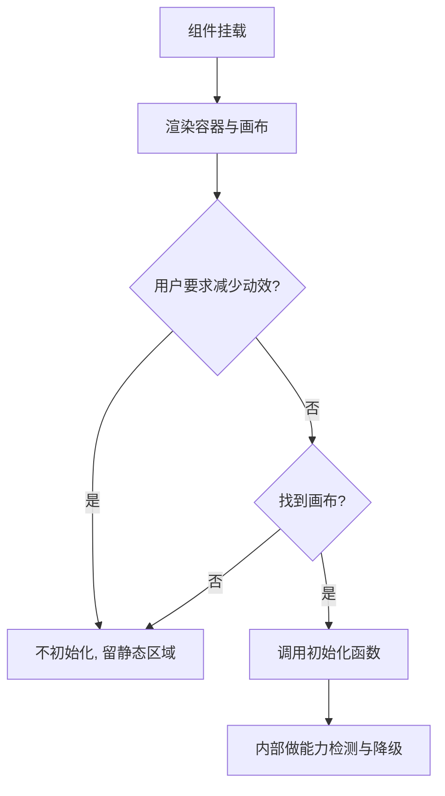
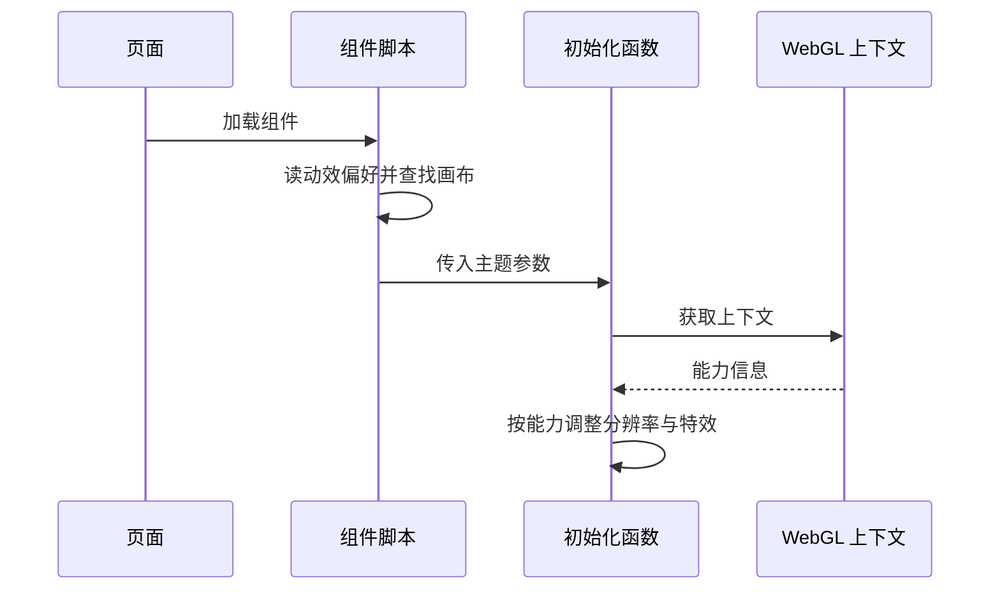

# 挂载点与降级策略

首页首屏右侧有一块会缓慢流动的紫色墨迹。系统开了"减少动效"、浏览器能力不足，或者干脆没有脚本时，这块区域不会强行播放动画——它安静地停在那里，页面其余部分照常可读。

组件 `src/components/FluidBackground.astro`（41 行）只做两件事：放一个画布容器，然后判断是否启动模拟。模拟实现在 `src/scripts/fluid.js`（1631 行）里，那是一个从上游开源项目改编过来的完整实现。

## 组件只决定启动与否

组件的标记部分只有一个画布，外面包一层容器：

```astro
---
interface Props {
  id?: string;
}
const { id = 'fluid-canvas' } = Astro.props;
---
<div class="fluid-wrap">
  <canvas id={id} aria-hidden="true"></canvas>
</div>
```

`<canvas>` 是浏览器提供的位图画布，WebGL 的所有绘制都落在这块画布上；`aria-hidden="true"` 表示它对辅助技术隐藏——它不承载信息，只是装饰。标识默认叫 `fluid-canvas`，可以由属性覆盖，但脚本按默认标识查找，因此一个页面只放一个该组件。

脚本段先读用户的动效偏好，再取画布元素，两个条件都满足才调用初始化：

```astro
<script>
  import { initFluid } from '../scripts/fluid.js';
  import { url } from '../lib/url';
  const reduce = window.matchMedia('(prefers-reduced-motion: reduce)').matches;
  const canvas = document.getElementById('fluid-canvas');

  if (canvas && !reduce) {
    initFluid({
      canvasSelector: '#fluid-canvas',
      ditheringTexture: url('/fluid/LDR_LLL1_0.png'),
      hueRange: [0.70, 0.82],
      config: {
        BACK_COLOR: { r: 255, g: 255, b: 255 },
        TRANSPARENT: false,
        BLOOM: false,
        SUNRAYS: false,
        DENSITY_DISSIPATION: 1.0,
        SPLAT_RADIUS: 0.16,
      },
      pointerColorScale: 0.55,
      ambientIntervalMs: 5000,
      initialSplats: 6,
      initialColorScale: 0.5,
    });
  }
</script>
```

`matchMedia` 读取的 `prefers-reduced-motion` 是用户系统里的减少动效偏好。这是一个"宁可不动"的选择：模拟本身不提供任何功能，省略它不影响内容。



## 白底相乘的观感

画布样式在全局样式表里（`src/styles/global.css` 的主视觉段）：外层图形容器固定四比三比例并裁掉溢出，流体容器绝对定位铺满，画布宽高百分之百并使用相乘混合模式。

`mix-blend-mode: multiply` 是 CSS 混合模式，让画布像素与它下面的背景按通道相乘（结果只会更暗或不变，不会变亮）。这是这套主题的关键：模拟本身在白底上画颜色，直接叠加会显得像实色块；与白底相乘之后，紫色变成浅紫、深色变成灰紫，整体像在白纸上晕开的墨。这也解释了配置里为什么关掉发光类效果——在白底上发光会发灰。

## 初始化参数

调用初始化时传了一组参数，覆盖默认配置并限定配色（`FluidBackground.astro` 的脚本段）：

| 参数 | 值 | 作用 |
| --- | --- | --- |
| `canvasSelector` | `#fluid-canvas` | 限定作用对象 |
| `ditheringTexture` | `/fluid/LDR_LLL1_0.png` | 抖动纹理，减轻色带 |
| `hueRange` | 0.70 到 0.82 | 把色相收在紫段，避免偏品红 |
| `pointerColorScale` | 0.55 | 悬停笔触亮度，压暗成"搅一下" |
| `ambientIntervalMs` | 5000 | 空闲时每五秒自落一团墨 |
| `initialSplats` | 6 | 开场墨团数量 |
| `initialColorScale` | 0.5 | 开场墨团亮度 |

配置覆盖里还显式设置了白色背景、关闭透明、关闭发光与阳光、把密度衰减从默认的 0.85 提到 1.0、把笔触半径从 0.25 收到 0.16。注释解释了每一条的理由，都是围绕"白纸上的薄墨"这个目标调的。

覆盖是在脚本里合并的，不是去改上游默认值：

```js
export function initFluid (opts = {}) {
  const canvasSelector = opts.canvasSelector || '#fluid-canvas';
  const pointerColorScale = opts.pointerColorScale != null ? opts.pointerColorScale : 0.8;
  ...
  // ── 本站扩展：opts 覆盖配色（白紫主题）与色相范围 ──
  if (opts.config) Object.assign(config, opts.config);
  const hueMin = opts.hueRange ? opts.hueRange[0] : 0.0;
  const hueMax = opts.hueRange ? opts.hueRange[1] : 1.0;
}
```

`Object.assign` 把传入的 `config` 逐项盖到默认对象上，因此上游默认值仍留在文件里可对照；`opts.hueRange` 被拆成两个常量，供后续生成颜色时使用。代价是"当前实际生效的值"要同时看默认对象和调用处两处。

## 能力不足时的处理

初始化函数内部先取 WebGL 上下文并检测扩展能力（`fluid.js` 开头的上下文与能力检测段）：

```js
const { gl, ext } = getWebGLContext(canvas);

if (isMobile()) {
    config.DYE_RESOLUTION = 512;
}
if (!ext.supportLinearFiltering) {
    config.DYE_RESOLUTION = 512;
    config.SHADING = false;
    config.BLOOM = false;
    config.SUNRAYS = false;
}
```

`gl` 是 WebGL 渲染上下文，所有绘制调用都发给它；`ext` 是探测到的扩展能力集合。线性滤波指纹理放大缩小时按插值采样，关掉后画面会更"硬"，所以这里同时把染料分辨率降到 512 来抵消；移动端也走同一条降配路径。

这套判断是能力驱动的：能跑就跑，不能跑就减配，而不是直接退出。直接的退出点只有两个——找不到画布，或用户要求减少动效。

## 改编边界与许可

文件头部保留了上游项目的 MIT 许可全文，并用一段注释列出针对本站的改动：

```js
/*
MIT License

Copyright (c) 2017 Pavel Dobryakov
...
*/

/* ────────────────────────────────────────────────────────────────
 * 本文件改编自 PavelDoGreat/WebGL-Fluid-Simulation（MIT，见上方许可原文）。
 * 针对本站的改动（非上游内容）：
 *   1. 包成 initFluid({ canvasSelector }) —— 只作用于我们自己的 <canvas>
 *   2. 删除：移动端推广弹窗、Google Analytics 调用、dat.GUI 调试面板、推广 window.open()
 *   3. 删除：全局 keydown 快捷键（P 暂停 / 空格喷溅）——它会劫持页面滚动
 *   4. 新增：标签页隐藏时暂停模拟，避免后台烧 GPU
 * 上游许可要求保留版权与许可声明 —— 上方 MIT 全文即为该声明，请勿删除。
 * ──────────────────────────────────────────────────────────────── */
```

MIT 是宽松的开源许可：允许修改与再发布，条件是保留版权与许可声明，所以注释里明确写了"请勿删除"。改编与上游的边界因此是显式的——读代码时能一眼看出哪些是上游算法、哪些是本站改动。



## 易错点

| 位置 | 问题 | 建议 |
| --- | --- | --- |
| `FluidBackground.astro` | 画布标识可改，脚本按默认标识查找，改标识会静默不启动 | 需要多实例时同时改脚本 |
| `FluidBackground.astro` | 减少动效时完全不初始化，区域变成空白 | 需要静态兜底时放一张静态图 |
| `global.css` | 相乘混合在白底上是浅紫，换深色底会偏暗 | 换主题时重调混合方式 |
| `fluid.js` | 上游许可须保留，改编清单与代码可能不同步 | 改动时同步更新注释 |
| `fluid.js` | 关闭发光与阳光后上游相关代码仍在，读代码会疑惑 | 以文件头清单为准 |
| `fluid.js` | 移动端与低能力设备降分辨率是自动的，观感与桌面不同 | 移动端单独看一眼 |
| `fluid.js` | 抖动纹理走静态资源地址，路径写错会让画面出现色带 | 换部署基路径时核对 |

## 小结

### 核心概念

* 组件只放画布并判断是否启动模拟，模拟实现独立在脚本文件里。
* 用户要求减少动效或找不到画布时直接不初始化。
* 画布用相乘混合，让颜色在白底上呈现为浅紫墨迹。
* 初始化参数围绕白紫主题调整色相范围、亮度、笔触与空闲墨量。
* 能力不足时自动下调分辨率并关闭特效，移动端同样降配。
* 文件头保留上游许可与本站改动清单。

### 设计权衡

| 选择 | 收益 | 代价 |
| --- | --- | --- |
| 装饰性模拟可省略 | 尊重动效偏好、省电 | 无兜底时区域空白 |
| 相乘混合 | 与白纸主题自然融合 | 换深色主题需要重调 |
| 色相范围收窄 | 画面不会偏品红 | 颜色变化显得克制 |
| 能力检测自动降配 | 低端设备也能跑 | 不同设备观感不一致 |
| 保留上游许可原文 | 合规、改编边界清晰 | 文件头较长 |
| 参数集中在调用处 | 主题调整不动实现 | 调参需要理解每个参数的作用 |

## 练习

### 基础题

1. 组件在什么条件下不启动模拟，为什么这样选择。
2. 相乘混合对最终观感的影响是什么。
3. 初始化参数里哪些与配色有关，哪些与手感有关。

### 挑战题

4. 给不启动模拟的情况加一张静态兜底图，设计资源与判断逻辑，并说明如何避免重复加载。
5. 把主题参数抽成配置对象供多套主题复用，列出改动点与验证方式，并说明色相范围如何随主题变化。

## 附：本页引用的路径

| 路径 | 用途 |
| --- | --- |
| `src/components/FluidBackground.astro` | 画布挂载与启动判断 |
| `src/scripts/fluid.js` | 流体模拟实现与改编清单 |
| `src/styles/global.css` | 容器与画布样式 |
| `src/pages/index.astro` | 组件使用位置 |
| `public/fluid/` | 抖动纹理资源 |
