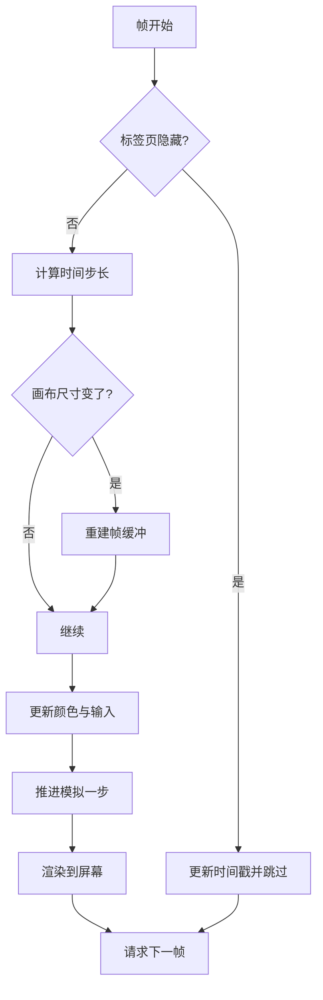
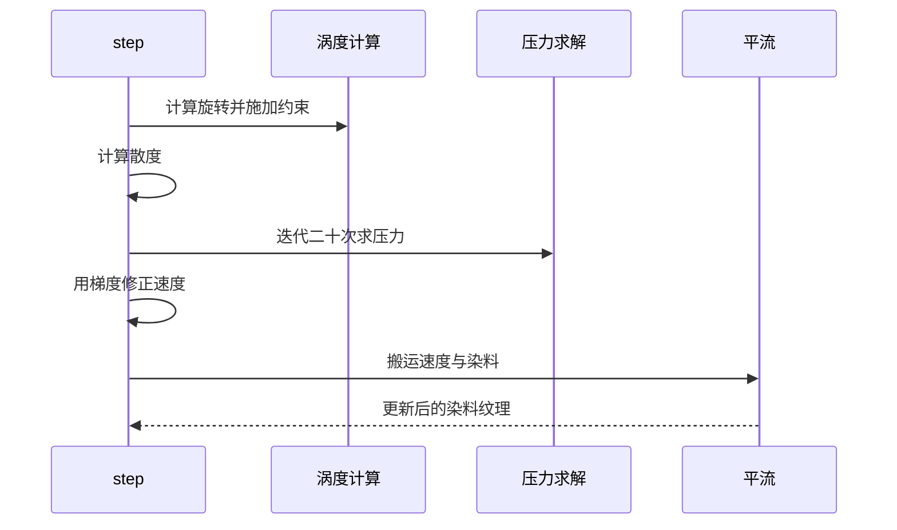

# 流体模拟的帧循环与渲染目标

一帧里发生了什么？画面上的墨迹为什么能保持形状又慢慢散开？要回答这个问题，只需要跟着主循环走一遍：它每秒被调用约六十次，每次把模拟往前推一小步，再把结果画到屏幕上。

模拟的数值参数集中在一个配置对象里（`src/scripts/fluid.js` 开头的配置段），算法部分则是标准的不可压缩流体求解：速度场、压力场、涡度与染料依次更新，每一步都在离屏纹理上完成。

这块背景是实时解一遍流体方程得到的，不是循环播放的视频：画面能跟着指针动、颜色随主题调，体积也只是一段脚本。代价是每帧都要花掉一部分 GPU 时间，帧循环里的那些取舍正是为此。

## 配置参数

默认配置里有几组关键数字（`fluid.js` 的配置段）：

| 参数 | 默认值 | 含义 |
| --- | --- | --- |
| `SIM_RESOLUTION` | 128 | 速度与压力场的分辨率 |
| `DYE_RESOLUTION` | 1024 | 染料（颜色）纹理分辨率 |
| `DENSITY_DISSIPATION` | 0.85 | 染料衰减速度 |
| `VELOCITY_DISSIPATION` | 0.2 | 速度衰减速度 |
| `PRESSURE` | 0.8 | 压力系数 |
| `PRESSURE_ITERATIONS` | 20 | 压力迭代次数 |
| `CURL` | 30 | 涡度强度 |
| `SPLAT_RADIUS` | 0.25 | 落墨半径 |
| `SPLAT_FORCE` | 6000 | 落墨施加的速度 |

配置对象就写在文件顶部，本站只覆盖其中几项：

```js
let config = {
    SIM_RESOLUTION: 128,
    DYE_RESOLUTION: 1024,
    CAPTURE_RESOLUTION: 512,
    DENSITY_DISSIPATION: 0.85,
    VELOCITY_DISSIPATION: 0.2,
    PRESSURE: 0.8,
    PRESSURE_ITERATIONS: 20,
    CURL: 30,
    SPLAT_RADIUS: 0.25,
    SPLAT_FORCE: 6000,
    SHADING: true,
    COLORFUL: true,
    PAUSED: false,
    BACK_COLOR: { r: 0, g: 0, b: 0 },
    TRANSPARENT: false,
    BLOOM: true,
    SUNRAYS: true,
    ...
}
```

`SIM_RESOLUTION` 与 `DYE_RESOLUTION` 是"速度场与染料场各自多少像素"的档位：前者低、后者高。本站的调用覆盖了其中几项：密度衰减提到 1.0 让墨更薄，落墨半径收到 0.16 让笔触更小，同时关闭发光与阳光。分辨率与迭代次数保持默认，它们是画质与开销的主要旋钮。

## 帧循环

主循环很短（`fluid.js` 的 `update`）：

```js
function update () {
    if (document.hidden) {
        lastUpdateTime = Date.now();
        requestAnimationFrame(update);
        return;
    }
    const dt = calcDeltaTime();
    if (resizeCanvas())
        initFramebuffers();
    updateColors(dt);
    applyInputs();
    if (!config.PAUSED)
        step(dt);
    render(null);
    requestAnimationFrame(update);
}
```

`requestAnimationFrame` 是浏览器的帧调度 API：把回调排进下一帧，屏幕刷新时调用一次（通常每秒 60 次），不需要自己写定时器；页面切到后台时浏览器还会自动降频或暂停它。`document.hidden` 读的是页面可见性状态：标签页隐藏时循环仍会排队，但只更新时间戳就返回——这样回到前台时不会因为累积了巨大的时间差而"炸开"，同时后台不消耗 GPU。

时间步长按秒计算并封顶：

```js
function calcDeltaTime () {
    let now = Date.now();
    let dt = (now - lastUpdateTime) / 1000;
    dt = Math.min(dt, 0.016666);
    lastUpdateTime = now;
    return dt;
}
```

除以 1000 把毫秒换成秒，封顶在 1/60 秒左右：即使帧率掉到很低，模拟每步推进的量也不会突然变大导致不稳定。`render(null)` 里的 `null` 表示"画到默认帧缓冲"，也就是屏幕。

画布尺寸变化时重算尺寸并重建帧缓冲（`resizeCanvas` 与 `initFramebuffers`）。因此窗口缩放、侧栏变化都会正确反映到模拟分辨率上。



## 模拟一步的六个阶段

推进函数把所有求解步骤串起来（`fluid.js` 的 `step`）：先算涡度并施加涡度约束，再算散度，然后用若干部迭代求解压力场，最后用压力梯度修正速度场；速度场更新完，再用它把染料平流到新位置。每一步都是一次"选着色器 + 传参数 + 画一遍"：

```js
function step (dt) {
    gl.disable(gl.BLEND);

    curlProgram.bind();
    gl.uniform1i(curlProgram.uniforms.uVelocity, velocity.read.attach(0));
    blit(curl);

    vorticityProgram.bind();
    gl.uniform1i(vorticityProgram.uniforms.uVelocity, velocity.read.attach(0));
    gl.uniform1i(vorticityProgram.uniforms.uCurl, curl.attach(1));
    gl.uniform1f(vorticityProgram.uniforms.curl, config.CURL);
    gl.uniform1f(vorticityProgram.uniforms.dt, dt);
    blit(velocity.write);
    velocity.swap();
    ...
    pressureProgram.bind();
    gl.uniform1i(pressureProgram.uniforms.uDivergence, divergence.attach(0));
    for (let i = 0; i < config.PRESSURE_ITERATIONS; i++) {
        gl.uniform1i(pressureProgram.uniforms.uPressure, pressure.read.attach(1));
        blit(pressure.write);
        pressure.swap();
    }
    ...
}
```

`bind()` 选中一个着色器程序，`uniform*` 把参数传进去，`attach(n)` 把纹理挂到第 n 个纹理槽并返回槽号，`blit()` 用当前程序画一次全屏四边形——"在 GPU 上算一遍"就是这么表达的。`velocity.swap()` 交换读写两张纹理，下面帧缓冲一节会讲。

| 阶段 | 作用 |
| --- | --- |
| 涡度 | 计算旋转量，补充小尺度涡旋 |
| 涡度约束 | 把涡旋能量加回速度场 |
| 散度 | 计算速度场的不可压缩误差 |
| 压力迭代 | 迭代求解压力，使速度场趋于无散 |
| 梯度修正 | 用压力梯度减掉散度 |
| 平流 | 用速度场搬运速度与染料 |

迭代次数是二十次，这是精度与开销的直接交换：次数越多速度场越接近无散，画面越平滑，但每帧的着色器调用也越多。

## 渲染的三个层次

渲染函数按需组合几层（`fluid.js` 的 `render`）：

```js
function render (target) {
    if (config.BLOOM)
        applyBloom(dye.read, bloom);
    if (config.SUNRAYS) {
        applySunrays(dye.read, dye.write, sunrays);
        blur(sunrays, sunraysTemp, 1);
    }
    ...
}
```

先铺背景，可能是纯色、棋盘格或透明；如果开启发光，就对高亮区域做多级模糊再叠加；如果开启阳光，就生成一层射线遮罩；最后用显示材质把染料画到屏幕，并用抖动纹理做一点噪声来减轻色带。

本站关掉了发光与阳光，因此实际路径只剩背景与显示两段。代码保留完整分支，是因为主题切换时可能重新打开——这也解释了为什么读代码时会看到未被本站启用的效果。



## 帧缓冲与分辨率

所有中间结果都存在帧缓冲纹理里（`fluid.js` 的帧缓冲段）：单目标用于中间结果，双目标用于需要读写交替的场（速度、压力、染料），切换时交换读写指针。目标尺寸按配置里的分辨率与画布比例换算：

```js
function getResolution (resolution) {
    let aspectRatio = gl.drawingBufferWidth / gl.drawingBufferHeight;
    if (aspectRatio < 1)
        aspectRatio = 1.0 / aspectRatio;

    let min = Math.round(resolution);
    let max = Math.round(resolution * aspectRatio);

    if (gl.drawingBufferWidth > gl.drawingBufferHeight)
        return { width: max, height: min };
    else
        return { width: min, height: max };
}
```

"帧缓冲"（framebuffer）是可以当作纹理再读回来的离屏画布：一步算完写进它，下一步把它当输入读——在 GPU 上做迭代计算靠的就是这套。`gl.drawingBufferWidth/Height` 是实际像素尺寸（已经含像素比缩放），所以高分屏上模拟不会因为逻辑尺寸小而模糊。

尺寸变化时不是重建全部，能复用的目标用拷贝方式迁移旧内容：

```js
function resizeFBO (target, w, h, internalFormat, format, type, param) {
    let newFBO = createFBO(w, h, internalFormat, format, type, param);
    copyProgram.bind();
    gl.uniform1i(copyProgram.uniforms.uTexture, target.attach(0));
    blit(newFBO);
    return newFBO;
}

function resizeDoubleFBO (target, w, h, internalFormat, format, type, param) {
    if (target.width == w && target.height == h)
        return target;
    target.read = resizeFBO(target.read, w, h, internalFormat, format, type, param);
    target.write = createFBO(w, h, internalFormat, format, type, param);
    ...
}
```

迁移的做法是用拷贝着色器把旧纹理画进新尺寸的纹理，避免缩放时画面突然清空；双目标只迁移读的那一张，写的直接新建。必须重建的是分辨率档位变化的场景，例如从桌面切到移动端能力档。

## 易错点

| 位置 | 问题 | 建议 |
| --- | --- | --- |
| `update` | 隐藏时只更新时间戳，若在隐藏期间改了配置不会立即生效 | 回到前台后核对一次 |
| `step` | 迭代次数与画质、开销直接相关，改大在低端设备上会掉帧 | 改后在不同设备上测 |
| `render` | 发光与阳光分支保留但本站关闭，读代码容易误判 | 以调用处的配置覆盖为准 |
| `resizeFBO` | 尺寸迁移靠拷贝，极端比例下可能拉伸 | 大幅改布局后看一眼 |
| `getResolution` | 分辨率与画布比例绑定，容器比例变化会影响观感 | 容器保持固定比例 |
| 双目标切换 | 读写指针交换写错方向会读到上一帧结果 | 修改时对照现有交换顺序 |

## 小结

### 核心概念

* 主循环每帧检查可见性、算时间步长、必要时重建缓冲，再推进模拟并渲染。
* 标签页隐藏时跳过模拟，避免后台消耗与回到前台时的时间差跳变。
* 时间步长封顶，低帧率下模拟仍然稳定。
* 模拟一步包含涡度、散度、压力迭代、梯度修正与平流。
* 渲染由背景、可选发光与阳光、显示合成三层组成。
* 中间结果存在帧缓冲里，尺寸变化时优先迁移旧内容。

### 设计权衡

| 选择 | 收益 | 代价 |
| --- | --- | --- |
| 低分辨率速度场加高分辨率染料 | 观感细腻、开销可控 | 两套分辨率需要分别维护 |
| 压力迭代二十次 | 流场平滑 | 每帧固定开销 |
| 时间步长封顶 | 低帧率下稳定 | 极低帧率时模拟变慢 |
| 尺寸变化迁移旧内容 | 缩放时画面不闪 | 迁移逻辑稍复杂 |
| 保留未启用的渲染分支 | 主题切换可直接打开 | 代码体积与理解成本增加 |

## 练习

### 基础题

1. 帧循环里每一步分别做什么，隐藏标签页时跳过了什么。
2. 模拟一步包含哪些求解阶段，为什么需要压力迭代。
3. 帧缓冲为什么要区分单目标与双目标。

### 挑战题

4. 给模拟增加一个"暂停后继续"的入口，设计状态存放位置与恢复方式，并说明如何避免恢复瞬间的时间跳变。
5. 在染料分辨率与速度分辨率之间做自适应调整（按设备帧率），列出需要采集的指标与调整策略，并说明如何避免抖动。

## 附：本页引用的路径

| 路径 | 用途 |
| --- | --- |
| `src/scripts/fluid.js` | 帧循环、求解步骤与渲染 |
| `src/components/FluidBackground.astro` | 传入的配置覆盖 |
| `src/styles/global.css` | 画布尺寸与混合模式 |
| `public/fluid/` | 抖动纹理 |
