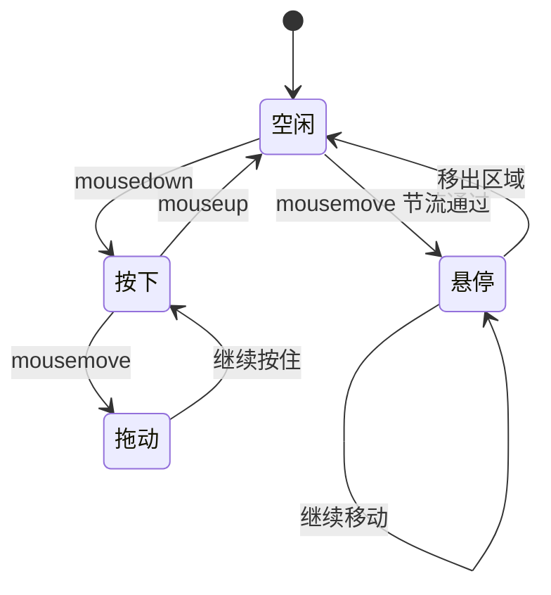
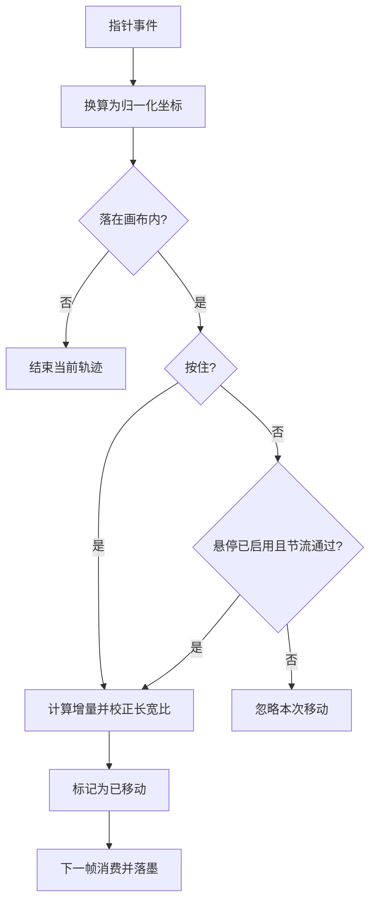
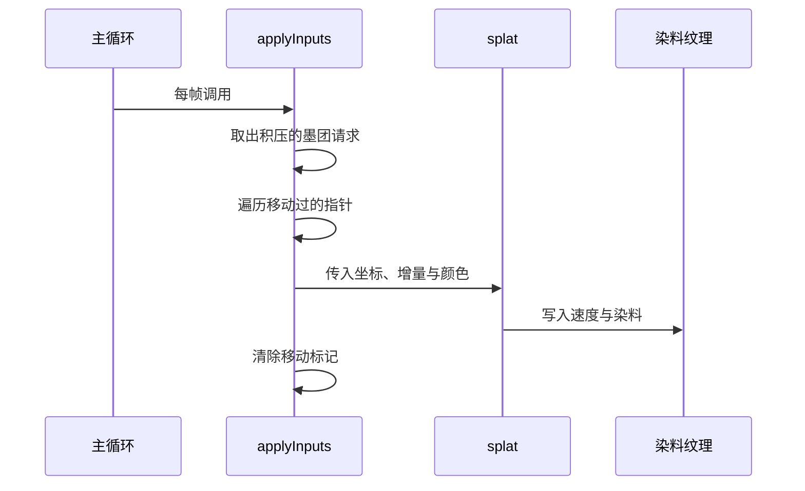

# 指针输入与墨迹生成

把鼠标移到首屏图形区域里，画面会跟着手指方向拖出一条紫色墨迹；停下来几秒，它会自己冒出一小团。这两个行为来自同一套机制：指针把位置变化换算成速度，再以"落墨"的形式注入模拟。

输入处理集中在脚本的后半段（`src/scripts/fluid.js` 的指针段），前半段是模拟本身。理解这段的关键是两个概念：指针对象保存上一帧位置，用于算增量；落墨是把增量与颜色写进速度场与染料场的动作。

## 指针对象

每个指针是一组状态（`fluid.js` 的 `pointerPrototype`）：编号、当前与上一次的归一化坐标、两个方向的增量、是否按下、是否移动过，以及本次轨迹使用的颜色。

坐标是归一化的纹理坐标，纵轴做了翻转，因为浏览器坐标从上往下、纹理坐标从下往上。指针第一次按下时颜色才生成（`updatePointerDownData`），一条轨迹内颜色保持不变，所以拖出的墨迹是同一色相；松开或移出区域后重新开始，颜色才会变。

鼠标用一个固定编号的指针；悬停另有一个专用指针，编号为负二，用来区分"按住拖动"与"悬停搅动"两种输入。

## 事件绑定

绑定目标由参数决定，默认是窗口（`fluid.js` 的 `interactionTarget`），悬停可以通过参数关掉。鼠标事件挂在绑定目标上，触屏事件挂在画布上（`fluid.js` 的事件段）：

| 事件 | 处理 |
| --- | --- |
| 按下 | 找到空闲指针并记录起点 |
| 移动（按住） | 更新位置并计算增量 |
| 移动（未按住） | 走悬停路径，按节流间隔更新 |
| 松开 | 标记指针抬起 |
| 触屏开始与移动 | 阻止默认行为，为每根手指分配指针 |
| 触屏结束 | 按标识符找到指针并抬起 |

鼠标移出区域时会显式重置悬停状态（`resetHover`）。注释解释了这个处理的目的：如果只靠坐标判断，指针移出再回来会拉出一条横跨画面的长线。

每次移动前都会换算坐标，落在画布之外时返回空值并结束当前轨迹（`canvasPos`）。这条判断同时服务鼠标与触屏。

## 归一化与增量校正

位置换算成归一化坐标后，增量还要按画布宽高比校正（`correctDeltaX` 与 `correctDeltaY`）：画布宽大于高时横向增量按比例缩小，反之纵向缩小。没有这步校正，非正方形画布上的笔触会被拉长。

移动处理里还有一个"是否真的动了"的判断（`updatePointerMoveData`）：两个方向的增量都为极小值时不算移动，避免静止时反复落墨。这个标记在输入被消费后清除。

## 从增量到落墨

主循环每帧把输入转成模拟变化（`fluid.js` 的 `applyInputs`）：先处理积压的墨团请求，再把移动过的指针逐一转成落墨，最后清掉移动标记。

落墨函数按指针的坐标、增量与颜色调用（`splatPointer` 到 `splat`）：增量乘以配置里的落墨力度作为速度，半径按画布比例校正后再用（`correctRadius`）。力度与半径都在配置里，本站把半径从 0.25 收到 0.16。

自动墨团走同一个落墨函数，只是位置与颜色随机。它由两个来源驱动：开场时按预置位置一次性铺若干团（`initialSplats` 与 `initialColorScale`），之后每五秒在标签页可见时补一团（`ambientIntervalMs` 对应的定时器）。

## 颜色从哪来

颜色用色相范围里的随机值生成（`generateColor`）：在最小值与最大值之间取一个色相，按满饱和与满亮度转成 RGB，再乘一个亮度系数并归一化。本站把色相限制在 0.70 到 0.82 之间，也就是紫色段。

亮度系数有两个来源：指针轨迹用调用参数传入的 0.55，开场与自动墨团用 0.5。两处都比上游默认值暗，目的是让墨在白纸上更薄，不压过内容。

## 易错点

| 位置 | 问题 | 建议 |
| --- | --- | --- |
| `fluid.js` | 悬停事件绑定在窗口上，坐标换算之外才判断是否在画布内 | 需要严格限制时改绑画布 |
| `fluid.js` | 触屏事件阻止默认行为，画布上无法滚动页面 | 移动端布局要留出滚动区 |
| `fluid.js` | 一条轨迹内颜色固定，快速来回拖动颜色不更新 | 接受该行为或按时间刷新颜色 |
| `fluid.js` | 悬停节流十六毫秒，高刷新率设备上仍会有较多落墨 | 需要更省时提高节流间隔 |
| `fluid.js` | 自动墨团定时器持续存在，页面隐藏时才跳过落墨 | 长期停留的页面关注耗电 |
| `fluid.js` | 落墨力度较大，长距离拖动会把墨推得很开 | 需要克制时调低力度 |

## 小结

### 核心概念

* 指针对象保存当前与上一次坐标，用来计算增量。
* 坐标是归一化纹理坐标，纵轴翻转；增量按画布长宽比校正。
* 鼠标与触屏共用同一套指针结构，触屏支持多指。
* 悬停与按住拖动是两条路径，用不同编号的指针区分。
* 每帧把移动过的指针转成落墨，速度来自增量乘力度。
* 颜色在色相范围内随机生成，本站限定在紫色段并压低亮度。

### 设计权衡

| 选择 | 收益 | 代价 |
| --- | --- | --- |
| 事件绑在窗口 | 区域外移入也能被感知 | 需要额外的进出判断 |
| 一条轨迹一个颜色 | 笔触连贯 | 来回快速拖动颜色单一 |
| 悬停节流十六毫秒 | 落墨密度可控 | 高刷设备仍偏密 |
| 触屏阻止默认行为 | 手势不触发页面滚动 | 画布区域无法滚动 |
| 空闲自动墨团 | 静止画面仍有变化 | 持续定时器带来少量开销 |

## 练习

### 基础题

1. 指针对象里哪些字段参与增量计算，为什么纵轴要翻转。
2. 鼠标与触屏的事件绑定分别在哪里，多指是怎么处理的。
3. 颜色在什么时机生成，本站的取值与上游有什么差别。

### 挑战题

4. 给落墨增加"拖尾渐隐"效果，设计需要保留的历史与每帧衰减方式，并说明对性能的影响。
5. 让自动墨团只在用户长时间未交互时出现，列出需要记录的交互状态与定时器调整，并说明如何避免与悬停路径互相干扰。

## 附：本页引用的路径

| 路径 | 用途 |
| --- | --- |
| `src/scripts/fluid.js` | 指针对象、事件绑定与落墨 |
| `src/components/FluidBackground.astro` | 传入的指针亮度与空闲间隔 |
| `src/styles/global.css` | 画布容器与混合模式 |
| `src/pages/index.astro` | 组件使用位置 |
