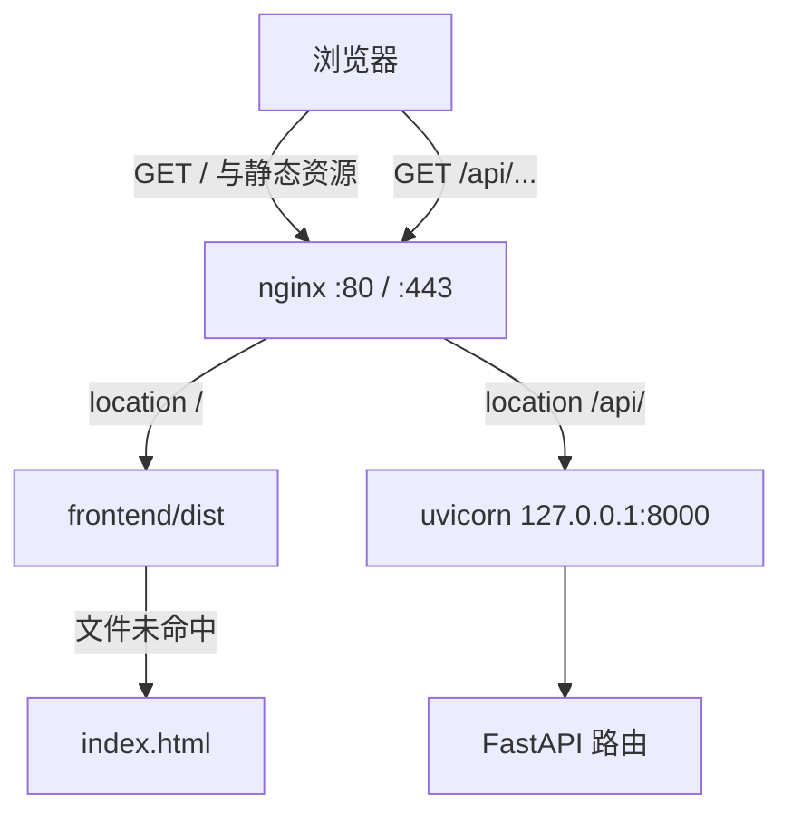
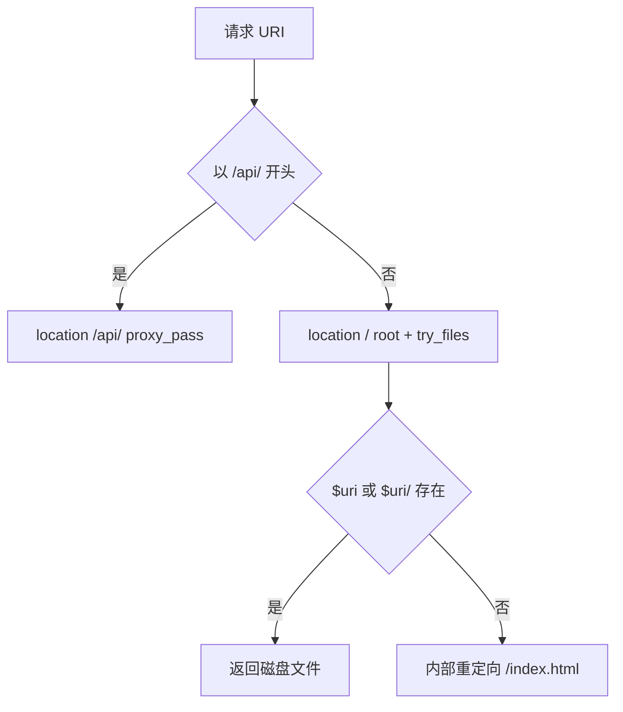
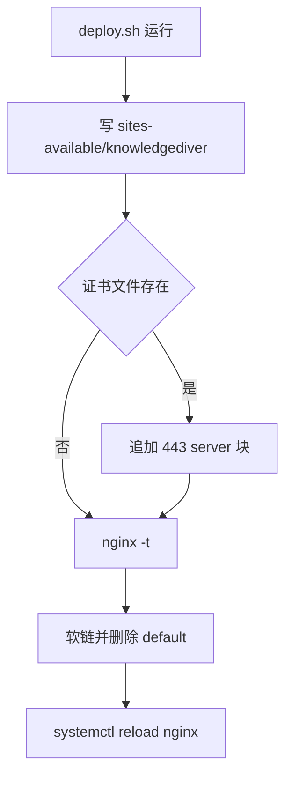

# 反向代理与 location 匹配

## nginx 在这里做什么

nginx 是一个 HTTP 服务器兼反向代理软件。它不参与业务，只做一件事：把进来的请求接住，判断这次请求是「从磁盘读一个文件返回」还是「转给别的进程处理」。除此之外它还负责终止 HTTPS、按域名或路径分发、限流、记访问日志。本站用到其中三样：静态文件托管、反向代理、TLS 终止。

反向代理的意思是，客户端以为自己在跟 nginx 说话，实际处理请求的进程在别处。浏览器访问站点域名，请求先到 nginx；nginx 判断这条路径该由谁处理，需要后端时把请求转给 127.0.0.1:8000 上的 uvicorn（FastAPI 应用），再把上游的响应送回浏览器。上游只监听回环地址，公网根本连不到它，这就是「代服务端出面」。

对照一下正向代理：浏览器里手工设置的那种代理替客户端出面，目标站点看到的是代理的地址；反向代理方向相反。本工程用的是后者。

## 本站为什么需要它

前端是一堆构建好的静态文件（`frontend/dist`），后端是一个 Python 进程。不用 nginx 只剩两条路：把 8000 端口直接开到公网，或者让 FastAPI 兼做静态文件服务。前者要另配 HTTPS 与跨域，后者把业务框架当文件服务器用。

用 nginx 之后有三点收益：公网只开 80 与 443 一个入口；静态与接口同源，浏览器不触发跨域预检；证书只在一个地方配。代价是多一层配置要维护，出问题时排查链路变长。

## 为什么按 URL 前缀分流

nginx 区分请求只有三个手段：监听端口、域名（`server_name`）、路径（`location`）。本站只有一个域名、一个端口，前两个都用不上，路径就成了唯一依据：`/api/` 开头的交给后端，其余交给静态文件。后面所有规则都是围绕这条分界展开的。

## 配置长什么样

生产配置是 `deploy/nginx.conf` 这 26 行（部署脚本会在服务器上另生成一份等价内容）：

```nginx
server {
    listen 80;
    server_name your-domain.com;

    location / {
        root /opt/knowledgediver/frontend/dist;
        try_files $uri $uri/ /index.html;
    }

    location /api/ {
        proxy_pass http://127.0.0.1:8000/api/;
        proxy_http_version 1.1;
        proxy_set_header Upgrade $http_upgrade;
        proxy_set_header Connection 'upgrade';
        proxy_set_header Host $host;
        proxy_set_header X-Real-IP $remote_addr;
        client_max_body_size 25m;
        proxy_buffering off;
        proxy_read_timeout 86400;
    }
}
```

逐块读：

- `server { }` 是一个虚拟主机，`listen 80` 表示它接 80 端口。生产上还有一份 443 的 server 块，由部署脚本在有证书时追加，内容与本块相同。
- `server_name` 只在同一端口存在多个 server 块时才有区分作用。本站只有一个站点，域名写错也不会表现为连不上，而是被这条规则照单接住。
- `location / { }` 接住除 `/api/` 之外的全部请求。`root` 指定文件根目录，`try_files` 是找不到文件时的回退链。
- `location /api/ { }` 接住以 `/api/` 开头的请求，`proxy_pass` 把它转给上游。后面几行分别管协议版本、请求头、请求体上限、缓冲与超时，它们的默认值各不相同，改动前要逐个确认。

注意两条 `location` 的结尾：`/ ` 没有斜杠，`/api/` 有斜杠。这一格之差决定了 `/api` 和 `/api/` 落在哪条规则上。

## 客户端只看到一个服务地址

| 维度 | 反向代理 | 正向代理 |
| --- | --- | --- |
| 代理对象 | 上游服务器 | 客户端 |
| 客户端感知 | 把 nginx 当作服务端 | 需显式配置代理地址 |
| 地址暴露 | 上游地址对客户端不可见 | 客户端地址对目标站点不可见 |
| 示例用途 | 静态资源与 `/api/` 分流 | 未使用 |

正向代理替客户端出面，目标站点看到的是代理地址；反向代理替服务端出面，客户端看到的是 nginx 地址。本工程属于后一种：浏览器访问站点域名，nginx 决定这次请求是读磁盘上的前端产物，还是转发给 127.0.0.1:8000 的 uvicorn 进程。上游进程的监听地址与端口写在 systemd 单元与部署脚本里，不由 nginx 配置定义，因此两边的地址改动必须成对完成。单元文件 `deploy/knowledgediver.service` 里这一行是地址的唯一来源：

```ini
ExecStart=/opt/knowledgediver/.venv/bin/uvicorn backend.main:app --host 127.0.0.1 --port 8000
```

systemd 是 Linux 的进程管理器，单元文件里的 `ExecStart` 是它负责拉起的命令，`Restart=always` 让进程退出后自动重起。`uvicorn` 是运行 FastAPI 应用的 ASGI 服务器，`--host 127.0.0.1` 把监听收在回环接口上——回环地址只有本机能连，公网流量必须经 nginx 转发才到得了后端，这正是「上游地址对客户端不可见」的物理依据。

把静态与接口放在同一个 server 块里，浏览器只会看到一个源，前端不必为跨域准备 `Access-Control-Allow-*` 响应头。后端仍然注册了 CORS 中间件（`backend/main.py`）——CORS 是跨源资源共享，浏览器在跨源请求时会先要求一组 `Access-Control-Allow-*` 响应头——那是为本地开发时前端直连 8000 端口预留的路径，生产流量不经过它。



## location 的选择顺序与修饰符

nginx 对每个请求只选一个 `location`，选择分两步：先按前缀找出最长的一项，再按书写顺序检查正则 `location`。修饰符决定一个 `location` 参与哪一步。

| 修饰符 | 匹配方式 | 优先级 |
| --- | --- | --- |
| `=` | 精确匹配 | 命中即结束 |
| `^~` | 前缀匹配，命中后跳过正则 | 高于正则 |
| `~`、`~*` | 正则，区分与不区分大小写 | 按书写顺序 |
| 无修饰符 | 前缀匹配，记录最长者 | 最后使用 |

正则 `location` 一旦命中就会覆盖之前记录的最长前缀，除非那条前缀带了 `^~`。因此一个 `/api/` 前缀如果写成正则 `location ~ ` 而又没有 `^~`，另一条更靠前的正则就可能把它抢走，代理规则不生效。

本工程两条规则都是最朴素的无修饰符前缀，按最长匹配决定：

```nginx
location / { ... }      # 其余全部请求
location /api/ { ... }  # 以 /api/ 开头
```

## 前缀边界由结尾斜杠决定

按最长前缀规则，`/api/pipeline/collect` 命中 `location /api/`；`/api` 与 `/apix` 都命中 `location /`。`/api/` 结尾的斜杠决定了这条边界：前缀匹配按字符逐个比较，没有结尾斜杠的路径不会被第二条 `location` 接住。

`/api` 落在 `location /` 之后走 `try_files`，磁盘上不存在 `api` 这个文件，最终回退到 `index.html`，客户端拿到的是 HTML 外壳而不是 JSON。这类症状容易被当成后端报错，实际请求从未到达后端。

| 请求路径 | 命中 location | 结果 |
| --- | --- | --- |
| `/api/pipeline/collect` | `location /api/` | 代理到上游 |
| `/api/` | `location /api/` | 代理到上游 |
| `/api` | `location /` | 返回 index.html |
| `/apix` | `location /` | 返回 index.html |
| `/assets/app.js` | `location /` | 返回磁盘文件 |

## URI 规范化发生在匹配之前

前缀比较发生在 URI 规范化之后。nginx 会合并路径里的 `.` 与 `..`、解码百分号转义，`/api/../index.html` 会先归一成 `/index.html` 再匹配，因此这类路径落到 `location /` 而不是代理。

规范化同时解码 `%2F` 之外的大部分转义字符，并压缩重复斜杠。这一点对边界判断有直接影响：`/api%2Ffoo` 是否被解码成 `/api/foo` 取决于 nginx 版本对编码斜杠的处理策略，默认不把 `%2F` 当作路径分隔符。要确认实际行为，在目标版本上跑一条带转义的请求即可：

```bash
curl -i 'http://127.0.0.1/api%2Ffoo'      # 看走到代理还是静态
tail -n 5 /var/log/nginx/access.log        # 看 $request 与 $uri 各自长什么样
```



## try_files 的三级回退

配置里这一行：

```nginx
try_files $uri $uri/ /index.html;
```

它依次检查三个候选：

1. `$uri`：规范化后的请求路径，对应磁盘上的文件。
2. `$uri/`：同路径作为目录，用于目录索引或后续规则。
3. `/index.html`：前两项都不存在时做内部重定向，由前端路由接管。

前两项命中就返回文件；否则内部重定向到 `index.html`，状态码仍是 200。内部重定向会重新走一遍 `location` 匹配，`/index.html` 以 `/` 开头，重新落回 `location /` 并命中磁盘文件，不会再次进入回退分支，所以不存在无限循环。

这条回退支撑了前端路由的直接刷新。用户刷新 `/cards/abc` 时磁盘上没有同名文件，服务器返回应用外壳，前端再按路径渲染对应组件。代价是磁盘上不存在的资源路径也返回 200，监控里看不到 404，前端拿到的是一页 HTML 而不是错误。判断资源是否真的存在只能看响应体的 `Content-Type` 或直接比对文件列表。

## 静态目录的 root 归属

`deploy/nginx.conf` 把 `root` 写死为 `/opt/knowledgediver/frontend/dist`，`deploy/deploy.sh` 则用变量 `$APP_DIR/frontend/dist`。二者语义相同，差别在部署脚本按自身位置推导 `APP_DIR`，不依赖固定安装路径。两处原文分别是：

```nginx
# deploy/nginx.conf（给人读的样例，路径写死）
root /opt/knowledgediver/frontend/dist;
```

```nginx
# deploy/deploy.sh 的 here-doc 内，写入站点文件时已展开成绝对路径
root $APP_DIR/frontend/dist;
```

`APP_DIR` 由脚本里的 `APP_DIR="$(cd "$SCRIPT_DIR/.." && pwd)"` 从自身位置推出，因此仓库可以放在任意目录。代价是同一组规则存在两处文本，改一处不影响另一处——这正是「改了样例但线上没变」的成因。

`root` 决定文件的根目录，`try_files` 的每一项都相对它解析。两条 `location` 各自声明 `root`，不存在 server 级 `root`，因此改动其中一条不会影响另一条。把 `root` 写在 `location /` 之外会让两条规则共享同一个根，静态路径与代理路径的耦合就出现了。

`root` 与 `alias` 的差别也在这里：`root` 把 `location` 前缀拼到路径前面，`alias` 用别名替换该前缀。本工程两条规则都用 `root`，`/assets/app.js` 解析为 `$root/assets/app.js`。要换成 `alias` 必须同时调整 `try_files` 的相对性，属于容易改错的一类改动。

本工程没有用到 `alias`，静态根只有两处 `root`。要确认某条 `location` 最终解析到哪个磁盘路径，用 `nginx -T` 把展开后的完整配置打出来找：

```bash
nginx -T | grep -n -A3 'location /'
```

`-T` 与 `-t` 的区别：`-T` 打印展开后的全部配置（会合并 include 的文件），`-t` 只做语法检查、不输出内容。两者都不影响正在运行的进程。

## 配置怎么装上去

`deploy/nginx.conf` 是一份独立的样例，`deploy/deploy.sh` 并不读取它。脚本用 here-doc 写出 `/etc/nginx/sites-available/knowledgediver`：加入 `listen [::]:80`，把占位域名替换成 `$DOMAIN www.$DOMAIN`，把固定路径替换成 `$APP_DIR`。节选（省略 location 内部与后面的 HTTPS 块）：

```bash
cat > /etc/nginx/sites-available/knowledgediver << NGINXEOF
server {
    listen 80;
    listen [::]:80;
    server_name $DOMAIN www.$DOMAIN;

    location / {
        root $APP_DIR/frontend/dist;
        try_files \$uri \$uri/ /index.html;
    }
    ...
}
NGINXEOF
```

here-doc 是 shell 的「整段文本」写法：`<< 标记` 到下一次出现该标记之间的内容被整体写进前面重定向的文件，不必逐行 `echo`。标记没写成 `<< 'NGINXEOF'`，shell 就会展开其中的变量，所以 `$DOMAIN`、`$APP_DIR` 落成实际值；而 `\$uri` 用反斜杠挡住展开，留给 nginx 在自己的运行期求值——同一段里两种「谁的值」就是这么区分的。

写完再启用站点、删掉发行版默认站点、校验、重载，这几步在脚本里连着出现：

```bash
ln -sf /etc/nginx/sites-available/knowledgediver /etc/nginx/sites-enabled/
rm -f /etc/nginx/sites-enabled/default
nginx -t && systemctl reload nginx
```

`ln -sf` 建的是符号链接：nginx 只读 `sites-enabled/` 目录，站点文件先放 `sites-available/` 再链过去，这是 Debian/Ubuntu 的打包惯例——停用站点只要删链接，配置本体还在。四步各自在做什么：

| 命令 | 作用 | 不做会怎样 |
| --- | --- | --- |
| `ln -s …/sites-available/… …/sites-enabled/` | 把站点文件链接进启用目录 | 配置写好了但 nginx 根本不会加载它 |
| `rm sites-enabled/default` | 删掉发行版自带的默认站点 | 默认站点在同端口抢占，请求落到别处 |
| `nginx -t` | 只检查语法，不改变运行中的进程 | 语法错误被写进配置，下次重载直接失败 |
| `systemctl reload nginx` | 重新加载配置，不断开已有连接 | 新配置不生效，仍在用旧规则 |

脚本开头有 `set -e`，所以 `nginx -t` 失败会直接终止，不会留下未验证的配置被加载。

`server_name` 只在同一端口存在多个 server 块时用于选择；脚本删掉了 `sites-enabled/default`，当前 server 是该端口上的唯一站点，请求的 Host 不匹配也会落到它。后果是：即使域名写错，请求也会被这条规则接住，问题不会表现为连接失败。

已有证书时，脚本追加一个 `listen 443 ssl http2` 的 server 块，并把两条 `location` 原样复制一份。同一份路由规则因此出现两次，改动需要同步两处。



## 两类请求的分流落点

| 请求前缀 | location | 处理方式 | 定义位置 |
| --- | --- | --- | --- |
| `/`、`/assets/...` | `location /` | `root` 加 `try_files`，返回 dist 内文件 | `deploy/nginx.conf` |
| `/api/...` | `location /api/` | `proxy_pass` 到 127.0.0.1:8000 | `deploy/nginx.conf` |

前端所有请求都写成相对路径，例如 `frontend/src/api/agent.ts` 里的 `fetch('/api/agent/chat', ...)`。同源路径经 nginx 分流，浏览器不触发跨域预检。

后端的路径前缀与 `location /api/` 对齐。FastAPI 应用在 `backend/main.py` 里逐个注册路由模块：

```python
# backend/main.py
app.include_router(auth_router)            # 认证：注册/登录/个人信息/头像
app.include_router(pipeline_router)        # 流水线：收集/延申搜索 SSE 流 + 任务管理
app.include_router(classification_router)  # 分类：AI 自动分类/重分类/树
```

`include_router` 把一个独立定义的路由模块挂到应用上，模块内部声明的路径原样生效。部分路由把完整路径写在装饰器里，例如 `backend/routes/pipeline.py` 的 `/api/pipeline/collect`、`backend/routes/auth.py` 的 `/api/auth/register`；部分模块用 `APIRouter(prefix=...)`，例如 `backend/routes/classification.py` 的 `/api/classification`。两类写法的最终路径都以 `/api` 开头。

根路径是少数例外：`backend/main.py` 注册了 `/` 的健康检查，但公网请求 `/` 先命中 `location /`，返回的是前端 `index.html`，不会到达后端。后端的 `/` 只在 nginx 之外（例如本机直连 8000）可见。上游只监听回环（`deploy/knowledgediver.service`），因此这个健康检查也不从公网暴露。

## 常见误用与边界情况

| # | 误用 | 现象 | 位置 |
| --- | --- | --- | --- |
| 1 | 把 `/api` 当作 `/api/` 的别名 | 请求落到 `location /`，返回 index.html 而非 JSON | `deploy/nginx.conf` |
| 2 | 认为 `deploy/nginx.conf` 会被自动安装 | 改了样例文件，服务器上仍是旧配置 | `deploy/deploy.sh` |
| 3 | 只改一处 443 块 | HTTP 正常、HTTPS 仍走旧路径 | `deploy/deploy.sh` 里的两处 443 块 |
| 4 | 用正则 `location` 匹配 `/api/` 而未加 `^~` | 前缀被正则抢先，代理规则不生效 | `deploy/nginx.conf` |
| 5 | 把不存在的前端路由当成 404 | 监控统计里全是 200，问题被掩盖 | `deploy/nginx.conf` |
| 6 | 在 `location /` 内再写 `root` 又期望外部继承 | 静态路径与预期不符 | `deploy/nginx.conf` |
| 7 | 忽略 `server_name` 的唯一站点效应 | 域名配错也能访问，误以为配置生效 | `deploy/deploy.sh` |

第 1 行与第 5 行是同一类问题的两个方向：一个把代理路径漏给了静态规则，一个把静态规则当成正常。判断请求到底去了哪里，最短的路径是看 nginx 访问日志里的 `$request` 与 `$status`，再对比响应体的首行是 `<!DOCTYPE html>` 还是 JSON。

## 小结

### 核心概念

- 反向代理对客户端隐藏上游地址，本工程的 nginx 同时承担静态托管与 `/api/` 代理。
- 无修饰符前缀 `location` 取最长匹配，`/api/` 与 `/` 的分界由结尾斜杠决定。
- URI 先规范化再匹配，`.`、`..` 与转义字符会影响最终命中的规则。
- `try_files $uri $uri/ /index.html` 支撑 SPA（单页应用，路由在浏览器里切换、服务器只回同一份外壳）刷新，代价是不存在的资源也返回 200。
- `deploy/nginx.conf` 与 `deploy/deploy.sh` 的 here-doc 是两处配置来源，安装以脚本为准。
- 上游地址 127.0.0.1:8000 只出现在 `location /api/` 内，后端不直接对公网监听。

### 设计权衡

| 权衡点 | 选择 | 收益与代价 |
| --- | --- | --- |
| 静态与 API 同域 | 一个 server 两条 location | 前端调用无需跨域配置；代价是路径前缀成为接口契约 |
| SPA 回退 | `try_files` 落到 index.html | 前端路由可直接刷新；代价是 404 语义丢失 |
| 配置来源 | 脚本生成，样例文件留档 | 安装自包含；代价是两处规则要同步维护 |
| `root` 的归属 | 每条 location 各自声明 | 互不影响；代价是重复书写与易漏改 |

## 练习

### 基础题

1. 写出 `/api`、`/api/`、`/api/pipeline/collect` 三条路径在 `deploy/nginx.conf` 下分别命中哪条 location，并说明 `/api` 的响应体来自哪里。
2. 说明 `location ~ ` 与 `location ^~ ` 同时存在时，请求 `/api/foo` 会命中哪一条，并解释原因。
3. 给定 `/api/../index.html`，说明规范化后的路径与命中的 location。

### 挑战题

4. 设计一组 location，使 `/api` 与 `/api/` 都被代理，同时不影响静态文件回退。写出配置并说明每条规则的优先级。
5. 若把后端路由前缀改成 `/v1`，列出需要同步修改的文件与对应的路由声明，并给出验证路径一致性的一条命令。
6. 说明 `root` 与 `alias` 在 `location /assets/` 下的差别，写出两种写法的 `try_files` 应如何调整。

### 附：本页引用的路径

| 路径 | 用途 |
| --- | --- |
| `deploy/nginx.conf` | server 块与两条 location 的样例定义 |
| `deploy/deploy.sh` | 生成 HTTP/HTTPS server 块，校验通过后重载 nginx |
| `deploy/knowledgediver.service` | 后端进程监听 127.0.0.1:8000 |
| `backend/main.py` | 应用建立、CORS 中间件与路由注册 |
| `backend/routes/pipeline.py`、`backend/routes/auth.py` | 把完整 `/api` 路径写在装饰器里的路由 |
| `frontend/src/api/agent.ts` | 前端以相对路径请求 `/api/...` 的 API 客户端 |
| 仓库根 `~/KnowledgeDiver` | 正文路径相对该根，部署素材在 `deploy/` |
