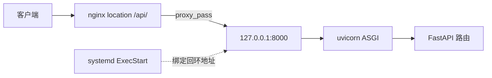
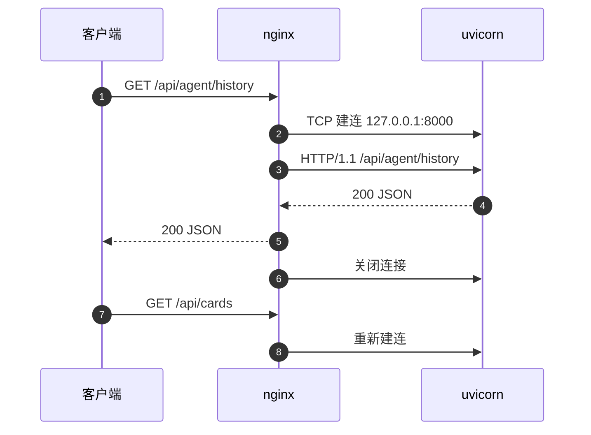

# proxy_pass 与上游转发

上游是 nginx 转发请求的目标服务。本工程的上游是 uvicorn 启动的单个 FastAPI 进程，监听 127.0.0.1:8000，只对回环接口开放。请求进入 `location /api/` 之后，nginx 要把它的路径改写成上游认识的形状，这件事由 `proxy_pass` 完成。

改写规则可以概括为：`proxy_pass` 里带 URI 就把 location 匹配到的那一段替换掉，不带 URI 就原样透传。这条规则决定了后端路由要不要自带 `/api` 前缀，也决定了尾斜杠写错时会出现什么症状。此外还有三件相邻的事：协议版本、连接复用与上游地址写法。

## 上游是谁：单实例 uvicorn

| 写法 | 形式 | 适用场景 |
| --- | --- | --- |
| 直接地址 | `proxy_pass http://127.0.0.1:8000/api/;` | 单实例、地址固定 |
| upstream 块 | 先定义 `upstream backend { server ...; }`，再 `proxy_pass http://backend;` | 多实例、需要负载均衡或连接池 |

本工程用的是第一种，`deploy/nginx.conf:16` 与 `deploy/deploy.sh:53` 都是内联地址，没有 `upstream` 块。单实例部署下这层抽象没有收益，代价是无法配置到上游的持久连接。



后端由 systemd 拉起，命令在 `deploy/knowledgediver.service:10`：

```bash
ExecStart=/opt/knowledgediver/.venv/bin/uvicorn backend.main:app --host 127.0.0.1 --port 8000
```

`deploy/deploy.sh:129` 生成的单元内容相同，只是路径用 `$APP_DIR` 展开。`--host 127.0.0.1` 表示只监听回环接口，8000 端口不对外暴露，访问后端只能经 nginx。这是一项有意的边界，改动监听地址会绕过代理直接暴露应用。

## proxy_pass 带不带 URI 决定替换方式

规则是：带 URI 时，把 location 匹配到的那一段前缀替换为 `proxy_pass` 的 URI；不带 URI 时，原请求 URI 原样透传。以 `location /api/`、请求 `/api/foo` 为例：

| proxy_pass 写法 | 上游收到的 URI | 说明 |
| --- | --- | --- |
| `http://127.0.0.1:8000/api/` | `/api/foo` | 前缀 `/api/` 替换成 `/api/`，等价恒等 |
| `http://127.0.0.1:8000/` | `/foo` | 前缀被替换成 `/`，`/api` 被剥掉 |
| `http://127.0.0.1:8000` | `/api/foo` | 不带 URI，原样透传 |
| `http://127.0.0.1:8000/api` | `/apifoo` | 少了结尾斜杠，拼接后路径改变 |

替换是字符串级的前缀替换，不是路径段级的合并，所以最后一行才会把 `/api` 和 `foo` 粘成 `/apifoo`。这类错误不会报语法错，只会让后端返回 404。

本工程的后端路由本身就带 `/api` 前缀（`backend/routes/pipeline.py:65`），因此 nginx 侧必须保留该前缀，`proxy_pass` 的 URI 写成 `/api/`。若写成不带 URI 的形式，结果相同；写成单个 `/` 则会把前缀剥掉，后端全部 404。

正则 `location` 中匹配段无法用前缀长度计算，官方建议 `proxy_pass` 不带 URI。本工程用的是普通前缀 `location`，替换规则按上表执行，替换只作用于路径部分，查询串由 nginx 自动附加，不需要写进 `proxy_pass` 的 URI。前端请求 `/api/tasks?session_id=xxx`（`frontend/src/api/task.ts:6`）时，上游收到的是同一条带查询串的路径。

## 前缀保留带来的路径一致性

前端请求 `/api/agent/chat`（`frontend/src/api/agent.ts:52`），经 `location /api/` 与 `proxy_pass .../api/` 后，上游收到的仍是 `/api/agent/chat`。FastAPI 侧的路由按完整路径注册，例如 `backend/routes/auth.py:58` 的 `/api/auth/register`、`backend/routes/classification.py:17` 的前缀 `/api/classification`。三段路径首尾一致，替换规则在这里表现为恒等。

恒等替换的好处是排查时不用心算前缀，nginx 与后端看到同一条路径。代价是接口路径的前缀成了两侧的契约：后端改前缀必须同时改 `proxy_pass` 的 URI，否则替换从恒等变成剥离或拼接，症状从 404 到路径粘连都可能出现。

若把 nginx 的上游路径改成 `/`，前端无需改动，但所有 `/api` 路由都会 404，`location /` 又会把它当静态资源回退到 `index.html`，症状变成前端拿到一页 HTML。这种失败方式的排查顺序在最后一页展开。

验证替换结果最直接的方式是在服务器上比较两条请求：`curl -i http://127.0.0.1/api/tasks` 走 nginx，`curl -i http://127.0.0.1:8000/api/tasks` 直连上游。两者的状态码与响应体一致，说明前缀没有在代理层被改写。

## 协议版本与 Upgrade

`proxy_http_version 1.1;`（`deploy/nginx.conf:17`）把 nginx 发给上游的协议从默认的 HTTP/1.0 提到 1.1。HTTP/1.0 默认关闭连接，1.1 允许连接复用，也是 WebSocket 升级所需的前提。

同块的 `proxy_set_header Connection 'upgrade';`（`:19`）配合 `Upgrade` 头，使带升级意图的请求能透传到上游。请求头的完整处理放在下一页。

若不写这两行 `proxy_set_header`，nginx 的默认值会把 `Host` 改成上游地址、把 `Connection` 改成 `close`。配置显式覆盖了这两个默认值，改动前需要知道它们并非空操作。

## 没有 upstream 块就没有连接复用

没有 `upstream` 块就没有 `keepalive` 指令，nginx 无法缓存到上游的连接。即使协议写成 HTTP/1.1，每个代理请求仍会新建一条 TCP 连接，请求结束即关闭。上游在回环地址上，建连成本是本地握手，不是公网往返。



要打开复用，需要把上游提到 `upstream` 块并加 `keepalive`，同时把 `Connection` 头置空。本工程未使用，属于通用做法，未在本工程验证。

回环连接的成本只有一次本地握手，几微秒量级，本工程的请求量下没有必要为此引入 `upstream` 块与新的配置面。若后端将来拆成多个实例或需要跨机部署，连接复用的收益才会显现。

## 上游地址的写法

`proxy_pass` 中是 IP 字面量时，nginx 不做域名解析；写成主机名（例如 `localhost`）则在启动或 reload 时解析一次并缓存。`localhost` 可能先解析到 `::1`，而 uvicorn 用 `--host 127.0.0.1` 只绑定 IPv4 回环，两者不匹配会得到 502。本工程直接写 `127.0.0.1`，避开这条歧义。

地址与端口在两个地方出现：nginx 的 `proxy_pass` 与 systemd 单元的 `ExecStart`。改了 uvicorn 的端口而没改 nginx，症状是 502；改了 nginx 而没改单元，症状同样是 502，区别只在上游是否在监听以及 error 日志里记录的连接结果。

| 文件 | 行 | 内容 |
| --- | --- | --- |
| `deploy/nginx.conf` | `:15` | `location /api/` |
| `deploy/nginx.conf` | `:16` | `proxy_pass http://127.0.0.1:8000/api/;` |
| `deploy/nginx.conf` | `:17` | `proxy_http_version 1.1;` |
| `deploy/deploy.sh` | `:52-62` | HTTP 块内同一组指令 |
| `deploy/deploy.sh` | `:85-95` | HTTPS 块内同一组指令 |

三段配置内容一致，改动 `:16` 的路径或端口需要同步另外两处。部署脚本生成的站点文件是 `/etc/nginx/sites-available/knowledgediver`，样例文件 `deploy/nginx.conf` 只用于阅读。

核对运行态里实际生效的地址，用 `nginx -T` 打印展开后的完整配置，再在输出里搜 `proxy_pass`。样例文件与站点文件同时存在时，这一步能确认加载的是哪一份。

上游端口是否在监听，用 `ss -ltnp | grep 8000` 看。输出里同时给出进程名，能排除端口被别的进程占用的情况。

地址改动的验证只需要两条请求：一条经 nginx，一条直连改后的端口。两条都通说明两处配置一致；直连通而经 nginx 502 说明 nginx 仍指向旧端口。

## 一条代理请求经过的动作

把上面几件事按时间顺序排开，可以看清每一步在哪一层出问题：

1. nginx 收到请求行与头部，完成 URI 规范化。
2. 按 `location` 规则选定一条规则，本工程是 `/api/` 或 `/`。
3. 若命中代理块，按 `proxy_pass` 的 URI 计算要发给上游的路径，查询串原样附加。
4. 按 `proxy_set_header` 的取值重建请求头，未配置的头使用 nginx 默认值。
5. 与上游建立 TCP 连接，上游在回环地址时这一步几乎不耗时。
6. 按 `proxy_http_version` 指定的协议把请求写出去，等待响应。
7. 收到响应后按缓冲设置决定转发节奏，写回客户端。

第 2 到第 4 步都在 nginx 内部完成，不会产生网络流量；第 5 到第 7 步涉及上游，是 502 与 504 的来源。区分这两段的办法是看 error 日志：只有涉及上游的失败会记录 `connect() failed` 或 `upstream timed out` 一类字样。

第 3 步算出的路径可以提前验证：在服务器上直接 `curl` 上游那条路径，看后端是否认得。路径算错时这一步会先暴露问题，不必等到改完 nginx 再看。

第 4 步之后上游收到的头已经定型，后端如果按头做分支（例如判 `Host`），行为差异在这一步之后确定，排查时要在应用侧打印收到的头，而不是看客户端发的内容。

第 5 到第 7 步涉及上游，是 502 与 504 的来源。区分这两段的办法是看 error 日志：只有涉及上游的失败会记录 `connect() failed` 或 `upstream timed out` 一类字样。

## 常见误用与边界情况

| # | 误用 | 现象 | 位置 |
| --- | --- | --- | --- |
| 1 | `proxy_pass` 带 URI 与不带 URI 混用 | 前缀被剥掉或重复，后端 404 | `deploy/nginx.conf:16` |
| 2 | 漏写结尾斜杠 | `/api` 段与后续路径粘连成一条新路径 | `deploy/nginx.conf:16` |
| 3 | 以为 `proxy_http_version 1.1` 等于长连接 | 每个请求仍新建 TCP 连接 | `deploy/nginx.conf:17` |
| 4 | 上游改成 `localhost` | 解析到 `::1`，与 IPv4 监听不匹配，502 | `deploy/knowledgediver.service:10` |
| 5 | 改了 uvicorn 端口而未改 nginx | 502 Bad Gateway | `deploy/nginx.conf:16` |
| 6 | 把 uvicorn 监听改成 0.0.0.0 | 8000 端口可从外部直连，绕过 nginx | `deploy/knowledgediver.service:10` |
| 7 | 只改一处代理块 | HTTP 与 HTTPS 行为不一致 | `deploy/deploy.sh:52-62`、`:85-95` |

第 2 行的症状有一个快速判据：直连上游访问同一条路径能通，经 nginx 不通，且 error 日志里没有连接错误，说明路径在代理层被改写。把 `proxy_pass` 的 URI 与 `location` 前缀并排抄下来对比，比读 nginx 文档更快。

## 小结

### 核心概念

- 上游是单实例 uvicorn，地址 127.0.0.1:8000，只监听回环。
- `proxy_pass` 带 URI 时替换 location 匹配段，不带 URI 时原样透传。
- 本工程 location 与上游 URI 都是 `/api/`，替换规则表现为恒等。
- `proxy_http_version 1.1` 是 Upgrade 与连接复用的前提；没有 `upstream` 块仍不复用连接。
- 上游地址用 IP 字面量可避开 `localhost` 的 IPv6 解析歧义。
- 地址与端口同时出现在 nginx 与 systemd 单元里，改动要成对完成。

### 设计权衡

| 权衡点 | 本工程选择 | 收益与代价 |
| --- | --- | --- |
| 内联地址还是 upstream 块 | 内联 | 配置短；代价是无法配置 keepalive 与负载均衡 |
| 是否剥掉 `/api` 前缀 | 保留 | nginx 与后端路径一一对应；代价是后端路由必须自带前缀 |
| 上游监听范围 | 仅回环 | 后端不直接暴露；代价是调试必须经 nginx 或登服务器 |
| 地址写法 | IP 字面量 | 无解析歧义；代价是换机时要改多处 |

## 练习

### 基础题

1. 给定 `location /api/` 与请求 `/api/foo`，分别写出 `proxy_pass` 取 `http://127.0.0.1:8000/api/`、`http://127.0.0.1:8000/`、`http://127.0.0.1:8000` 时上游收到的 URI。
2. 说明 `proxy_http_version 1.1` 与 `Connection` 头各自解决什么问题，缺一个会怎样。
3. 解释为什么把上游写成 `localhost` 在只监听 IPv4 回环时可能返回 502。

### 挑战题

4. 把内联上游改成 `upstream` 块并开启 `keepalive`，写出完整配置，并说明 `Connection` 头需要改成什么。
5. 若后端路由前缀从 `/api` 改为 `/v1`，列出 nginx、部署脚本、后端与前端需要改的每一处，并给出验证路径一致性的命令。
6. 设计一个实验判断 `proxy_pass` 的前缀替换结果：只用 `curl` 与访问日志，不读 nginx 源码。

### 附：本页引用的路径

| 路径 | 用途 |
| --- | --- |
| `deploy/nginx.conf` | `location /api/` 与 `proxy_pass`（`:15-25`） |
| `deploy/deploy.sh` | 生成两段代理块与 systemd 单元（`:52-62`、`:85-95`、`:129`） |
| `deploy/knowledgediver.service` | 上游绑定回环地址（`:10`） |
| `backend/main.py` | 应用与路由注册（`:47`、`:130-144`） |
| `backend/routes/auth.py`、`backend/routes/classification.py` | 后端完整 `/api` 路径（`:58`、`:17`） |
| `frontend/src/api/agent.ts` | 前端请求路径（`:52`） |
| 仓库根 `~/KnowledgeDiver` | 正文路径相对该根 |

