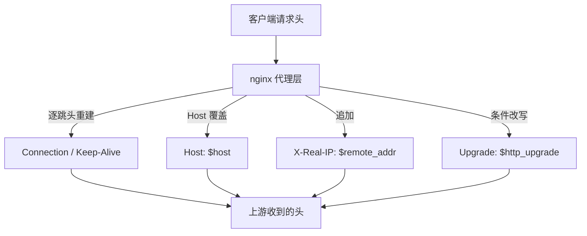
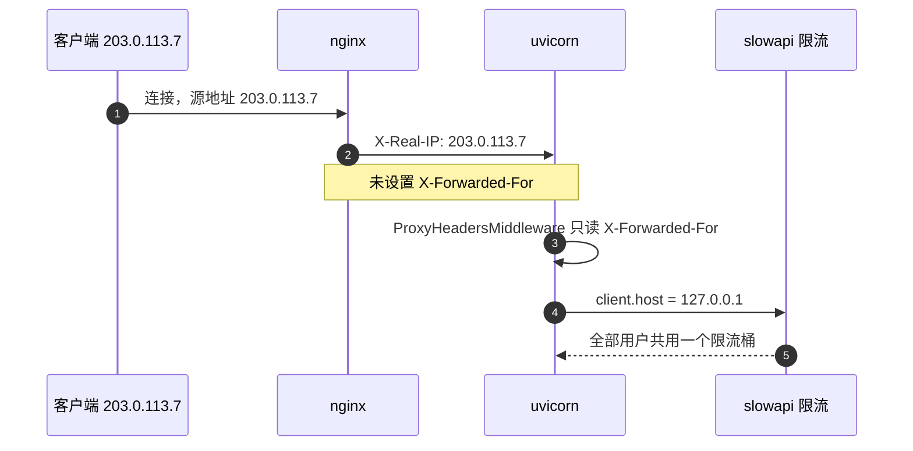

# 请求头与客户端地址

路径改写只解决请求去向，请求头决定上游看到的上下文。nginx 代理时不会原样透传所有头：逐跳头会被终止后重新生成，端到端头默认透传，其中 `Host` 是少数默认就被改写的项。`location /api/` 内 `proxy_set_header` 的四行决定哪些头被改写、后端实际能读到什么，也解释了客户端真实地址为什么在应用层丢失。

## nginx 默认就改写哪些头

需要区分两类头：

| 类别 | 例子 | 处理 |
| --- | --- | --- |
| 逐跳头 | `Connection`、`Keep-Alive`、`Transfer-Encoding` | nginx 终止后重新生成 |
| 端到端头 | `Host`、`Cookie`、`Authorization` | 默认透传，除非被 `proxy_set_header` 覆盖 |

逐跳头只对单段连接有意义，代理在中间终止连接后必须重建，客户端发的 `Connection` 不会被原样带到上游。端到端头描述请求本身，默认透传；`Host` 是例外，不配置时 nginx 发 `Host: $proxy_host`，也就是上游地址。配置显式改回 `$host`，让上游看到客户端请求的主机名。



## proxy_set_header 的覆盖与删除语义

`proxy_set_header` 的规则可以归为三条：

1. 默认继承上层，`http`、`server`、`location` 逐级合并，同级后写的覆盖先写的。
2. 设置空串表示删除该头，例如 `proxy_set_header X-Foo '';`。
3. 同一头在同一个上下文里重复设置，以最后一次为准。

值可以是变量，例如 `$host`、`$remote_addr`、`$http_upgrade`。变量在请求处理时求值，`$http_upgrade` 取客户端 `Upgrade` 头的原值，客户端没发时为空串。

继承的方向容易记错：上层设了 `proxy_set_header`，下层再设同一个头会覆盖它；下层不设则继承上层的整套设置，而不是逐条合并到 nginx 默认值。本工程把四行都写在 `location /api/` 内（`deploy/nginx.conf:18-21`），静态规则不受影响。

## Host 的三种取值

| 变量 | 来源 | 特点 |
| --- | --- | --- |
| `$host` | 请求行、`Host` 头或 `server_name`，按序取第一个有值的 | 已规范化，小写且去掉端口 |
| `$http_host` | 客户端 `Host` 头的原值 | 保留大小写与端口，可能为空 |
| `$proxy_host` | `proxy_pass` 里的主机名 | nginx 不配置时的默认值 |

本工程用 `$host`（`deploy/nginx.conf:20`）。后端只把 Host 用于生成绝对 URL 或同源校验时需要留意端口被剥掉；当前后端没有这类用法。若将来要做跨源校验或拼回调地址，`$host` 与 `$http_host` 的差别就会显出来：带非标准端口的部署需要 `$http_host` 才能保住端口。

## 客户端地址的三段链路

真实客户端地址要经过三段才能被应用读到：



第一段是 `$remote_addr`，即 nginx 看到的 TCP 源地址；第二段是 nginx 写进 `X-Real-IP` 或 `X-Forwarded-For`；第三段是上游框架是否读取这些头并回填 `scope['client']`。缺任何一段，应用拿到的都是上一跳的地址。

## Upgrade 与 Connection

`proxy_set_header Upgrade $http_upgrade;`（`:18`）把客户端的升级意图透传；`proxy_set_header Connection 'upgrade';`（`:19`）把连接头固定写成 `upgrade`，与 `proxy_http_version 1.1` 配套。

`'upgrade'` 是字面量，不随请求变化。对普通请求，客户端发的是 `Connection: keep-alive`，经 nginx 后上游收到 `Connection: upgrade`。对 WebSocket 握手这是需要的；对普通 HTTP 请求，上游通常忽略该头。更稳妥的写法是用 `map` 按 `$http_upgrade` 决定 `Connection` 的值（通用做法，本工程未使用）：

```nginx
map $http_upgrade $connection_upgrade {
    default upgrade;
    ''      close;
}
```

`map` 的定义必须写在 `http` 上下文里，不能在 `server` 或 `location` 内。用 `map` 之后，普通请求会得到 `Connection: close`，与长连接的目标相反；要同时保留长连接，通常再配合 `upstream` 块的 `keepalive`。本工程没有 `upstream` 块，保持固定写法更简单。

## 本工程设置的四个头

| 头 | 配置 | 行 | 上游能得到的信息 |
| --- | --- | --- | --- |
| `Upgrade` | `$http_upgrade` | `deploy/nginx.conf:18` | 客户端是否请求协议升级 |
| `Connection` | `'upgrade'` | `:19` | 固定值，不区分请求 |
| `Host` | `$host` | `:20` | 客户端请求的主机名，已去端口 |
| `X-Real-IP` | `$remote_addr` | `:21` | nginx 直连的对端地址 |

`deploy/deploy.sh:55-58` 与 `:88-91` 重复了同一组设置，改动要同步三处。

## 真实地址在后端丢失的链路

uvicorn 默认启用代理头处理：`proxy_headers` 默认 `True`（`.venv/Lib/site-packages/uvicorn/config.py:207`），受信来源默认 `127.0.0.1`（`config.py:339-340`），启动时装入 `ProxyHeadersMiddleware`（`config.py:476-477`）。该中间件只读取 `x-forwarded-for` 与 `x-forwarded-proto`（`uvicorn/middleware/proxy_headers.py:37`、`:46`），不读取 `X-Real-IP`。

依赖包路径按本仓库检出的 Windows 目录层级书写；Linux 部署时同一文件位于 `.venv/lib/pythonX.Y/site-packages/uvicorn/`。包版本由 `requirements.txt:3` 锁定为 `uvicorn==0.44.0`。

nginx 侧只设置了 `X-Real-IP`（`deploy/nginx.conf:21`），没有 `X-Forwarded-For`。中间件因此找不到可回填的地址，`scope['client']` 保持 nginx 与 uvicorn 之间的连接地址 127.0.0.1。

限流键直接取自这个值：`backend/rate_limit.py:9` 用 `get_remote_address`，该函数返回 `request.client.host`，取不到时兜底 `127.0.0.1`（`.venv/Lib/site-packages/slowapi/util.py:20-27`）。`backend/rate_limit.py:12` 用它构造全局限流器，后果是线上所有用户共用一个限流桶，单个高频客户端会触发对全体的 429。

补齐的方式是在 `location /api/` 增加 `proxy_set_header X-Forwarded-For $proxy_add_x_forwarded_for;`，并在 HTTPS 场景补 `X-Forwarded-Proto $scheme`。这是通用做法，本工程当前未配置。要注意 `FORWARDED_ALLOW_IPS` 决定哪些上游受信（`config.py:339-340`），只在 nginx 与 uvicorn 同机且来源是回环时才能直接信任；补上转发头之后如果受信来源放宽到任意地址，客户端就能自己伪造该头绕过限流。

四个头里只有 `Host` 会影响上游生成绝对地址的行为，其余三个都是附加信息。改动 `proxy_set_header` 之后要确认运行态，用 `nginx -T` 搜这一段，或用一条请求让后端打印收到的头。

HTTPS 块里的同一组设置写在 `deploy/deploy.sh:88-91`，与 HTTP 块的 `:55-58` 是两处独立文本。只改一处的症状是协议切换后行为变化：HTTP 正常、HTTPS 下地址或升级头不符合预期。

请求头的改动只影响上游看到的内容，不影响 nginx 自己记录访问日志时的字段：日志里的 `$remote_addr` 取自连接，与 `proxy_set_header` 无关。

## 响应侧的头

请求头之外，后端自己会加安全响应头：`backend/main.py:52-67` 的中间件写入 `X-Content-Type-Options`、`X-Frame-Options`、`Strict-Transport-Security` 与 `Content-Security-Policy`。这些头由 nginx 原样带回客户端，nginx 侧没有再覆盖。

`Strict-Transport-Security` 在 HTTP 响应里也会出现（nginx 同时监听 80），浏览器会忽略非 HTTPS 连接上的 HSTS；实际生效发生在 443 的响应。

查看响应头用 `curl -I` 或 `curl -i` 打一条请求，`-I` 只看头部。四个安全头是否都出现，可以直接和 `backend/main.py:52-67` 的中间件逐条对照。

响应头没有被 nginx 覆盖，这一点与请求头不同：请求头由 `proxy_set_header` 改写，响应头默认原样带回。若将来需要在 nginx 侧补安全头或删掉某一个，要用 `add_header` 或 `proxy_hide_header`，并把这段配置同步到 HTTP 与 HTTPS 两个块。

第三段之后的风险在受信来源：如果受信地址放宽到任意来源，客户端就能自带 `X-Forwarded-For`，让应用采信一个假地址。

判断当前落到第几段，可以在后端临时打印 `request.client.host` 与 `request.headers.get('x-forwarded-for')`。前者是 127.0.0.1、后者为空，说明停在第 2 段之后；两者都出现真实地址，说明三段全通。

多级代理的场合，`$proxy_add_x_forwarded_for` 会在客户端自带的 `X-Forwarded-For` 后面追加当前对端地址，形成一条链。应用要取链上第一个不可信来源之前的地址，取值逻辑比单级代理复杂，本工程没有这一层。

## 常见误用与边界情况

| # | 误用 | 现象 | 对应位置 |
| --- | --- | --- | --- |
| 1 | 只设 `X-Real-IP` 就认为后端拿到真实地址 | 限流、审计日志里全是 127.0.0.1 | `deploy/nginx.conf:21` |
| 2 | 把 `X-Real-IP` 当标准头 | 多数框架按 `X-Forwarded-For` 取值，读不到 | `uvicorn/middleware/proxy_headers.py:46` |
| 3 | 认为 `Connection: 'upgrade'` 只作用于 WebSocket | 普通请求也带该头 | `deploy/nginx.conf:19` |
| 4 | 用 `$http_host` 替换 `$host` 后带上了端口 | 后端同源判断与生成链接变化 | `deploy/nginx.conf:20` |
| 5 | 只改一处 `proxy_set_header` | HTTP 与 HTTPS 行为不一致 | `deploy/deploy.sh:55-58`、`:88-91` |
| 6 | 信任所有 `X-Forwarded-*` | 客户端伪造该头即可绕过限流 | `uvicorn/config.py:339-340` |
| 7 | 把 `map` 写进 `server` 上下文 | `nginx -t` 报 `"map" directive is not allowed here` | 通用做法 |

第 1 行与第 2 行常被混为一谈：设置 `X-Real-IP` 本身没错，问题是只设置了它。判断当前状态的最快方式是在后端打印一次 `request.client.host` 与 `request.headers.get('x-forwarded-for')`，前者是 127.0.0.1 而后者为空，就说明中间件没有可用的转发头。

## 小结

### 核心概念

- `proxy_set_header` 覆盖 nginx 默认值，`Host` 默认会被改为上游地址，配置改回 `$host`。
- 逐跳头由 nginx 重建，端到端头默认透传，两类头的处理方式不同。
- 本工程设置了 `Upgrade`、`Connection`、`Host`、`X-Real-IP` 四个头，缺少 `X-Forwarded-For`。
- uvicorn 0.44.0 默认启用代理头处理，只认 `X-Forwarded-For` 与 `X-Forwarded-Proto`。
- `get_remote_address` 返回 `request.client.host`，缺少 `X-Forwarded-For` 时是 127.0.0.1，限流因此共桶。
- 后端自加的安全响应头由 nginx 原样带回。

### 设计权衡

| 权衡点 | 本工程选择 | 收益与代价 |
| --- | --- | --- |
| 透传客户端地址 | 只写 `X-Real-IP` | 配置简单；代价是后端默认代理头处理读不到 |
| `Connection` 的取值 | 固定 `upgrade` | WebSocket 可用；代价是普通请求也带升级头 |
| 是否信任转发头 | 依赖 uvicorn 默认的回环白名单 | 同机部署安全；代价是跨机代理需另配 `FORWARDED_ALLOW_IPS` |
| 地址变量 | `$host` | 已规范化；代价是端口信息被剥掉 |

## 练习

### 基础题

1. 说明为什么 `deploy/nginx.conf:21` 设置了 `X-Real-IP`，后端的限流键仍是 127.0.0.1，并指出需要补哪一个请求头。
2. 写出 `$host`、`$http_host`、`$proxy_host` 三者的取值来源，并指出配置里用的是哪一个。
3. 解释逐跳头为什么必须由代理重建，举两个例子。

### 挑战题

4. 设计一个改动，把线上限流改为按真实客户端地址分桶，且能抵抗客户端伪造转发头。要求给出：nginx 侧需要新增的 `proxy_set_header`、uvicorn 的启动参数或环境变量、以及验证方法（含一条可复现的请求与一份预期日志）。
5. 用 `map` 把 `Connection` 改成按 `$http_upgrade` 取值，写出完整配置，并说明它对 WebSocket 与普通请求各自的后果。
6. 若后端需要生成绝对回调地址，说明 `$host` 与 `$http_host` 在带非标准端口部署下的差别，并给出选择依据。

### 附：本页引用的路径

| 路径 | 用途 |
| --- | --- |
| `deploy/nginx.conf` | 四个 `proxy_set_header`（`:18-21`） |
| `deploy/deploy.sh` | HTTP/HTTPS 两处重复设置（`:55-58`、`:88-91`） |
| `backend/rate_limit.py` | 限流键 `get_remote_address`（`:9`、`:12`） |
| `backend/main.py` | 安全响应头中间件（`:52-67`） |
| `.venv/Lib/site-packages/uvicorn/config.py` | 代理头开关与受信来源（`:207`、`:339-340`、`:476-477`） |
| `.venv/Lib/site-packages/uvicorn/middleware/proxy_headers.py` | 只读取的转发头（`:37`、`:46`） |
| `.venv/Lib/site-packages/slowapi/util.py` | `get_remote_address` 的取值（`:20-27`） |
| 仓库根 `~/KnowledgeDiver` | 正文路径相对该根 |

