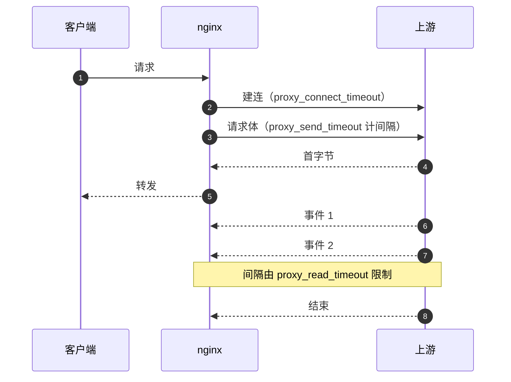
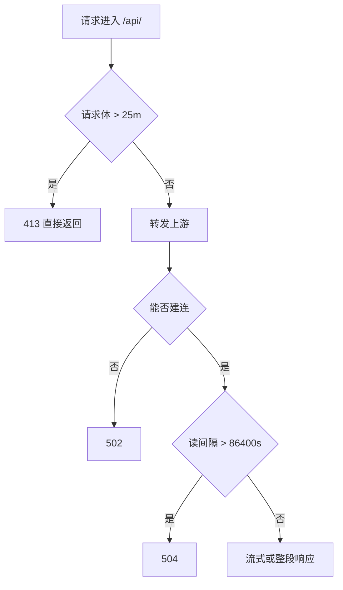

# 超时与响应缓冲

代理把一次请求拆成几段等待：与上游建连、把请求体发完、等上游回响应，每段都有独立的超时变量，互不共用。另有三个指令控制响应节奏与请求体规模：读超时决定等多久算失败，缓冲开关决定何时把数据发给客户端，请求体上限决定多大的上传会被直接拒绝。

`location /api/` 内与超时、缓冲有关的是 `proxy_read_timeout`、`proxy_buffering`、`client_max_body_size` 三个指令，行号在 `deploy/nginx.conf:22-24`。

## 一次代理请求分成几段等待

默认值集中在 60 秒，本工程把读超时放大到 24 小时：

| 指令 | 计时区间 | nginx 默认 | 本工程取值 |
| --- | --- | --- | --- |
| `proxy_connect_timeout` | 与上游建立 TCP 连接 | 60s | 未设置 |
| `proxy_send_timeout` | 两次向上游写数据的间隔 | 60s | 未设置 |
| `proxy_read_timeout` | 两次从上游读到数据的间隔 | 60s | 86400s |
| `client_body_timeout` | 两次读客户端请求体的间隔 | 60s | 未设置 |

四个变量里有两个计的是间隔而不是总时长：`proxy_read_timeout` 管两次读之间，`proxy_send_timeout` 管两次写之间。只要数据持续流动，连接就不会被判定超时，一个持续输出两小时的事件流不会触发任何一个超时。

这些指令可以写在 `http`、`server` 或 `location` 任一上下文，内层覆盖外层。本工程写在 `location /api/` 内（`deploy/nginx.conf:22-24`），只作用于代理请求；`location /` 的静态响应不受影响。86400 秒同时放宽了普通 JSON 请求的读等待，一个卡住的上游不会在 60 秒时被 nginx 主动断开，而是会让请求一直挂着直到客户端放弃。

## 读超时计的是间隔

上游采用 `StreamingResponse` 时，响应体分多次写出，块与块之间可能间隔数秒到数分钟。默认的 60 秒读超时会把空闲超过 60 秒的流断开，nginx 记录 504 或直接关闭连接。把读超时调到 86400 秒，等于把这类连接的空闲上限提到一天，代价是异常连接也不会被快速回收。

86400 是秒数，对应 24 小时，与 systemd 单元的 `Restart=always` 无关，后者管的是进程退出后的拉起。

读超时不会自动续期到"总响应时长"的语义：如果上游每隔 59 秒发一个心跳，连接可以一直保持；如果上游安静 61 秒，即使此前已经传了几分钟，也会被判超时。因此流式接口需要应用侧有规律地产生数据，仅靠放大超时不能代替心跳。

## 关闭缓冲对流式响应的意义

`proxy_buffering` 默认 `on`。打开时 nginx 尽快从上游读走全部响应，缓存在内存或临时文件，再按客户端读取速度发送。对普通 JSON 响应这能减少上游占用；对流式响应会破坏实时性，因为 nginx 会等缓冲区积累或响应结束后才向客户端发送。

`proxy_buffering off;`（`deploy/nginx.conf:23`）让 nginx 收到一块就转发一块，客户端看到的是连续的事件。这个开关只影响发送节奏，不改变读超时的计时方式。

关闭缓冲后，`proxy_buffers` 与 `proxy_max_temp_file_size` 对这类响应不再起作用；它们只在缓冲打开时决定内存块与磁盘临时文件。关闭缓冲也会让上游的输出节奏直接暴露给客户端：客户端慢时 nginx 不能提前把上游读完，上游的连接占用时间变长。

## 请求体上限与它的作用范围

`client_max_body_size` 默认 1 MB，超过时 nginx 直接回 413，不把请求转给上游。本工程写成 25 MB（`deploy/nginx.conf:22`），给上传类接口留空间。这个限制针对单个请求体，不是累计流量，也不区分编码方式。

判断限制是否生效的一个实验是故意上传一个略大于 25 MB 的文件，观察状态码：413 表示在 nginx 侧被拦，400 或 500 表示请求已经到达应用。上游收不到被拦的请求体，因此应用日志里不会出现对应记录，只有 nginx 访问日志里的一行 413。

## 状态码的归属

代理链路上的失败由不同环节返回不同的状态码，区分来源能缩短排查：

| 状态码 | 产生环节 | 典型原因 |
| --- | --- | --- |
| 413 | nginx | 请求体超过 `client_max_body_size` |
| 502 | nginx | 上游拒绝连接或提前关闭 |
| 504 | nginx | 上游在 `proxy_read_timeout` 内没有数据 |
| 499 | nginx 访问日志 | 客户端在响应完成前断开 |

499 不会出现在响应里，只写在访问日志中，客户端断开的原因需要结合前端行为判断。

超时值的大小要结合上游行为确定，而不是越大越好。读超时给到一天，死连接会被占住一天，连接数与文件描述符的占用随之上限变高；流式接口本身有规律的心跳时，可以取更小的值。

三个指令都写在 `location /api/` 内，静态规则不受影响。若把上传接口拆到单独 `location`，需要在那里重新声明 `client_max_body_size`，因为内层不继承兄弟 location 的取值。

验证改动是否生效，最简单的是用一条超过 25 MB 的上传与一条长流请求各打一次，观察 413 与事件到达的节奏。

## 三个指令的落点

| 文件 | 行 | 内容 |
| --- | --- | --- |
| `deploy/nginx.conf` | `:22` | `client_max_body_size 25m;` |
| `deploy/nginx.conf` | `:23` | `proxy_buffering off;` |
| `deploy/nginx.conf` | `:24` | `proxy_read_timeout 86400;` |
| `deploy/deploy.sh` | `:59-61` | HTTP 块内同一组指令 |
| `deploy/deploy.sh` | `:92-94` | HTTPS 块内同一组指令 |

三段内容一致。`proxy_connect_timeout` 与 `proxy_send_timeout` 没有设置，沿用 60 秒默认值，上游是回环地址，建连时间远低于该值。

## 谁需要关缓冲

后端的流式接口都用 `StreamingResponse`：流水线收集与延伸（`backend/routes/pipeline.py:114-117`、`:186-188`）、任务重连流（`:423`）、Agent 对话流（`backend/routes/ai.py:34`）。这些响应以 `text/event-stream` 或 `text/plain` 分块写出，`proxy_buffering off` 是它们能按事件实时到达客户端的前提。

事件流的格式、断线重连与前端 `useSSE` 的处理属于 SSE 代理主题，这里只覆盖它和超时、缓冲的关系。

缓冲开关写在 `location /api/` 内，对同一 location 下的普通 JSON 接口也生效。普通响应量小，关闭缓冲带来的额外系统调用可以忽略；若将来把大文件下载类接口放进同一 location，关闭缓冲会让上游连接占用时间变长，届时应把这类接口拆到单独 location。

上游也可以在响应里用 `X-Accel-Buffering: no` 单独关闭某条响应的缓冲，作用范围比 location 更细。这个头由应用写，不写在 nginx 配置里，排查时容易漏看，判断方法与 `proxy_buffering` 一节相同。

验证缓冲是否生效，用 `curl -N` 看事件到达的时间戳，或对比走 nginx 与直连上游两条命令的输出节奏。配置改动后需要 `reload` 才会反映到运行态。

## 上传上限的两套数字

后端定义了单 ZIP 上限 50 MB（`backend/routes/session_io.py:31`），上传处理里对超过该值的请求返回 400（`:111`）。nginx 的 25 MB 低于这个值，25 MB 到 50 MB 之间的上传在到达应用前就被 413 拦下。生产环境下应用里针对 50 MB 的分支因此不可达。

| 限制 | 位置 | 超出后的状态码 |
| --- | --- | --- |
| 25 MB | `deploy/nginx.conf:22` | 413，请求不转发 |
| 50 MB | `backend/routes/session_io.py:31` | 400，请求已到应用 |

文档上传接口（`frontend/src/api/documents.ts:21`）走同一个 `location /api/`，受同一个 25 MB 限制。要支持更大的文件，需要同时调整 nginx 的 `client_max_body_size` 与应用侧的上限，只改一处会得到与预期不同的状态码。

502 与 504 都表示上游不可用，区别在失败的位置：502 是连接阶段就失败（进程没起、端口不对、地址解析错），504 是连接成功但读不到数据。error 日志里的措辞能直接区分这两类。

413 与三者不同，它由 nginx 在转发之前返回，上游不会看到这次请求。日志里出现 413 时先查 `client_max_body_size`，再看应用侧的上限是否更低。

把这些状态码写进监控告警判据时，建议把 499 单独统计：它反映客户端行为，与服务质量的关系比 502、504 弱，混在一起会让告警噪声变大。

## 常见误用与边界情况

| # | 误用 | 现象 | 对应位置 |
| --- | --- | --- | --- |
| 1 | 把 `proxy_read_timeout` 当成整个响应总时长 | 长任务中途被 504，误判为上游卡死 | `deploy/nginx.conf:24` |
| 2 | 保留默认缓冲又期望事件实时 | 客户端一次收到全部事件，进度条长时间不动 | `deploy/nginx.conf:23` |
| 3 | 只调大 nginx 上传上限 | 应用侧另一个上限先返回 400 | `deploy/nginx.conf:22`、`backend/routes/session_io.py:31` |
| 4 | 把 499 当成服务端错误 | 误查上游，实际是客户端提前断开 | 访问日志 |
| 5 | 认为未设置的超时是无限 | 实际沿用 60 秒默认值 | `deploy/nginx.conf:15-25` |
| 6 | 只改一处缓冲开关 | HTTPS 分支仍按缓冲发送 | `deploy/deploy.sh:59-61`、`:92-94` |
| 7 | 用超时放大代替心跳 | 上游安静超过读超时后连接仍被判失败 | `deploy/nginx.conf:24` |

第 4 行需要结合客户端行为判断：499 表示客户端在响应完成前断开，常见原因是用户切走页面或前端设了更短的请求超时。前端若有自己的超时，改前端超时会改变 499 的数量，而服务端配置没有任何变化。

## 小结

### 核心概念

- 代理链路上的建连、发送、读取各有独立超时，默认值都是 60 秒。
- `proxy_read_timeout` 限制两次读之间的间隔，本工程取 86400 秒以支撑长连接。
- `proxy_buffering off` 让流式响应按块转发，是本工程流式接口可用的前提。
- `client_max_body_size` 默认 1 MB，本工程取 25 MB，低于应用侧的 50 MB 上限。
- 413、502、504 分别来自请求体超限、上游建连失败、上游读超时；499 只在访问日志里。
- 三个指令都写在 `location /api/` 内，只作用于代理请求。

### 设计权衡

| 权衡点 | 本工程选择 | 收益与代价 |
| --- | --- | --- |
| 读超时长度 | 24 小时 | 长任务与事件流不断线；代价是死连接回收慢 |
| 响应缓冲 | 关闭 | 流式实时；代价是上游输出节奏直接暴露给客户端 |
| 请求体上限 | 25 MB | 覆盖文档与 ZIP 上传；代价是与应用侧 50 MB 上限不一致 |
| 指令作用范围 | 只写在代理块 | 不影响静态规则；代价是 HTTPS 块要重复一份 |

## 练习

### 基础题

1. 说明 `proxy_read_timeout` 与 `client_body_timeout` 各自计的是哪两个事件之间的间隔。
2. 解释为什么 `proxy_buffering on` 会破坏事件流的实时性，从 nginx 的读取与发送两侧说明。
3. 上传 30 MB 文件时得到 413，说明请求经过了哪些环节、应用为什么没有记录。

### 挑战题

4. 某个流式接口每隔 90 秒才发一个事件，当前配置下会不会被断开？给出两种修法并比较代价。
5. 把上传上限统一到 50 MB，列出 nginx 与后端各自需要改的行号，并设计一条验证命令，覆盖 30 MB、60 MB 两个用例。
6. 若把大文件下载接口放进 `location /api/`，分析 `proxy_buffering off` 对上游连接占用的影响，并给出拆分 location 的方案。

### 附：本页引用的路径

| 路径 | 用途 |
| --- | --- |
| `deploy/nginx.conf` | 三个超时与缓冲指令（`:22-24`） |
| `deploy/deploy.sh` | HTTP/HTTPS 两处重复指令（`:59-61`、`:92-94`） |
| `backend/routes/pipeline.py` | 流式响应与任务流（`:114-117`、`:186-188`、`:423`） |
| `backend/routes/ai.py` | 文本流式响应（`:34`） |
| `backend/routes/session_io.py` | 应用侧上传上限（`:31`、`:111`） |
| `frontend/src/api/documents.ts` | 文档上传请求（`:21`） |
| 仓库根 `~/KnowledgeDiver` | 正文路径相对该根 |

