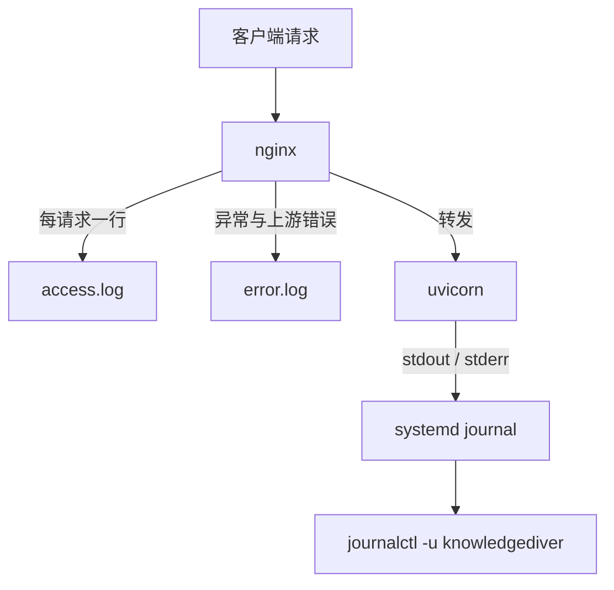
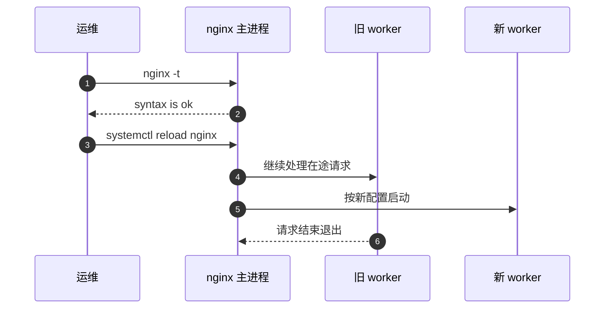

# 日志与观测

一个 `/api/` 请求会经过 nginx 与 uvicorn 两个进程，各自写各自的日志，没有统一的请求标识把它们串起来。出问题时能用的观测点只有三类：nginx 的访问日志、错误日志，以及经 journald 收集的应用输出。三层日志的时间戳格式不同，对时间只能对齐到秒。

三层日志各自的字段与查看方式不同，`nginx -t` 与 `systemctl reload` 在同一件事上也有分工；配置里查不到日志位置时还有替代办法。

## 三层观测点

| 层 | 载体 | 记录内容 | 查看方式 |
| --- | --- | --- | --- |
| nginx 访问日志 | `/var/log/nginx/access.log` | 每请求一行，状态码、字节数、耗时 | `tail -f` 或 `journalctl -u nginx` |
| nginx 错误日志 | `/var/log/nginx/error.log` | 上游失败、配置问题、权限问题 | 同上 |
| 应用日志 | systemd journal | uvicorn 与 `logging` 的输出 | `journalctl -u knowledgediver -f` |

访问日志按请求逐行记录，适合统计与按路径过滤；错误日志按事件记录，只有异常才写，适合看上游连接失败的原因；应用日志记录业务处理过程，是判断请求是否到达后端的依据。三层日志里访问日志与错误日志由 nginx 写，应用日志由 systemd 接管。

两层日志的时间戳格式不同，nginx 默认是本地时间字符串，应用日志由 `logging.basicConfig` 写成秒级时间（`backend/main.py:41-45`）。对时间能对齐到秒，再靠路径与状态码关联。



## 访问日志字段

nginx 默认的 `combined` 格式包含若干变量，排查代理问题时常用的有：

| 变量 | 含义 | 代理场景的用途 |
| --- | --- | --- |
| `$remote_addr` | 与 nginx 直连的对端地址 | 反代后是 nginx 看到的客户端；若上游再有代理则不是终端地址 |
| `$request` | 请求行，含方法、路径、协议 | 对齐前端发出的路径 |
| `$status` | 响应状态码 | 区分 200、413、502、504 |
| `$request_time` | 从收到首字节到响应完成 | 客户端感知的耗时 |
| `$upstream_response_time` | 上游从建连到响应完成 | 与 `$request_time` 之差约等于 nginx 自身开销 |
| `$upstream_addr` | 实际转到的上游地址 | 有多个上游时定位是哪一台 |

`combined` 默认不含 `$request_time` 与 `$upstream_*`，需要在 `log_format` 里显式加入。本工程没有自定义格式，因此这些耗时字段默认不在访问日志里，要看耗时只能靠应用日志或临时加。

没有耗时字段时的替代路径是应用侧的日志与前端埋点：应用日志里能算出处理时间，前端能测到端到端时间，两者之差包含 nginx 与网络的开销。这个差值在回环与同机部署下很小，只有在跨机或上行受限时才会成为主要部分。

## 错误日志级别

`error_log` 支持 `debug`、`info`、`notice`、`warn`、`error`、`crit`、`alert`、`emerg`，默认 `error`。上游无响应、连接被重置这类问题写在 error 日志里；`info` 及以上会记录代理转发与上游选择。调高到 `info` 会显著增加日志量，排查完应改回。

| 需求 | 建议级别 | 代价 |
| --- | --- | --- |
| 只看失败 | 默认 `error` | 看不到成功的转发过程 |
| 看每次转发到哪个上游 | `info` | 日志量与磁盘占用明显上升 |
| 看变量取值与规则匹配细节 | `debug` | 只能在调试时短时开启 |

级别是全局或按 server、location 设置的，调高之后影响同一 nginx 上的所有站点。生产环境排查建议先限定在最短时间窗内，用 `nginx -s reload` 生效，完成后立即改回。

## 应用日志如何进 journald

systemd 单元是 `Type=simple`，进程的 stdout 与 stderr 被 journald 接管，不需要重定向到文件。`journalctl -u knowledgediver` 读取该单元的日志，配置在 `deploy/knowledgediver.service` 与 `deploy/deploy.sh:118-135` 生成的单元里。

Uvicorn 自身在 `INFO` 级别打印启动信息与访问行，应用日志格式由 `backend/main.py:41-45` 设定为 `时间 [级别] 日志器: 消息`。两类输出混在同一 journal 流里，靠格式前缀区分。

`Type=simple` 表示 systemd 只启动进程并跟随主进程，不做 fork 与就绪通知。如果应用把日志写进自己的文件而不是标准输出，journal 里就只剩 uvicorn 的启动行，这时需要在单元里补 `StandardOutput` 或改用 `Type=forking`，本工程两者都没有使用。

## 校验与重载是两步

改完配置先做语法检查，再让运行中的 nginx 重新加载。校验与重载是两步，脚本把两者串在一起：`nginx -t && systemctl reload nginx`（`deploy/deploy.sh:102`）。`-t` 只检查语法与引用的文件，不改变运行状态。

`reload` 是平滑重载：主进程读取新配置、启动新的 worker、旧 worker 处理完现存请求后退出。`restart` 会中断在途请求，对流式连接尤其明显。`server_start.sh:180-187` 先尝试 `reload`，失败才退回 `restart`。



校验通过不等于新配置生效。`nginx -t` 校验的是磁盘上被引用的那份文件，若站点文件的软链未更新，或根本忘了 reload，运行态仍是旧规则。确认运行态最直接的方式是 `nginx -T`，它把当前加载的完整配置打印出来。

## 脚本给出的观测入口

`deploy/deploy.sh:148-149` 在部署完成的提示里列出两条命令：`systemctl status knowledgediver` 与 `journalctl -u knowledgediver -f`。后端日志的官方入口就是 journal，脚本没有把 uvicorn 输出重定向到文件。

同一段提示里还有 `bash $APP_DIR/server_start.sh` 作为更新入口。该脚本在 `:147-149` 重启后端，在 `:180-187` 重载 nginx，并跳过未安装 nginx 的情况。

## 配置里没有日志项

`deploy/nginx.conf` 与 `deploy/deploy.sh` 生成的 server 块都没有 `access_log`、`error_log` 或 `log_format`。日志路径与级别沿用发行版 `/etc/nginx/nginx.conf` 的 `http` 段默认值，通常指向 `/var/log/nginx/`。这意味着配置本身不能说明日志在哪，需要看系统级配置。

| 想要的信息 | 当前是否可查 | 位置 |
| --- | --- | --- |
| 每请求状态码与路径 | 可查 | 发行版默认 access_log |
| 上游耗时 | 默认不可查 | 需自定义 `log_format` |
| 上游地址 | 默认不可查 | 同上 |
| 应用级异常 | 可查 | `journalctl -u knowledgediver` |
| 配置是否合法 | 可查 | `nginx -t` |

要补上游耗时字段，在 `http` 段自定义 `log_format` 并在 server 里引用，例如把 `$request_time`、`$upstream_response_time`、`$upstream_addr` 加进去。这项改动属于通用做法，本工程未使用，也不在 `deploy/` 两个文件的管理范围内。

把三类日志写进同一份排查记录时，建议每条记录同时留存时间、路径与状态码三个字段，其余信息都能从这三项反推。

journald 与应用日志的时区由系统决定，访问日志的时间格式由 nginx 默认值决定，跨时区排障前先确认机器的时区设置，避免把时间差算进故障现象。

## 排障时的最短命令

```bash
# 校验当前磁盘上的配置，不重载
nginx -t
# 按单元查看后端最近日志
journalctl -u knowledgediver -n 100 --no-pager
# 持续跟踪后端
journalctl -u knowledgediver -f
# 仅看本次启动以来的日志
journalctl -u knowledgediver -b --no-pager
```

这些是通用做法，本机没有安装 nginx，未做现场验证。journald 的保留量由系统 `journald.conf` 决定，长期运行的部署需要确认磁盘配额，nginx 的 `/var/log/nginx/` 则由 `logrotate` 轮转。两者都不由本工程的配置文件管理。

按状态码过滤访问日志用 `grep ' 502 '` 一类写法，注意两侧空格避免匹配到请求路径里的数字。要按时间窗筛选，journalctl 用 `--since` 与 `--until`，两个命令取同一段时间窗。

三层日志没有共同的请求标识，跨层关联只能靠时间、路径与状态码。一次请求在访问日志里是 502、在应用日志里没有任何记录，说明请求没到应用；两处都有记录时，用应用日志的行内时间与访问日志的时间戳对齐到秒。

日志级别与格式都不由项目配置控制，改动它们要先确认系统级配置文件的位置，避免改了 `deploy/` 下的样例却没有作用到运行态。

## 常见误用与边界情况

| # | 误用 | 现象 | 对应位置 |
| --- | --- | --- | --- |
| 1 | 以为配置里能找到日志路径 | 配置无 `access_log`，日志仍在默认位置 | `deploy/nginx.conf:4-26` |
| 2 | 用 `$remote_addr` 判定终端地址 | 上游再经代理时记录的是上一跳 | 默认日志格式 |
| 3 | 期望访问日志里有上游耗时 | `combined` 格式不含该字段 | 需自定义 `log_format` |
| 4 | 用 `restart` 代替 `reload` | 在途的流式请求被中断 | `deploy/deploy.sh:102` |
| 5 | `nginx -t` 通过就认为新配置已生效 | 生效需要额外 `reload` | `deploy/deploy.sh:102` |
| 6 | 只改配置不改 systemd 单元 | 后端环境变量与日志来源不符合预期 | `deploy/deploy.sh:118-135` |
| 7 | 长期不检查 journal 配额 | 磁盘占满后应用日志停止写入 | 系统 `journald.conf` |

第 1 行与第 3 行说明配置的边界：本工程的部署文件只管路由与代理行为，日志落点交给发行版与 systemd 的默认策略。要确定实际日志位置，读 `/etc/nginx/nginx.conf` 的 `http` 段或直接看 `/var/log/nginx/` 目录，而不是在 `deploy/` 里找。

## 小结

### 核心概念

- 反向代理链路上有三层观测点：nginx 访问日志、错误日志、systemd journal。
- 本工程没有自定义 `log_format`，上游耗时与上游地址默认不可查。
- 应用日志经 stdout 进 journald，用 `journalctl -u knowledgediver` 读取。
- 配置改动先 `nginx -t` 再 `systemctl reload nginx`，重载不中断在途请求。
- 部署脚本给出的观测入口是 `systemctl status` 与 `journalctl -f`。
- 日志落点与保留策略由发行版与系统配置管理，不在项目配置里。

### 设计权衡

| 权衡点 | 本工程选择 | 收益与代价 |
| --- | --- | --- |
| 日志落点 | 沿用发行版默认加 journald | 配置少；代价是日志位置不写在项目里 |
| 是否自定义格式 | 否 | 不增加配置；代价是缺少上游耗时字段 |
| 重载方式 | 优先 `reload`，失败退回 `restart` | 尽量不断线；代价是降级为重启时仍会中断 |
| 错误日志级别 | 保持默认 `error` | 日志量小；代价是看不到成功转发的细节 |

## 练习

### 基础题

1. 写出三层日志各自的载体与查看命令，并说明哪一层能判断请求是否到达后端。
2. 说明 `nginx -t` 与 `systemctl reload nginx` 各做什么，只做前者会留下什么问题。
3. 解释为什么 `combined` 格式里看不到上游耗时，需要补哪个字段。

### 挑战题

4. 设计一个 `log_format`，同时记录客户端地址、上游地址、上游耗时与请求总耗时，写出配置并说明如何验证它生效。
5. 某次部署后接口返回 502，但 `nginx -t` 通过。给出一套只用日志与命令的排查步骤，指明每一步看哪一层日志。
6. 若 journald 配额被写满，设计一个可长期运行的日志保留方案，覆盖 nginx 与应用的日志，并说明与 `logrotate` 的分工。

### 附：本页引用的路径

| 路径 | 用途 |
| --- | --- |
| `deploy/nginx.conf` | server 块未配置日志（`:4-26`） |
| `deploy/deploy.sh` | 校验与重载、部署提示、systemd 单元（`:102`、`:148-149`、`:118-135`） |
| `deploy/knowledgediver.service` | 后端单元，日志进 journald |
| `server_start.sh` | 重启后端与重载 nginx（`:147-149`、`:180-187`） |
| `backend/main.py` | 日志级别与格式（`:41-45`） |
| 仓库根 `~/KnowledgeDiver` | 正文路径相对该根 |

