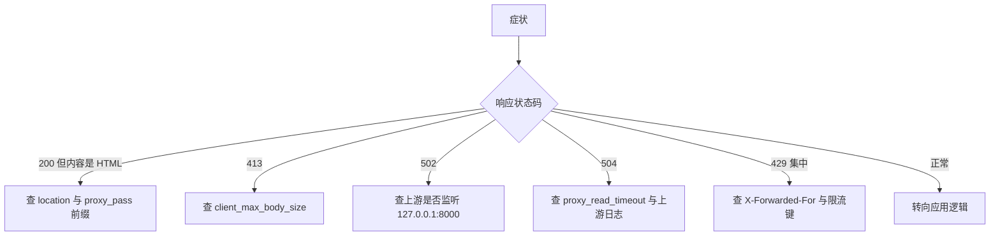
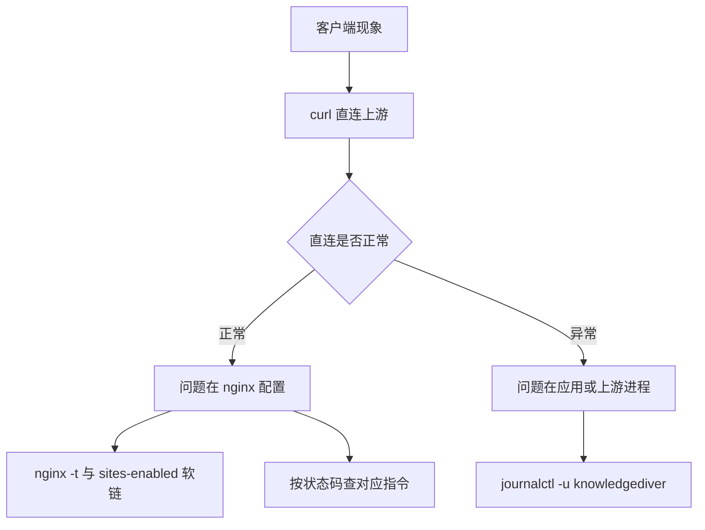

# 易错点与调试

反向代理的故障几乎都能用响应状态码先分类，再往对应的一层查。分类的价值在于避免从应用代码开始翻，因为多数问题出在 nginx 与上游的边界上。下面的排查顺序把前面几页的内容串起来，并给出可直接复制的命令。

## 先按状态码分类

| 症状 | 优先怀疑的层 | 直接证据 |
| --- | --- | --- |
| 接口返回 HTML | location 匹配或路径替换 | 响应体首行、`$request` |
| 413 | 请求体上限 | `client_max_body_size` |
| 502 | 上游进程或地址 | `ss -ltnp`、systemd 状态 |
| 504 | 读超时或上游阻塞 | error.log、应用日志 |
| 429 集中出现 | 真实地址丢失导致限流共桶 | `$remote_addr`、转发头 |



分类的前提是拿到真实状态码，浏览器里的"接口失败"往往已被前端包装。用 `curl -i` 直接打一条请求，看响应首行的状态码与响应体的 `Content-Type`，比在控制台里猜更快。

状态码之外还要看响应体：同样返回 200，正文是 HTML 说明请求落到了 `location /`，正文是 JSON 才说明走的是代理。这一条能立刻区分路径匹配问题与接口逻辑问题。

拿不到状态码时（例如前端把错误统一显示成一句提示），最快的办法是在服务器上重放同一条请求。请求参数与头部可以从浏览器开发者工具里复制，转成 `curl` 命令后在服务器上跑，避开本地环境与线上的差异。

## 绕过 nginx 直连上游

在服务器上绕过 nginx 直接请求上游，可以判断问题在代理还是在应用：

```bash
# 走 nginx
curl -i http://127.0.0.1/api/pipeline/collect
# 绕过 nginx，直接问上游
curl -i http://127.0.0.1:8000/api/pipeline/collect
# 看 8000 是否在监听、由谁监听
ss -ltnp | grep 8000
```

直接请求上游返回 404 而经 nginx 返回 200 的 HTML，说明路径前缀在代理层变了；两边都 404，说明后端没有该路由；直连拒绝而经 nginx 502，说明上游没起来或地址不对。

这一刀之所以有效，是因为 `location /api/` 的 `proxy_pass` 只做前缀替换（`deploy/nginx.conf`）。两侧结果一致时，代理层的路径改写、请求头与超时都基本正常，问题落在应用侧；两侧不一致时，差异集中在 nginx 的改写与转发规则上。

## 确认配置与运行态一致

```bash
nginx -t
systemctl status nginx knowledgediver --no-pager
journalctl -u knowledgediver -n 100 --no-pager
```

`nginx -t` 只校验磁盘上的配置。要确认运行中的 nginx 用的是哪份文件，看 `nginx -T` 的输出或 `sites-enabled` 的软链指向（`deploy/deploy.sh`）。改动未生效时先查软链与是否执行了 `reload`。

| 检查 | 命令 | 能回答的问题 |
| --- | --- | --- |
| 语法是否合法 | `nginx -t` | 新配置能不能加载 |
| 运行态用的是哪份文件 | `nginx -T` | 加载的是软链目标还是别的文件 |
| 软链指向 | `ls -l sites-enabled` | 站点文件是否被替换 |
| 上游是否在监听 | `ss -ltnp \| grep 8000` | 502 是否来自进程未起 |
| 后端是否健康 | `systemctl status knowledgediver` | 进程是否反复重启 |

五个检查里前三个针对 nginx，后两个针对上游。顺序上先确认上游在监听，再查 nginx，因为上游不在时后面的检查都会指向错误的方向。

上游进程的状态也要在同一步确认：`systemctl status knowledgediver` 看是否反复重启，`ss -ltnp | grep 8000` 看端口是否在监听。进程在但端口不听的场合，通常是启动参数里的监听地址或端口被改过。

配置侧的检查顺序是先软链再 reload：软链指向的文件决定改了哪份配置，reload 决定新配置是否生效，两者缺一都会表现为改动无效。

## 流式问题要看时序

长连接与流式响应的问题要看间隔。`curl -N` 关掉 curl 自己的输出缓冲（`-N` 即 no-buffer，收到多少立刻写出），能观察到事件到达的节奏：

```bash
curl -N -i http://127.0.0.1/api/tasks/REPLACE_ID/stream
```

事件长时间不来但连接未断，可能是上游没有产出，也可能是 `proxy_buffering` 未关闭导致 nginx 攒着不发。两者在 error 日志里都没有记录，只能从客户端观察区分。

区分办法是比两条命令的到达节奏：一条走 nginx，一条直连 8000。直连时事件连续到达、走 nginx 时长时间静默然后一次收到全部，就说明是缓冲问题，对应 `deploy/nginx.conf`；两条都一样地安静，说明上游确实没有输出，应查应用日志。



## 两份配置的差异

同一份配置同时存在"给人读的样例"与"由脚本生成的生效版本"时，真正生效的总是后者；只改样例文件，改动不会落到运行态。识别办法是看软链指向的文件里是否含展开后的变量。本项目就是这种两处文本的结构：`deploy/nginx.conf` 与 `deploy/deploy.sh` 的 here-doc 是两处独立配置。前者写死 `/opt/knowledgediver/frontend/dist` 与占位域名 `your-domain.com`，后者用 `$APP_DIR` 与 `$DOMAIN` 展开。部署脚本不读取前者，所以直接修改 `deploy/nginx.conf` 不会影响已安装站点。

| 项 | `deploy/nginx.conf` | `deploy/deploy.sh` 生成 |
| --- | --- | --- |
| 静态根 | `/opt/knowledgediver/...` | `$APP_DIR/frontend/dist` |
| 域名 | `your-domain.com` | `$DOMAIN www.$DOMAIN` |
| IPv6 监听 | 无 | `listen [::]:80`、`listen [::]:443` |
| HTTPS 块 | 无 | 证书存在时追加 |

改动只在样例文件里完成时，症状是"改了配置但没有效果"。判断当前站点由谁生成，看软链指向的文件里是 `$APP_DIR` 展开后的绝对路径还是固定路径，或者在脚本里搜索同一段规则。

## 注释与代码不一致的一处

注释与实现漂移是长期维护里最常见的一类不一致：改动落在代码上，注释没人回头改。判据永远是代码，而且最好到真实环境复核一次。本项目就有这样一处：`deploy/deploy.sh` 的注释写「HTTP → HTTPS 重定向（无证书时直接服务）」，但紧跟着的 HTTP 块里没有 `return 301`：

```bash
# deploy/deploy.sh：注释与它下面的 HTTP 块开头
# HTTP → HTTPS 重定向（无证书时直接服务）
server {
    listen 80;
    listen [::]:80;
    server_name $DOMAIN www.$DOMAIN;
    # 块内没有 return 301
```

重定向来自首次运行时 `certbot --nginx ... --redirect`——certbot 是 Let's Encrypt 的申请客户端，`--nginx` 让它直接改 nginx 配置，`--redirect` 负责补 80 到 443 的跳转。重新部署时 here-doc 会整体重写该文件，certbot 写入的重定向随之丢失，只剩脚本自己的 HTTP 块与条件追加的 443 块。

这是注释与实现的冲突，按代码为准，标注为待现场确认：需要在实际服务器上核对第二次部署后 HTTP 是否仍跳转。

## 不在请求路径上的前端服务

判断一个进程重不重要，看它是否在请求路径上，而不是看它是否在运行。本项目里 `deploy/knowledgediver-frontend.service` 用一条命令起 Vite 的预览服务：

```ini
# deploy/knowledgediver-frontend.service
ExecStart=/usr/bin/npm run preview -- --host 127.0.0.1 --port 5173
```

`npm run preview` 是 Vite 自带的预览命令，把构建产物 `dist/` 当成本地静态服务器跑在 5173 端口，用来在本机查看产物；`server_start.sh` 也会重启它。但 nginx 的 `location /` 直接读 `frontend/dist` 磁盘文件，预览服务不在请求路径上。它退出时站点仍能打开，容易被误判为「一切正常」；反过来，只重启预览服务也不会让前端产物更新，更新产物要靠 `npm run build`（`server_start.sh`）。

## 开发与生产两套代理

开发与生产用两套不同的代理实现是常态：开发机上一个 dev server 顺手转发，生产上才由反向代理接管。改动接口前缀、鉴权头这类契约时必须两边都核对。开发态由 Vite 自己做代理。Vite 是开发期的构建与预览工具，它的 dev server 内置转发能力：

```ts
// frontend/vite.config.ts
server: {
  proxy: {
    '/api': {
      target: 'http://localhost:8000',
      changeOrigin: true,
    },
  },
},
```

`server.proxy` 把以 `/api` 开头的请求转给后端；`changeOrigin: true` 表示转发时把请求的 `Host` 改成目标主机名，某些后端按 `Host` 做校验时需要它。生产态由 nginx 代理，规则是 `deploy/nginx.conf`。两套规则的路径替换不同（Vite 保留 `/api` 前缀但不做尾部斜杠改写），改动接口前缀时两处都要核对。`start.sh` 的 `uvicorn --reload --port 8000` 与生产单元的后端是同一进程入口的不同启动方式。

| 环境 | 代理方 | 配置位置 | 差异 |
| --- | --- | --- | --- |
| 开发 | Vite dev server | `frontend/vite.config.ts` | 保留 `/api` 前缀，目标 `localhost:8000` |
| 生产 | nginx | `deploy/nginx.conf` | 前缀替换恒等，目标 127.0.0.1:8000 |

开发态用 `localhost`，可能走 IPv6 回环；生产态写死 IPv4。后端在开发时用 `--reload` 启动，端口相同。两类差异叠加后，开发能通而生产 502 的情形通常出在地址解析或进程监听上，而不是路径前缀。

## 易错点与调试

| # | 易错点 | 现象 | 对应位置 |
| --- | --- | --- | --- |
| 1 | 请求 `/api` 而非 `/api/...` | 返回 index.html | `deploy/nginx.conf` |
| 2 | 修改样例配置后未同步脚本 | 部署结果与预期不符 | `deploy/deploy.sh` |
| 3 | `proxy_pass` 尾斜杠写错 | 前缀被剥掉或粘连 | `deploy/nginx.conf` |
| 4 | 只设 `X-Real-IP` | 限流按 127.0.0.1 共桶 | `deploy/nginx.conf` |
| 5 | nginx 25 MB 与应用 50 MB 不一致 | 25 到 50 MB 上传直接 413 | `deploy/nginx.conf` |
| 6 | 未关缓冲 | 流式事件攒批 | `deploy/nginx.conf` |
| 7 | 用 `restart` 代替 `reload` | 在途流被中断 | `deploy/deploy.sh` |
| 8 | 认为前端服务必须运行 | 误把预览服务当流量入口 | `knowledgediver-frontend.service` |
| 9 | 二次部署后丢失 HTTP 跳转 | 明文的 80 端口可访问 | `deploy/deploy.sh` |
| 10 | 只看前端控制台报错 | 拿到的状态码已被前端包装 | `deploy/nginx.conf` |

第 4 行的完整链路是：nginx 只写 `X-Real-IP`，uvicorn 的代理头中间件只读 `X-Forwarded-For`，限流键取到 127.0.0.1（`backend/rate_limit.py`），所有客户端共用一个桶。表现为 429（HTTP 的「请求过多」状态码）集中在同一时刻出现，与单个客户端的请求量无关。

## 小结

### 核心概念

- 排查从状态码分类开始，先判断问题在代理层还是在应用层。
- 绕过 nginx 直连 127.0.0.1:8000 是最快的一刀切分。
- `nginx -t` 校验语法，`systemctl reload nginx` 让运行态生效，两者要都做。
- `deploy/nginx.conf` 与脚本生成物是两处配置，安装以脚本为准。
- 前端预览服务不在请求路径上，产物更新依赖 `npm run build`。
- 开发态由 Vite 代理，生产态由 nginx 代理，两套规则的路径替换不同。

### 设计权衡

| 权衡点 | 选择 | 收益与代价 |
| --- | --- | --- |
| 配置文件与生成脚本并存 | 两处各自可读 | 样例便于理解；代价是容易改错对象 |
| 前端发布方式 | nginx 直读 dist | 少一个常驻服务；代价是预览服务的存在造成误解 |
| 部署重写站点配置 | here-doc 整体覆盖 | 幂等；代价是 certbot 的改动不持久 |
| 调试入口 | 直连上游与日志 | 不用改配置；代价是需要能登录服务器 |

## 练习

### 基础题

1. 写出 `/api`、`/api/`、`/api/pipeline/collect` 三条路径在 `deploy/nginx.conf` 下分别命中哪条 location，并说明 `/api` 的响应体来自哪里。
2. 给定 `location /api/` 与请求 `/api/foo`，分别写出 `proxy_pass` 取 `http://127.0.0.1:8000/api/`、`http://127.0.0.1:8000/`、`http://127.0.0.1:8000` 时上游收到的 URI。
3. 说明为什么 `deploy/nginx.conf` 设置了 `X-Real-IP`，后端的限流键仍是 127.0.0.1，并指出需要补哪一个请求头。

### 挑战题

4. 设计一个改动，把线上限流改为按真实客户端地址分桶，且能抵抗客户端伪造转发头。要求给出：nginx 侧需要新增的 `proxy_set_header`、uvicorn 的启动参数或环境变量、以及验证方法（含一条可复现的请求与一份预期日志）。把方案写成可执行的配置片段与命令清单。
5. 接口返回 502，列出从上游进程到 nginx 规则的完整排查顺序，每步给出命令与判据。
6. 针对二次部署丢失 HTTP 跳转的问题，给出一个不依赖 certbot 的修复方案，并说明如何验证 80 端口的跳转仍然存在。

### 附：本页引用的路径

| 路径 | 用途 |
| --- | --- |
| `deploy/nginx.conf` | 样例 server 与代理块 |
| `deploy/deploy.sh` | 生成配置与重载 |
| `deploy/knowledgediver.service`、`deploy/knowledgediver-frontend.service` | 后端与预览服务单元 |
| `server_start.sh` | 构建产物与重载入口 |
| `frontend/vite.config.ts` | 开发态代理 |
| `backend/rate_limit.py` | 限流键 |
| 仓库根 `~/KnowledgeDiver` | 正文路径相对该根 |

