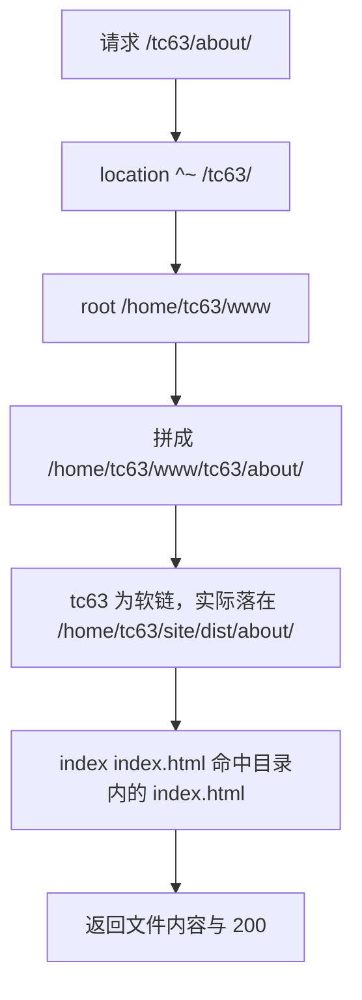
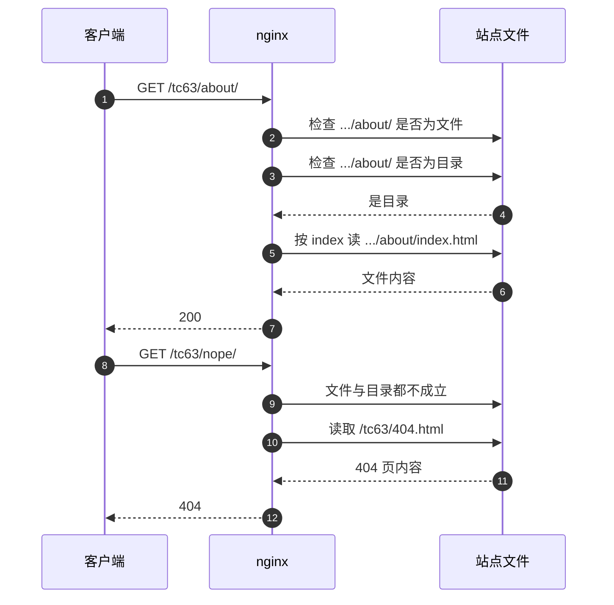

# 静态请求的处理顺序

静态托管做的事情是把 URL 映射到磁盘上的文件并读出来。个人主页没有应用进程，`/tc63/` 下的每个请求都由 nginx 打开一个文件返回，因此这条链路上的每一步都能在配置里找到对应的指令。

nginx 处理一个请求的顺序是：先选 location，再把 URI 拼成磁盘路径，然后判断目标是文件还是目录，最后决定返回内容、404 页还是重定向。对象是服务器上 `/etc/nginx/sites-available/knowledgediver` 里为 `/tc63/` 插入的三条 location（`personal-homepage-research/15-deploy-tc63.md:63-77`）。location 的匹配优先级与修饰符规则在 `01-反向代理/01-反向代理与location匹配` 里讲，这里不重复。

| 请求 | 命中 location | 磁盘目标 | 响应 |
| --- | --- | --- | --- |
| `/tc63` | `location = /tc63` | 不读文件 | 301 到 `/tc63/` |
| `/tc63/` | `location ^~ /tc63/` | `.../tc63/index.html` | 200 |
| `/tc63/about/` | `location ^~ /tc63/` | `.../tc63/about/index.html` | 200 |
| `/tc63/_astro/*.css` | `location ^~ /tc63/_astro/` | `.../tc63/_astro/*.css` | 200，带长缓存头 |
| `/tc63/nope/` | `location ^~ /tc63/` | 不存在 | 404，内容取自 `404.html` |

## URI 先被拼成磁盘路径

`root` 指令给出一个目录前缀，nginx 把完整的 URI 接在它后面。配置是 `root /home/tc63/www`，因此 `/tc63/about/index.html` 对应 `/home/tc63/www/tc63/about/index.html`。这一层拼接不做任何重写或截断，`/tc63` 这一级也原样保留在路径里。

文件放在 `/home/tc63/www/tc63/` 下，而 `tc63` 是一条指向 `/home/tc63/site/dist` 的软链接（`personal-homepage-research/15-deploy-tc63.md:129`、`README.md:163`），所以读到的实际是仓库里的构建产物。用 `root` 而不是 `alias` 的理由在 `## root 与 alias 在子路径下的差别` 里说明。



## location 命中之后的三个判断

进到 `location ^~ /tc63/` 之后，配置里还有三条语句参与决定返回什么：

```nginx
location ^~ /tc63/ {
    root /home/tc63/www;
    index index.html;
    try_files $uri $uri/ =404;
    error_page 404 /tc63/404.html;
}
```

（`personal-homepage-research/15-deploy-tc63.md:71-76`）

`try_files $uri $uri/ =404` 依次尝试三个候选：把 URI 当文件、把 URI 当目录、都不成立就返回 404。第二步命中目录时，nginx 会对该目录做一次内部重定向，接着由 `index index.html` 决定读哪个文件。`error_page 404` 把默认的 404 响应体换成站点自己的页面。这条指令不带 `=200` 一类的状态改写，响应码仍是 404，只有响应体被替换，因此状态码与自定义页两件事同时成立。



## 目录形式与尾斜杠

Astro 默认按目录形式输出页面：`/about/` 对应 `dist/about/index.html`，`/projects/<slug>/` 对应 `dist/projects/<slug>/index.html`。当前构建产出一共 27 个 HTML 文件，分布在 `dist/about/`、`dist/projects/*/` 与 `dist/docs/` 下面。nginx 侧不需要为每种页面写规则，目录加 `index` 就能覆盖。

尾斜杠由两处规则处理。入口 `/tc63` 不带斜杠时命中的是精确匹配 `location = /tc63`，它返回一条 301 补上斜杠（`personal-homepage-research/15-deploy-tc63.md:66`）。子路径 `/tc63/about` 没有专门规则，`try_files` 的第二步把目录作为候选，内部重定向后由 `index` 接住，行为与带斜杠的写法一致。构建产物的 `canonical` 统一写成带斜杠的形式，例如 `https://knowledgediver.cloud/tc63/about/`（`dist/about/index.html` 内的 `link rel="canonical"`）。

## root 与 alias 在子路径下的差别

`root` 是拼接，`alias` 是替换。同样是把 `/tc63/` 指向站点目录，两种写法的结果如下。

| 写法 | `/tc63/about/` 映射到 | 需要对齐的细节 |
| --- | --- | --- |
| `root /home/tc63/www` | `/home/tc63/www/tc63/about/` | 目录名要恰好与 URI 前缀同名 |
| `alias /home/tc63/www/tc63/;` | `/home/tc63/www/tc63/about/` | `location` 与 `alias` 的结尾斜杠必须同时有或同时无 |

两种写法在路径正确时指向同一个文件，差别在出错时的表现。`alias` 与 `try_files` 组合时，如果 `location` 带尾斜杠而 `alias` 不带，拼接出的路径会缺少一级；`root` 没有这个问题，因为前缀与 URI 各管一段，拼接关系固定。服务器上的配置用了 `root`（`personal-homepage-research/15-deploy-tc63.md:79-80`），文件名与目录名本来就一致，拼接天然对上。

## 站点根是一条软链接

`/home/tc63/www/tc63` 是软链接，nginx 默认会跟随它（`disable_symlinks` 未开启）。这带来一个好处和一个代价：`git pull` 更新 `~/site/dist` 后站点立即生效，配置不用改；同时打开文件要经过符号链接解析，路径上多出 `/home/tc63/site` 与 `dist` 两级，这两级目录也需要对 worker 进程可进入。权限的具体要求见 `04-HTTPS与权限/03-文件权限与nginx读取路径`。

## 默认关闭的目录列举

请求一个没有 `index.html` 的目录时，nginx 不会列出目录内容：`autoindex` 默认为 `off`，此时返回 403 或 404。本工程的站点树里没有点文件（构建产物 `dist/` 下检查结果为空），因此也不存在通过 `/tc63/.env` 一类路径读到内部文件的情形。若以后产物里出现点文件，需要在 location 里另加拒绝规则，现有配置没有这一条。

## 请求路径与文件系统的对齐检查

目录形式产物意味着每个页面只对应一个 `index.html`，没有同名的 `.html` 文件。请求 `/tc63/about` 与 `/tc63/about/` 都能返回页面，请求 `/tc63/about.html` 则会落到 `try_files` 的第三段。这类路径上的差别在排查时经常被忽略。

| 请求 | 磁盘候选 | 结果 |
| --- | --- | --- |
| `/tc63/about/` | `dist/about/index.html` | 200 |
| `/tc63/about` | 目录候选命中，内部重定向后取 `index.html` | 200，地址栏不变 |
| `/tc63/about.html` | `dist/about.html` 不存在 | 404，返回自定义页 |
| `/tc63/about/index.html` | 直接命中文件 | 200，canonical 仍指向 `/tc63/about/` |

最后一行是常见现象：直接写完整文件名也能拿到内容，但页面里的 `canonical` 与站内链接指向的是目录形式，因此不应把带 `index.html` 的 URL 当成正式入口。

## 易错点

| 现象 | 原因 | 判据 |
| --- | --- | --- |
| `/tc63` 返回 301 而不是页面 | 入口精确匹配只做补斜杠 | 请求 `/tc63/` 应返回 200 |
| 子页面返回 404，文件确实存在 | 目录下缺少 `index.html`，或路径拼错一级 | 对照 `dist/` 下的实际目录结构 |
| 改了 `alias` 后 `try_files` 找不到文件 | `location` 与 `alias` 的尾斜杠不配对 | 用 `nginx -T` 看展开后的配置 |
| 软链目标更新后仍返回旧内容 | 请求命中的是缓存或另一份产物 | 比较响应体与 `~/site/dist` 下文件 |
| 请求目录得到 403 | `autoindex off` 且无 `index.html` | 状态码 403 与 error.log 的记录 |
| 站点根写成 `root /home/tc63/www/tc63` | 把 `root` 当成了 `alias` | 正确写法只到 `www` 一级 |

## 小结

### 核心概念

- `root` 把 URI 接在前缀后面，子路径部署时目录结构要与 URI 对应。
- `try_files` 的两级候选加 `index` 覆盖了文件与目录两种请求。
- 目录形式输出下，每个页面是一个目录加一个 `index.html`。
- 站点根是软链接，解析路径上多两级目录，权限要一起放开。

### 设计权衡

| 决策 | 选择 | 收益 | 代价 |
| --- | --- | --- | --- |
| 路径指令 | `root` | 拼接关系固定，不易出错 | 目录名必须与 URI 前缀同名 |
| 入口斜杠 | 精确匹配加 301 | 两种入口最终落到同一路径 | 多一次往返 |
| 目录页 | `index index.html` | 不用为每页写规则 | 目录必须按约定命名 |
| 站点接入 | 软链接到产物目录 | 更新即生效 | 路径解析多两级，权限要求变长 |

## 练习

### 基础题

1. 写出请求 `/tc63/docs/index.html` 在 `root /home/tc63/www` 下对应的磁盘路径。
2. `try_files $uri $uri/ =404` 的三段各自在什么条件下命中？
3. 说明 `/tc63` 与 `/tc63/` 的响应差别，以及产生差别的那条配置。

### 挑战题

4. 把 `root` 换成 `alias`，写出完整指令并说明尾斜杠写错时 `/tc63/about/` 会映射到哪个路径。

5. 站点从软链接接入改成直接放在 `www/tc63/`，列出需要改动的配置与权限项，并说明哪一项最容易漏。

6. 请求一个只含图片、没有 `index.html` 的目录，预测状态码并说明依据。

### 附：本页引用的路径

| 路径 | 用途 |
| --- | --- |
| `personal-homepage-research/15-deploy-tc63.md` | 三条 location 的内容、root 与 alias 取舍、软链接（`:63-80`、`:129`、`:155-161`） |
| `README.md` | nginx root 与软链接的分工（`:162-164`） |
| `astro.config.mjs` | `site` 与 `base`（`:16-17`） |
| `dist/index.html`、`dist/about/index.html`、`dist/404.html` | 构建产物的目录形式与 canonical |
| `docs/32-nginx 配置/01-反向代理/01-反向代理与location匹配.md` | location 优先级与 try_files 的一般规则（`:37-98`） |
| `/etc/nginx/sites-available/knowledgediver` | 线上生效配置（服务器文件，未在本机核对） |