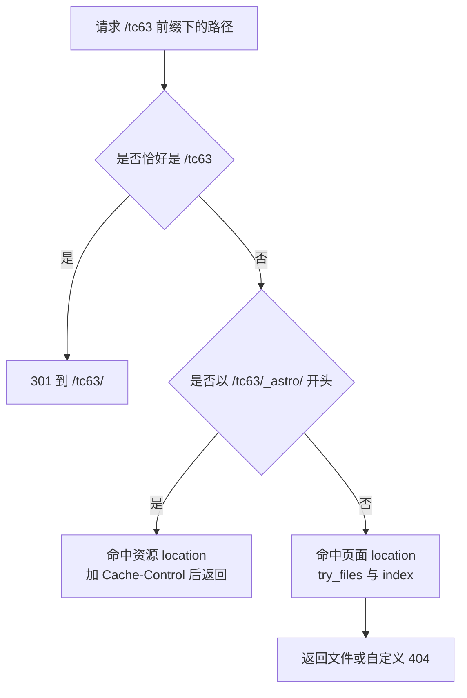
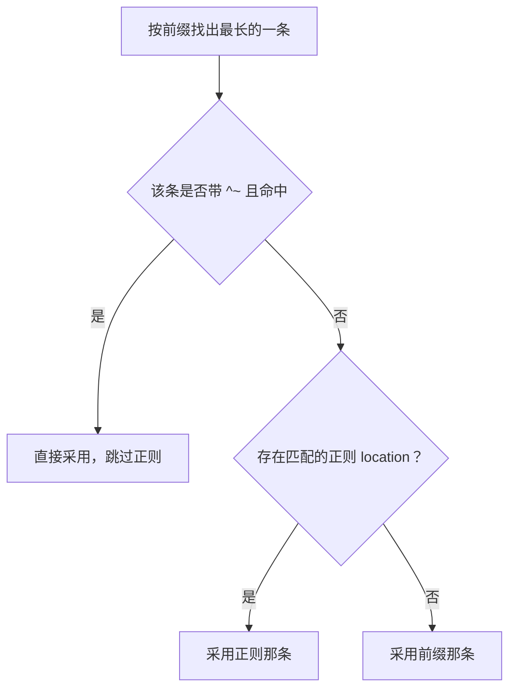

# 子路径下的三条 location

个人主页的 nginx 配置只有三条 location，全部挂在 `/tc63` 前缀上。它们分别负责入口补斜杠、静态资源长缓存与页面内容，覆盖了站点运行需要的全部请求类型。

三段配置各有其选择理由，重点在两处容易被当成「写法习惯」的地方：`^~` 修饰符的作用范围，以及 `_astro` 为什么要单独占一条前缀。配置原文来自服务器启用脚本插入的内容（`personal-homepage-research/15-deploy-tc63.md:63-77`）。

## 三条 location 各自的职责

```nginx
location = /tc63 { return 301 /tc63/; }
location ^~ /tc63/_astro/ {
    root /home/tc63/www;
    add_header Cache-Control "public, max-age=2592000, immutable";
}
location ^~ /tc63/ {
    root /home/tc63/www;
    index index.html;
    try_files $uri $uri/ =404;
    error_page 404 /tc63/404.html;
}
```

| location | 匹配范围 | 主要动作 | 典型请求 |
| --- | --- | --- | --- |
| `= /tc63` | 只有不带斜杠的入口 | 301 到 `/tc63/` | `GET /tc63` |
| `^~ /tc63/_astro/` | 构建产物里的资源目录 | 加长缓存头后返回文件 | `GET /tc63/_astro/BaseLayout.Bw8pNA6E.css` |
| `^~ /tc63/` | 其余全部 | 目录页、404 页 | `GET /tc63/about/` |



## 精确匹配只处理入口

`location = /tc63` 用等号限定为完整匹配，只有 URI 恰好是 `/tc63` 时才命中。它的作用是把不带尾斜杠的入口收敛到带斜杠的形式，返回 301 而不是直接返回页面内容。带查询串的 `/tc63?x=1` 同样命中这一条，因为匹配不看查询串。

用精确匹配而不是普通前缀，是为了不影响 `/tc63/` 下的其他路径。普通前缀 `location /tc63` 会让所有 `/tc63...` 开头的请求都进入这条规则，包括资源与子页面，那样就得在块里再写一层判断。等号写法只覆盖一个 URI，职责最小。

## ^~ 让静态前缀跳过正则

两条内容 location 都带 `^~` 修饰符。前缀匹配命中 `^~` 之后，nginx 不再继续检查正则 location，直接采用这一条。作用范围仅限「是否继续匹配正则」，不影响普通前缀之间的最长优先规则。



加这个修饰符的用意是防御：站点配置之外的配置里可能存在正则 location（例如拦截隐藏文件的规则），带 `^~` 的前缀能保证站点自己的规则优先。本仓库里的样例配置没有正则 location（KD 仓库 `deploy/nginx.conf:4-26`），服务器上完整生效的配置未在本机核对。

两条前缀中，`/tc63/_astro/` 比 `/tc63/` 长，按最长优先命中资源那条，与书写顺序无关。把资源规则写在前面只是让阅读顺序与匹配结果一致。

## 静态资源的独立前缀与缓存头

`_astro/` 下是构建器生成的资源，文件名带内容哈希，例如 `BaseLayout.Bw8pNA6E.css`、`FluidBackground.astro_astro_type_script_index_0_lang.D0mjmIVk.js`。内容改变时文件名随之改变，因此可以放心让浏览器长期缓存。

```nginx
add_header Cache-Control "public, max-age=2592000, immutable";
```

`max-age=2592000` 是 30 天，`immutable` 表示在有效期内不必再发校验请求。这条设置只作用于 `/tc63/_astro/` 前缀，不会影响 HTML 与 `search-index.json`。页面 HTML 的引用总是指向带哈希的文件名，所以资源更新时页面里换的是 URL，不会出现旧缓存覆盖新内容的情况。

资源单独占一条前缀还有一个副作用：这条 location 里没有 `try_files`，请求一个不存在的资源会直接由 nginx 返回 404，不会被页面的回退规则接住。对静态资源来说这是期望行为。

## 自定义 404 的接入方式

页面 location 的最后一行是 `error_page 404 /tc63/404.html;`。`try_files` 的第三段判定失败后，nginx 把响应体替换成这条指令指向的文件，同时保留 404 状态码。

被指向的 `/tc63/404.html` 又会重新进入同一条页面 location：它不以 `/tc63/_astro/` 开头，因此命中 `^~ /tc63/`，`try_files` 找到 `dist/404.html` 后正常返回内容。这个过程是内部重定向，客户端只看到一次响应。构建产物里确实存在 `dist/404.html`，大小约 3.9 KB。

## 与域名根配置共存的插入方式

启用脚本的做法是在每个已有 server 块的 `location /api/` 之前插入这三条，没有新建 server 块（`personal-homepage-research/15-deploy-tc63.md:63`）。域名根的 `location /` 与 `/api/` 保持原样，因此 KnowledgeDiver 不受影响。

| 已有配置 | 插入后的关系 |
| --- | --- |
| `location /`（域名根前端） | 保留，只处理不以 `/tc63` 开头的请求 |
| `location /api/`（后端代理） | 保留，插入位置在其之前，但前缀不同，互不遮挡 |
| 80 与 443 两个 server 块 | 各自插入一份，HTTPS 与 HTTP 行为一致 |

插入位置在 `/api/` 之前，是因为脚本按这个锚点做插入（`personal-homepage-research/15-deploy-tc63.md:63`）。两条前缀没有重叠，先后顺序不影响匹配结果。

## 验证三条规则是否都在生效

配置写完之后的核对可以只靠状态码与响应头，不需要通读配置。

| 请求 | 期望 | 检查点 |
| --- | --- | --- |
| 请求不带斜杠的入口 `/tc63` | `301`，`Location` 指向 `/tc63/` | 精确匹配生效 |
| 请求 `/tc63/` | `200` | 页面 location 生效 |
| 请求 `/tc63/_astro/<带哈希文件名>` | `200`，`Cache-Control` 含 `max-age=2592000` | 资源 location 生效 |
| 请求 `/tc63/nope/` | `404` | `error_page` 生效且状态码未被改写 |

服务器上没有 `curl`，本机侧的核对照旧，服务器侧可以用 `nc` 发一次 `HTTP/1.0` 请求看响应行（`04-HTTPS与权限/04-验证与故障分层` 有现成写法）。四条请求的期望值互相独立，任何一条不符都能定位到具体是哪段规则没有生效。

## 易错点

| 现象 | 原因 | 判据 |
| --- | --- | --- |
| 资源命中了页面规则 | 前缀写成 `/tc63/` 一条 | 用 `nginx -T` 检查是否真有 `_astro` 那条 |
| `^~` 写成了普通前缀 | 正则 location 抢先匹配 | 对照 `nginx -T` 展开后的顺序与修饰符 |
| 资源更新后浏览器仍用旧文件 | 缓存头加在了错误前缀上，或文件名没有哈希 | 核对响应头与 `dist/_astro/` 下的文件名 |
| 404 状态码变成 200 | `error_page` 被写了 `=200` | 直接请求一个不存在的路径看状态码 |
| HTTP 下行为与 HTTPS 不同 | 只在一个 server 块里插入了 location | 两个 server 块都要有这三条 |
| 误以为书写顺序决定优先级 | 前缀匹配按最长优先 | 见 `01-反向代理/01-反向代理与location匹配` 的选择顺序一节 |

## 小结

### 核心概念

- 三条 location 覆盖入口、资源与页面三类请求。
- 精确匹配把入口收敛到带斜杠形式，不参与前缀竞争。
- `^~` 只影响是否继续匹配正则，前缀之间仍按最长优先。
- 资源前缀带内容哈希，长缓存与 URL 变化配合成立。

### 设计权衡

| 决策 | 选择 | 收益 | 代价 |
| --- | --- | --- | --- |
| 入口处理 | 精确匹配加 301 | 不影响子路径匹配 | 客户端多一次请求 |
| 修饰符 | 前缀加 `^~` | 不受正则 location 干扰 | 需要理解它对正则的跳过语义 |
| 资源缓存 | 30 天 immutable | 回访不再请求资源 | 文件名不哈希时无法安全使用 |
| 404 处理 | 自定义页保留 404 状态 | 用户看到站点页面，状态码仍正确 | 需要在产物里保留 `404.html` |

## 练习

### 基础题

1. 请求 `/tc63/_astro/foo.css` 会命中哪一条 location？说明理由。
2. `location = /tc63` 与 `location /tc63` 在匹配范围上有什么差别？
3. `add_header Cache-Control` 写在资源 location 里，是否会影响 `/tc63/index.html`？

### 挑战题

4. 如果把 `^~` 全部去掉，举出一个会改变行为的场景，并说明如何用 `nginx -T` 验证。

5. 设计一条规则让 HTML 也不被浏览器强缓存，写出指令位置与它和资源规则的分工。

6. 说明自定义 404 页为什么能返回内容而不是再次 404，写出这个过程中的两次路径判断。

### 附：本页引用的路径

| 路径 | 用途 |
| --- | --- |
| `personal-homepage-research/15-deploy-tc63.md` | 三条 location 原文与插入方式（`:63-77`、`:155-161`） |
| `dist/_astro/`、`dist/404.html` | 带哈希的资源文件名与 404 页（构建产物） |
| `docs/32-nginx 配置/01-反向代理/01-反向代理与location匹配.md` | location 选择顺序与修饰符表（`:37-56`） |
| KD 仓库 `deploy/nginx.conf` | 域名根的静态规则对照（`:9-12`） |
| `/etc/nginx/sites-available/knowledgediver` | 线上生效配置（服务器文件，未在本机核对） |