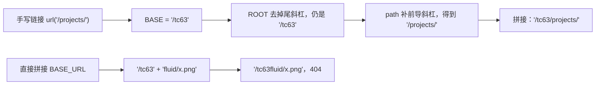
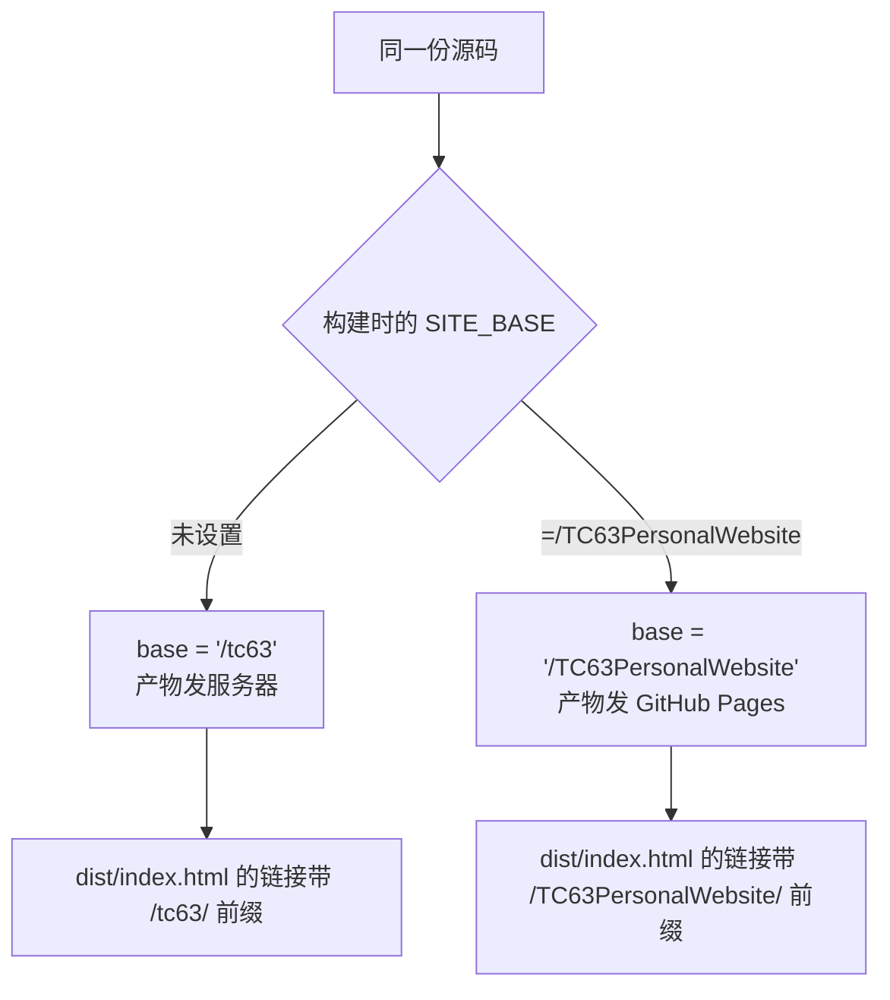

# base 前缀与资源路径

子路径部署里，nginx 只负责把 `/tc63/` 开头的请求映射到文件，决定页面里每个链接写成什么样的，是构建时的 `base` 配置。同一个 `/about/` 页面，根部署下链接是 `/about/`，子路径部署下必须是 `/tc63/about/`，写错就会打到域名根上的另一个应用。

`base` 覆盖哪些引用、手写链接为什么要经过统一出口、构建产物在文件名上留下什么特征，以及仓库里为什么同时存在两套前缀——这四点合起来决定资源路径对不对得上。对象是 `astro.config.mjs`、`src/lib/url.ts` 与 `dist/` 下的产物。

## base 决定三类引用

配置里 `site` 与 `base` 各管一半（`astro.config.mjs:16-17`）：`site` 给出域名，`base` 给出路径前缀。前者影响 `canonical`、`og:url` 一类绝对地址，后者影响所有静态资源的相对前缀。

| 引用类型 | 由谁加前缀 | 产物中的例子 |
| --- | --- | --- |
| 构建器生成的资源 | `base` | `href="/tc63/_astro/BaseLayout.Bw8pNA6E.css"` |
| 页面元信息 | `site` 加 `base` | `link rel="canonical"` 为 `https://knowledgediver.cloud/tc63/` |
| 手写的站内链接 | 需要显式调用 `url()` | `href="/tc63/projects/"` |

前两类由构建器自动处理，第三类不会。仓库在文档里明确记了这一点：`base` 会自动处理 JS/CSS 资源前缀、`canonical`、`og:url`、`og:image` 与 `_astro/` 引用，但不会改手写的链接（`personal-homepage-research/15-deploy-tc63.md:32`）。因此站内链接统一走 `src/lib/url.ts` 的 `url()`。实测的 `dist/index.html` 里没有出现任何不带 `/tc63` 前缀的根绝对引用。

## url() 为什么要剥掉尾斜杠

`url()` 的实现只有几行（`src/lib/url.ts:11-16`）：

```ts
export const BASE = import.meta.env.BASE_URL;
NaN

export function url(path = '/'): string {
  const p = path.startsWith('/') ? path : '/' + path;
  return ROOT + p;
}
```

Astro 把 `BASE_URL` 设成配置里的原样值 `'/tc63'`，末尾没有斜杠，与 Vite 常见的 `'/tc63/'` 不同。如果直接做字符串拼接，`BASE_URL + 'fluid/xxx.png'` 会得到 `/tc63fluid/xxx.png`，资源与搜索索引同时 404（`personal-homepage-research/15-deploy-tc63.md:50-54`）。`url()` 先把 `BASE` 归一化成不带尾斜杠的 `ROOT`，再补一个开头的斜杠，因此传入 `'/projects/'` 或 `'projects/'` 都得到同一个结果。



`url()` 的注释把使用范围写得很清楚：html 里所有以 `/` 开头的绝对链接都必须带上 base（`src/lib/url.ts:1-9`）。相对链接不受影响，但站内统一用绝对链接加 `url()` 更可控。

## 构建产物的目录形式与资源命名

构建产物的形态决定了 nginx 侧能用最简单的规则覆盖全部请求。当前产物有两类命名约定：

| 产物 | 命名特征 | 对应 nginx 行为 |
| --- | --- | --- |
| 页面 | 目录加 `index.html`，共 27 个 HTML 文件 | 由 `index index.html` 接住 |
| 资源 | 文件名带内容哈希，如 `BaseLayout.Bw8pNA6E.css` | 命中 `_astro/` 前缀，长缓存 |
| 数据 | 固定名 `docs/search-index.json`，体积约 480 KB | 走页面规则，跟随 HTML 的缓存策略 |

页面用目录形式，所以 URL 以斜杠结尾，`canonical` 也是这个形式（`dist/about/index.html` 里的 `link rel="canonical"` 指向 `/tc63/about/`）。资源带哈希，所以可以设置 30 天不可变缓存；数据文件名字固定，更新后 URL 不变，因此不能套用同一套缓存策略。

## 同一份源码的两套前缀

同一个仓库同时发布到两个位置：腾讯云服务器上的 `/tc63` 与 GitHub 项目站点 `/TC63PersonalWebsite`。区别只在构建时传入的环境变量（`astro.config.mjs:17`、`.github/workflows/deploy.yml:29-31`）。



两套前缀不能混用：拿 Pages 产物去核对服务器路径会全部对不上，反之亦然。服务器侧的产物由本地 `./deploy.sh` 构建（默认不带 `SITE_BASE`），Pages 侧的产物由 workflow 构建，两边互不覆盖（`deploy.sh:9-13`、`.github/workflows/deploy.yml:27-31`）。

## 推送之前的本地先验

前缀问题在本地就能发现，`deploy.sh` 里有两条检查：构建后确认 `dist/index.html` 存在，再用 `grep` 验证链接带有 `/tc63/` 前缀，不满足就退出（`deploy.sh:25-29`）。第二条检查针对的正是「用 Pages 参数构建过又直接部署」的情形。

更完整的核对方式是逐条请求构建产物里的路径：`dist/index.html` 中的样式、脚本、站内链接与图片，以及搜索索引。实测记录里这些路径在服务器上全部返回 200，`/` 返回 404（`personal-homepage-research/15-deploy-tc63.md:156-157`）。

## 子路径改动的影响面

改动 `base` 会影响三类东西，改动前先按这张表过一遍。

| 改动点 | 需要同步 | 不需要动 |
| --- | --- | --- |
| 更换部署路径前缀 | `BASE_URL` 派生出的所有链接、`canonical` | 页面内容与样式 |
| 手写链接改成相对路径 | 改回 `url()` 调用 | 构建器生成的资源 |
| 迁到域名根部署 | `base` 设为 `'/'` | nginx 的 `root` 与 location |

迁移时要一起检查 `isActive()` 一类用 `href === '/'` 判断的代码：子路径下首页 URL 变成 `/tc63/`，判据要跟着换成 `url('/')`，否则导航会在每个页面都点亮首页项（`personal-homepage-research/15-deploy-tc63.md:47-48`）。

## 易错点

| 现象 | 原因 | 判据 |
| --- | --- | --- |
| 资源与搜索索引同时 404 | 直接把 `BASE_URL` 当带尾斜杠的字符串拼接 | 产物里搜 `/tc63fluid` 一类拼接痕迹 |
| 页面能打开但样式丢失 | 样式链接没走 `url()` | 检查 `dist/index.html` 里的 `href` 前缀 |
| 导航高亮错位 | 首页判据用 `href === '/'` | 看子路径下首页 URL 是 `/tc63/` |
| 拿 Pages 产物核对服务器 | 两套前缀不同 | 产物里搜 `/TC63PersonalWebsite` |
| `canonical` 指向域名根 | `site` 或 `base` 配置不对 | 看 `dist/index.html` 的 `link rel="canonical"` |
| 部署脚本前缀检查失败 | 用 `SITE_BASE` 构建过 | 重新执行不带该变量的构建（`deploy.sh:26-29`） |

## 小结

### 核心概念

- `site` 管绝对地址，`base` 管资源前缀，手写链接要显式加前缀。
- `url()` 先把 `BASE_URL` 归一化再拼接，避免缺斜杠的拼接错误。
- 页面是目录加 `index.html`，资源文件名带内容哈希。
- 同一份源码靠构建变量产出两套前缀的产物。

### 设计权衡

| 决策 | 选择 | 收益 | 代价 |
| --- | --- | --- | --- |
| 前缀来源 | 构建时 `base` | 一套源码适配两个部署位置 | 产物不通用，构建参数不能混 |
| 站内链接 | 统一走 `url()` | 改动前缀时只改一处 | 新增链接要记得调用 |
| 资源命名 | 内容哈希 | 长缓存安全 | 文件名难读，需要按页面引用查找 |
| 本地先验 | 构建后检查前缀 | 上线前拦住一类错误 | 多一步检查逻辑 |

## 练习

### 基础题

1. `base` 会自动处理哪些引用？哪一类引用需要手写 `url()`？
2. `import.meta.env.BASE_URL` 的值带不带尾斜杠？直接拼接会得到什么？
3. 打开 `dist/index.html`，找出至少三条带 `/tc63` 前缀的引用。

### 挑战题

4. 把部署位置改成域名根，列出需要修改的配置项与需要复查的代码点各两处。

5. 设计一条命令，在本地判断一份 `dist/` 是为服务器构建还是为 GitHub Pages 构建。

6. 说明为什么固定名文件（如 `search-index.json`）不能套用资源的长缓存策略。

### 附：本页引用的路径

| 路径 | 用途 |
| --- | --- |
| `astro.config.mjs` | `site` 与 `base` 的定义（`:8-17`） |
| `src/lib/url.ts` | `BASE` 归一化与 `url()` 实现（`:1-17`） |
| `personal-homepage-research/15-deploy-tc63.md` | 前缀改动的影响面与尾斜杠问题（`:32-54`） |
| `deploy.sh` | 构建后的前缀检查（`:25-29`） |
| `.github/workflows/deploy.yml` | Pages 构建的 `SITE_BASE`（`:29-31`） |
| `README.md` | 改路径前缀的说明（`:171-183`） |
| `dist/index.html`、`dist/about/index.html` | 产物中的 canonical 与资源前缀 |