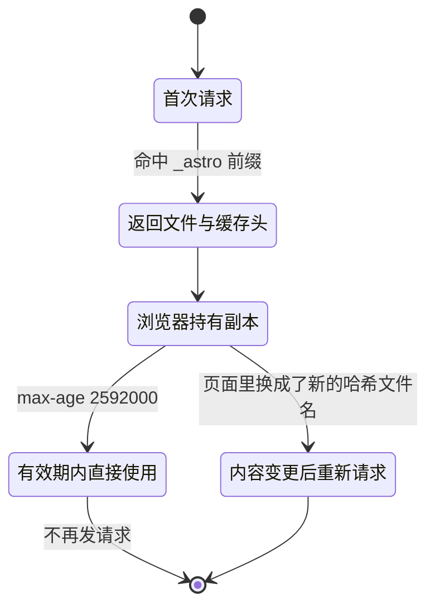
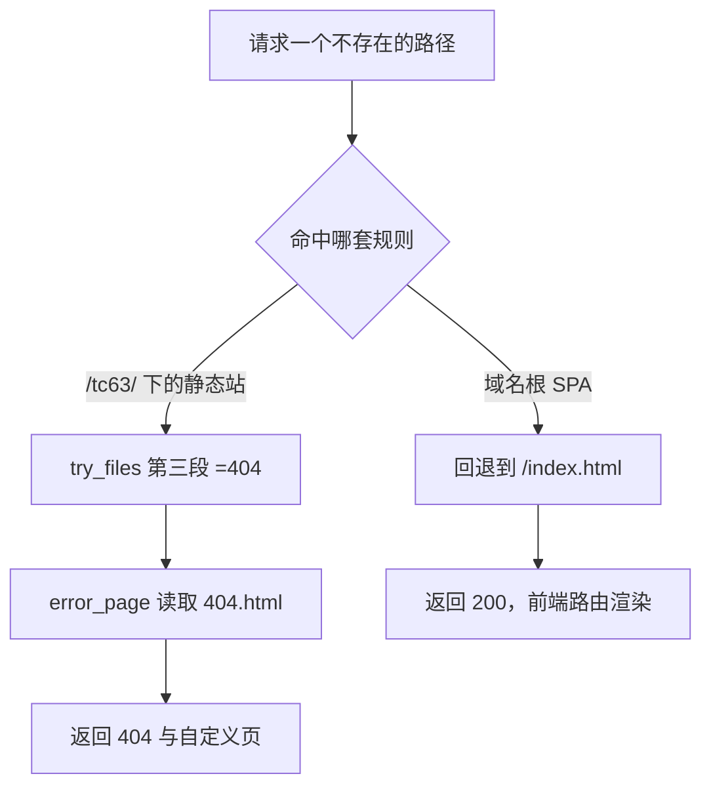

# 缓存与 404 的边界

静态托管把缓存策略与缺失处理都推给了文件和配置。资源带哈希就有条件长期缓存，页面名固定就不能照搬同一策略；路径不存在时返回什么，取决于 `try_files` 的最后一段与 `error_page` 的配合。

缓存与 404 放在一起看，是因为它们在部署时同时变化：一次 `git pull` 会整体替换产物目录，缓存中的旧页面与新文件集之间可能出现对不上的请求。对象是 `/tc63/` 的两条内容 location 与构建产物的命名方式。

## 内容哈希让长缓存成立

`/tc63/_astro/` 下的文件名形如 `BaseLayout.Bw8pNA6E.css`，中间那段是内容哈希。文件内容一变，哈希变，文件名跟着变，所以同一个 URL 永远指向同一份内容。长缓存的前提正是这一点。



配置里对应的只有 `add_header` 一行（见 `personal-homepage-research/15-deploy-tc63.md`）：

```nginx
add_header Cache-Control "public, max-age=2592000, immutable";
```

`max-age=2592000` 换算成 30 天，`immutable` 告诉浏览器在有效期内不必发校验请求。这条设置写在资源 location 内部，作用范围仅限该前缀。

## 哪些路径没有显式缓存头

页面与搜索索引都没有收到 `Cache-Control`。没有显式头时，浏览器可以按启发式规则自行决定缓存时长，不同浏览器策略不一致。

| 路径 | 显式缓存头 | 名称是否随内容变化 | 风险 |
| --- | --- | --- | --- |
| `/tc63/_astro/*` | 有，30 天 immutable | 是，带内容哈希 | 低 |
| `/tc63/` 与各页面 HTML | 无 | 否 | 浏览器可能用旧页面引用已删除的资源 |
| `/tc63/docs/search-index.json` | 无 | 否 | 搜索索引可能滞后一个版本 |
| `/tc63/favicon.svg`、`/tc63/og.png` | 无 | 否 | 换图标后短期可能仍是旧图 |

如果要让页面固定走校验，可以在页面 location 里加一条作用范围可控的缓存头，例如对 HTML 设置 `no-cache`——它的语义是「每次使用前必须向服务器校验一次」，响应本身仍可被缓存。当前配置没有这一条，属于可选改进。

## 静态站与 SPA 的 404 差别

同一条域名下，KnowledgeDiver 前端是单页应用，个人主页是多页静态站，两者的缺失路径处理不能共用一套规则。

| 项 | 个人主页 `/tc63/` | 域名根（SPA） |
| --- | --- | --- |
| 缺失路径 | `try_files $uri $uri/ =404` 后接自定义 404 页 | `try_files $uri $uri/ /index.html` |
| 状态码 | 404 | 200 |
| 路由归属 | 每个页面一个目录 | 由前端路由在浏览器里决定 |

两处 `try_files` 的差别就在最后一段落点：

```nginx
# 个人主页 /tc63/ 下的多页静态站
try_files $uri $uri/ =404;
```

```nginx
# KD 仓库 deploy/nginx.conf 的域名根 SPA
try_files $uri $uri/ /index.html;
```

SPA 必须把未知路径交给 `index.html`，由前端路由接管，代价是真实缺失的路径也返回 200。多页静态站没有前端路由，未知路径就是缺失，保留 404 状态码更准确，搜索与监控看到的结果也对得上。域名根的样例配置见 KD 仓库 `deploy/nginx.conf`，生成逻辑见 `deploy/deploy.sh`。



## 自定义 404 页的触发链

`error_page 404 /tc63/404.html;` 的执行分两步：先由 `try_files` 判定原请求不存在，再把内部请求改写成 `/tc63/404.html`。改写后的请求重新走一遍 location 选择，命中 `^~ /tc63/`，由 `try_files` 找到 `dist/404.html` 后返回。

响应状态码由 `error_page` 保持为 404，只有响应体被替换。构建产物里的 `404.html` 约 3.9 KB，页面内的 `canonical` 是 `https://knowledgediver.cloud/tc63/404/`，这一点与入口页不同，核对时不要拿它判断站点根地址。

## 目录列举与点文件

两个容易越界的点当前都是关闭状态：`autoindex` 默认 `off`，请求没有 `index.html` 的目录不会列出内容；构建产物 `dist/` 下没有点文件，检查结果为空。

这两项都由默认行为保证，配置里没有显式关闭它们。若以后产物里出现 `.well-known` 一类需要公开的目录，或出现不该公开的点文件，都要在 location 里显式写规则，现有配置不覆盖这些情形。

## 产物整体替换带来的旧资源失效

服务器侧每次更新执行 `git pull`，产物目录被替换成新版本。带哈希的旧资源不再存在，而浏览器里可能有 30 天内缓存过的旧 HTML，它引用的正是那些被删掉的文件名。

| 客户端状态 | 请求 | 结果 |
| --- | --- | --- |
| 缓存的旧 HTML | 旧哈希资源，文件已被替换 | 404 |
| 缓存的旧 HTML | 站内链接跳转 | 正常，页面重新获取 |
| 刷新后的页面 | 新哈希资源 | 200 |

这个组合属于推论（按产物整体替换与长缓存两个已知事实推导，未在线上实测）。缓解方式有两条：给 HTML 加 `no-cache` 让页面每次都校验，或保留上一版资源一段时间。当前配置两条都没有采用。

## 部署后的核对项

四类请求覆盖了上面讨论的全部行为，部署后逐条核对即可确认策略与预期一致。

| 请求 | 期望 | 观察点 |
| --- | --- | --- |
| `/tc63/_astro/<带哈希文件名>` | 200 | 响应头里有 `Cache-Control: public, max-age=2592000, immutable` |
| `/tc63/` | 200 | 响应头里没有 `Cache-Control`，说明页面走浏览器默认策略 |
| `/tc63/docs/search-index.json` | 200 | 同样没有显式缓存头，与上面的页面一致 |
| `/tc63/nope/` | 404 | 响应体是站点自己的 404 页，状态码未被改写 |

核对 `Cache-Control` 用响应头即可，判断 404 页是否生效则要看响应体内容与状态码两者，只看页面样式无法区分自定义页与默认错误页。

## 易错点

| 现象 | 原因 | 判据 |
| --- | --- | --- |
| 换图标后浏览器仍是旧图 | 固定名文件没有缓存头 | 强制刷新或看响应头 |
| 搜索索引落后一个版本 | 数据文件被浏览器缓存 | 请求 `search-index.json` 看响应头 |
| 把静态站的 404 改成回退 `index.html` | 套用了 SPA 的规则 | 未知路径会返回 200 而不是 404 |
| 404 页状态码被改成 200 | `error_page` 写了状态改写 | 请求不存在路径看状态码 |
| 旧页面引用已删除资源 | 产物整体替换加浏览器缓存 | 控制台出现 404 的资源请求 |
| 期望目录能列出文件 | `autoindex` 默认关闭 | 状态码为 403 或 404 |

## 小结

### 核心概念

- 内容哈希是长缓存成立的前提，缓存头只加在带哈希的路径上。
- 没有显式缓存头的页面与数据文件由浏览器自行判断。
- 多页静态站用 `=404` 加自定义页，SPA 用 `index.html` 回退。
- `error_page` 替换响应体但保留 404 状态码。

### 设计权衡

| 决策 | 选择 | 收益 | 代价 |
| --- | --- | --- | --- |
| 资源缓存 | 30 天 immutable | 回访节省带宽与时间 | 旧页面可能引用已删除资源 |
| 页面缓存 | 不设显式头 | 配置简单 | 不同浏览器行为不一致 |
| 缺失处理 | 返回真实 404 | 状态码准确 | 需要额外维护 404 页 |
| 目录列举 | 保持默认关闭 | 不暴露文件结构 | 需要目录索引时要另加规则 |

## 练习

### 基础题

1. 资源文件名里的哈希段起什么作用？为什么它让 30 天缓存变得安全？
2. 列出前面提到的、没有显式缓存头但名字固定的三个路径。
3. 请求 `/tc63/nope/` 经过哪两步返回自定义 404 页？状态码是多少？

### 挑战题

4. 给页面 HTML 加 `no-cache`，写出指令与放置位置，并说明它与 `_astro` 缓存头的作用范围如何区分。

5. 说明「缓存的旧 HTML 引用已删除资源」这个问题的成因，给出两种缓解方案并比较维护成本。

6. 如果要把 `/tc63/docs/` 做成前端路由的单页应用，说明 `try_files` 与 404 页需要怎么改。

### 附：本页引用的路径

| 路径 | 用途 |
| --- | --- |
| `personal-homepage-research/15-deploy-tc63.md` | 资源缓存头与 404 页配置 |
| `dist/_astro/` | 带内容哈希的资源文件名 |
| `dist/404.html` | 自定义 404 页与其 canonical |
| KD 仓库 `deploy/nginx.conf` | SPA 回退规则对照 |
| KD 仓库 `deploy/deploy.sh` | 域名根 server 块的生成逻辑 |
| `/etc/nginx/sites-available/knowledgediver` | 线上生效配置（服务器文件，未在本机核对） |