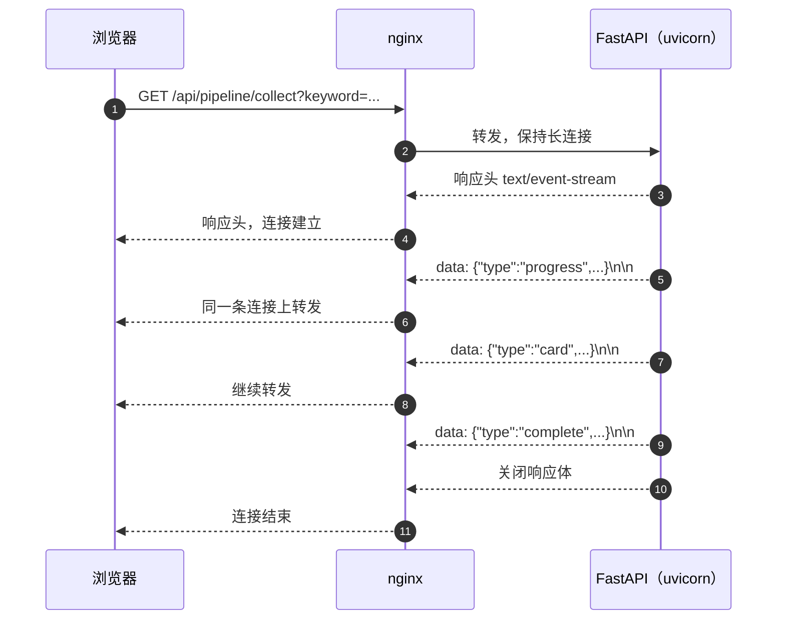
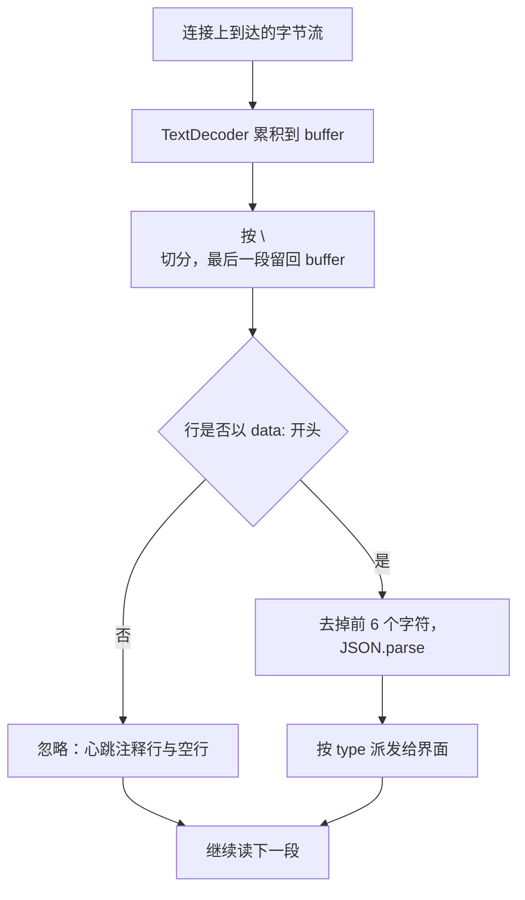

# SSE 的帧格式与项目约定

KnowledgeDiver 的两类长任务都用事件流把进度推给浏览器：流水线收集与扩展、Agent 聊天。它们走同一种协议，服务端在一个不结束的 HTTP 响应里持续写文本帧，浏览器边收边处理。

协议与工程约定要落到四件事上：帧怎么写、客户端怎么解析、心跳行起什么作用、响应头里哪两条与 nginx 有关。代理层的缓冲与超时在 `02-代理层的缓冲与超时`，断线重连的解耦设计在 `03-断线重连与后台循环解耦`。KD 仓库的路径以服务器上的 `~/KnowledgeDiver` 为根。

| 端点 | 方法 | 用途 | 出处 |
| --- | --- | --- | --- |
| `/api/agent/chat` | POST | 聊天，或对运行中的循环追加订阅 | `backend/agent/routes/agent.py:27-66` |
| `/api/agent/stream` | GET | 刷新页面后重连当前循环 | `backend/agent/routes/agent.py:69-89` |
| `/api/pipeline/collect` | GET | 采集流水线的进度流 | `backend/routes/pipeline.py:65-117` |
| `/api/pipeline/expand` | GET | 扩展流水线的进度流 | `backend/routes/pipeline.py:120-189` |
| `/api/tasks/{task_id}/stream` | GET | 任务重连，回放后继续推送 | `backend/routes/pipeline.py:423-445` |

## 一条连接上的事件序列

SSE 的载体是一个普通的 HTTP 响应，服务端把 `Content-Type` 设为 `text/event-stream` 之后不结束响应体，而是按事件持续写入。浏览器侧的读取循环一直读到连接关闭为止，中间不重新发请求。



每次事件之间只有时间间隔，没有新的请求。断线之后要恢复进度，靠的是重连端点，这部分在第三篇展开。

## SSE 的字段与注释行

事件流按行解析，字段名后面跟冒号与一个空格，空行表示一个事件结束。规范里定义了四个字段，本工程只用到其中一个。

| 行 | 含义 | 本工程用法 |
| --- | --- | --- |
| `data: <文本>` | 事件负载 | 每个事件都用 |
| `event: <类型>` | 命名事件类型 | 未使用，类型放在负载 JSON 里 |
| `id: <标识>` | 事件编号，用于 `Last-Event-ID` 续传 | 未使用 |
| `retry: <毫秒>` | 重连间隔建议 | 未使用 |
| `: <文本>` | 注释行，客户端忽略 | 用于心跳 |

`data` 可以出现多次、客户端拼接后再派发，本工程每个事件只写一行 `data`，省略了拼接逻辑。心跳行以冒号开头，浏览器收到后不产生事件，只把连接的活动时间刷新一次。

## 本工程的帧格式：data 加 JSON

服务端把事件类型和负载一起塞进一个 JSON 对象，再作为单行 `data` 写出（`backend/agent/manager.py:21-23`）：

```python
def _sse(event_type: str, data: dict) -> str:
    payload = {"type": event_type, "data": data}
    return f"data: {json.dumps(payload, ensure_ascii=False, default=str)}\n\n"
```

`type` 在负载里而不是 `event:` 字段里，客户端解析时取的是 `event.data` 再 `JSON.parse`（`frontend/src/api/stream.ts:12-25`）。事件类型由服务端定义，流水线侧出现的是 `progress`、`card`、`complete`、`error`（`backend/routes/pipeline.py:42-59`），Agent 侧另有一条 `complete` 收尾（`backend/agent/manager.py:66`）。



（解析过程见 `frontend/src/hooks/useSSE.ts:44-97`。）

## 为什么帧里不会出现换行

`json.dumps` 会把字符串里的换行转义成两个字符 `\n`，序列化结果因此始终是单行。这一点是客户端按行切分的前提：如果负载里带真实换行，一条 `data` 会被拆成多行，客户端的 `JSON.parse` 就会失败。

客户端的处理方式与此对应：每次从连接读到一段文本先追加到缓冲区，按 `\n` 切分后把最后一段留回缓冲区，等下一段到达再拼接（`frontend/src/hooks/useSSE.ts:84-85`）。这样即使一个事件被拆到两个 TCP 段里，也不会被切开解析。

## 响应头里的两条约定

Agent 路由的每个流式响应都带两个头（`backend/agent/routes/agent.py:44-48`）：

```python
return StreamingResponse(
    mgr.subscribe(key),
    media_type="text/event-stream",
    headers={
        "X-Accel-Buffering": "no-buffering",
        "Cache-Control": "no-cache",
    },
)
```

`media_type` 决定 `Content-Type`，客户端据此判断这是事件流（`frontend/src/api/agent.ts:57` 用这个头决定走流式分支）。`Cache-Control: no-cache` 避免中间层把响应缓存起来。`X-Accel-Buffering` 是给 nginx 看的逐响应开关，含义与生效范围在 `02-代理层的缓冲与超时` 里说明。

流水线侧的三个流式响应只设了 `media_type`，没有带这两个头（`backend/routes/pipeline.py:87-90`、`:114-117`、`:436-445`）。它们能流起来靠的是 nginx 配置里的 `proxy_buffering off`，与 Agent 路由的双保险不同。

## 心跳行与空闲连接

Agent 的订阅循环在队列上等待事件，超时时间设为 15 秒；超时且后台循环仍在运行时，写一行注释作为心跳（`backend/agent/manager.py:80-89`）：

```python
event = await asyncio.wait_for(q.get(), timeout=15.0)
yield event
if '"complete"' in event:
    return
...
except asyncio.TimeoutError:
    if not self.is_running(key):
        return
    yield ": heartbeat\n\n"
```

心跳有两个作用：让连接上一直有字节流动，避免中间层按空闲超时断开；同时给循环一个检查点，后台任务已经结束时可以主动关闭订阅。客户端只处理 `data: ` 开头的行，注释行不会进入界面逻辑。

## 易错点

| 现象 | 原因 | 判据 |
| --- | --- | --- |
| 界面一直不更新，结束时一次性刷出 | 中间层缓冲了响应体 | 看是否命中了关闭缓冲的 location；见第二篇 |
| 客户端解析抛 JSON 错误 | 事件之间缺少空行，或多个事件被拼在一起 | 抓一段原始响应看帧结构 |
| 把 `event:` 当类型取不到 | 本工程的类型在 `data` 的 JSON 里 | 检查 `JSON.parse(event.data).type` |
| 心跳被当成业务事件 | 客户端只按 `data: ` 前缀过滤 | 注释行不应进入解析分支 |
| 负载里有真实换行 | 手工拼接字符串而不是走 `json.dumps` | 序列化结果必须是单行 |
| 刷新后进度从头开始 | 重连端点与订阅键不一致 | 对照 `/api/agent/stream` 与 `/api/tasks/{id}/stream` 的入参 |

## 小结

### 核心概念

- SSE 是一条长连接上的文本帧序列，空行分隔事件。
- 本工程把类型放进 `data` 的 JSON，客户端先取 `event.data` 再解析。
- JSON 序列化保证帧是单行，客户端按行切分并缓存不完整行。
- 心跳用注释行实现，客户端忽略，代理层据此判断连接仍活跃。

### 设计权衡

| 决策 | 选择 | 收益 | 代价 |
| --- | --- | --- | --- |
| 类型位置 | 放进 `data` 的 JSON | 客户端只需一个解析分支 | 失去 `event:` 的天然分类 |
| 帧结构 | 单行 `data` | 解析简单，可增量处理 | 负载必须序列化成单行 |
| 空闲保活 | 15 秒心跳注释 | 连接不会被空闲超时切断 | 服务端每 15 秒产生一次写入 |
| 响应头 | 只在 Agent 路由加 | 与流水线路由互不影响 | 两处行为不一致，排查要看两条路径 |

## 练习

### 基础题

1. 写出一个事件在连接上的完整字节形式，并说明哪个字符序列表示事件结束。
2. 本工程的事件类型放在哪个字段里？客户端在哪里取它？
3. 注释行 `: heartbeat` 会不会触发前端的事件回调？为什么？

### 挑战题

4. 说明为什么客户端要把缓冲区最后一段留到下一次读取时再处理，去掉这一步会出现什么解析错误。

5. 如果要把事件类型改到 `event:` 字段，列出服务端与客户端各自需要改的位置。

6. 对比 Agent 路由与流水线路由在响应头上的差别，说明只保留一套写法时应该选哪一种，以及各自的风险。

### 附：本页引用的路径

| 路径 | 用途 |
| --- | --- |
| KD 仓库 `backend/agent/manager.py` | 帧构造函数、订阅循环与心跳（`:21-23`、`:66`、`:80-89`） |
| KD 仓库 `backend/agent/routes/agent.py` | 三个流式端点的响应头（`:27-66`、`:69-89`） |
| KD 仓库 `backend/routes/pipeline.py` | 流水线事件类型与端点（`:42-59`、`:65-117`、`:423-445`） |
| KD 仓库 `frontend/src/api/stream.ts` | 客户端解析事件负载（`:5-25`） |
| KD 仓库 `frontend/src/hooks/useSSE.ts` | 增量读取与按行解析（`:29-32`、`:44-97`、`:108-112`） |
| KD 仓库 `frontend/src/api/agent.ts` | 按 `content-type` 判断流式分支（`:57`） |