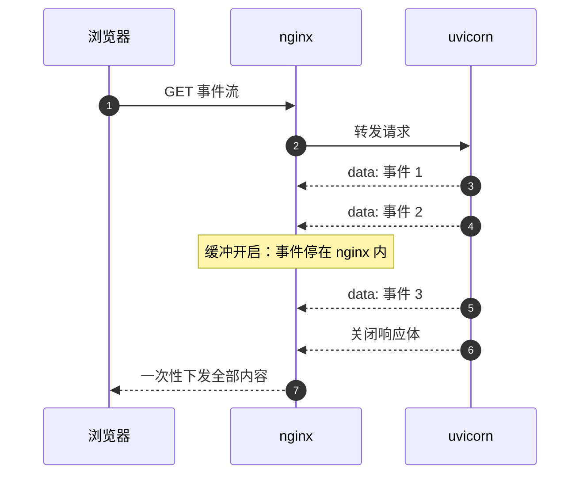
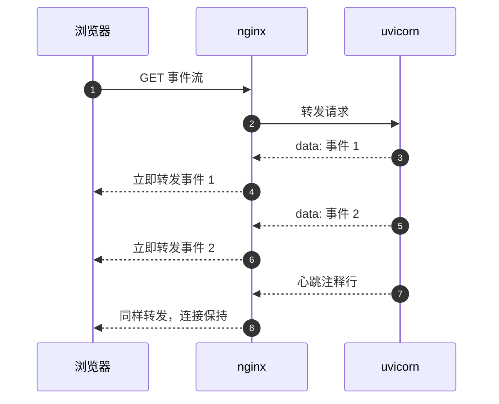
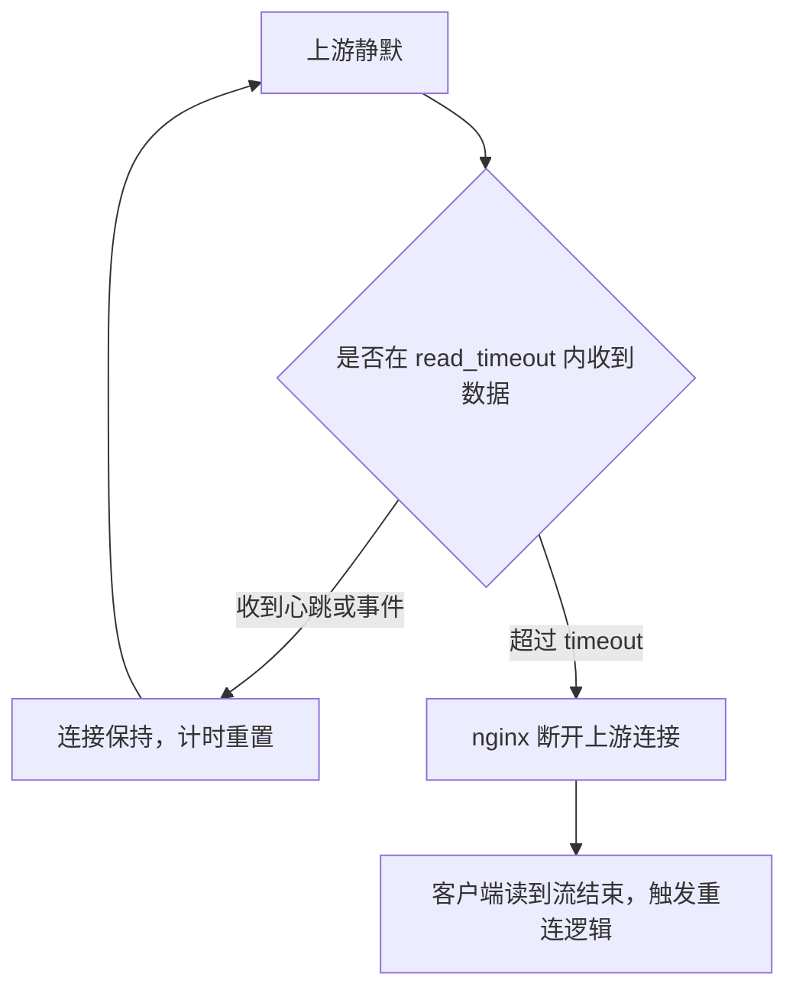

# 代理层的缓冲与超时

事件流从 uvicorn 到浏览器之间隔着 nginx。代理默认会把上游响应先攒起来再转发，这个行为对普通接口只是延迟几毫秒，对事件流却会把逐条推送变成结束时的一次性返回。KnowledgeDiver 的两段代理配置里有三行专门为流式服务调整过。

缓冲在哪一层生效、两种关闭方式如何分工、读超时与心跳什么关系，以及同段里那条为 WebSocket 准备的 `Upgrade` 头为什么也会出现在 SSE 请求上——这四处串起来才能解释长时间不断的事件流。KD 仓库路径以服务器上的 `~/KnowledgeDiver` 为根。

| 配置位置 | 出处 |
| --- | --- |
| HTTP server 块的 `/api/` | KD `deploy/deploy.sh:52-62` |
| HTTPS server 块的 `/api/` | KD `deploy/deploy.sh:85-95` |
| 独立样例配置 | KD `deploy/nginx.conf:15-25` |

## 缓冲把逐条事件变成一次性响应

`proxy_buffering` 默认开启。开启时 nginx 会尽量快地从上游读取响应体放进内存缓冲区，再按自己的节奏发给客户端；上游写得很慢时，事件会先在缓冲区里累积。对事件流来说，客户端等待期间什么都收不到，直到缓冲区写满或上游结束响应。



把缓冲关掉之后的时序变成逐条转发，客户端每收到一个事件就能更新界面。



## proxy_buffering off 的作用范围

配置写在 `location /api/` 里（KD `deploy/deploy.sh:60`、`:94`）：

```nginx
location /api/ {
    proxy_pass http://127.0.0.1:8000/api/;
    proxy_http_version 1.1;
    proxy_set_header Upgrade $http_upgrade;
    proxy_set_header Connection 'upgrade';
    proxy_set_header Host $host;
    proxy_set_header X-Real-IP $remote_addr;
    client_max_body_size 25m;
    proxy_buffering off;
    proxy_read_timeout 86400;
}
```

这条指令按 location 生效，`/api/` 下的所有响应都不再缓冲，包括流水线的三个事件流端点、Agent 的流式端点与普通 JSON 接口。JSON 接口本来就不依赖缓冲，关掉只是少一层中间存储，没有副作用。

两段 server 块各有一份，HTTP 与 HTTPS 都要写。只改 HTTPS、保留 HTTP 的默认缓冲时，同一套后端代码在两种协议下表现不同，这类差异在排查时很难一眼看出。

## 上游头 X-Accel-Buffering 逐响应关闭

除了配置层，nginx 还支持由上游在响应头里逐个响应关闭缓冲。Agent 路由就是这么做的（KD `backend/agent/routes/agent.py:46`）：

```python
headers={
    "X-Accel-Buffering": "no-buffering",
    "Cache-Control": "no-cache",
}
```

nginx 识别这个头时看的是值是否以 `no` 开头，写成 `no` 或 `no-buffering` 都能命中（按 nginx 的行为与社区通行做法整理；sse-starlette 项目把这一类问题记作 network buffering，要求在响应头写 `X-Accel-Buffering: no`，见 https://github.com/ColeMurray/sse-starlette 的说明）。这是一条逐响应的补充开关，前提是请求已经走到代理；它不能替代 location 级配置。

流水线的三个事件流端点没有带这个头（KD `backend/routes/pipeline.py:87-90`、`:114-117`、`:436-445`），下表按路径列出两者的差异。

| 路径 | location 级开关 | 上游头 | 结果 |
| --- | --- | --- | --- |
| `/api/agent/chat`、`/api/agent/stream` | 关闭 | 带 `X-Accel-Buffering` | 两层都关闭 |
| `/api/pipeline/*` | 关闭 | 未带 | 依赖配置层 |
| 其他 `/api/` 接口 | 关闭 | 未带 | 无影响 |

## proxy_read_timeout 与心跳的关系

`proxy_read_timeout` 限制的是两次读上游数据之间的最长等待时间，默认 60 秒（按 nginx 文档）。事件流在没有业务事件时是静默的，超过这个时间就可能在下一批事件到达前被断开。配置把它放宽到 86400 秒，也就是 24 小时（KD `deploy/deploy.sh:61`、`:95`）。

后端的心跳与它是配套的：Agent 订阅循环每 15 秒至少产生一行心跳（KD `backend/agent/manager.py:82-89`），远小于读超时，因此连接上一直有字节流动。即使把读超时设短一些，只要有心跳仍然不会断；反过来，只放宽超时而不发心跳，某些中间设备仍可能按自己的空闲策略断开。



## 1.1 与 Upgrade 头的来源

`proxy_http_version 1.1` 是长连接与分块传输的前提，缺省值是 1.0，会退回逐段关闭连接的行为，长连接场景下不合适（按 nginx 文档）。工程里显式写成 1.1（KD `deploy/deploy.sh:54`、`:87`）。

`proxy_set_header Upgrade $http_upgrade;` 与 `proxy_set_header Connection 'upgrade';` 是为 WebSocket 场景写的：浏览器发 `Upgrade: websocket` 时把该头透传，并把 `Connection` 设为 `upgrade`。SSE 请求不带 `Upgrade`，但配置仍然会把 `Connection: upgrade` 发给上游。本工程线上可用，去掉这两行对 SSE 是否有差别未做实测，属于现状说明。

## 与流式无关但同段的配置

| 指令 | 作用 | 与流式的关系 |
| --- | --- | --- |
| `proxy_pass .../api/` | 转发并保留 `/api` 前缀 | 无，路径转发本身 |
| `client_max_body_size 25m` | 允许较大的请求体 | 无，服务的是上传类接口 |
| `proxy_set_header Host $host` | 传原始主机名 | 无，影响后端生成的绝对地址 |
| `proxy_set_header X-Real-IP $remote_addr` | 传客户端地址 | 无，影响日志与来源判断 |

## 易错点

| 现象 | 原因 | 判据 |
| --- | --- | --- |
| 事件结束时一次性刷出 | `proxy_buffering` 仍为默认开启 | 检查实际生效配置里 `/api/` 段有没有 `off` |
| HTTPS 能流、HTTP 一次性 | 只在一段 server 块里关了缓冲 | 两个 server 块对照 |
| 长任务跑到一半断流 | 读超时按默认 60 秒断开 | 看是否在静默期断开，以及心跳有无产生 |
| 加了上游头仍然被缓冲 | 请求没有走到该 location，或配置层覆盖顺序不同 | 用 `nginx -T` 看生效配置 |
| 误以为 `no-buffering` 是固定值 | nginx 比较的是 `no` 前缀 | 写成 `no` 同样有效 |
| 把读超时当成请求总时长上限 | 它限制的是两次读之间的间隔 | 结合心跳判断是否会被重置 |

## 小结

### 核心概念

- 缓冲必须按 location 整体关闭；上游头 `X-Accel-Buffering` 只是逐响应补充，不能替代 location 级配置。
- `proxy_read_timeout` 限制两次读上游之间的间隔，需要与心跳配合。
- `proxy_http_version 1.1` 是长连接前提，`Upgrade` 两行来自 WebSocket 场景。

### 设计权衡

| 决策 | 选择 | 收益 | 代价 |
| --- | --- | --- | --- |
| 缓冲 | location 级整体关闭 | 所有流式端点都生效 | 普通接口少一层中间缓冲 |
| 上游头 | 只在 Agent 路由加 | 响应级可控 | 两条路径行为不一致 |
| 读超时 | 放宽到 24 小时 | 静默期不会误断 | 连接可能长时间占用资源 |
| HTTP 版本 | 固定 1.1 | 支持长连接与分块 | 需要理解与默认值的差别 |

## 练习

### 基础题

1. 说明 `proxy_buffering` 开启时事件流在客户端看来是什么表现。
2. `proxy_read_timeout` 限制的是整个请求时长还是两次读之间的间隔？
3. 上游头 `X-Accel-Buffering` 与 location 级 `proxy_buffering off` 有什么关系？

### 挑战题

4. 只保留 location 级配置、删掉 Agent 路由的上游头，预测行为是否有变化并说明理由。

5. 把读超时从 86400 改成 30 秒，说明心跳周期需要满足什么条件才不会被断开。

6. 说明 `proxy_set_header Connection 'upgrade'` 在 SSE 请求上会向上游发送什么，并给出验证方法。

### 附：本页引用的路径

| 路径 | 用途 |
| --- | --- |
| KD 仓库 `deploy/deploy.sh` | 两段 `/api/` 代理配置（`:52-62`、`:85-95`） |
| KD 仓库 `deploy/nginx.conf` | 独立样例配置（`:15-25`） |
| KD 仓库 `backend/agent/routes/agent.py` | 上游 `X-Accel-Buffering` 与 `Cache-Control`（`:42-49`） |
| KD 仓库 `backend/routes/pipeline.py` | 未带上游头的事件流端点（`:87-90`、`:114-117`、`:436-445`） |
| KD 仓库 `backend/agent/manager.py` | 订阅循环与心跳（`:80-89`） |
| sse-starlette 项目说明 | network buffering 与 `X-Accel-Buffering: no`（外部参考） |