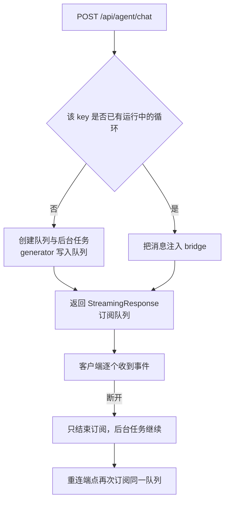
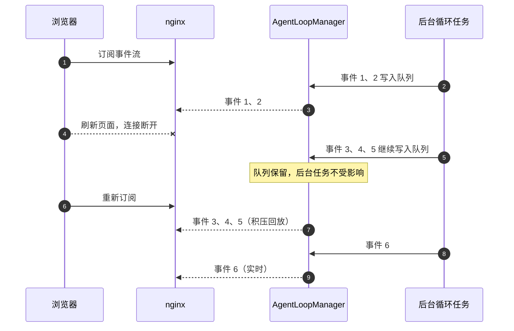

# 断线重连与后台循环解耦

事件流的客户端随时可能断开：用户刷新页面、切换标签、网络抖动。如果上游的生成器直接由 HTTP 响应驱动，一次断开就会取消整段生成逻辑，正在跑的工具调用与后台流水线一起消失。KnowledgeDiver 用一层队列把两者分开，断开只影响订阅，不影响任务本身。

这层解耦的结构、重连时事件从哪里来、两种客户端的差别，以及收尾阶段的清理顺序，是这块代码每次改动都会碰到的问题。KD 仓库路径以服务器上的 `~/KnowledgeDiver` 为根。

## 生成器被客户端生命周期绑架的问题

把长任务的生成器直接交给 HTTP 响应消费，就等于把任务生命周期绑在连接上：客户端一断开，框架取消响应任务，生成器被关闭，正在执行的工具与后台流水线一起消失。`run_agent_loop` 正是这样一个异步生成器，源码注释把这条因果写在了开头（KD `backend/agent/manager.py`）。

取消的传播路径是：客户端关闭连接，Starlette 取消响应任务，`async for` 收到取消，生成器被 `aclose`。生成器内部的清理与取消逻辑随之执行，长任务没有恢复入口。

## 后台任务加队列的结构

解法是把生成器挪到独立的后台任务里，事件写进一个队列，HTTP 响应只是队列的订阅者（KD `backend/agent/manager.py` 的 `start` 实现）：

```python
def start(self, key: str, generator) -> None:
    if self.is_running(key):
        return
    q: asyncio.Queue = asyncio.Queue()
    self._queues[key] = q

    async def _consume() -> None:
        try:
            async for event in generator:
                await q.put(event)
        except asyncio.CancelledError:
            await q.put(_sse("error", {"message": "Agent 任务被取消"}))
        except Exception as e:
            await q.put(_sse("error", {"message": str(e)}))
        finally:
            await q.put(_sse("complete", {"turns": -1, "tools_used": [], "interrupted": True}))
            await asyncio.sleep(0.2)
            self._queues.pop(key, None)
            self._tasks.pop(key, None)

    self._tasks[key] = asyncio.create_task(_consume())
```

`key` 由用户名与会话号拼成（KD `backend/agent/routes/agent.py` 的订阅键构造），因此并发的不同会话各自有独立队列。`is_running` 决定请求是新建循环还是追加订阅（KD `backend/agent/routes/agent.py` 的路由判断）。在源码里，起解耦作用的是 `asyncio.create_task(_consume())` 与 `asyncio.Queue`：前者把协程交给事件循环独立调度，生命周期不再挂在任何一次 HTTP 请求上；后者是进程内的 FIFO 缓冲，后台任务往里 `put`、订阅者用 `get` 取，「断开只结束订阅」靠的就是这两者。



## 订阅者与心跳的配合

`subscribe` 是异步生成器，从队列取事件并写出（KD `backend/agent/manager.py` 的订阅实现）。它承担三件事：正常事件转发、队列空闲时发心跳、发现循环结束就收尾。

| 分支 | 条件 | 动作 |
| --- | --- | --- |
| 队列有事件 | `wait_for` 在 15 秒内返回 | 原样写出；内容是 `complete` 则结束订阅 |
| 队列为空 | 15 秒超时且循环仍在运行 | 写出注释行 `: heartbeat` |
| 队列为空且循环已结束 | 超时后发现 `is_running` 为假 | 直接结束订阅 |
| 一开始就没有队列 | 无运行中的循环 | 写出一个 `error` 事件后结束 |

`subscribe` 是异步生成器，上面四条分支在源码里其实就是一次带超时的 `q.get()` 加两个判断：

```python
async def subscribe(self, key: str):
    q = self._queues.get(key)
    if q is None or not self.is_running(key):
        yield _sse("error", {"message": "当前没有正在运行的 Agent 任务"})
        return
    while True:
        try:
            event = await asyncio.wait_for(q.get(), timeout=15.0)
            yield event
            if '"complete"' in event:
                return
        except asyncio.TimeoutError:
            if not self.is_running(key):
                return
            yield ": heartbeat\n\n"
```

`asyncio.wait_for` 给 `q.get()` 加了 15 秒上限：超时在这里不算错误，而是被当作一次「顺手检查循环还在不在」的机会。第四条对应刷新后的场景：若循环已经结束、队列已被清理，重连只能拿到一个错误事件（KD `backend/agent/manager.py` 的订阅分支）。这时前端应把界面切回可交互状态，而不是继续等待。

## 重连拿到的是积压事件

队列没有被订阅者消费时事件会留在里面，因此循环在后台继续跑、客户端断开一段时间后再回来，能先收到断开期间积压的事件，再跟上实时进度（KD `backend/agent/manager.py` 的注释把这一行为记作积压回放）。



队列是单订阅者结构：同一个 key 上多个订阅者会分摊事件，而不是各自收到全量。本工程的界面按单会话单订阅设计，重连前会先结束旧订阅。

## 两种客户端的接入方式

前端同时用了两种读取方式，差别在能否带请求头与是否自动重连。`EventSource` 是浏览器内置的 SSE 客户端：给它一个 URL 就自动连接，断线还会自动重连；代价是它不支持自定义请求头，没法带 `Authorization`。需要带 Bearer 令牌的 Agent 流因此改用 `fetch` 加 `response.body.getReader()`，自己读分块、自己决定什么时候重连。

| 方式 | 使用位置 | 认证头 | 重连 |
| --- | --- | --- | --- |
| `EventSource` | 采集入口（KD `frontend/src/api/stream.ts`） | 不能自定义头 | 浏览器自动重连 |
| `fetch` 加 `getReader` | Agent 与部分流水线（KD `frontend/src/hooks/useSSE.ts`） | 可带 `Authorization: Bearer` | 需上层重新发起 |

`useSSE` 的 effect 只依赖 `url`，url 不变时不会重建连接；需要重连时要改变 url 或由调用方重新挂载。卸载时通过 `AbortController` 中止读取，`AbortError` 被识别为主动取消，不进入错误回调（KD `frontend/src/hooks/useSSE.ts` 的中止与错误处理分支）。`AbortController` 是浏览器提供的取消原语：把它生成的 `signal` 传给 `fetch`，之后调用 `abort()` 就会中止这次请求，组件卸载时正需要这个动作。

## 收尾事件与状态清理

循环结束时的顺序是：生成器正常结束或抛错，`finally` 里写入一个 `complete` 事件（带 `interrupted: True`），等待 0.2 秒让订阅者把事件读走，再清理队列与任务记录（KD `backend/agent/manager.py` 的收尾分支）。订阅者读到含 `complete` 的事件就返回，结束 HTTP 响应（KD `backend/agent/manager.py` 的订阅实现）。

流水线侧的结构类似但换了实现：后台任务由 `task_service.launch` 启动，事件通过 `task.emit` 写入，重连端点按 `task_id` 回放并续推（KD `backend/routes/pipeline.py` 里的启动与回放端点）。重连时会校验任务存在性与归属，非本人任务返回 403，任务不存在返回 404（KD `backend/routes/pipeline.py` 的鉴权分支）。

## 易错点

| 现象 | 原因 | 判据 |
| --- | --- | --- |
| 刷新后任务消失 | 生成器仍被响应直接消费，没有解耦层 | 看是否有后台任务与队列；源码对照 `manager.py` 的后台任务结构 |
| 重连后进度从头开始 | 重连的 key 或 task_id 不一致 | 对照 `username:session_id` 与任务标识 |
| 同一会话收到重复事件 | 两个订阅者同时读同一个队列 | 重连前先结束旧订阅 |
| 界面一直停在等待状态 | 循环已结束但客户端仍在读 | 重连收到 `error` 事件时应切回可交互 |
| 取消任务后没有收尾事件 | `CancelledError` 分支未覆盖 | 看 `finally` 是否保证写入收尾事件 |
| 前端组件卸载后仍报错 | 未中止读取 | `useSSE` 的清理函数应调用 `abort()` |

## 小结

### 核心概念

- 后台任务加队列把循环生命周期与 HTTP 连接分开，断开只结束订阅。
- 订阅循环用 15 秒超时同时实现心跳与结束检查。
- 队列保留未被消费的事件，重连时先回放积压再跟上实时。
- `EventSource` 自动重连但不能带自定义头，`fetch` 加 reader 相反。

### 设计权衡

| 决策 | 选择 | 收益 | 代价 |
| --- | --- | --- | --- |
| 循环驱动 | 后台任务 | 断开不影响长任务 | 需要管理与清理任务状态 |
| 事件传递 | 单队列 | 实现简单，天然支持回放 | 多订阅者会分摊事件 |
| 心跳周期 | 15 秒 | 空闲连接不会被误断 | 服务端周期性写入 |
| 客户端 | 两种方式并存 | 认证与自动重连各取所需 | 行为不一致，排查要看具体调用点 |

## 练习

### 基础题

1. 说明客户端断开时，后台循环与订阅者分别发生什么。
2. 订阅循环的 15 秒超时承担了哪两个职责？
3. 重连时事件从哪里来？为什么不会丢进度？

### 挑战题

4. 如果两个客户端用同一个 key 订阅，事件会怎样分发？给出一种让两者都收到全量事件的改法。

5. 说明循环正常结束与异常结束在收尾事件上的差别，以及客户端如何区分。

6. 把 `fetch` 加 reader 的客户端改成带自动重连，列出需要保存的状态与重连时机。

### 附：本页引用的路径

| 路径 | 用途 |
| --- | --- |
| KD 仓库 `backend/agent/manager.py` | 解耦说明、后台任务、订阅与收尾 |
| KD 仓库 `backend/agent/routes/agent.py` | 订阅键、运行判断与流式响应 |
| KD 仓库 `backend/routes/pipeline.py` | 后台任务启动、事件写入、重连与鉴权 |
| KD 仓库 `frontend/src/hooks/useSSE.ts` | 请求头、中止与增量读取 |
| KD 仓库 `frontend/src/api/stream.ts` | EventSource 入口 |