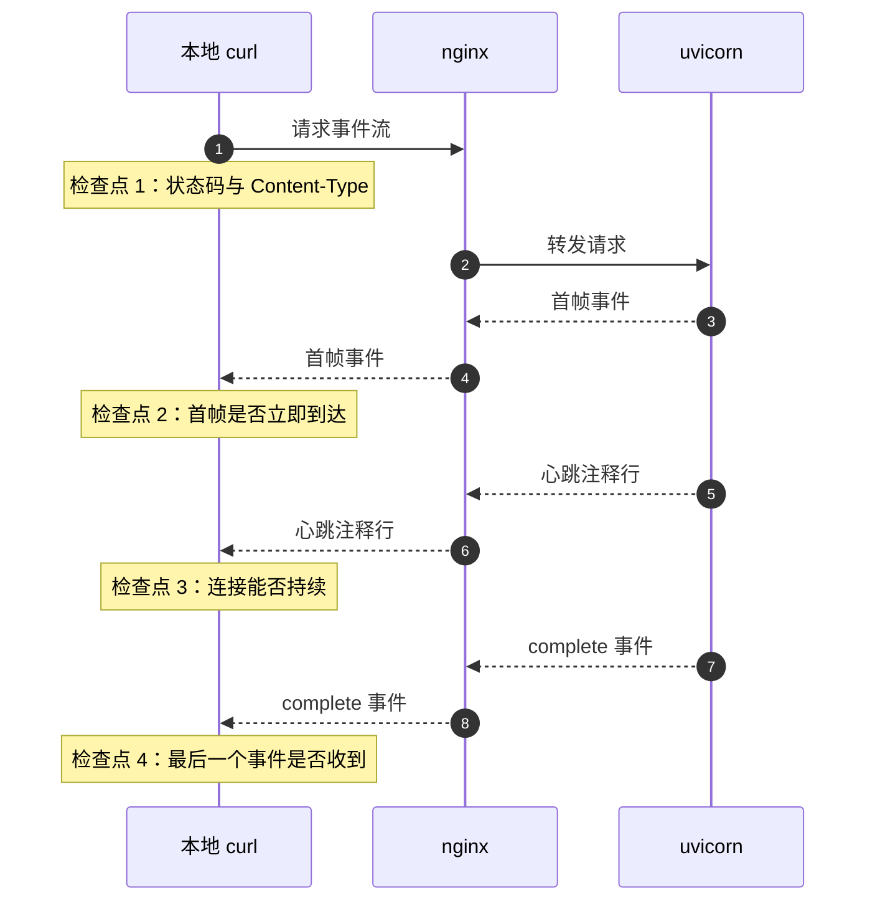
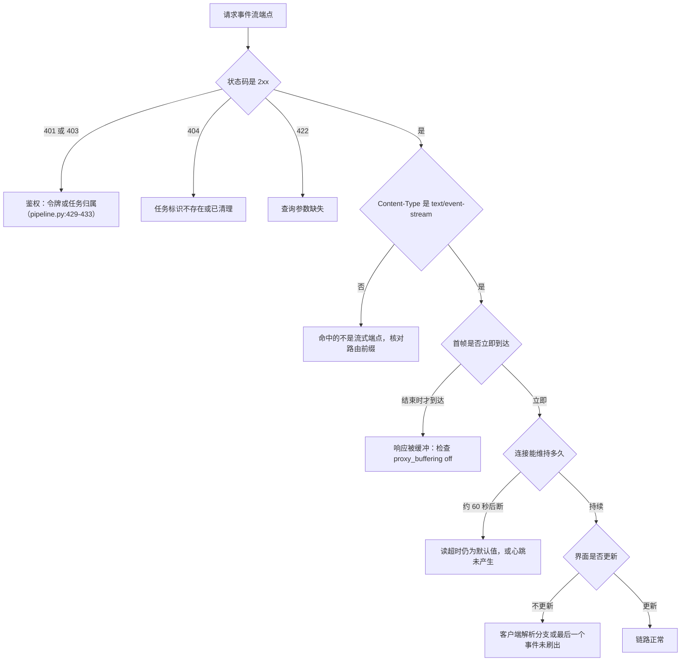

# 事件流的验证与排错

事件流的故障表现通常只有一句「页面不动」。要分清是请求没通、被缓冲、中途被断开，还是客户端没处理最后一个事件，需要按层观察：先确认连接与响应头，再看首帧到达的时间，最后看连接能维持多久。

检查命令与判定顺序按可直接执行的顺序给出，照着跑就能从症状走到原因。KD 仓库路径以服务器上的 `~/KnowledgeDiver` 为根；示例域名用 `knowledgediver.cloud`。

## 用 curl 观察增量输出

`curl` 默认会缓冲自己的输出，观察流式响应必须加 `-N`。下面这条请求在 5 秒后主动退出，用于看前几帧：

```bash
curl -N -sS --max-time 5 \
  -H "Authorization: Bearer <token>" \
  "https://knowledgediver.cloud/api/agent/stream?session_id=<id>"
```

判定标准只有一个：终端在 5 秒内陆续出现 `data: {...}` 行，说明流是通的；如果直到 `--max-time` 结束才一次性刷出全部内容，说明响应被缓冲，回到 `proxy_buffering` 那一层检查。

流水线的采集端点也是 GET 加鉴权（KD `backend/routes/pipeline.py:65-75`），把 URL 换成 `/api/pipeline/collect?keyword=...` 即可。参数不合法或缺鉴权时不会进入流式分支，会先返回 401 或 422。

## 核对响应头

只看第一帧之前的部分可以确认响应类型：

```bash
curl -N -sS -o /dev/null -D - --max-time 3 \
  -H "Authorization: Bearer <token>" \
  "https://knowledgediver.cloud/api/agent/stream?session_id=<id>"
```

| 响应头 | 期望 | 说明 |
| --- | --- | --- |
| `HTTP/1.1` | `200` | 非 200 时先解决鉴权与参数问题 |
| `Content-Type` | `text/event-stream` | 不是该类型说明命中的不是流式端点 |
| `Transfer-Encoding` | `chunked` | 分块传输是长响应的常见形态 |
| `X-Accel-Buffering` | `no-buffering` | 只有 Agent 路由带（KD `backend/agent/routes/agent.py:46`） |
| `Cache-Control` | `no-cache` | 只有 Agent 路由带（KD `backend/agent/routes/agent.py:47`） |

流水线的三个事件流端点只设置 `media_type`，响应头里看不到后两项（KD `backend/routes/pipeline.py:87-90`、`:114-117`）。缺少它们不代表有问题，前提是 nginx 的 `/api/` 段已经关了缓冲。

## 服务器侧可用的手段有限

这台服务器上没有 `curl`、`wget`，`python3` 也是断链（`personal-homepage-research/15-deploy-tc63.md:82-89`）。可用的只有 `awk`、`sed`、`perl`、`nc` 一类工具。

`nc` 能发出的是一次性的短请求，用来确认端口与响应行足够，但观察不到增量：HTTP/1.0 请求不保持连接，连接一关响应就结束。要在服务器本机看流式行为，只能用后端日志；观察客户端侧的增量应当在有 `curl` 的机器上进行。

## 从连接建立到事件到达的排查顺序



按下面四层依次判断，前一层不成立时后一层的结论都不成立。



第四层的「结束才到达」是最常见的现象，判定方式就是第一节里的 `curl -N`：终端一次性刷出内容，说明事件在 nginx 里堆积过。

## 前端症状对照表

前端把读取、解析与展示放在一处（KD `frontend/src/hooks/useSSE.ts:44-97`），因此界面症状能反推到具体环节。

| 症状 | 可能环节 | 依据 |
| --- | --- | --- |
| 一直停在「生成中」，最后一条事件后卡住 | 流结束前最后一个事件未被处理 | 代码在 `done` 分支显式冲洗缓冲区（KD `frontend/src/hooks/useSSE.ts:57-63`） |
| 进度与卡片一次性出现 | 代理层缓冲 | 见第一节的 `curl -N` 判定 |
| 刷新后进度从头开始 | 重连的 key 与后台队列不一致 | 对照 `username:session_id`（KD `backend/agent/routes/agent.py:36`） |
| 控制台报 JSON 解析失败 | 帧被拆开或缺少空行 | 抓原始响应看 `data:` 与空行 |
| 401 后没有任何事件 | 未带 `Authorization` 头 | 流式端点都依赖登录态（KD `backend/routes/pipeline.py:74`） |
| 切换页面后仍报错 | 组件卸载时未中止读取 | `useSSE` 的清理函数会 `abort()`（KD `frontend/src/hooks/useSSE.ts:108-112`） |

前端还有一条容易漏的分支：`fetch` 读取方式的响应不是 `text/event-stream` 时，代码不会走流式路径（KD `frontend/src/api/agent.ts:57`）。这条判断失败时界面不会报错，只是没有增量输出。

## 日志与状态码线索

| 线索 | 位置 | 含义 |
| --- | --- | --- |
| `499` | nginx access 日志 | 客户端在响应完成前关闭连接，常见于刷新页面 |
| `504` | nginx access 日志 | 等上游超时，对应 `proxy_read_timeout` |
| `upstream timed out` | nginx error 日志 | 上游在超时窗口内没有写出数据 |
| 上游异常栈 | `journalctl -u knowledgediver -f` | 后台循环抛错，会以 `error` 事件下发 |
| 取消记录 | 后端日志 | 任务被主动取消，收尾事件带 `interrupted` 标记 |

后端的服务名与查看日志的命令在部署脚本的输出里列了出来（KD `deploy/deploy.sh:147-152`）。循环内部抛出的异常不会中断连接，而是转成一条 `error` 事件写进队列（KD `backend/agent/manager.py:62-64`），所以前端能看到错误内容，日志侧则留下完整的栈。

## 易错点

| 现象 | 原因 | 判据 |
| --- | --- | --- |
| 用 curl 不加 `-N` 就下结论 | curl 自身缓冲输出 | 命令里必须有 `-N` |
| 用 `nc` 观察增量 | HTTP/1.0 不保持连接 | 服务器侧只看日志，增量验证在本地做 |
| 把 401 当成流式配置问题 | 鉴权发生在进入流式分支之前 | 先解决令牌与归属校验 |
| 只测 HTTPS 就认为配置正确 | HTTP 段可能仍是默认缓冲 | 两段 server 块分别验证 |
| 把「结束时一次性输出」当成前端问题 | 浏览器侧只看到结果 | 用 `curl -N` 区分代理层与前端 |
| 忽略最后一个事件 | 流结束时缓冲区还有残留 | 看客户端在 `done` 分支是否冲洗 |

## 小结

### 核心概念

- 观察增量必须用 `curl -N`，一次性刷出就是缓冲的证据。
- 响应头能确认端点类型与上游是否声明了逐响应关闭缓冲。
- 排查顺序：鉴权、内容类型、首帧时间、连接时长、前端更新。
- 后端异常会转成 `error` 事件，日志里保留完整栈。

### 设计权衡

| 决策 | 选择 | 收益 | 代价 |
| --- | --- | --- | --- |
| 验证工具 | 本地 curl 观察，服务器看日志 | 绕开服务器工具缺失 | 需要两边切换 |
| 判定依据 | 首帧到达时间 | 能直接区分缓冲与业务慢 | 需要短超时命令配合 |
| 错误下发 | 事件形式返回 | 前端能展示原因 | 需要同时看事件与日志 |
| 响应头 | 只有 Agent 路由带缓冲声明 | 逐响应可控 | 两条路径行为不一致 |

## 练习

### 基础题

1. 写出一条能在 5 秒内看到前几帧的命令，并说明 `-N` 的作用。
2. 响应头里哪些项能证明命中的是流式端点？
3. 刷新页面后事件流断开，nginx 日志里会出现哪个状态码？

### 挑战题

4. 写出一组判断「首帧延迟」的命令，并说明如何用输出时间区分缓冲与业务处理慢。

5. 服务器上没有 curl，设计一套只用日志与 nginx 状态码的排查流程，覆盖缓冲、超时与上游异常三种情况。

6. 前端停在「生成中」但 `curl` 能看到 `complete` 事件，列出两个最可能的原因与验证方法。

### 附：本页引用的路径

| 路径 | 用途 |
| --- | --- |
| KD 仓库 `backend/agent/routes/agent.py` | 上游响应头与订阅键（`:36`、`:42-49`） |
| KD 仓库 `backend/routes/pipeline.py` | 流式端点与重连鉴权（`:65-75`、`:87-90`、`:114-117`、`:423-445`） |
| KD 仓库 `backend/agent/manager.py` | 异常转事件（`:62-64`） |
| KD 仓库 `frontend/src/hooks/useSSE.ts` | 读取、收尾冲洗与中止（`:44-97`、`:108-112`） |
| KD 仓库 `frontend/src/api/agent.ts` | 按内容类型判断流式分支（`:57`） |
| KD 仓库 `deploy/deploy.sh` | 后端服务名与日志命令（`:147-152`） |
| `personal-homepage-research/15-deploy-tc63.md` | 服务器工具缺失情况（`:82-89`） |
| `/var/log/nginx/`、`journalctl -u knowledgediver` | 日志位置（服务器路径，未在本机核对） |