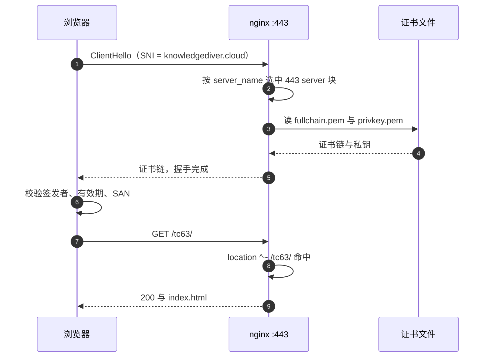
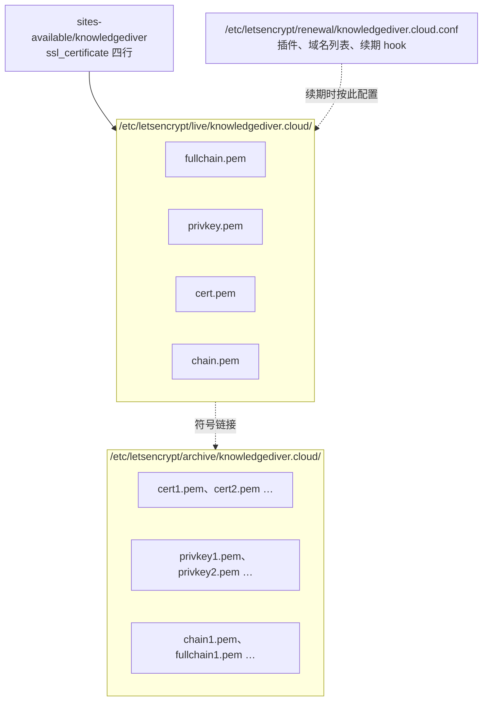

# TLS 终止与证书绑定域名

个人主页的线上地址是 https://knowledgediver.cloud/tc63/ 。这个 URL 里 HTTPS 与 /tc63 属于两层不同的机制：TLS 在 TCP 连接建立时完成，证书只回答「你是不是 knowledgediver.cloud」；路径分流发生在握手之后，由 nginx 的 location 决定。浏览器在握手阶段看不到 /tc63，也就不会为它单独校验任何东西。所谓 TLS 终止，就是加密隧道到 nginx 这一端就解开：nginx 出示证书、完成握手，之后以明文经回环地址访问 127.0.0.1:8000 的后端，证书与私钥只装在一处，后端进程完全不用处理 HTTPS。

443 这一端由谁负责、证书为什么只有一张、nginx 从哪里读它、证书文件在磁盘上有哪两处组织，是配置 TLS 终止时必须先确定的事。TLS 的密码学细节不在范围内，重点是文件位置、引用方式与配置错误的表现。

| 层 | 决定因素 | 本工程取值 | 出处 |
| --- | --- | --- | --- |
| 连接目标 | DNS A 记录 | `knowledgediver.cloud` → `43.136.78.68` | `README.md`、`personal-homepage-research/15-deploy-tc63.md` |
| 证书校验 | 证书 SAN 与请求域名 | `knowledgediver.cloud`、`www.knowledgediver.cloud` | KD 仓库 `deploy/deploy.sh` 的签发命令 |
| 路径分流 | nginx `location` | `/tc63/` 归个人主页，`/` 与 `/api/` 归 KnowledgeDiver | `personal-homepage-research/15-deploy-tc63.md` 的 location 插入记录 |
| 站点文件 | `root` 指令 | `root /home/tc63/www`，其下 `tc63` 为软链 | `personal-homepage-research/15-deploy-tc63.md`、`README.md` 的站点接入说明 |

KD 仓库的路径以服务器上的 `~/KnowledgeDiver` 为根，正文与附录都按这个根书写；个人主页仓库的路径按仓库根书写。

## 域名先于路径被校验

TLS 握手开始时，客户端在 `ClientHello` 里带上 SNI 字段，写明想访问的域名。SNI（Server Name Indication）让服务器在出示证书之前就知道客户端要哪个域名，同一个 443 端口才能为多个站点分别返回各自的证书；nginx 用这个字段挑出 `server_name` 匹配的 server 块，把对应的证书链发回去。客户端检查签发者、有效期与 SAN 列表里有没有该域名，全部通过之后才开始发 HTTP 请求。



证书里没有任何与路径有关的字段，SAN（Subject Alternative Name，证书里登记「这张证书对哪些域名有效」的扩展字段）是一串域名。校验通过之后，`/tc63/` 与 `/` 对 TLS 层完全等价。这也是子路径部署不需要第二张证书的根本原因。

## 一个域名只有一张有效证书

服务器上 nginx 1.24 的站点配置文件是 `/etc/nginx/sites-available/knowledgediver`，同时监听 80 与 443，证书由 Let’s Encrypt 签发（`personal-homepage-research/15-deploy-tc63.md` 的服务器现状记录）。域名根已经被 KnowledgeDiver 占用：`/` 指向 `frontend/dist`，`/api/` 转发到 127.0.0.1:8000（同文档的 location 说明）。

个人主页落在 `/tc63/`，处理方式是往已有的每个 server 块里插入三条 location，而不是新建 server 块（`personal-homepage-research/15-deploy-tc63.md` 的插入步骤）：

```nginx
location = /tc63 { return 301 /tc63/; }
location ^~ /tc63/_astro/ {
    root /home/tc63/www;
    add_header Cache-Control "public, max-age=2592000, immutable";
}
location ^~ /tc63/ {
    root /home/tc63/www;
    index index.html;
    try_files $uri $uri/ =404;
    error_page 404 /tc63/404.html;
}
```

这段配置里没有出现 `ssl_certificate`，因为证书属于整个 server 块，`/tc63/` 只是它内部的一条路径。证书换新时个人主页跟着一起换，不需要单独处理。

## 80 与 443 两个入口的分工

两个入口在配置里是分开的 server 块，职责也不同。`listen 443 ssl http2;` 一行同时做了三件事：在 443 上监听、对这个端口启用 TLS、协商 HTTP/2。

```nginx
server {
    listen 80;
    listen [::]:80;
    ...
}

server {
    listen 443 ssl http2;
    listen [::]:443 ssl http2;
    server_name $DOMAIN www.$DOMAIN;
    ...
}
```

两段都由 `deploy/deploy.sh` 生成：HTTP 段每次重写，HTTPS 段只在证书已存在时追加（首次部署靠 certbot 的 nginx 插件补上）。

| 入口 | 本工程行为 | 依据 |
| --- | --- | --- |
| 80 | 无证书阶段直接服务前端与接口；签发后由 certbot 加整站 301 跳到 443 | KD `deploy/deploy.sh` 的 HTTP server 块与签发步骤 |
| 443 | `listen 443 ssl http2`，引用 fullchain、privkey 与 certbot 的 TLS 片段 | KD `deploy/deploy.sh` 的 443 server 块 |
| `/tc63` → `/tc63/` | 301 补尾斜杠，与协议无关 | `personal-homepage-research/15-deploy-tc63.md` 的 location 插入记录 |

第三条容易和协议重定向混淆：`location = /tc63 { return 301 /tc63/; }` 只补一个尾斜杠，HTTP 与 HTTPS 下都会触发。把 http 跳到 https 的是 certbot 写入的重定向，它在 server 块级别生效。

## 证书文件的引用只有四行

443 server 块里与证书相关的配置是四行（KD `deploy/deploy.sh` 的 443 server 块）：

```nginx
ssl_certificate     /etc/letsencrypt/live/$DOMAIN/fullchain.pem;
ssl_certificate_key /etc/letsencrypt/live/$DOMAIN/privkey.pem;
include /etc/letsencrypt/options-ssl-nginx.conf;
ssl_dhparam /etc/letsencrypt/ssl-dhparams.pem;
```

`fullchain.pem` 是叶证书加中间证书的拼接，带上它客户端就不必再去补中间证书。`privkey.pem` 是私钥。`options-ssl-nginx.conf` 提供协议版本、加密套件与会话缓存参数，`ssl-dhparams.pem` 是 DHE 用的参数文件。

后两个文件由 certbot 包安装时生成，内容不在本仓库里，其协议版本与套件列表按 certbot 包的默认值（服务器上的实际内容未在本机核对）。

## live 与 archive 两处目录

`live` 下的文件名固定，配置只引用这一层；真实文件放在 `archive` 下并按签发次数编号，`live` 里是符号链接。另一处是 `renewal`，记录这张证书签发时的参数。



续期一次就向 `archive` 追加一组带序号的文件，然后把 `live` 下的符号链接指到新文件；配置里的路径不变，因此续期不需要改 nginx。`renewal` 目录下的 conf 记录了签发方式（这里走 nginx 插件）、覆盖的域名列表与是否配置了 hook，`certbot renew` 只读它，不读命令行历史。

这套目录结构是 certbot 的默认布局（按 certbot 通用行为整理，服务器上的实际内容未在本机核对）。

## 私钥权限与读取时机

`privkey.pem` 的默认权限是 600 且属主为 root（按 certbot 默认）。nginx 的 master 进程以 root 启动，在启动与 reload 时把证书和私钥读进内存；worker 进程以 `www-data` 运行，之后不需要再读这两个文件。因此不存在「为了 nginx 能读而放开私钥权限」的需求，把 600 改成 644 只会扩大暴露面。

站点目录的权限是另一回事：worker 进程要读静态文件，而文件在 `/home/tc63` 下面，家目录的穿透权限必须单独处理，这部分在 `03-文件权限与nginx读取路径` 展开。

## 易错点

| 现象 | 原因 | 处理 |
| --- | --- | --- |
| 用 IP 直接访问报证书域名不匹配 | 证书 SAN 只含域名，不含 IP | 一律用域名访问；IP 访问仅用于临时排查 |
| `www.knowledgediver.cloud` 报证书错误 | 签发的 `-d` 参数漏了 www | 重新签发时同时给两个域名（KD `deploy/deploy.sh` 的签发命令） |
| `nginx -t` 报找不到证书 | 配置引用了 live 下不存在的文件名 | 先确认签发成功，再检查 `live/<域名>/` 目录 |
| 续期成功后浏览器仍看到旧证书 | nginx 启动时读入内存，不自动跟随文件变化 | 续期后执行 `systemctl reload nginx`，或用 deploy hook 自动完成 |
| 私钥被改成 644 或换属主 | 误以为 worker 进程需要读私钥 | 恢复 600 root；读私钥发生在 master 启动阶段 |
| 只改了 80 的 server 块 | 两个 server 块内容相近，容易漏改 | 用 `nginx -T` 查看实际生效的完整配置再改 |

## 小结

### 核心概念

- 证书绑定域名，不绑定路径；`/tc63/` 与 `/` 共用同一张证书。
- nginx 用 SNI 选 server 块，用 location 选路径，两件事在时间上先后发生。
- 配置只引用 `live` 下的稳定路径；`archive` 与 `renewal` 由 certbot 维护。
- 证书与私钥由 master 进程在启动与 reload 时读入，worker 进程不读文件本身。

### 设计权衡

| 决策 | 选择 | 收益 | 代价 |
| --- | --- | --- | --- |
| 子路径是否单独签发证书 | 复用域名根已有的证书 | 不用新增签发与续期对象，配置改动只有 location | 证书出问题时同域名的所有路径一起受影响 |
| TLS 参数来源 | include certbot 的片段 | 版本与套件跟随 certbot 更新 | 自定义空间小，手改的文件会被覆盖 |
| 私钥权限 | 600 root | 只有 root 能读，暴露面最小 | 排错时非 root 账号看不到内容 |
| 证书路径引用 | 只引用 `live` 下的固定名 | 续期不触发配置修改 | 排查时要记得 `live` 里是符号链接 |

## 练习

### 基础题

1. 说明访问 `https://knowledgediver.cloud/tc63/` 时，证书校验发生在请求路径解析之前还是之后。
2. 如果只为 `knowledgediver.cloud` 签发了证书，用 `https://www.knowledgediver.cloud/tc63/` 访问会发生什么？
3. `fullchain.pem` 与 `cert.pem` 的差别是什么？配置里为什么用前者？

### 挑战题

4. 证书续期后没有 reload，nginx 会继续使用内存里的旧证书。写出一条能验证当前生效证书日期的命令，并说明读取的是文件还是内存中的证书。
5. 如果要把个人主页迁到独立域名 `tc63.example.com`，列出需要改动的配置层与权限层各一项，并说明哪些部分不受影响。
6. 说明 `location = /tc63 { return 301 /tc63/; }` 与 certbot 写入的整站重定向在触发条件上的差别。

### 附：本页引用的路径

| 路径 | 用途 |
| --- | --- |
| `README.md` | 线上地址、登录方式与更新脚本 |
| `personal-homepage-research/15-deploy-tc63.md` | 服务器现状、证书归属与 location 插入内容 |
| `deploy.sh`、`astro.config.mjs` | 本地构建与 base 前缀 |
| `.github/workflows/deploy.yml` | GitHub Pages 侧的构建参数 |
| KD 仓库 `deploy/deploy.sh` | certbot 安装、443 server 块与签发命令 |
| KD 仓库 `deploy/nginx.conf` | 样例 server 块 |
| 证书目录 `/etc/letsencrypt/` | live、archive、renewal 三处布局（服务器文件，未在本机核对） |