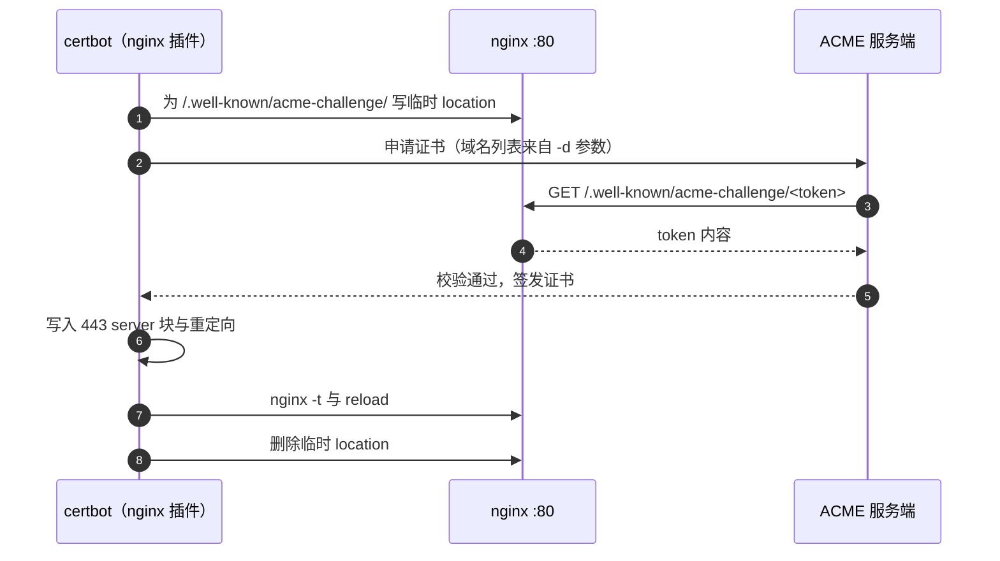
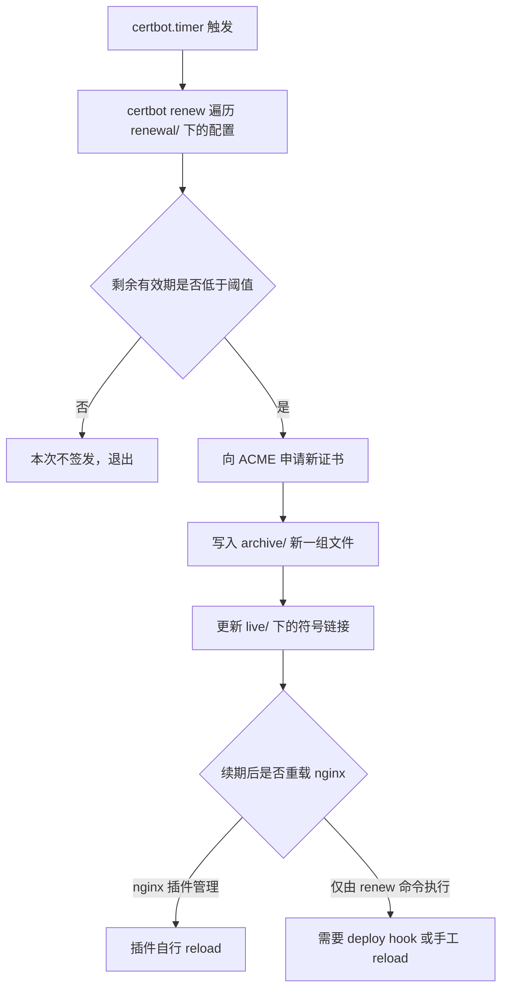
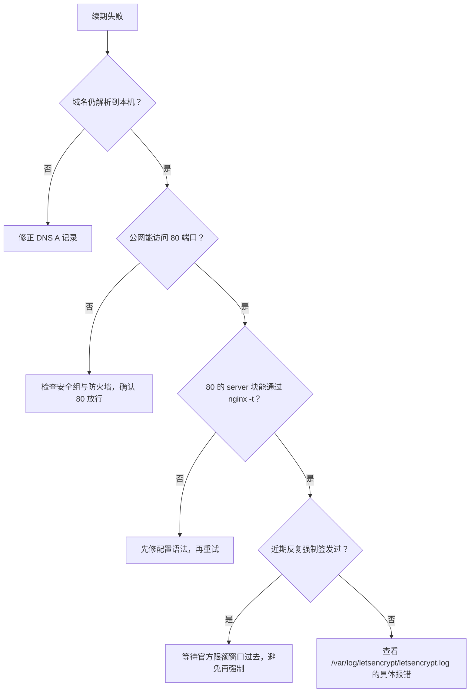

# 证书申请与自动续期

证书不是一次性的配置，它有两个时间点需要处理：第一次把域名指向服务器之后签发，以及此后每隔一段时间续期。签发命令由部署脚本发起，续期则交给系统定时器，两者共用同一份 renewal 配置。

这里的对象是 KD 仓库 `deploy/deploy.sh` 的第 5 步与 certbot 的续期机制。脚本顺序里有一个容易忽略的细节：首次运行时 443 server 块并不存在，那份配置是 certbot 自己写进去的。

| 阶段 | 触发者 | 关键条件 | 出处 |
| --- | --- | --- | --- |
| 首次签发 | `deploy/deploy.sh` 第 5 步 | 域名已解析、80 可达、`live` 下无证书 | KD `deploy/deploy.sh:107-113` |
| 配置改写 | certbot 的 nginx 插件 | 使用 `--nginx`，插件直接改 sites-available | KD `deploy/deploy.sh:108-110` |
| 自动续期 | `certbot.timer` 或 cron | 到期前 30 天内才实际签发 | 按 certbot 包默认，服务器实际未核对 |
| 生效 | nginx reload | 续期写文件，进程内的证书要重载才更新 | 见「续期之后的重载」一节 |

## ACME 与 HTTP-01 的验证路径

Let’s Encrypt 用 ACME 协议签发证书。客户端要先证明自己控制着目标域名，最常用的是 HTTP-01：ACME 服务端向 `http://<域名>/.well-known/acme-challenge/<token>` 发起一次 GET，能取到约定的 token 内容就通过。



验证走的是 80 端口，因此签发的两个前提是：域名的 A 记录已经指向这台服务器，且 80 端口从公网可达。腾讯云的安全组默认不放开 80 与 443 时需要另行放行（控制台操作，按服务商文档）。

HTTP-01 只关心 80 端口能否返回 token 文件，不关心 80 上原先是静态站点还是重定向。但 `--redirect` 生效后 80 会整站跳到 443，如果此时 443 的配置有问题，验证请求跟着跳过去也会失败。

## 首次签发在部署脚本里的位置

脚本第 4 步先写 HTTP server 块并 reload，第 5 步才申请证书（KD `deploy/deploy.sh:38-113`）。第 5 步的判断很直接：

```bash
if [ ! -f "/etc/letsencrypt/live/$DOMAIN/fullchain.pem" ]; then
    certbot --nginx -d "$DOMAIN" -d "www.$DOMAIN" \
        --non-interactive --agree-tos --email "admin@$DOMAIN" \
        --redirect 2>/dev/null || echo "  SSL 申请跳过（可能域名未解析）"
else
    echo "  SSL 证书已存在，跳过"
fi
```

（KD `deploy/deploy.sh:107-113`）四个参数各有作用：`--nginx` 指定用 nginx 插件做验证与安装，两个 `-d` 决定 SAN 覆盖的域名，`--non-interactive` 配合 `--agree-tos` 与邮箱免交互，`--redirect` 要求装完后加 http 到 https 的跳转。

同一段脚本在第 4 步有个条件分支：只有 `live/$DOMAIN/fullchain.pem` 已经存在时才追加 443 server 块（KD `deploy/deploy.sh:67-98`）。首次运行时证书还不存在，443 块不会被写入；certbot 的 nginx 插件接管配置后把 443 与重定向补上。第二次运行起，脚本自己写 443 块，`certbot --nginx` 因为证书存在而被跳过。

另外，签发失败被 `|| echo` 兜住，脚本不会中断（KD `deploy/deploy.sh:110`）。部署可能在没有证书的状态下继续跑完，判断是否真的签发成功要看 `live` 目录，而不是脚本退出码。

## --nginx 插件改动的三处

nginx 插件不只是签发，它还负责安装。它改动的三处都在同一份站点配置里：

| 改动 | 内容 |
| --- | --- |
| 验证期 | 临时插入 `/.well-known/acme-challenge/` 的 location，验证后删除 |
| 安装证书 | 在匹配的 server 块写入 `ssl_certificate`、`ssl_certificate_key`、`include` 与 `ssl_dhparam` |
| 重定向 | `--redirect` 时在 80 的 server 块加 `return 301 https://$host$request_uri` |

这三处都写在 `/etc/nginx/sites-available/knowledgediver` 里，会与脚本自己生成的 443 块共存。理解这一点的用处是：线上生效的配置不等于仓库里脚本模板的展开结果，排查时要看服务器上那份文件（`nginx -T`）。

## 续期由定时器驱动

Let’s Encrypt 证书的有效期是 90 天，certbot 默认在剩余不到 30 天时才执行续期（按 certbot 默认策略）。触发者是系统定时任务，不依赖人工记忆。

Ubuntu 上用包管理器装的 certbot 会带一个 systemd 定时器 `certbot.timer`，每天运行两次 `certbot renew`，两次之间带随机延迟以错开官方服务端的负载高峰；不带 systemd 的环境是 `/etc/cron.d/certbot` 里的等价任务。这两处的实际内容未在本机核对，按 certbot 包的分发方式整理。



`certbot renew` 读的是 `/etc/letsencrypt/renewal/<域名>.conf`，里面记着签发方式、域名列表与 hook。命令行的签发参数不会在续期时重放，所以对 `--nginx`、`--redirect`、deploy hook 的改动要落在 renewal 配置里或用 certbot 的子命令写入。

两个常用命令用于核对状态：`certbot certificates` 列出已签发证书的域名与到期时间，`certbot renew --dry-run` 用演练环境走一遍续期流程，不改动真实证书。

## 续期之后的重载

证书文件更新后，nginx 内存里仍是启动时读入的那份，页面会继续用旧证书直到 reload。使用 nginx 插件管理的证书，插件在续期成功后会自己完成重载；如果证书是别的方式签发的，需要在 renewal 配置里挂 deploy hook：

```bash
certbot renew --deploy-hook "systemctl reload nginx"
```

deploy hook 只在实际签发时才执行，被跳过的轮次不会触发。这一点比用 cron 无条件 reload 更合适：无谓的 reload 会打断连接。

## 续期失败的排查顺序

续期失败的现象是 `certbot certificates` 里的到期时间不再延后。按下面的顺序逐层排除，前一层不成立时后一层没有意义。



日志在 `/var/log/letsencrypt/letsencrypt.log`，每次运行一份带时间戳的记录。常见报错有三类：`DNS problem` 说明解析没生效或解析到别处；`Timeout during connect` 说明 80 被安全组挡住或没有服务监听；`too many certificates` 说明触发了 Let’s Encrypt 的签发限额。限额的具体数值以官方文档为准，实际做法是避免为了测试反复强制签发，测试用 `--dry-run`。

另一类失败不报错但同样致命：续期成功、文件已更新，nginx 没有 reload。判定方式是比对 `openssl s_client` 返回的 `notAfter` 与 `live/fullchain.pem` 里那份证书的到期时间，两者不一致就说明内存里还是旧的。

## 易错点

| 现象 | 原因 | 处理 |
| --- | --- | --- |
| 脚本跑完没有证书，退出码却是 0 | 签发失败被 `|| echo` 吞掉（KD `deploy/deploy.sh:110`） | 用 `certbot certificates` 与 `live` 目录判断，不看脚本退出码 |
| 首次部署后没有 443 块 | 443 块只在证书已存在时写入，首次靠插件补 | 确认 certbot 运行成功；第二次部署起脚本自带的 443 块生效 |
| 签发时报域名未解析 | A 记录没指向本机或还没传播 | 解析生效后再签发（KD `deploy/deploy.sh:110` 的提示） |
| 反复执行强制签发 | 每次都可能计入限额 | 测试用 `certbot renew --dry-run`，正式签发按需 |
| 续期后浏览器仍用旧证书 | 没有 reload | 挂 deploy hook 重载 nginx |
| 续期配置里的域名与服务器实际不符 | 证书是手工签发、renewal conf 未同步 | 查看 `/etc/letsencrypt/renewal/`，必要时重新签发覆盖 |

## 小结

### 核心概念

- HTTP-01 通过 80 端口返回 token 完成域名控制权验证。
- `certbot --nginx` 同时完成验证、安装与重定向三件事，改动落在站点配置文件里。
- 续期由 `certbot.timer` 或 cron 触发，`certbot renew` 只读 renewal 配置。
- 文件更新不等于生效，重载 nginx 或 deploy hook 才能让新证书进入服务。

### 设计权衡

| 决策 | 选择 | 收益 | 代价 |
| --- | --- | --- | --- |
| 验证方式 | HTTP-01 加 nginx 插件 | 不需要改 DNS，插件自动处理配置 | 依赖 80 端口可达，且插件会改配置文件 |
| 首次签发的位置 | 放在部署脚本第 5 步 | 与新装机器流程合并 | 失败被兜底语句吞掉，需要单独核对 |
| 续期触发 | 系统定时器 | 不需要人工干预 | 服务器上多一个后台任务，排查要看日志 |
| 生效方式 | deploy hook 重载 | reload 只在签发后发生 | 需要把 hook 写进 renewal 配置 |

## 练习

### 基础题

1. 说明 HTTP-01 验证请求落在哪个端口、请求哪条路径。
2. 首次运行 `deploy/deploy.sh` 时，443 server 块是谁写进配置文件的？
3. `certbot certificates` 与 `certbot renew --dry-run` 各自会不会改动真实证书？

### 挑战题

4. 部署脚本用 `|| echo` 兜住签发失败。写出两条能在部署后确认证书真的签下来的检查命令，并说明检查的是文件还是服务状态。

5. 续期成功后没有 reload，写出一条比对命令，用 `notAfter` 判断服务实际在用的是新证书还是旧证书。

6. 如果要把 `--redirect` 去掉、让 80 与 443 并存，列出需要修改的位置，并说明为什么这类改动要落在 renewal 配置或用 certbot 子命令完成。

### 附：本页引用的路径

| 路径 | 用途 |
| --- | --- |
| KD 仓库 `deploy/deploy.sh` | 依赖安装、首次签发命令、443 块的条件写入（`:21`、`:67-98`、`:107-113`） |
| KD 仓库 `deploy/nginx.conf` | 只监听 80 的样例 server 块（`:4-26`） |
| KD 仓库 `deploy/knowledgediver.service` | 后端 systemd 单元（`:1-15`） |
| `personal-homepage-research/15-deploy-tc63.md` | 服务器现状与证书归属（`:13-16`） |
| `README.md` | 线上地址与更新流程（`:143`、`:155-164`） |
| `/etc/letsencrypt/renewal/`、`/var/log/letsencrypt/` | renewal 配置与日志（服务器文件，未在本机核对） |