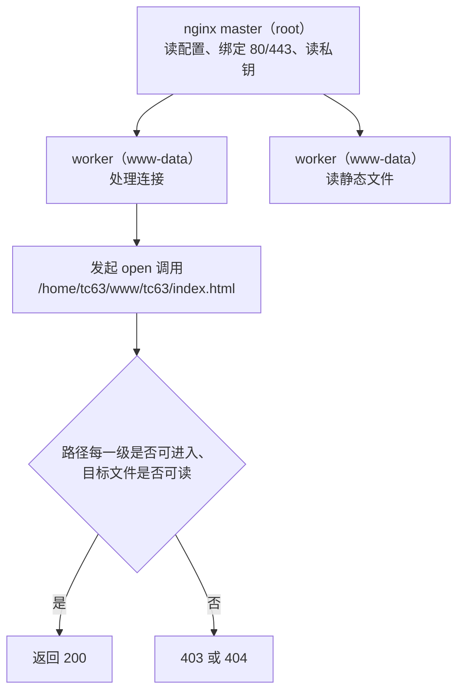

# 文件权限与 nginx 读取路径

HTTPS 这一侧的权限要求是私钥 600 且属主 root，静态文件那一侧的要求正好相反：nginx 的 worker 进程以非特权用户运行，必须能穿过路径上的每一级目录、读到每一个文件。个人主页的站点文件放在 `/home/tc63` 下面，而家目录默认不允许其他用户进入，于是权限成为这条链路上最容易出错的一环。

读取路径上的要求可以按「进程身份 → 路径逐级检查 → 软链接 → 更新脚本」的顺序逐项确认，最后落到账号边界上的现有状态与改进方向。对象是服务器上的 `/home/tc63` 目录树与两份更新脚本。

## worker 进程以什么身份读文件

nginx 启动后有一个 master 进程与若干 worker 进程。master 以 root 运行，负责读配置、绑定端口与读证书私钥；worker 降权到 `www-data`（Debian 与 Ubuntu 的 nginx 包默认值），负责处理连接与读静态文件。请求落到 `/tc63/` 时，执行打开文件动作的是 worker。



这一分工解释了两种权限为什么方向相反而互不冲突：私钥由 master 在启动阶段读入内存，worker 不需要碰它；静态文件由 worker 随时打开，必须对 `www-data` 可读。

## 路径上每一级目录都要有 x

Linux 打开 `/home/tc63/www/tc63/index.html` 时，内核沿路径逐级检查：每一级目录都需要对目标进程有执行位 `x`，最后一级文件需要读位 `r`。任何一级缺 `x`，后续路径都不可达，返回的是权限错误而不是「文件不存在」。

| 路径组件 | 作用 | 对 www-data 的要求 | 现状 |
| --- | --- | --- | --- |
| `/` | 根 | `x` | 默认满足 |
| `/home` | 目录 | `x` | 默认满足 |
| `/home/tc63` | 家目录 | `x` | 默认不满足，需专门打开（`personal-homepage-research/15-deploy-tc63.md:91`） |
| `/home/tc63/www` | nginx 的 `root` | `x` | 由 `chmod -R o+rX` 覆盖 |
| `/home/tc63/www/tc63` | 指向 `~/site/dist` 的软链 | 解析目标需要路径上的 `x` | 见下一节 |
| `/home/tc63/site/dist` | 实际产物目录 | `x`（目录）与 `r`（文件） | 由更新脚本每次修复 |
| 目标 `.html`、`.css` 等 | 静态文件 | `r` | 打包产物默认 644 |

家目录的默认权限不包含 `o+x`，所以「文件在 `/home/tc63` 里」本身就是一道门槛。这条链上一次只错一级，表现都是访问 `/tc63/` 返回错误，需要从 `/home/tc63` 开始逐级核对。

## 家目录穿透的两种做法

服务器上采用的做法是给家目录补 `o+x`（`personal-homepage-research/15-deploy-tc63.md:91`）：

```bash
chmod o+x /home/tc63
chmod -R o+rX /home/tc63/www
```

`o+x` 只加执行位，不加读位：其他用户能穿过家目录进入已知路径，但列不出家目录的内容。这是让 nginx 读到文件的通行做法，代价是家目录里的目录名对其他本地用户不再保密。

另一条路是不放开家目录，改用组或 ACL 授权。可行方式有把 `www-data` 加入文件所属组后用 `g+rX` 放开，或用 `setfacl -m u:www-data:x /home/tc63` 单独授权。这两种做法需要服务器上有对应的组关系或 `acl` 挂载选项与 `setfacl` 命令，本工程未采用，属于可选的替代方案（通用做法，未在服务器上验证）。

## 站点树的可读位与它的代价

`chmod -R o+rX` 把整棵树的权限一次性放开。这里的 `X` 是大写形式，只在目录上补执行位，对普通文件不补；`r` 则递归加到所有文件上。结果是目录可进入、文件可读，而不需要给每个文件单独设执行位。

| 权限 | 对象 | 效果 |
| --- | --- | --- |
| `o+x` | 目录 | 能进入、能按已知路径访问，不能列目录内容 |
| `o+rX`（目录） | 目录 | 能列出内容并进入 |
| `o+rX`（文件） | 普通文件 | 可读，不改变执行位 |

代价是站点树对所有本地用户可读。静态构建产物本身就是给公网看的，这一点可以接受；但同一棵树下不能放密钥、`.env`、数据库口令一类文件。个人主页把产物放在 `dist/` 并整树放开，源码与 `node_modules` 在仓库根，不在被放开的那一层。

## 软链接把仓库产物接到站点根

nginx 的配置是 `root /home/tc63/www`，而构建产物在 `/home/tc63/site/dist`。两者用一条软链接连接（`personal-homepage-research/15-deploy-tc63.md:129`、`README.md:163`）：

```bash
rm -rf ~/www/tc63 && ln -s /home/tc63/site/dist ~/www/tc63
```

于是 `git pull` 更新 `~/site/dist` 之后，站点立即跟着变，不需要复制文件，也不需要改 nginx 配置。请求路径的解析过程如下。


软链接本身不需要权限位，但解析目标路径时内核要检查链上每一级目录的 `x`。这里出现两个方向：经 `/home/tc63/www` 进入，以及解析后落在 `/home/tc63/site` 下。两侧都要可进入，只放开 `www` 而不放开 `site` 时，症状是 `/tc63/` 返回错误而文件名看起来完全正确。

顺带说明 `root` 与 `alias` 的取舍：文件本来就放在 `/home/tc63/www/tc63/` 这一层，用 `root` 直接拼接最省事；`alias` 与 `try_files` 组合在路径拼接上容易出错，服务器上的配置也确认用了 `root`（`personal-homepage-research/15-deploy-tc63.md:79-80`）。

## 更新脚本里的两行权限修复

服务器侧每次拉取后都要修一次权限，理由是 `git pull` 新增的文件权限由服务器上的 umask 决定，目录上的 `o+x` 也不会因为文件内容没变而被保留。脚本放在仓库外面，避免被 `git pull` 的目录语义影响（`personal-homepage-research/15-deploy-tc63.md:123-130`）：

```bash
git pull --ff-only origin main
chmod o+x "$HOME" "$(dirname "$0")"; chmod -R o+rX dist
```

第一行拉取产物，第二行补齐两处：家目录与脚本所在目录（也就是 `~/site`）的 `o+x`，以及 `dist` 整树的可读位。`README.md:159` 把这步记作 `~/update-tc63.sh`，内容是 `cd ~/site && git pull && 修权限`。

本地侧的 `deploy.sh` 不参与权限：它只做构建、提交与推送，不连服务器（`deploy.sh:9-13`）。两侧解耦之后，本地机器不需要服务器凭据，服务器拉的是公开仓库，用匿名 HTTPS 即可（`personal-homepage-research/15-deploy-tc63.md:110-113`）。

## 账号边界与最小权限

服务器上可登录的账号是 `tc63`（uid 1005），sudo 组里原本只有 `ubuntu`（`personal-homepage-research/15-deploy-tc63.md:16`）。启用 nginx 的 location 需要写 `/etc/nginx` 并 reload，属于 root 操作，所以那一步是在临时给 `tc63` 开 sudo 后执行的（`personal-homepage-research/15-deploy-tc63.md:163-167`）。

文档里给出的后续处理是收回 sudo 并改用 SSH key 登录（`personal-homepage-research/15-deploy-tc63.md:167`、`:171`）。现状记录中，本地到服务器的免密登录公钥已经被删除，`authorized_keys` 是空文件（`personal-homepage-research/15-deploy-tc63.md:111-113`）。

| 项 | 现状 | 方向 |
| --- | --- | --- |
| 登录方式 | 密码登录 | 改用 SSH key，轮换密码（`personal-homepage-research/15-deploy-tc63.md:171`） |
| 提权 | 曾临时给 `tc63` 开 sudo | 用完收回（`:167`） |
| 站点文件 | `www-data` 靠 `o+rX` 读取 | 保持公网可见内容的只读放开 |
| 证书私钥 | 600 root | 不因站点权限需求而改动 |
| 仓库凭据 | 公开仓库，匿名拉取 | 不需要在服务器上放 token |

这份清单里的四项是已经落地的事实，两项（SSH key、收回 sudo）是文档提出的改进方向，尚未在服务器上确认完成。

## 易错点

| 现象 | 原因 | 判据 |
| --- | --- | --- |
| `/tc63/` 返回 403 | 路径上某一级目录对 `www-data` 缺 `x` | 用 `namei -l /home/tc63/www/tc63/index.html` 逐级看权限 |
| 更新后静态资源忽然 403 | `git pull` 新增的目录没有 `o+x` | 重跑更新脚本里的 `chmod o+rX dist` |
| 只放开 `www` 仍打不开 | 软链目标在 `~/site` 下，那一级缺 `x` | 检查 `~/site` 与 `dist` 两级 |
| 页面能打开但样式丢失 | 部分子目录没有可读位 | 对整棵 `dist` 递归核对 |
| 为排查把私钥改成 644 | 把静态文件权限的结论套到证书上 | 证书与站点目录是两套要求，恢复 600 root |
| 用列目录方式验证 `o+x` | `o+x` 不提供读位，`ls` 本来就会失败 | 用 `stat` 或直接请求已知路径 |

## 小结

### 核心概念

- worker 进程以 `www-data` 运行，读静态文件；master 以 root 运行，读私钥。
- 打开文件要求路径上每一级目录都有 `x`，最后一级文件有 `r`。
- `o+x` 让其他用户穿过家目录但不列出内容；`o+rX` 递归放开站点树。
- 软链接把 `~/www/tc63` 接到 `~/site/dist`，两侧路径都要可进入。

### 设计权衡

| 决策 | 选择 | 收益 | 代价 |
| --- | --- | --- | --- |
| 家目录处理 | 补 `o+x` | 一条命令解决穿透，不改用户与组 | 家目录下的目录名对其他本地用户可见 |
| 站点树权限 | `o+rX` 递归放开 | 新文件加入后不需要逐个授权 | 整棵树对所有本地用户可读 |
| 站点根接入方式 | 软链接到 `dist` | `git pull` 后立即生效，配置不动 | 解析链变长，路径上多两级要检查 |
| 更新与权限修复 | 放在服务器侧脚本 | 本地不需要服务器凭据 | 每次更新多一步，忘记执行就出现 403 |

## 练习

### 基础题

1. 说明 `/home/tc63` 为什么需要 `o+x`，以及加了这个位之后其他用户能不能列出家目录内容。
2. `chmod -R o+rX` 里大写 `X` 与 `x` 的差别是什么？对普通文件分别有什么效果？
3. 用一条命令列出 `/home/tc63/www/tc63/index.html` 路径上每一级的权限，并指出哪一级由 `www-data` 决定成败。

### 挑战题

4. 站点从 `/home/tc63/www/tc63/` 换成直接放在 `/home/tc63/site/dist/`，列出需要同步修改的 nginx 指令与权限命令，并说明少改哪一处会先出现什么现象。

5. 设计一套不放开家目录、只对 `www-data` 授权的方案，写出所需命令，并说明它与 `o+rX` 方案在新增文件时的维护差别。

6. 假设 `git pull` 后只有新目录缺 `o+x`、旧文件仍然可读，解释为什么现象是部分资源 403 而不是整站不可用。

### 附：本页引用的路径

| 路径 | 用途 |
| --- | --- |
| `personal-homepage-research/15-deploy-tc63.md` | 权限命令、软链接、更新脚本、账号与 sudo 现状（`:16`、`:91`、`:110-113`、`:123-130`、`:163-167`、`:171`） |
| `README.md` | 服务器侧更新脚本与 nginx root（`:158-164`） |
| `deploy.sh` | 本地只与 GitHub 交互的分工说明（`:9-13`） |
| `/home/tc63/www`、`/home/tc63/site/dist` | 站点根与产物目录（服务器路径，未在本机核对） |
| `/etc/nginx/sites-available/knowledgediver` | `root /home/tc63/www` 的来源（服务器文件） |