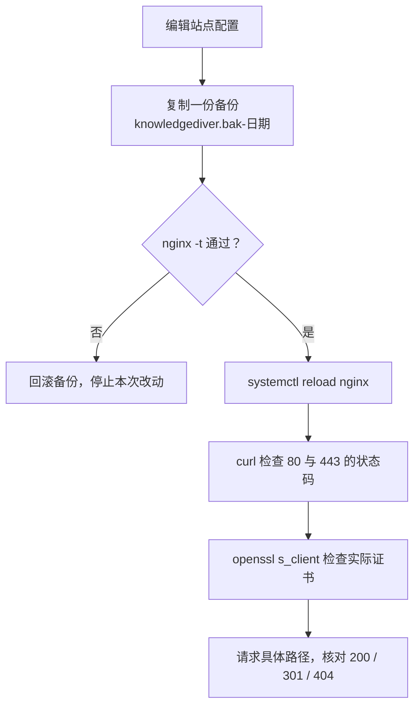
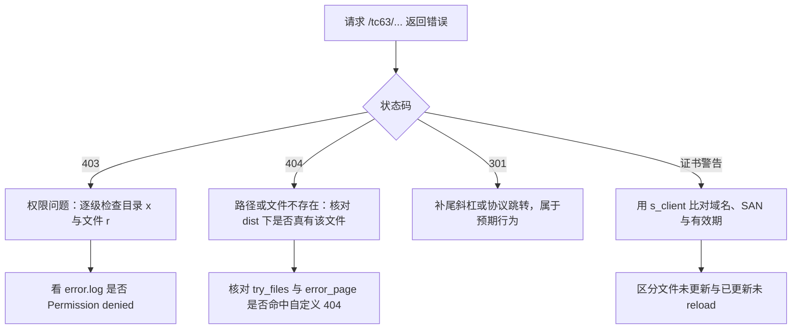

# 上线验证与故障分层

改完 nginx 配置或站点权限之后，需要确认三件事：配置本身能不能通过语法检查、生效的证书与服务是不是期望的那一份、路径与权限组合起来能不能返回正确内容。三件事的检查手段不同，混在一起做会浪费时间。

按同一顺序走下去就能得到可执行的检查命令与判定依据，其中 403 与 404 在权限问题上的区分方式最容易走偏。对象是服务器上的 nginx 与 `/tc63/` 这条路径，验证记录取自部署时的实测结果。

## 改动后的动作顺序

服务器上启用 `/tc63/` 的脚本只做一件事：备份配置，插入 location，`nginx -t` 通过才 reload，不通过就回滚到备份（`personal-homepage-research/15-deploy-tc63.md:63-80`）。这套顺序适合沿用到所有手工改动里，因为 reload 会用新配置替换工作进程，语法错误会让服务直接不可用。



备份名在实测记录里是 `knowledgediver.bak-20261007-020423`（`personal-homepage-research/15-deploy-tc63.md:159`），格式是配置名加时间戳。回滚动作是把备份复制回 `sites-available` 后再次校验并重载。

## 用 openssl s_client 看实际生效的证书

浏览器看到的证书来自 nginx 内存，不是磁盘上的文件。服务端已经 reload、客户端没有连接缓存时，下面的命令返回的就是当前生效的证书信息：

```bash
openssl s_client -connect knowledgediver.cloud:443 \
  -servername knowledgediver.cloud </dev/null 2>/dev/null \
  | openssl x509 -noout -dates -subject -ext subjectAltName
```

输出里要看三项：`notAfter` 的日期是否已经更新到最近一次续期之后、`subject` 的域名、`subjectAltName` 里是否包含签发时给的两个域名。命令带 `-servername`，与浏览器发 SNI 的行为一致，否则服务端可能返回默认 server 块的证书。

磁盘上的文件与内存中的证书可以直接比对：`openssl x509 -noout -dates -in /etc/letsencrypt/live/knowledgediver.cloud/fullchain.pem` 读文件，前一条命令读服务。两者日期不一致就说明续期写入了文件但没有 reload。

## 从状态码区分权限与内容问题

`/tc63/` 返回 403 与返回 404 的原因不同。403 表示 nginx 找到了目标但无权打开，多与目录缺 `x` 或文件缺 `r` 有关；404 表示按 `try_files` 找不到文件，配置里的 `error_page 404 /tc63/404.html` 会把它替换成自定义页面（`personal-homepage-research/15-deploy-tc63.md:74-75`）。



判断权限问题时，错误日志比状态码更直接：`tail -n 20 /var/log/nginx/error.log` 里出现 `Permission denied` 或 `stat() failed`，就按路径逐级核对 `x` 位。日志里没有权限字样、只有 `open() ... failed (2: No such file or directory)` 时，属于路径或产物缺失。

## 线上回归清单

部署记录里的实测覆盖了域名根、子路径的入口与子路径内部的资源（`personal-homepage-research/15-deploy-tc63.md:155-161`）。这套清单可以直接作为改动后的回归项。

| 请求 | 期望 | 检查点 |
| --- | --- | --- |
| `http://knowledgediver.cloud/tc63` | 301 到 `/tc63/` | 补尾斜杠的 location 生效 |
| `https://knowledgediver.cloud/tc63/` | 200 | 入口页面与证书 |
| `https://knowledgediver.cloud/tc63/about/` | 200 | 子页面路径 |
| `https://knowledgediver.cloud/tc63/docs/` | 200 | 文档区入口 |
| `https://knowledgediver.cloud/tc63/docs/search-index.json` | 200 | 构建期生成的资源 |
| `https://knowledgediver.cloud/tc63/favicon.svg` | 200 | 站点根下的静态文件 |
| `https://knowledgediver.cloud/tc63/nope/` | 404 | 自定义 404 页 |
| `https://knowledgediver.cloud/` | 200 | 域名根未受影响 |

最后一行是回归里容易被忽略的一项：改动插入的是共享 server 块，域名根的 KnowledgeDiver 必须保持原状（`personal-homepage-research/15-deploy-tc63.md:173`）。另外还要核对页面的 `canonical` 是否为 `https://knowledgediver.cloud/tc63/`，它由构建时的 `site` 与 `base` 决定（`astro.config.mjs:16-17`）。

## 构建产物在本地先验一次

本地构建阶段有两道廉价检查，能在推送到服务器之前发现路径前缀问题。`deploy.sh` 在构建后确认 `dist/index.html` 存在，并用 `grep` 检查链接是否带 `/tc63/` 前缀（`deploy.sh:25-29`）；`astro preview` 下可以逐个请求 `/tc63/` 开头的路径，确认资源命中。

GitHub Pages 那一侧走的是另一套前缀：构建时传 `SITE_BASE=/TC63PersonalWebsite`，产物供项目站点使用（`.github/workflows/deploy.yml:29-31`）。两套产物的前缀不同，验证时不要拿 Pages 的产物去核对服务器路径。

## 服务器上可用的工具受限

这台服务器上没有 `python3`、`curl`、`wget`（`personal-homepage-research/15-deploy-tc63.md:82-89`）。`python3` 是个断链，实际 Python 只存在于 KnowledgeDiver 的虚拟环境里。可用的工具是 `awk`、`sed`、`perl`、`nc` 与 busybox 一套。

要在服务器上直接验证，可以用 `nc` 手工发一次 HTTP 请求：

```bash
printf "GET /tc63/ HTTP/1.0\r\nHost: knowledgediver.cloud\r\n\r\n" \
  | nc 127.0.0.1 80 | head -n 8
```

这只能确认本机 80 端口的响应，证书与外部可达性要在本地机器上用 `curl` 与 `openssl` 验证。部署记录里的线上状态码就是在外网侧测的（`personal-homepage-research/15-deploy-tc63.md:160`）。

## 权限与证书故障的分层判定

两类故障的症状都是「页面不对」，但检查位置完全不同。按下面这张表先分类，再进入各自的排查路径。

| 症状 | 先查 | 再查 | 不查 |
| --- | --- | --- | --- |
| 浏览器提示证书无效 | `openssl s_client` 的域名与有效期 | 证书文件是否存在、是否已 reload | 站点文件权限 |
| 页面返回 403 | `nginx` error.log 的 `Permission denied` | 路径逐级 `x` 位 | 证书 |
| 页面返回 404 | `dist` 下是否有该文件 | `try_files` 与 `error_page` | 证书与目录 `x` |
| 部分资源 403、页面本身正常 | 新增子目录的权限位 | 更新脚本是否执行过 | 证书 |
| 改动后整站不可用 | `nginx -t` 的结果 | 是否已回滚备份 | 站点内容 |

## 易错点

| 现象 | 原因 | 处理 |
| --- | --- | --- |
| `nginx -t` 没过就 reload | 顺序颠倒，服务被错误配置替换 | 先校验；失败时回滚备份再 reload |
| 只看磁盘证书、不看服务实际证书 | 两者可能不一致 | 用 `s_client` 验证服务端返回的那一份 |
| 把 403 当成 404 处理 | 两者原因不同 | 403 查权限与 error.log，404 查文件与 try_files |
| 在服务器上找 curl | 这台机器没装 | 用 `nc` 验证本机响应，外部验证放到本地 |
| 拿 Pages 产物核对服务器路径 | 两套 base 前缀不同 | 服务器版本默认 `/tc63`，Pages 版本带 `/TC63PersonalWebsite` |
| 改动后只验证子路径 | 共享 server 块可能影响域名根 | 回归清单里保留 `https://knowledgediver.cloud/` 一项 |

## 小结

### 核心概念

- 顺序固定：备份、编辑、`nginx -t`、reload、分层验证。
- 证书验证看服务端返回的那一份，与磁盘文件比对能定位「已续期但未重载」。
- 403 属于路径权限问题，404 属于文件与 `try_files` 问题。
- 回归清单要覆盖子路径内部资源与域名根两条线。

### 设计权衡

| 决策 | 选择 | 收益 | 代价 |
| --- | --- | --- | --- |
| 配置改动方式 | 备份加校验加回滚 | 出错时服务不中断 | 每次改动多两步操作 |
| 验证位置 | 服务器测本机响应、本地测外部表现 | 绕开服务器工具缺失 | 需要两边配合 |
| 状态码与日志 | 两者都看 | 能区分权限与内容问题 | 需要登录服务器读日志 |
| 回归范围 | 同时覆盖 `/tc63/` 与 `/` | 及早发现共享配置的连带影响 | 检查项比单页验证多 |

## 练习

### 基础题

1. 写出校验并重载 nginx 的两条命令，并说明校验失败时应该做什么。
2. 请求 `/tc63/` 返回 403 与 404，分别先看哪一处证据？
3. 用一条命令读出服务端当前证书的 `notAfter`。

### 挑战题

4. 续期后没有 reload，写出比对磁盘证书与服务端证书的两条命令，并说明如何根据结果判断是「文件没更新」还是「更新了没重载」。

5. 服务器上没有 `curl`，设计一套只用 `nc` 与本地工具的验证流程，覆盖 80 的跳转与 443 的证书。

6. 改动插入的 location 与域名根共享 server 块。列出至少三条回归请求，说明每条在保护什么。

### 附：本页引用的路径

| 路径 | 用途 |
| --- | --- |
| `personal-homepage-research/15-deploy-tc63.md` | 校验与回滚顺序、工具受限情况、线上状态码与回归结果（`:63-80`、`:82-89`、`:155-161`、`:173`） |
| `deploy.sh` | 本地构建后的前缀检查（`:25-29`） |
| `.github/workflows/deploy.yml` | Pages 侧的 `SITE_BASE`（`:29-31`） |
| `astro.config.mjs` | `site` 与 `base` 决定 canonical（`:16-17`） |
| `README.md` | 线上地址与服务器侧更新（`:143`、`:155-164`） |
| `/var/log/nginx/error.log`、`/etc/letsencrypt/live/` | 错误日志与证书文件（服务器路径，未在本机核对） |