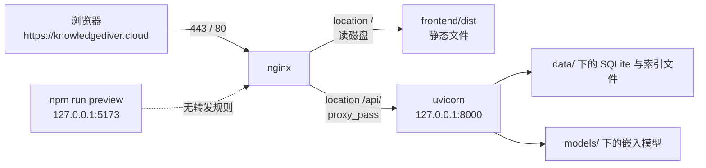
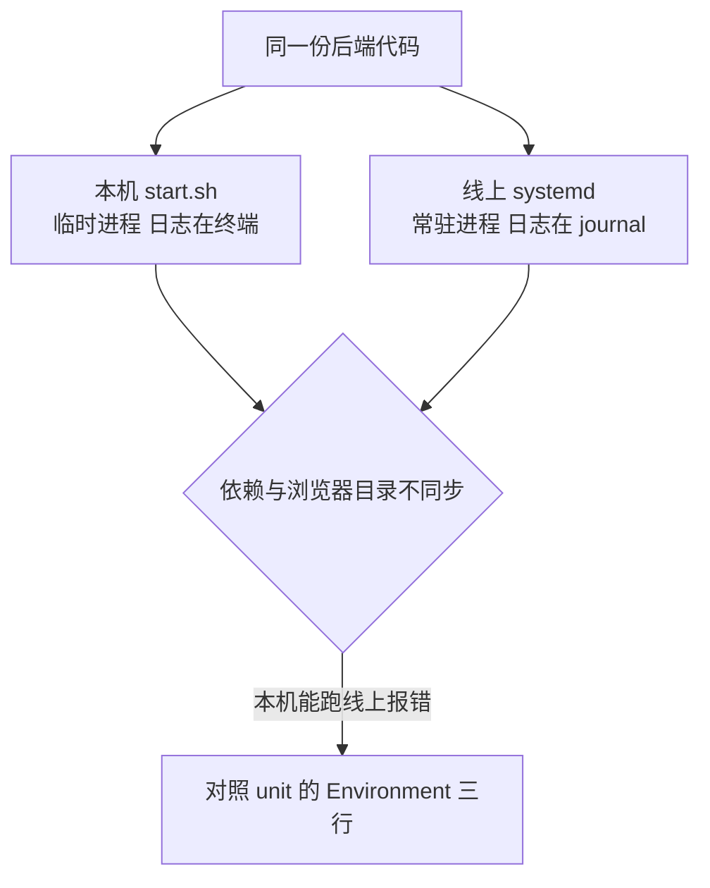

# 云主机与三个进程

买完一台云主机、把域名解析过去之后，最先要回答的问题是「线上到底有几个进程在跑、它们各自守着哪个端口」，"怎么装环境"可以放到后面再管。KnowledgeDiver 的答案写在 `deploy/` 目录里：一个 nginx 守着 80 与 443，一个 uvicorn 后端守着本机的 8000，前端则被编译成静态文件交给 nginx 直接发。把这条路径理顺之后，后面 systemd 的每一行配置、部署脚本的每一步都能对上位置。

把这条路径画出来之后，为什么后端只监听 127.0.0.1、为什么前端还留着一个没被对外使用的 service 都能对上位置；腾讯云控制台里必须手动做的两件事与首次启动会下载的东西也一并列出。

## 一台云主机上的三个角色

线上对外只有一个入口，就是 nginx 的 80 与 443。`deploy/deploy.sh:40-64` 生成的 server 块里，`location /` 指向 `frontend/dist`，`location /api/` 转发到 `http://127.0.0.1:8000/api/`。也就是说，浏览器看到的页面来自磁盘上的静态文件，页面里的接口请求被 nginx 转交给本机的后端进程。

| 角色 | 监听 | 由谁拉起 | 对外可见 |
| --- | --- | --- | --- |
| nginx | 0.0.0.0:80、443 | 系统包自带的 nginx.service | 是 |
| uvicorn 后端 | 127.0.0.1:8000 | `knowledgediver.service` | 否，只经 nginx 转发 |
| 前端构建产物 | 不监听，磁盘目录 | 不需要进程 | 是，由 nginx 读文件 |
| 前端预览进程 | 127.0.0.1:5173 | `knowledgediver-frontend.service` | 否，nginx 并未指向它 |

这张表里最容易被忽略的是最后一行。仓库里确实有一个前端 service（`deploy/knowledgediver-frontend.service:8`），它执行 `npm run preview -- --host 127.0.0.1 --port 5173`，但 `deploy/nginx.conf` 与 `deploy.sh` 生成的配置都只读 `dist` 目录，没有任何一行把请求转给 5173。它是早期把前端也当常驻进程时的遗留，实际线上不起决定作用。

## 请求从公网进来之后走哪条路

以一次页面加载为例。浏览器先取 `/`，nginx 在 `dist` 里找到 `index.html`；页面里的脚本再请求 `/api/...`，nginx 按前缀匹配到代理规则，把请求交给 8000 端口，拿到响应之后再回给浏览器。整个过程里 nginx 是唯一接触公网的进程。

代理段里有两行与流式响应有关：`proxy_buffering off`（`deploy/nginx.conf:23`）和 `proxy_read_timeout 86400`（`deploy/nginx.conf:24`）。前者关掉 nginx 的响应缓冲，避免边生成边发送的结果被攒在 nginx 里；后者把读超时放到 24 小时，给长任务留空间。这两行是 SSE 场景的配置，具体机制见 `docs/32-nginx 配置/03-SSE与流式代理/`。

还有一行 `client_max_body_size 25m`（`deploy/nginx.conf:22`）。默认值 1m 会在上传稍大的文件时直接返回 413，而 413 是 nginx 自己回的，后端日志里什么都看不到，这是排查时容易走错方向的一个点。

## 为什么后端只监听 127.0.0.1

`ExecStart` 里的 `--host 127.0.0.1`（`deploy/knowledgediver.service:10`）让 uvicorn 只接受来自本机的连接。这样做有两层好处：公网无法绕过 nginx 直接访问 8000；后端也不需要自己处理 TLS 与跨域。代价是调试时必须通过 nginx，或者先 ssh 登上去再访问本机端口。

如果临时想让后端直接接受外部请求，把 `--host` 改成 `0.0.0.0` 并在云主机安全组里放行 8000 也能通，但这等于让接口完全暴露且没有证书，不应当作为常规做法。

## 安全组与域名解析：控制台里的两步

仓库里没有安全组与 DNS 的配置，因为它们不在代码里，而在腾讯云控制台：

1. 安全组入站规则放行 TCP 22、80、443。只放行 22 时，nginx 装好了也访问不到。
2. 域名解析把 `knowledgediver.cloud` 与 `www.knowledgediver.cloud` 的 A 记录指向云主机的公网 IP。解析没生效时，`certbot` 申请证书会失败。

`deploy.sh` 默认域名就是 `knowledgediver.cloud`（`deploy/deploy.sh:8`），也可以在执行时把域名作为第一个参数传进去。脚本不会替你检查解析，它只是把域名写进 nginx 配置并尝试申请证书。

## 目录布局与文件归属

部署脚本假设应用目录是仓库根目录（`deploy/deploy.sh:10` 取脚本所在目录的上一级），而仓库自带的 service 文件写死为 `/opt/knowledgediver`（`deploy/knowledgediver.service:7`）。两种路径都能跑，关键在于 `WorkingDirectory`、`ExecStart` 里的解释器路径、`PLAYWRIGHT_BROWSERS_PATH` 三者必须指向同一个目录，否则会出现"服务起来了但浏览器找不到"这种半故障。

| 目录或文件 | 作用 | 出处 |
| --- | --- | --- |
| `.venv/` | Python 虚拟环境，uvicorn 与后端依赖都在里面 | `deploy/deploy.sh:25-29` |
| `frontend/dist/` | 前端构建产物，nginx 的 root | `deploy/nginx.conf:10` |
| `.playwright/` | 项目内的浏览器，抓取功能依赖它 | `server_start.sh:19` |
| `models/` | 嵌入模型目录，可预先上传 | `deploy/deploy.sh:155-156` |
| `data/` | 运行期数据，升级时不应被覆盖 | 素材目录 `/mnt/d/KnowledgeDiver/data/` |

## 首次启动会下载什么

后端第一次起来时会拉取嵌入模型（`deploy/deploy.sh:154` 提示约 95MB），走的是 `HF_ENDPOINT=https://hf-mirror.com` 这个镜像（`deploy/deploy.sh:127`）。抓取功能还需要 Playwright 的浏览器，脚本把它装进项目内的 `.playwright`（`deploy/deploy.sh:128`），并额外校验 systemd 的 Environment 里有没有这一项（`server_start.sh:139-145`）。

这两件事解释了为什么"服务 active 但功能报错"很常见：进程起来了不代表模型与浏览器就位。判断方法是直接看日志里有没有下载进度或浏览器路径，而不是只看 `systemctl status` 的颜色。

## 同一份代码的两种运行方式

本机跑 `start.sh` 与线上跑 systemd，用的是同一份代码，环境却不同。`start.sh` 会在缺 `.venv` 时自动创建，会顺手修正 `ALL_PROXY` 里的协议前缀，还会把浏览器目录 export 到当前 shell（`start.sh:10-28`）；systemd 不会做这些，它只认 unit 里的三行 `Environment`。所以"本机能跑、线上报错"的差异往往不在代码，而在这些启动差异上。

| 项 | 本机 `start.sh` | 线上 systemd |
| --- | --- | --- |
| 虚拟环境 | 缺失时自动创建 | 部署脚本提前建好 |
| 代理变量 | 自动修正前缀 | 不处理 |
| 浏览器目录 | export 到当前 shell | 写在 unit 的 Environment |
| 进程存续 | 随终端退出而结束 | 由 systemd 托管并自愈 |
| 日志 | 打在终端 | 进 journal |

## 常见判断偏差

| # | 判断偏差 | 表现 | 依据 |
| --- | --- | --- | --- |
| 1 | 认为前端是常驻进程 | 去重启 `knowledgediver-frontend` 却发现页面没变化 | 对外页面由 nginx 读 `dist` |
| 2 | 认为后端也监听公网 | 用公网 IP 加 8000 去试，结果超时 | `ExecStart` 里是 `127.0.0.1` |
| 3 | 把 413 归因到后端 | 后端日志里找不到这次请求 | 体积上限由 nginx 的 `client_max_body_size` 决定 |
| 4 | 只放行 22 端口 | ssh 正常、网页打不开 | 安全组是云平台侧配置，不在仓库里 |
| 5 | 域名解析未生效就申请证书 | certbot 报失败但脚本继续执行 | `deploy/deploy.sh:110` 吞掉错误继续 |
| 6 | 换目录部署却不改 service | 服务起来但找不到浏览器或模块 | 三处路径必须指向同一目录 |

## 小结

### 核心概念

- 对外只有 nginx 一个入口，80 与 443 由它监听，静态文件直接读 `dist`，接口请求转发到本机 8000。
- 后端 uvicorn 只监听 127.0.0.1，公网访问必须经过 nginx。
- 前端 service 使用 5173 预览端口，但没有任何转发指向它，属于遗留配置。
- 安全组与域名解析在腾讯云控制台完成，仓库里没有对应文件。
- 应用目录、解释器路径与浏览器路径三者必须一致。

### 设计权衡

| 权衡点 | 本工程的选择 | 收益与代价 |
| --- | --- | --- |
| 入口暴露面 | 只暴露 nginx 的 80 与 443 | 证书与跨域都集中在 nginx；代价是调试必须走代理或登录主机 |
| 前端形态 | 构建成静态文件交给 nginx | 少一个常驻进程、少一份内存；代价是构建与部署脚本耦合 |
| 模型与浏览器 | 首次启动按需下载 | 镜像小、部署脚本简单；代价是首启依赖外网与镜像源 |
| 目录约定 | 脚本按仓库根，service 文件写 `/opt` | 两种都能用；代价是路径不一致时故障表现隐蔽 |
| 前端 service | 保留但不参与对外服务 | 便于本机预览；代价是容易被误当成线上入口 |

## 练习

### 基础题

1. 画出浏览器到后端的一条完整请求路径，标出每一跳的端口与进程名。
2. 说明 `proxy_buffering off` 与 `proxy_read_timeout 86400` 各自解决什么问题。
3. 为什么上传超过 25MB 的文件时后端日志里看不到这次请求？
4. 列出在腾讯云控制台必须完成的两步配置，并说明各自漏掉时的现象。

### 挑战题

5. 如果要把后端直接暴露到公网（不使用 nginx），需要改哪几处配置？列出改动点与风险。
6. 设计一次"目录搬家"：把应用从 `/opt/knowledgediver` 换到 `/srv/kd`，写出需要修改的文件与验证顺序。
7. 线上出现"页面正常、接口 502"，写出三条从外到内的排查命令，并说明每条命令能排除什么。
8. 首次启动卡在模型下载，设计一个离线部署方案，写出需要预先准备的文件与放置位置。

## 附：本页引用的路径

| 路径 | 用途 |
| --- | --- |
| `/mnt/d/KnowledgeDiver/deploy/deploy.sh` | 一键部署六步、默认域名、nginx 配置生成与 systemd 写入 |
| `/mnt/d/KnowledgeDiver/deploy/nginx.conf` | 静态目录、`/api/` 代理与超时配置 |
| `/mnt/d/KnowledgeDiver/deploy/knowledgediver.service` | 后端 unit 的目录、环境变量与启动命令 |
| `/mnt/d/KnowledgeDiver/deploy/knowledgediver-frontend.service` | 前端预览 unit 及 5173 端口 |
| `/mnt/d/KnowledgeDiver/server_start.sh` | 更新脚本：依赖、浏览器校验、重启顺序 |
| `docs/32-nginx 配置/03-SSE与流式代理/` | 代理缓冲与长连接的展开讲解 |
