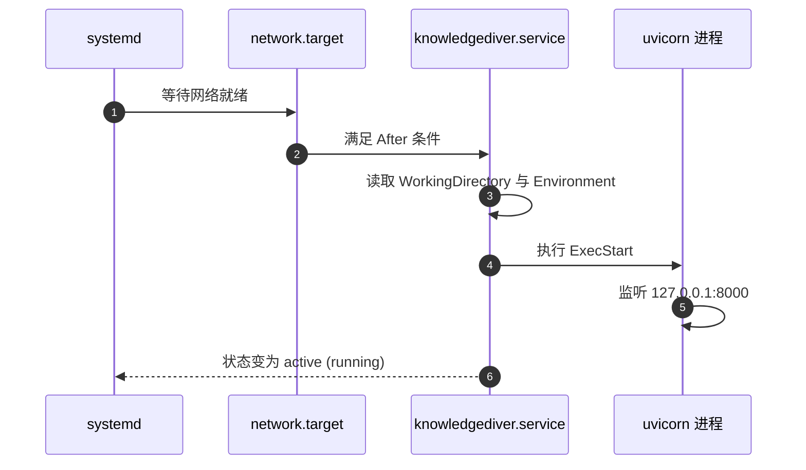
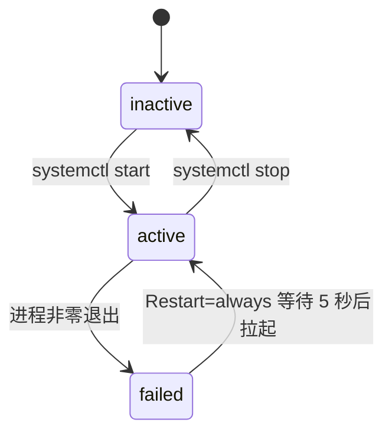

# systemd 如何托管后端

ssh 登上云主机，敲 `systemctl status knowledgediver`，屏幕上会给出一个 Main PID、一行 `active (running)` 和最近几条日志。这几项都由 systemd 根据 `deploy/knowledgediver.service` 这份十几行的配置文件托管出来，后端自己并不打印它们。读懂这十几行，等于读懂了后端进程的目录、环境、启动命令与死亡后的行为。

unit 文件的三段结构对上 `ExecStart` 里的每个参数之后，仓库里两份长得不一样的 service 文件、日志与重启的实际命令，以及几个容易看错的地方都能串起来。

## 一份 unit 文件被 systemd 读成什么

unit 文件分成 `[Unit]`、`[Service]`、`[Install]` 三段。第一段描述"它是什么、什么时候可以启动"；第二段描述"怎么启动、失败怎么办"；第三段描述"开机时属于哪个 target"。

| 段 | 键 | 作用 |
| --- | --- | --- |
| Unit | `Description` | `systemctl status` 第一行显示的说明 |
| Unit | `After=network.target` | 网络就绪之后再启动 |
| Service | `Type=simple` | 启动命令就是主进程，不 fork |
| Service | `WorkingDirectory` | 进程的工作目录，相对路径的基准 |
| Service | `Environment` | 注入进程的环境变量，可写多行 |
| Service | `ExecStart` | 实际执行的命令行 |
| Service | `Restart=always` | 退出后总是重启 |
| Service | `RestartSec=5` | 两次重启之间等 5 秒 |
| Install | `WantedBy=multi-user.target` | 开机自启时的挂载点 |

`Type=simple` 是最常见的一种：systemd 认为 `ExecStart` 起来的进程就是服务本体，进程活着服务就是 running。uvicorn 不 fork 子进程，正好符合这个模型。

## 逐行读 ExecStart 里的每个参数

脚本生成的启动命令是 `ExecStart=$APP_DIR/.venv/bin/uvicorn backend.main:app --host 127.0.0.1 --port 8000`（`deploy/deploy.sh:129`）。其中 `$APP_DIR/.venv/bin/uvicorn` 用的是虚拟环境里的解释器入口，而不是系统 `uvicorn`，这样后端依赖与系统 Python 隔离；`backend.main:app` 指向应用对象；后两个参数决定只监听本机 8000。

环境变量有三行（`deploy/deploy.sh:126-128`）：`PYTHONPATH` 让 `backend` 包可以被找到；`HF_ENDPOINT` 指向国内镜像，模型下载走它；`PLAYWRIGHT_BROWSERS_PATH` 指向项目内的浏览器目录。三行缺一行都会以某种功能失败的形式暴露出来，而不是启动失败。

## 两份 service 文件的差异

仓库里同时存在两份 unit：`deploy/knowledgediver.service` 是手写留档版，`deploy/deploy.sh` 里用 `cat > /etc/systemd/system/knowledgediver.service` 生成的是实际安装版。两者只有三处不同：

| 项 | 留档版 | 脚本生成版 |
| --- | --- | --- |
| 目录 | `/opt/knowledgediver`（`deploy/knowledgediver.service:7-10`） | `$APP_DIR`，即仓库根（`deploy/deploy.sh:125-129`） |
| 浏览器路径 | 没有这一行 | 有 `PLAYWRIGHT_BROWSERS_PATH`（`deploy/deploy.sh:128`） |
| 其余键 | 与生成版一致 | 与留档版一致 |

差异里最有后果的是浏览器路径。`server_start.sh:139-145` 专门检查了这一行：脚本里的 `export` 不会传进 systemd 服务，如果 unit 里没有 `PLAYWRIGHT_BROWSERS_PATH`，后端运行时找不到项目内的浏览器。留档版照抄安装会踩到这个点。

## 进程死掉之后会发生什么

`Restart=always` 与 `RestartSec=5` 决定了自愈行为：无论退出码是什么，systemd 都等 5 秒再拉起一次。写代码时如果启动即崩，`systemctl status` 会看到 PID 不断更换、日志里重复同一段报错，这种"每 5 秒一条"的节奏本身就是线索。

需要注意的是，反复重启不会无限试下去之外的额外保护：没有 `StartLimitIntervalSec` 的限制时，崩溃循环会持续。排查这类问题的顺序是先把 `Restart` 临时停掉，手动执行 `ExecStart` 的那条命令看报错，定位完再恢复。

## 以前台身份运行意味着什么

两份 unit 都没有写 `User=`。system 级 unit 默认以 root 运行，这也是 `deploy.sh` 要求 `sudo` 的原因之一。以 root 运行的文件读写权限最宽松，但任何由接口触发的写操作也带着 root 的权限，部署脚本本身又要求用 root 执行，两者叠加之后权限问题的表现会变少、风险会变高。要收窄权限，需要补 `User=`、`Group=`，并把应用目录的属主改成对应的用户。

## 前端 service 与 nginx 的关系

`deploy/knowledgediver-frontend.service` 用 `npm run preview -- --host 127.0.0.1 --port 5173`（`deploy/knowledgediver-frontend.service:8`）把构建产物再起一个预览服务。nginx 的配置里没有任何一行指向 5173，对外页面始终由 `dist` 目录直接提供。`server_start.sh:166-178` 的处理顺序也印证了这一点：它优先 `systemctl restart knowledgediver-frontend`，服务没装时退化成 `nohup npm run preview`。两条路都不会影响对外访问。

## 重启与看日志的命令

| 目的 | 命令 |
| --- | --- |
| 看状态与最近日志 | `systemctl status knowledgediver` |
| 实时跟日志 | `journalctl -u knowledgediver -f` |
| 只重启后端 | `systemctl restart knowledgediver` |
| 改过 unit 之后 | `systemctl daemon-reload` 再 restart |
| 开机自启 | `systemctl enable knowledgediver` |
| 临时停掉自愈 | 改 `Restart=no` 后 `daemon-reload` |

日志没有写到文件，而是进了 journal。`systemctl status` 只显示最后几行，追一次完整启动过程要用 `journalctl -u knowledgediver --since "10 min ago"`。

## 常见判断偏差

| # | 判断偏差 | 表现 | 依据 |
| --- | --- | --- | --- |
| 1 | 认为服务日志写在项目目录 | 找遍目录看不到日志文件 | 没有配置 `StandardOutput`，输出进 journal |
| 2 | 改完 unit 直接 restart | 新配置没生效 | 需要先 `daemon-reload` |
| 3 | 用系统 `uvicorn` 复现 | 手动能跑、服务报模块缺失 | 服务用的是 `.venv` 里的解释器 |
| 4 | 把浏览器路径 export 在 shell 里 | 手动跑抓取正常、服务里失败 | shell 环境不传给 systemd |
| 5 | 把前端 service 当成对外入口 | 重启它却发现页面没变 | nginx 读的是 `dist`，不是 5173 |
| 6 | 崩溃循环时只看最后一行日志 | 分不清是启动失败还是依赖缺失 | 重复的 5 秒节奏说明在反复重启 |

## 小结

### 核心概念

- unit 分 `[Unit]`、`[Service]`、`[Install]` 三段，分别回答是什么、怎么跑、开机挂在哪。
- `Type=simple` 下 `ExecStart` 的进程就是服务本体，`WorkingDirectory` 决定相对路径的基准。
- 三行 `Environment` 分别管模块导入路径、模型下载镜像与浏览器目录。
- `Restart=always` 加 `RestartSec=5` 构成自愈，同时也会掩盖崩溃循环。
- 两份 service 的差异只在目录与浏览器路径，后者缺了会让抓取功能失败。
- 日志在 journal 里，`journalctl -u knowledgediver` 是主要入口。

### 设计权衡

| 权衡点 | 本工程的选择 | 收益与代价 |
| --- | --- | --- |
| 进程模型 | `Type=simple` 直接跑 uvicorn | 配置最少、日志直接；代价是没有多进程与平滑重启 |
| 运行身份 | 不写 `User=`，以 root 运行 | 免去权限排查；代价是应用侧写操作权限过大 |
| 环境注入 | 写死在 unit 的 `Environment` | 与 systemd 解耦、直观；代价是改配置要 `daemon-reload` |
| 前端形态 | 静态文件交给 nginx，同时留一个预览 service | 本机预览方便；代价是多一个空转进程与一处易误判的分支 |
| 自愈 | `always` 加固定 5 秒 | 偶发崩溃自动恢复；代价是持续崩溃时反复拉起 |

## 练习

### 基础题

1. 写出 unit 文件三段各自的职责，并指出 `After=network.target` 属于哪一段。
2. 解释 `WorkingDirectory` 与 `ExecStart` 里解释器路径之间的关系，换目录部署时为什么要同时改。
3. `PLAYWRIGHT_BROWSERS_PATH` 为什么必须在 unit 里写一遍，即使部署脚本里已经 export 过？
4. 用两条命令分别查看服务状态与实时日志。

### 挑战题

5. 把后端改成以专用用户运行：列出需要新增的 unit 键、目录属主调整与验证步骤。
6. 设计一次"启动即崩"的定位流程：写出如何临时停掉自愈、如何手动复现 `ExecStart`、如何判断是依赖缺失还是配置错误。
7. 两份 service 文件合并成一份（用 `EnvironmentFile` 承载路径）有哪些好处与代价？
8. 线上 nginx 重启后接口 502，但服务状态是 active，写出三条能区分"进程活着但没监听""监听了但 nginx 指错端口""代理配置未加载"的命令。

## 附：本页引用的路径

| 路径 | 用途 |
| --- | --- |
| `/mnt/d/KnowledgeDiver/deploy/knowledgediver.service` | 留档版后端 unit：三段结构与 `/opt` 目录 |
| `/mnt/d/KnowledgeDiver/deploy/knowledgediver-frontend.service` | 前端预览 unit 与 5173 端口 |
| `/mnt/d/KnowledgeDiver/deploy/deploy.sh` | 实际安装的 unit 生成段（目录、环境变量、启动命令） |
| `/mnt/d/KnowledgeDiver/server_start.sh` | 浏览器路径检查与前端重启的两条分支 |
| `/mnt/d/KnowledgeDiver/deploy/nginx.conf` | 静态目录与 `/api/` 代理，证明 5173 未被使用 |
