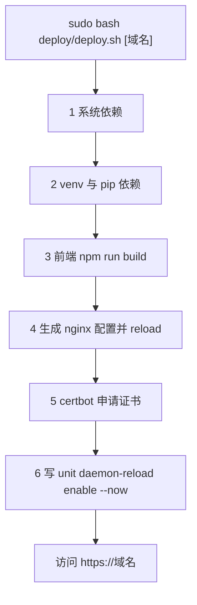

# 部署脚本与更新流程

第一次上线和后来的每次更新，是两个不同的动作。首装要装系统包、建虚拟环境、配 nginx、申请证书、写 systemd 并开机自启，这些事都放在 `deploy/deploy.sh` 里；日常改动只涉及同步代码、重装依赖、重建前端、重启服务，这一套在 `server_start.sh` 里。把两者混用会得到不必要的副作用，比如重跑首装脚本会覆盖 nginx 配置并再次尝试申请证书。

按首装的六步顺序走过脚本，每一步的幂等边界与失败表现都能看到；更新时为什么换脚本、停止服务该用哪一个，以及出问题回到哪一步看，也随之清楚。

## 首装的六步在做什么

`deploy.sh` 打印的进度是 `[1/6]` 到 `[6/6]`，对应的动作如下：

| 步骤 | 动作 | 出处 |
| --- | --- | --- |
| 1 | 装 nginx、certbot 与 Python 工具 | `deploy/deploy.sh` 的系统依赖安装段 |
| 2 | 建虚拟环境并安装依赖 | `deploy/deploy.sh` 的 venv 与 pip 依赖段 |
| 3 | 进入 `frontend` 构建 | `deploy/deploy.sh` 的前端构建段 |
| 4 | 生成并启用 nginx 配置 | `deploy/deploy.sh` 的 nginx 配置生成段 |
| 5 | 申请或复用 SSL 证书 | `deploy/deploy.sh` 的证书申请段 |
| 6 | 写入 unit 并启动服务 | `deploy/deploy.sh` 的 unit 写入与启动段 |

脚本开头有 `set -e`，任何一条命令返回非零都会中断后续步骤。这解释了为什么"卡在第三步"之后 nginx 与 systemd 都没配：不是没写，是根本没执行到。

```bash
#!/bin/bash
#  用法: sudo bash deploy/deploy.sh [域名]
set -e

DOMAIN="${1:-knowledgediver.cloud}"                        # 第一个参数当域名，没传就用默认值
SCRIPT_DIR="$(cd "$(dirname "${BASH_SOURCE[0]}")" && pwd)"  # 脚本自己所在的目录
APP_DIR="$(cd "$SCRIPT_DIR/.." && pwd)"                    # 再上一层，就是仓库根
```

bash 默认不会因为某条命令失败就停下，`set -e` 就是「遇错即停」开关，加在最前面才有「第一步失败、后面都不执行」的效果。`${1:-默认值}` 表示取第一个位置参数、为空时用默认值；`BASH_SOURCE[0]` 是脚本自身的路径，配合 `dirname` 与 `pwd` 换成绝对目录，所以脚本从哪个目录被调用都能定位到仓库根，部署路径不写死。



## 每一步的幂等边界

幂等（idempotent）指同一操作执行一次与执行多次的结果相同。部署脚本追求幂等，是因为现场总会重跑：加一个步骤、修一次错、换一台机器，都希望直接再执行一遍，而不是先人工判断「哪些已经做过」。天然幂等的操作可以放心重跑；做不到幂等的操作，要么加存在性判断跳过，要么明确接受「重跑会覆盖现场」。这份脚本的六步各落在哪一边，逐条看：

| 步骤 | 重复执行的结果 |
| --- | --- |
| 1 | `apt-get install` 本身幂等 |
| 2 | 已有 `.venv` 时跳过创建，依赖重装 |
| 3 | 每次都会重新构建，产物被覆盖 |
| 4 | nginx 配置每次整体重写（`cat >`），手工改动会丢 |
| 5 | 证书存在则跳过 |
| 6 | unit 每次重写，`enable --now` 幂等 |

第四步是唯一会静默覆盖人工修改的地方。如果线上曾经手工调整过 `/etc/nginx/sites-available/knowledgediver`，重跑首装脚本会把这些改动抹掉，所以后续更新应当走 `server_start.sh`。

```bash
# deploy/deploy.sh 第 2 步
if [ ! -d "$APP_DIR/.venv" ]; then
    python3 -m venv "$APP_DIR/.venv"        # 只有第一次才创建
fi
"$APP_DIR/.venv/bin/pip" install --upgrade pip -q
"$APP_DIR/.venv/bin/pip" install -r "$APP_DIR/requirements.txt"
```

venv 是 Python 的虚拟环境：一个独立目录，里面放这个项目自己的 Python 与依赖，跟系统 Python 互不干扰；`python3 -m venv` 生成它，之后所有 pip 都走 `.venv/bin/pip`，装什么都不会污染系统。`-r requirements.txt` 表示按清单文件列出的包安装。这段的幂等性就来自那个 `if`：目录存在就跳过创建，但 `pip install` 每次仍会执行并重新校验依赖——重跑不会出错，只是会慢。

## 证书那一分支为什么经常被跳过

申请证书的条件是 `/etc/letsencrypt/live/$DOMAIN/fullchain.pem` 不存在。域名解析未生效或 80 端口未放行时，`certbot` 会失败，而脚本对这条例外用 `|| echo "  SSL 申请跳过"` 吞掉了非零返回，流程继续往下走。结果是服务能起来、`https` 打不开、`http` 能打开。

```bash
# deploy/deploy.sh 第 5 步
if [ ! -f "/etc/letsencrypt/live/$DOMAIN/fullchain.pem" ]; then
    certbot --nginx -d "$DOMAIN" -d "www.$DOMAIN" \
        --non-interactive --agree-tos --email "admin@$DOMAIN" \
        --redirect 2>/dev/null || echo "  SSL 申请跳过（可能域名未解析）"
else
    echo "  SSL 证书已存在，跳过"
fi
```

`A || B` 是 shell 的短路写法：A 成功就结束，A 返回非零才执行 B。因为后面的 `echo` 一定成功，整条语句的退出码是 0，`set -e` 便不会中断脚本——证书失败被「合法地」咽了下去。至于 certbot 本身：`--nginx` 让它顺带改写 nginx 配置，`-d` 声明证书覆盖哪些域名，`--non-interactive --agree-tos` 省掉交互，`--redirect` 自动补一条 http 跳 https 的规则。失败为什么一点痕迹都不留，也能从这里看出来：`2>/dev/null` 把 certbot 的报错丢掉了，只剩一句「跳过」。

判断方法很直接：看 `/etc/letsencrypt/live/` 下有没有对应目录，以及浏览器访问时用的是不是 443。修复顺序是先确认安全组放行 80，再确认解析指向本机，最后单独执行一次 `certbot --nginx -d 域名`。

## 更新为什么换一个脚本

`server_start.sh` 把更新拆成五段：安装后端依赖、安装并校验 Playwright、重启后端、构建前端、重启前端与 reload nginx。与首装相比，它不碰系统包、不重写 nginx 配置、不申请证书，因此适合日常发布。

其中有两处细节需要记下来。第一处是依赖分两次安装，先用 `--no-deps` 装一遍再用完整模式装一遍，目的是绕开依赖解析超时。第二处是脚本里的浏览器校验段：先确认 `crawl4ai` 与 `playwright` 能导入，再实际启动一次 Chromium，任何一步失败都会让脚本以非零退出，避免带着坏环境重启服务。

```bash
# server_start.sh：依赖分两次安装
"$APP_DIR/.venv/bin/pip" install -r "$APP_DIR/requirements.txt" --no-deps 2>/dev/null || true
"$APP_DIR/.venv/bin/pip" install -r "$APP_DIR/requirements.txt"
```

`--no-deps` 只装清单里点名的包、不递归解析它们的依赖，第一遍因此很快；第二遍完整安装负责补齐传递依赖，此时要解析的东西已经少很多，于是绕开了 `sentence-transformers` 那种一动就超时的依赖树。中间的 `|| true` 是第一遍失败时的保险丝：不让它打断脚本，留第二遍兜底。

```bash
# server_start.sh：Playwright 环境校验（节选）
if "$APP_DIR/.venv/bin/python" - << 'PYEOF' 2>&1
    import crawl4ai
    from playwright.sync_api import sync_playwright
    p = sync_playwright().start()
    b = p.chromium.launch(headless=True)
    b.close()
    p.stop()
PYEOF
then
    echo "  Playwright 环境正常"
else
    echo "  ⚠️ Playwright 环境异常——请检查系统依赖（libnss3/libatk1.0/libgbm 等）后重跑本脚本"
fi
```

这里用了 here-doc 的另一种形态：`python - << 'PYEOF'` 让解释器直接从标准输入读代码，不必先落一个临时 `.py` 文件。校验的关键是不止 import，还真 `launch()` 了一次浏览器——Python 包装能导入，不代表系统库和浏览器二进制都齐了，只有真启动才暴露；`headless=True` 是无界面模式，服务器没有显示器也能跑。这一步失败会让脚本以非零退出，挡在重启服务之前。


## 停止服务该用哪一个脚本

仓库里有两个停止脚本，作用范围不同。`server_stop.sh` 依次停后端、前端、nginx；`stop.sh` 只停后端。要在维护窗口里彻底停对外服务，用前者；只重启后端做一次验证，用后者或者直接 `systemctl stop knowledgediver`。

两个脚本停之前都用 `systemctl is-active --quiet knowledgediver` 判断服务在不在跑：`--quiet` 让它不打印状态文本，只用退出码表示结果，这个退出码正好交给 `if` 使用，于是「没在跑就提示一句」不必去解析命令输出。

另外 `start.sh` 与 `server_start.sh` 不是一回事：前者偏向本地开发（自动建 venv、处理代理变量、检查依赖是否已装），后者才是服务器上的更新入口。

## 失败时回到哪一步

| 现象 | 最可能的步骤 | 先看什么 |
| --- | --- | --- |
| 脚本在第一步就退出 | 1 系统依赖 | apt 源与网络是否可用 |
| 前端构建失败 | 3 构建 | `frontend/` 是否存在、Node 版本 |
| 网页能开但接口 502 | 4 或 6 | nginx 配置里的 8000 与后端监听是否一致 |
| https 打不开、http 正常 | 5 证书 | `letsencrypt/live` 与安全组 80 端口 |
| 服务反复重启 | 6 unit | `journalctl -u knowledgediver` 的重复报错 |
| 抓取功能报浏览器缺失 | 更新脚本 | `server_start.sh` 的校验段与 unit 里的路径 |

## 常见判断偏差

| # | 判断偏差 | 表现 | 依据 |
| --- | --- | --- | --- |
| 1 | 每次更新都重跑首装脚本 | 手工改过的 nginx 配置被覆盖 | 第四步用 `cat >` 整体重写 |
| 2 | 看到"部署完成"就认为证书已就绪 | https 仍不可用 | 证书失败被 `\|\|` 吞掉 |
| 3 | 认为脚本会检查域名解析 | 失败提示只有一句"跳过" | 脚本不含 DNS 校验逻辑 |
| 4 | 更新时跳过依赖安装 | 新代码报模块缺失 | 依赖与代码是两件事 |
| 5 | 用 `stop.sh` 期待停掉 nginx | 网页仍可访问 | 该脚本只停后端 |
| 6 | 浏览器校验失败仍继续走 | 服务重启后抓取才暴露问题 | 校验段以非零退出终止脚本 |

## 小结

### 核心概念

- 首装脚本六步：系统依赖、venv 与依赖、前端构建、nginx 配置、证书、systemd。
- `set -e` 让任一步失败即中断，后面步骤不会执行。
- 幂等边界集中在第二、五、六步；第四步会整体覆盖 nginx 配置。
- 证书申请失败的例外被吞掉，表现为 http 可用、https 不可用。
- 日常更新用 `server_start.sh`，它不碰系统包、nginx 配置与证书。
- 停止脚本有两个，作用范围分别是"后端"与"后端加前端加 nginx"。

### 设计权衡

| 权衡点 | 本工程的选择 | 收益与代价 |
| --- | --- | --- |
| 首装与更新分家 | 两个脚本各管一段 | 更新快且无副作用；代价是要记住该跑哪一个 |
| nginx 配置 | 脚本整体生成 | 配置与脚本始终一致；代价是手工改动会被覆盖 |
| 证书申请 | 失败后继续执行 | 首装不因证书中断；代价是 https 问题延后暴露 |
| 依赖安装 | 分两次安装 | 绕开解析超时；代价是时长翻倍 |
| 环境校验 | 更新时真启动一次浏览器 | 问题在重启前暴露；代价是更新多花几十秒 |

## 练习

### 基础题

1. 按顺序写出首装脚本的六个步骤，并指出哪一步会覆盖手工修改。
2. 解释 `set -e` 与 `|| echo` 同时存在时，证书申请失败为什么不会中断脚本。
3. 说出两个停止脚本各自停掉哪些服务。
4. 更新时为什么可以跳过证书步骤？

### 挑战题

5. 设计一个"只更新前端"的最小操作序列，要求不改后端进程。
6. 把首装脚本改成幂等：列出需要加判断的位置与判断条件，说明这样改的代价。
7. 线上出现"脚本跑完、网页还是旧版本"，写出三条排查路径并说明各自的判据。
8. 给证书申请加一份失败清单：把脚本现在吞掉的信息补齐，写出需要检查的项与顺序。

## 附：本页引用的路径

| 路径 | 用途 |
| --- | --- |
| `/mnt/d/KnowledgeDiver/deploy/deploy.sh` | 首装六步、`set -e`、nginx 生成与证书分支 |
| `/mnt/d/KnowledgeDiver/server_start.sh` | 更新五段、依赖两次安装、浏览器校验与前端分支 |
| `/mnt/d/KnowledgeDiver/server_stop.sh` | 停止后端、前端与 nginx |
| `/mnt/d/KnowledgeDiver/stop.sh` | 只停后端 |
| `/mnt/d/KnowledgeDiver/start.sh` | 本地开发启动路径，与服务器更新区分 |
| `/mnt/d/KnowledgeDiver/deploy/nginx.conf` | nginx 配置的静态与代理部分 |
