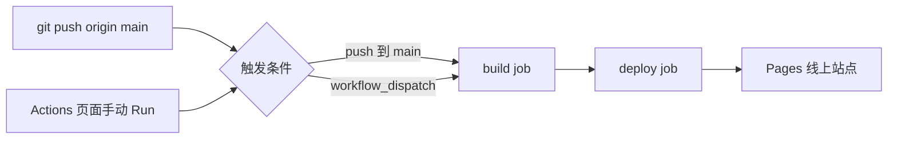
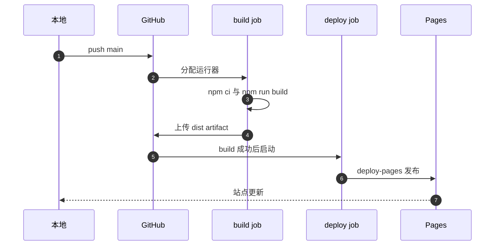

# GitHub Actions 工作流逐段读

改完一篇文章，执行 `git push origin main`，几分钟后线上页面就会更新。中间没有任何人登录服务器，这一串动作由仓库里的 `.github/workflows/deploy.yml` 完成：GitHub 在云端开一台临时机器，装依赖、构建、把 `dist` 目录打包成 Pages 产物，再交给 Pages 发布。

这份 workflow 只有 45 行，却包含触发、权限、并发、两个 job 与一次前后端交接。其中三件事最容易被忽略：为什么需要 `permissions`、为什么并发组要设置在 Pages 上、以及构建时为什么要指定 `SITE_BASE`。

## 触发条件决定了谁可以上线

文件开头是 `name` 与 `on`（`.github/workflows/deploy.yml:1-6`）。触发方式是两种：推到 `main` 分支时自动触发，或者在 Actions 页面手动点一次 `workflow_dispatch`。两者覆盖了两类场景：日常提交走自动，想重跑一次失败或回滚后的构建走手动。

没有配 `pull_request` 触发，意味着 PR 不会跑这份 workflow，也就不会有预览部署。改动在合并进 `main` 之前拿不到线上构建结果，这是当前流程的一个取舍。

## 权限与并发：两段容易跳过但会出问题的配置

`permissions` 段（`.github/workflows/deploy.yml:8-11`）给了三项：`contents: read` 读仓库、`pages: write` 写 Pages、`id-token: write` 换取 OIDC 令牌。第三项是 `actions/deploy-pages` 能工作的前提，缺了它部署会报权限不足。与老做法相比，这里不需要把任何密钥放进仓库 Secrets：部署凭据由 GitHub 在运行时签发。

`concurrency` 段（`.github/workflows/deploy.yml:14-16`）把组名定为 `pages`，并且 `cancel-in-progress: false`。含义是同一时间只允许一个 Pages 部署在跑，但已经在跑的不会被新提交打断。对个人站点来说这是合适的取舍：少一次部署不会丢内容，被打断的生产部署反而可能留下半成品。

## build job：从源码到一份 Pages 产物

build job 跑在 `ubuntu-latest` 上，步骤共六步（`.github/workflows/deploy.yml:19-35`）：

| 步骤 | 动作 | 作用 |
| --- | --- | --- |
| 1 | `actions/checkout@v4` | 把仓库拉到运行器上 |
| 2 | `actions/setup-node@v4` | 装 Node 22 并缓存 npm |
| 3 | `npm ci` | 严格按 lock 文件安装依赖 |
| 4 | `npm run build` | 执行 Astro 构建，产出 `dist` |
| 5 | `actions/configure-pages@v5` | 读取 Pages 站点配置 |
| 6 | `actions/upload-pages-artifact@v3` | 把 `dist` 上传成 artifact |

第 3 步用的是 `npm ci` 而不是 `npm install`。前者按 `package-lock.json` 精确还原依赖，本地与云端拿到同一棵依赖树；后者可能顺带升级次版本，让"本地能构建、云端报错"变成难以复现的问题。

第 4 步带了一个环境变量 `SITE_BASE: /TC63PersonalWebsite`（`.github/workflows/deploy.yml:29-31`）。Pages 的项目站点地址形如 `用户.github.io/仓库名/`，静态资源必须带这个前缀才能被找到；服务器部署走的是另一个前缀 `/tc63`。同一个仓库、两份不同的资源前缀，全靠这个变量在构建时切换。

## deploy job：只做一件事

deploy job 通过 `needs: build` 依赖前一个 job（`.github/workflows/deploy.yml:37-45`），跑在同样的运行器上，`environment` 声明为 `github-pages`，部署地址取自 `steps.deployment.outputs.page_url`。唯一一步是 `actions/deploy-pages@v4`。

它不重新构建、不装依赖，只消费 build 上传的 artifact。这样拆分的好处是构建失败不会影响线上，部署失败也不会让人怀疑源码；代价是两次 job 之间多了一次 artifact 上传与下载。

## 一次部署失败该看哪一段

| 现象 | 出问题的段 | 判据 |
| --- | --- | --- |
| workflow 根本没跑 | 触发条件 | 提交是否落在 `main` |
| 权限不足、部署被拒 | `permissions` | 是否缺 `id-token: write` |
| 部署被新提交取消 | `concurrency` | 组名与 `cancel-in-progress` 的取值 |
| 构建报依赖不一致 | 第 3 步 | 是否用了 `npm ci`、lock 是否提交 |
| 页面能开、样式与图片丢失 | 第 4 步 | 构建时的 `SITE_BASE` 前缀 |
| build 成功、deploy 失败 | deploy job | 看 Pages 环境与 artifact 是否上传 |

## 运行器与环境约束

CI 选的是 `ubuntu-latest` 与 Node 22（`.github/workflows/deploy.yml:20-26`）。Node 版本不是随手写的：本项目的 Astro 需要 Node 22 以上，本地的 `start.sh:63-66` 在检测到主版本小于 22 时会直接退出并提示升级。把 CI 的版本固定成 22，换来的是"云端能构建，本地却不行"这类差异大幅减少。

运行器是临时机器，每次从零开始：没有 `node_modules`、没有缓存目录、没有历史的 `dist`。这意味着构建必须完全依赖仓库里已有的文件，任何"我本地有这个文件"的假设在 CI 上都会暴露。`setup-node` 的 `cache: npm` 只缓存下载好的依赖包，不改变这条前提。

## 构建缓存与重复构建

`setup-node` 的 `cache: npm`（`.github/workflows/deploy.yml:26`）缓存的是 npm 的下载缓存，命中之后 `npm ci` 仍然会按 lock 文件重新铺设 `node_modules`。缓存失效时只是慢一点，不会改变结果，因此"上次能构建、这次不行"的原因基本可以排除缓存本身，转而去看依赖版本与源码变化。

## 常见判断偏差

| # | 判断偏差 | 表现 | 依据 |
| --- | --- | --- | --- |
| 1 | 认为 CI 会部署到自己的服务器 | 服务器上的页面没有变 | 这份 workflow 只发布 Pages |
| 2 | 把 Pages 与服务器前缀混用 | 线上样式全丢或 404 | 两处 base 分别是 `/TC63PersonalWebsite` 与 `/tc63` |
| 3 | 在仓库里配部署密钥 | 找不到相关 Secrets | 用的是 OIDC，不需要长期密钥 |
| 4 | 认为并发会保留最新提交 | 后一次部署排队等待 | `cancel-in-progress` 为 false |
| 5 | 用 `npm install` 复现 CI 问题 | 本地始终无法复现 | CI 用的是 `npm ci` |
| 6 | 只改代码不看 workflow | 改了触发分支后 CI 不再跑 | 触发条件写在 workflow 里 |

## 小结

### 核心概念

- 这份 workflow 在 push `main` 或手动触发时运行，只发布 GitHub Pages。
- 三项权限中 `id-token: write` 是 OIDC 部署的前提，仓库不需要长期密钥。
- 并发组固定在 `pages`，不取消进行中的部署。
- build job 六步：检出、装 Node、`npm ci`、构建、读 Pages 配置、上传 artifact。
- deploy job 只消费 artifact，用 `deploy-pages` 发布。
- 构建时用 `SITE_BASE` 切换资源前缀，Pages 与服务器用不同的 base。

### 设计权衡

| 权衡点 | 本工程的选择 | 收益与代价 |
| --- | --- | --- |
| 触发方式 | push main 加手动 | 简单可控；代价是没有 PR 预览 |
| 依赖安装 | `npm ci` | 与本地一致、可复现；代价是 lock 必须及时提交 |
| 权限模型 | OIDC 而非长期密钥 | 无密钥泄漏面；代价是权限段必须写全 |
| 并发控制 | 不取消进行中的部署 | 生产部署完整；代价是连续提交要排队 |
| job 拆分 | build 与 deploy 分开 | 失败点清晰；代价是多一次 artifact 传递 |

## 练习

### 基础题

1. 写出这份 workflow 的两种触发方式，并说明哪种适合回滚后重跑。
2. `permissions` 三项各自解决什么问题？缺 `id-token: write` 会看到什么现象？
3. 解释 `npm ci` 与 `npm install` 的差别，以及为什么 CI 要用前者。
4. `SITE_BASE` 在 Pages 构建时取什么值，服务器部署时又是多少？

### 挑战题

5. 为 PR 增加一次"只构建不部署"的检查：写出需要的触发条件、job 结构与要跳过的步骤。
6. 如果要把产物同时发布到 Pages 与自己的服务器，设计 job 结构并说明密钥与权限怎么分。
7. 连续推送三次提交，分析并发组为 `pages` 时三次部署的执行顺序与最终线上内容。
8. 构建成功但页面白屏，列出从 artifact 内容、资源前缀到 Pages 配置的排查顺序。

## 附：本页引用的路径

| 路径 | 用途 |
| --- | --- |
| `.github/workflows/deploy.yml` | 触发条件、权限、并发与两个 job |
| `astro.config.mjs` | `site`、`base` 与环境变量切换 |
| `package.json` | `dev`、`build`、`preview` 三个脚本 |
| `deploy.sh` | 本地构建并推送的脚本，与 CI 构成两条发布路 |
