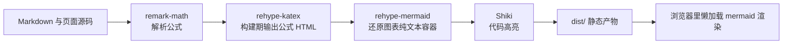
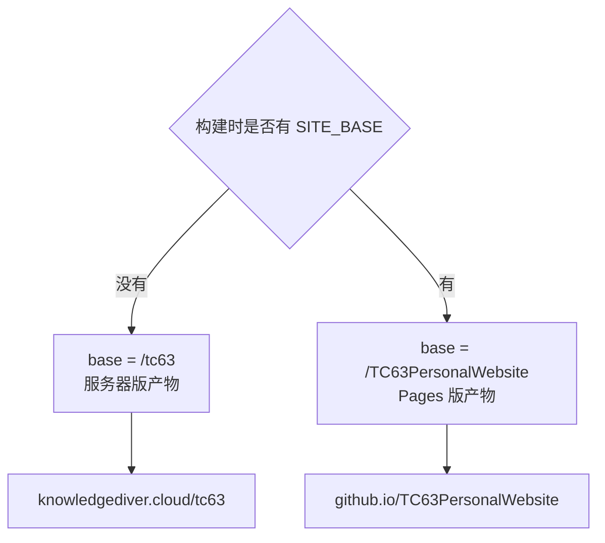

# Astro 构建与两种资源前缀

`npm run build` 只花十几秒，产出一个 `dist` 目录，之后无论是 GitHub Pages 还是自己的服务器，拿到的都是这份目录。让两份部署看起来不同的地方不在内容，而在前缀：Pages 的项目站点地址是 `用户.github.io/TC63PersonalWebsite/`，服务器上的站点挂在 `https://knowledgediver.cloud/tc63/`。同一个页面，链接前缀必须跟部署位置走，否则样式、图片与站内跳转会一半可用一半 404。

构建过程之后是 `site` 与 `base` 如何决定前缀、`SITE_BASE` 如何在两者之间切换，以及公式与图表为什么一个在构建期完成、另一个留给浏览器。

## 一次构建到底做了什么

`package.json` 里 `build` 指向 `astro build`。Astro 会把 `src/pages/` 与 `docs/` 下的内容走一遍 Markdown 管线，生成静态 HTML 与配套资源，最后统一写进 `dist`。文档区里每个单元的文件都在这条管线上，因此文档的渲染规则与页面代码共用同一套配置。

`astro.config.mjs` 定义了这条管线：remark-math 解析公式语法，rehype-katex 把公式渲染成 HTML，rehype-mermaid 处理图表代码块，Shiki 负责代码高亮。插件顺序不是随手排的，Shiki 的高亮排在用户插件之前，所以 `rehype-mermaid` 拿到的已经是高亮后的结构，需要先把纯文本还原出来（见 `src/lib/rehype-mermaid.mjs`）。

```js
// astro.config.mjs（节选）
markdown: {
  processor: unified({
    remarkPlugins: [remarkMath],
    rehypePlugins: [rehypeKatex, rehypeMermaid],
  }),
  shikiConfig: { theme: 'github-light' },
},
```

Astro 是静态站点生成器：构建时把每个页面与 Markdown 编译成 HTML，产出 `dist/`，线上只要一个静态文件服务器，不需要 Node 常驻进程。Markdown 的转换被拆成两级插件树——`remark` 插件处理 Markdown 语法树（这里只加公式语法），`rehype` 插件处理 HTML 树（KaTeX 把公式变成 HTML，mermaid 插件把图表代码块换成容器）。Shiki 是构建期的代码高亮器，它在构建时就把高亮结果写进 HTML，所以线上不加载任何高亮脚本。



## site 与 base 决定链接前缀

`astro.config.mjs` 里有两行最关键：`site` 写死为 `https://knowledgediver.cloud`，`base` 取 `process.env.SITE_BASE ?? '/tc63'`。`site` 影响 canonical、og:url 这类绝对地址；`base` 影响所有静态资源与站内链接的前缀。

```js
// astro.config.mjs（节选）
export default defineConfig({
  site: 'https://knowledgediver.cloud',
  base: process.env.SITE_BASE ?? '/tc63',
  // ...
});
```

`??` 是 JavaScript 的空值合并运算符：左边为 `null` 或 `undefined` 时取右边的值，所以没设 `SITE_BASE` 就落到默认的 `/tc63`，CI 里显式传入时才切成 Pages 前缀。两个键分工不同：`site` 是站点的规范地址，参与 canonical、`og:url` 这类绝对地址的生成，改它不会改变站点实际被访问的地址；`base` 是子路径前缀，构建器用它给资源 URL 加前缀。

默认值 `/tc63` 对应服务器部署：站点挂在 `knowledgediver.cloud` 下的子路径。`astro.config.mjs` 开头的注释把两种部署位置写得很清楚，其中 GitHub Pages 那一行明确要求构建时传入 `SITE_BASE=/TC63PersonalWebsite`。

| 部署位置 | 访问地址 | base |
| --- | --- | --- |
| 腾讯云服务器 | `https://knowledgediver.cloud/tc63/` | `/tc63`（默认） |
| GitHub Pages | `https://TC635807.github.io/TC63PersonalWebsite/` | `/TC63PersonalWebsite` |
| 本地开发 | `http://localhost:4321/` | 走默认值，与服务器一致 |



`base` 不改变文件在磁盘上的位置，只改变 HTML 里写出的地址。构建器负责把资源路径带上它，模板作者负责让手写链接也带上它，两边都做到之后，换部署位置就只剩一个环境变量的差别。

## 站内链接为什么必须走 url()

`base` 只作用于构建器认识的链接。手写在模板里的 `"/projects/"` 不会被自动加前缀，页面在子路径下就会打到域名根。仓库因此提供了统一出口 `src/lib/url.ts`：它从 `import.meta.env.BASE_URL` 取出 base，去掉尾斜杠后拼在路径前面。站内链接与图片路径都走这个函数，部署位置变化时不需要逐个改模板。

```ts
// src/lib/url.ts（全文）
export const BASE = import.meta.env.BASE_URL;
const ROOT = BASE.endsWith('/') ? BASE.slice(0, -1) : BASE;

export function url(path = '/'): string {
  const p = path.startsWith('/') ? path : '/' + path;
  return ROOT + p;
}
```

`import.meta.env.BASE_URL` 是 Astro 在构建时注入的常量，值就是配置里的 `base`（带尾斜杠）。这个函数先去掉尾斜杠、再保证传入路径以 `/` 开头，最后拼接：模板里写 `url('/projects/')`，换部署位置时 base 自动跟着变。

同一个理由解释了 `deploy.sh` 里的自检：构建完成后它检查 `dist/index.html` 里是否存在 `href="/tc63/`。如果发现链接不带 `/tc63` 前缀，说明这份产物是用 Pages 的 `SITE_BASE` 构建的，脚本会拒绝提交，避免把 Pages 版产物推到服务器分支上。

```bash
# deploy.sh：构建产物的前缀自检（节选）
[ -f dist/index.html ] || { echo "✗ dist/index.html 不存在，构建失败了？"; exit 1; }
if ! grep -q 'href="/tc63/' dist/index.html; then
  echo "⚠️ dist 里的链接不是 /tc63 前缀 —— 是不是用 SITE_BASE 构建过 Pages 版本？重新构建。"
  exit 1
fi
```

`grep -q` 是「只判断有没有匹配、不打印匹配内容」，退出码 0 表示找到、1 表示没找到，前面的 `!` 取反即可当成「没找到就报错」；`[ -f 文件 ] || { ... }` 则是「文件不存在就执行后面这串」的惯用写法。放在本地构建之后跑，是为了让前缀错误当场暴露，而不是等服务器上样式成片 404 才发现。

## 公式与图表在两个不同阶段完成

公式在构建期就变成 HTML，页面加载时不需要额外脚本，首屏不会闪。图表走的是另一条路：`rehype-mermaid` 只把代码块还原成 `<pre class="mermaid">` 容器，SVG 由页面里懒加载的客户端脚本渲染。这样做的收益是构建不需要浏览器环境，代价是关掉 JS 时页面里留下的是一段可读的图表源码。

```js
// src/lib/rehype-mermaid.mjs：把 mermaid 代码块换成纯文本容器
function toDiagram(node) {
  const source = textOf(node).replace(/\s+$/, '');
  return {
    type: 'element',
    tagName: 'div',
    properties: { className: ['diagram'] },
    children: [{
      type: 'element',
      tagName: 'pre',
      properties: { className: ['mermaid'], 'data-diagram': 'mermaid' },
      children: [{ type: 'text', value: source }],
    }],
  };
}
```

这是个 HTML 语法树上的转换：拿到节点、把纯文本抽出来、换成 `<pre class="mermaid">` 容器。`<pre class="mermaid">` 是 mermaid 约定的挂载点，浏览器里的脚本找到它、读出文本、生成 SVG；「等图滚进视口才渲染」就是懒加载，它让首屏不必为一个远处的图付出代价，也让构建环境不需要装浏览器。

## 本地构建与 CI 构建的差别

两条构建命令相同，环境不同。本地用的是当前机器上的 Node 与已装好的 `node_modules`，CI 用的是固定 22 版本与 `npm ci` 还原的依赖树。构建时如果本地忘了传 `SITE_BASE`，产出的就是服务器版；CI 始终显式传入 Pages 版。把本地产物直接推到服务器的做法，必须先过 `deploy.sh` 的前缀自检。

| 项 | 本地 `npm run build` | CI 构建 |
| --- | --- | --- |
| Node 版本 | 本机版本，需 22 以上 | 固定 22 |
| 依赖来源 | 本地 `node_modules` | `npm ci` 按 lock 还原 |
| base | 默认 `/tc63` | `SITE_BASE=/TC63PersonalWebsite` |
| 产物去向 | `dist`，可被提交 | artifact，交给 Pages |
| 用途 | 服务器部署与本地预览 | Pages 线上站点 |

## 产物里有什么

`dist` 里是逐页生成的 HTML 与按内容哈希命名的静态资源。每个页面在 `dist` 下都有对应的目录与 `index.html`，文档单元的 URL 直接由目录层级决定，因此改文件名等于改链接，旧链接不会自动跳转。

## 为什么 `dist` 也留在仓库里

`dist` 里是逐页生成的 HTML、按内容哈希命名的资源文件与文档页面。`.gitignore` 明确没有忽略 `dist/`，注释给出的理由是服务器只做 `git pull`，不在服务器上装 Node 也不在服务器上构建。这个选择让产物随源码一起进入版本历史，也意味着每次发布都会产生一份新的二进制式快照。

## 构建失败先看哪一类原因

构建失败的表现都是同一条红色日志，原因却分成几类：Node 版本过低、lock 文件与 `package.json` 不一致、Markdown 里的语法让插件抛错、以及样式或组件引用路径写错。判断顺序是先看日志第一行的错误类型，再看它指向的文件属于依赖、内容还是代码。依赖问题的日志里会出现包名与版本，内容问题的日志里会出现具体 md 路径，这两类最容易区分。

构建成功但产物不对，则属于前缀问题，回到 `SITE_BASE` 与 `url()` 这两处检查。

## 文档页面的 URL 也受前缀影响

知识库正文同样走这条路。每个单元的目录名与文件名直接决定页面路径，前缀由 base 补在域名之后，因此服务器上的地址形如 `/tc63/docs/01-FreeRTOS/01-任务与调度/01-任务与调度基础/`。改名或移动文件都会改变链接，旧链接不会自动重定向；引用其他页面时写相对路径，交给 `url()` 拼前缀，才能在两套部署下同时可用。

## 常见判断偏差

| # | 判断偏差 | 表现 | 依据 |
| --- | --- | --- | --- |
| 1 | 认为 base 会自动改写所有链接 | 站内跳转打到域名根 | 直接写死的字符串不会被加前缀，要走 `url()` |
| 2 | 用 Pages 产物部署服务器 | 样式与图片全部 404 | 两份产物的 base 不同 |
| 3 | 认为图表在构建期渲染 | 构建环境缺浏览器也不报错，页面里却只有源码 | mermaid 在浏览器里渲染 |
| 4 | 把 site 当成访问入口 | 改 site 后站点并没有换地址 | site 只影响绝对地址的生成 |
| 5 | 忽略 Node 版本要求 | 本地构建失败但 CI 正常 | Astro 7 需要 Node 22 以上 |
| 6 | 手改 dist 里的文件 | 下次构建被覆盖 | dist 是产物，不是源码 |

## 小结

### 核心概念

- `npm run build` 把页面与文档走一遍 Markdown 管线，产出 `dist` 静态目录。
- 管线顺序为 remark-math、rehype-katex、rehype-mermaid、Shiki。
- `site` 影响绝对地址，`base` 影响资源与站内链接前缀。
- 服务器用 `/tc63`，Pages 用 `/TC63PersonalWebsite`，靠 `SITE_BASE` 在构建时切换。
- 站内链接统一走 `src/lib/url.ts` 的 `url()`，写死的路径不会自动加前缀。
- 公式在构建期渲染，图表在浏览器里懒加载渲染。

### 设计权衡

| 权衡点 | 本工程的选择 | 收益与代价 |
| --- | --- | --- |
| base 来源 | 环境变量加默认值 | 同一份源码支持两种部署；代价是构建时必须记得设变量 |
| 站内链接 | 统一 `url()` 出口 | 换部署位置无需改模板；代价是新增页面要遵守这个约定 |
| 公式渲染 | 构建期 KaTeX | 首屏稳定、无额外脚本；代价是构建时间略增 |
| 图表渲染 | 浏览器懒加载 mermaid | 构建不需要浏览器；代价是关 JS 只看到源码 |
| 产物管理 | `dist` 进仓库 | 服务器零构建；代价是仓库体积与提交噪音增大 |

## 练习

### 基础题

1. 写出构建管线里四个插件的顺序，并说明公式与图表各自在什么阶段完成。
2. `site` 与 `base` 分别影响哪些地址？
3. 服务器部署与 Pages 部署的 base 各是什么？构建时如何切换？
4. 为什么直接写 `"/projects/"` 会在子路径部署下出错？

### 挑战题

5. 把站点从子路径迁到域名根：列出需要改动的文件与构建参数。
6. 设计一条检查规则，在构建后自动判断产物属于哪一种部署目标。
7. 如果要求关掉 JS 也能看到图表，需要把渲染挪到哪个阶段？说明代价。
8. `dist` 进仓库带来的冲突与体积问题，设计一种"只保留最新产物"的替代方案并说明代价。

## 附：本页引用的路径

| 路径 | 用途 |
| --- | --- |
| `astro.config.mjs` | `site`、`base`、Markdown 管线与 Shiki 配置 |
| `src/lib/url.ts` | 站内链接统一出口 |
| `src/lib/rehype-mermaid.mjs` | 图表代码块还原为纯文本容器 |
| `package.json` | `build` 等脚本定义 |
| `deploy.sh` | 构建后的前缀自检 |
| `.github/workflows/deploy.yml` | Pages 构建时传入 `SITE_BASE` |
