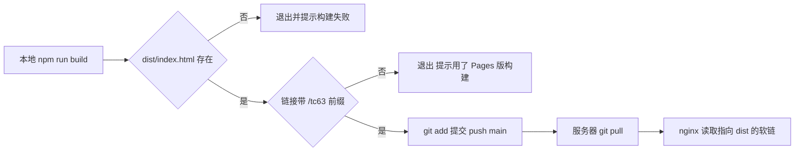
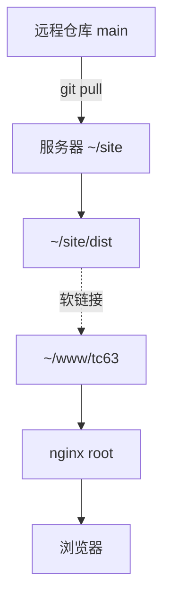

# 本地发布脚本与服务器同步

在服务器上执行 `git pull` 就能更新页面，这一步之所以成立，是因为仓库里除了源码还有构建产物：本地先构建好 `dist/`，把源码与产物一起提交推送到 `main`，服务器只是仓库的一个克隆，`nginx` 指向克隆里的 `dist` 软链。整个过程里服务器不需要 Node，也不需要执行构建。

`deploy.sh` 的四段动作与两道自检之后，是服务器那一侧的目录约定、提交记录的样子，以及回滚与重发的方法。

## 本地这一侧的四段动作

`deploy.sh` 的注释把分工写得很直接：它只跟 GitHub 打交道，不碰服务器（`deploy.sh:1-14`）。脚本支持三种模式：默认是构建加提交加推送，`--no-build` 跳过构建，`--dry` 只构建。默认路径的动作可以拆成四段：

| 段 | 动作 | 位置 |
| --- | --- | --- |
| 1 | 执行 `npm run build` | `deploy.sh:20-23` |
| 2 | 检查 `dist/index.html` 存在 | `deploy.sh:25` |
| 3 | 检查产物链接带 `/tc63/` 前缀 | `deploy.sh:26-29` |
| 4 | `git add -A` 后提交并推送 `main` | `deploy.sh:35-45` |

脚本开头是 `set -euo pipefail`（`deploy.sh:15`），任何一步失败立即停止，不会出现"构建失败却推送了旧产物"的情况。

## 两道自检分别挡什么

第一道自检挡的是构建根本没成功：目录不存在时直接报错。第二道挡的是产物来源不对：`deploy.sh:26-29` 用 `grep -q 'href="/tc63/' dist/index.html` 判断链接前缀，命中失败就提示"是不是用 SITE_BASE 构建过 Pages 版本"，然后拒绝提交。

第二道自检的价值在于两种部署共用一份源码。忘了 `SITE_BASE` 会得到服务器版，多传了它就会得到 Pages 版；后者推到 `main` 后服务器拉下来，页面样式与图片会成片 404，而构建过程本身不会报任何错。

## 为什么把 dist 也提交进仓库

`.gitignore` 里有一段注释专门解释这件事：服务器部署等于本地构建、推送 `main`、服务器只 `git pull`，不装 `node_modules`、不在服务器上构建。由此带来两个后果：服务器上的更新是一条网络命令，不需要环境；仓库的历史里会持续出现生成产物，提交体积与冲突概率随之上升。

提交信息固定为 `deploy: 日期 时间`（`deploy.sh:40`）。仓库的最近几条提交都是这个格式，好处是翻历史时一眼能分出"发布"与"改代码"两类提交。

## 服务器那一侧：克隆与软链

服务器上 `~/site` 是这个仓库的克隆，`~/www/tc63` 是指向 `~/site/dist` 的软链接（`deploy.sh:11-13`）。nginx 的 root 一直指向软链路径，所以发布流程不需要动 nginx 配置：`git pull` 之后 `dist` 内容变化，软链后面的目录内容随之更新。

这样的约定还带来一个好处：回滚不需要重新构建。把服务器上的仓库切到上一个提交，软链指向的还是 `dist`，只是内容回到了旧版本。

## 回滚与重发

回滚有两条路。第一条是在服务器上切提交：`git log` 找到上一个 `deploy:` 提交，`git checkout` 到那一个提交，页面立刻回到旧版本；此时仓库处于游离头状态，后续 `git pull` 之前要先切回 `main`。第二条是本地回退源码后重新构建并推送一次，历史里多一条发布提交，方向清晰但耗时更长。

重发指的是 CI 那侧的 Pages 部署失败后补跑。在 Actions 页面手动触发一次 `workflow_dispatch` 即可，不需要新的提交。

## 本地预览用 start.sh

`start.sh` 是开发与预览入口，支持 `dev`、`preview`、`build`、`stop`、`check` 与 `host` 几种模式（`start.sh:5-15`）。`preview` 会先确保有 `dist` 再以静态方式预览，最接近线上表现；`dev` 带热更新，适合改样式与页面结构。默认端口 4321，被占用时自动往后找空闲端口（`start.sh:146-156`）。

## 发布之后怎样确认更新真的生效

推送完成不等于页面更新。Pages 那边要等 workflow 跑完，站点地址才会变化；服务器那边要等一次 `git pull`。两条路都可以用一个最简单的判据确认：改动里加一句可见的文字，刷新线上页面看它有没有出现。

服务器侧还可以看提交：`git log --oneline -3` 应当出现刚推送的 `deploy:` 记录；若没有，说明 `git pull` 没执行或拉取的不是 `main`。Pages 侧看 Actions 页面最近一次运行的状态与耗时。两条都正常而页面仍旧，通常是浏览器缓存或 nginx 指向了别的目录。

## 服务器目录的权限与属主

服务器侧的路径分两层：仓库克隆 `~/site` 与对外目录 `~/www/tc63`。`git pull` 由登录用户在克隆目录里执行，nginx 以 `www-data` 之类的身份读取软链指向的内容，所以软链目标目录需要对 nginx 可读。常见的问题是仓库克隆在家目录下、家目录权限较紧，nginx 读不到文件，页面报 403；此时现象是"文件明明存在"，而 `git pull` 与构建都完全正常。

## 两条发布路径的关系

Pages 与服务器互不依赖：CI 在 push 之后自动发布 Pages，服务器上的站点要等人执行 `git pull`。两条路都可能出现"只有一边更新"的情况，判断方法分别是去看 Actions 最近一次运行与服务器上的 `git log`。两条路共用同一份源码，但前缀不同，因此不要用一条路径的产出去验证另一条的页面。

## 提交体积与历史清理

产物入仓的代价会随时间显现：`dist` 里带哈希文件名的资源每次构建都会新增一批，历史体积逐步变大。若仓库开始变慢，可以先把 `dist` 从历史里清理，再改成"服务器自行构建"或"产物走单独分支"。两种替代方案都要重新设计服务器侧的更新步骤，因此通常等到影响明显时再处理。

## 常见判断偏差

| # | 判断偏差 | 表现 | 依据 |
| --- | --- | --- | --- |
| 1 | 在服务器上执行构建 | 服务器缺 Node 或依赖报错 | 服务器只做 `git pull` |
| 2 | 手动改服务器上的 dist | 下次 pull 后改动消失 | `dist` 的内容来自仓库 |
| 3 | 用 `--no-build` 却改了源码 | 线上仍是旧页面 | 该模式跳过构建 |
| 4 | 把 Pages 版产物推到 main | 服务器页面样式丢失 | 前缀自检会拦截，不要绕过 |
| 5 | 回滚后直接 git pull | 拉取失败或状态混乱 | 游离头状态需要先切回 main |
| 6 | 认为发布必须动 nginx | 每次发布都去改配置 | root 指向软链，配置无需变化 |

## 小结

### 核心概念

- `deploy.sh` 在本地构建、自检、提交并推送 `main`，不直接接触服务器。
- 两道自检分别确认产物存在与链接前缀正确。
- `dist` 故意进仓库，服务器因此不需要 Node 与构建步骤。
- 提交信息统一为 `deploy: 日期 时间`，便于区分发布与开发提交。
- 服务器用克隆加软链的方式暴露产物，nginx 配置不随发布变化。
- 回滚可以在服务器上切提交，也可以在本地重新构建后推送。

### 设计权衡

| 权衡点 | 本工程的选择 | 收益与代价 |
| --- | --- | --- |
| 构建位置 | 本地构建 | 服务器零依赖、发布快；代价是本地环境必须正确 |
| 产物入仓 | `dist` 一起提交 | 服务器只 pull；代价是仓库体积与噪音 |
| 发布方式 | 脚本加手动 push | 步骤少；代价是依赖执行者的环境 |
| 部署暴露 | 软链 `~/www/tc63` | nginx 配置稳定；代价是多一层间接、需记住路径 |
| 回滚 | 切提交或重发 | 无需重新构建；代价是游离头状态要小心处理 |

## 练习

### 基础题

1. 按顺序写出 `deploy.sh` 默认模式的四段动作。
2. 两道自检各挡什么情况？绕过第二道会看到什么现象？
3. 解释 `dist` 为什么没有写进 `.gitignore`。
4. 服务器上的 `git pull` 之后，页面更新的路径是怎样的？

### 挑战题

5. 设计一条发布检查清单，覆盖构建、自检、提交、服务器拉取与页面验证。
6. 把"服务器上切提交回滚"写成可复用脚本，说明如何避免游离头状态带来的后续问题。
7. 如果不再把 `dist` 进仓库，服务器侧需要增加什么？写出两种方案与代价。
8. 一次发布会同时触发 Pages 与服务器两条路径，设计一种判断"两边是否一致"的验证方法。

## 附：本页引用的路径

| 路径 | 用途 |
| --- | --- |
| `deploy.sh` | 本地构建、两道自检、提交与推送 |
| `.gitignore` | 明确不忽略 `dist/` 的理由 |
| `start.sh` | 本地开发与预览的几种模式 |
| `.github/workflows/deploy.yml` | Pages 那条发布路径 |
| `astro.config.mjs` | base 默认值与前缀来源 |
