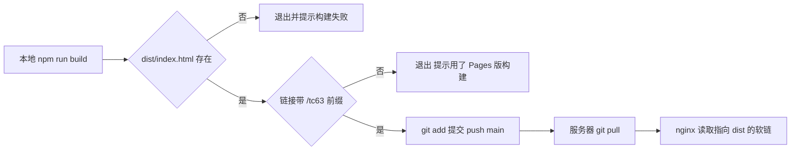
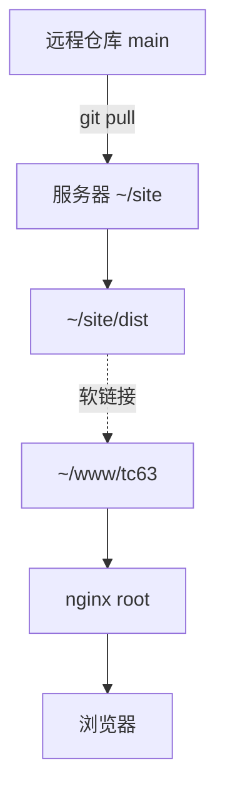

# 本地发布脚本与服务器同步

在服务器上执行 `git pull` 就能更新页面，这一步之所以成立，是因为仓库里除了源码还有构建产物：本地先构建好 `dist/`，把源码与产物一起提交推送到 `main`，服务器只是仓库的一个克隆，`nginx` 指向克隆里的 `dist` 软链。整个过程里服务器不需要 Node，也不需要执行构建。

`deploy.sh` 的四段动作与两道自检之后，是版本库里该放什么、提交历史怎么读，以及服务器那一侧的目录约定与回滚方法。

## 本地这一侧的四段动作

`deploy.sh` 的注释把分工写得很直接：它只跟 GitHub 打交道，不碰服务器。脚本支持三种模式：默认是构建加提交加推送，`--no-build` 跳过构建，`--dry` 只构建。默认路径的动作可以拆成四段：

| 段 | 动作 | 出处 |
| --- | --- | --- |
| 1 | 执行 `npm run build` | `deploy.sh` 的构建段 |
| 2 | 检查 `dist/index.html` 存在 | `deploy.sh` 的第一道自检 |
| 3 | 检查产物链接带 `/tc63/` 前缀 | `deploy.sh` 的第二道自检 |
| 4 | `git add -A` 后提交并推送 `main` | `deploy.sh` 的提交与推送段 |

脚本开头是 `set -euo pipefail`，任何一步失败立即停止，不会出现"构建失败却推送了旧产物"的情况。

```bash
#!/usr/bin/env bash
#   ./deploy.sh              # 构建 → 提交（源码 + dist）→ push main
#   ./deploy.sh --no-build   # 跳过构建（dist 已是想要的产物）
#   ./deploy.sh --dry        # 只构建，不提交/不推送
set -euo pipefail

MODE="${1:-}"
cd "$(dirname "$0")"

if [ "$MODE" != "--no-build" ]; then
  npm run build
fi
```

`set -euo pipefail` 是三个开关的组合：`-e` 遇错即停，`-u` 一旦用到未定义的变量就报错（防止变量名拼错后悄悄变成空字符串），`-o pipefail` 让管道里任何一个命令失败都算整条失败（默认只看管道最后一个命令的退出码）。`cd "$(dirname "$0")"` 把工作目录切到脚本自己所在的目录，于是从哪个目录调用它，构建都发生在仓库根。



## 两道自检分别挡什么

第一道自检挡的是构建根本没成功：目录不存在时直接报错。第二道挡的是产物来源不对：脚本用 `grep -q 'href="/tc63/' dist/index.html` 判断链接前缀，命中失败就提示"是不是用 SITE_BASE 构建过 Pages 版本"，然后拒绝提交。

第二道自检的价值在于两种部署共用一份源码。忘了 `SITE_BASE` 会得到服务器版，多传了它就会得到 Pages 版；后者推到 `main` 后服务器拉下来，页面样式与图片会成片 404，而构建过程本身不会报任何错。

## 什么该进版本库、提交信息与历史

版本库该存什么，取决于「构建由谁负责」。常见有两种做法：只提交源码，构建放在 CI 或部署机上；或者把源码与构建产物一起提交，部署机只负责拉取。前者历史干净、体积小，代价是每台部署机都要有完整的构建环境；后者要让仓库长期容纳生成物，换来部署机零依赖、更新只需一条 `git pull`。本项目的 `.gitignore` 显式保留 `dist/`，走的正是后一条路：服务器不装 Node，也从不执行构建。

判断一个文件该不该进版本库，通常看三点：它是产物还是来源（产物原则上可以重建）、它是否与机器绑定（密钥、本机路径不该进）、以及它是否需要被部署机直接读取。按这三条，`node_modules/` 是体积巨大的产物，忽略；`package-lock.json` 记录依赖的精确版本，是来源的一部分，必须提交；`dist/` 是产物，但这里把它当作部署输入，于是保留。

提交信息不是给自己看的备注，它是 `git log` 的索引。给同类提交加一个统一前缀，翻历史时能一眼分辨「发布」与「改代码」，回滚时也能直接找到上一次发布是哪个提交。本项目用 `deploy: 日期 时间` 作发布提交的前缀，只是一个具体例子；前缀叫什么并不重要，重要的是同类操作可检索、可回滚。

```bash
git log --oneline -10        # 最近十条：一行一条，主题在前
git log --oneline -- dist    # 只看改动过 dist 的提交
git show --stat <commit>     # 某次提交动了哪些文件、增删多少行
```

`--oneline` 把每条提交压成一行，适合先看轮廓；`-- <路径>` 把历史过滤到某个文件或目录，排查「这行改动是谁引入的」时比翻全量日志快得多。

```bash
# deploy.sh：提交与推送（节选）
git add -A
if git diff --cached --quiet; then
  echo "    （没有改动，跳过提交）"
else
  git commit -q -m "deploy: $(date '+%F %H:%M')"
fi
git push origin main
```

`git add -A` 把工作区里所有改动（含新增、删除，这里包括 `dist/`）放进暂存区；`git diff --cached --quiet` 判断「暂存区相对上一个提交有没有差异」，退出码 0 表示没有，于是跳过空提交。`$(date '+%F %H:%M')` 是命令替换：先把 date 的输出算出来，再拼进提交信息，于是每条发布提交都长成 `deploy: <日期> <时间>` 这样。

## 服务器那一侧：克隆与软链

服务器上 `~/site` 是这个仓库的克隆，`~/www/tc63` 是指向 `~/site/dist` 的软链接。nginx 的 root 一直指向软链路径，所以发布流程不需要动 nginx 配置：`git pull` 之后 `dist` 内容变化，软链后面的目录内容随之更新。

```bash
# 服务器上由登录用户手动执行
cd ~/site
git pull          # 只更新工作区文件：产物已在仓库里，拉下来就是最新页面

ls -l ~/www/tc63  # 输出形如：tc63 -> /home/<user>/site/dist
```

软链接（`ln -s 目标 链接名`）相当于一个指路牌：nginx 的 root 指向 `~/www/tc63`，真正读到的却是 `~/site/dist` 里的文件，所以克隆目录一更新，对外目录不用做任何事。另一条常见路线是本地用 `rsync -avz dist/ 用户@服务器:/var/www/tc63/` 走 ssh 直接把文件推上去（rsync 只传有差异的部分）；本项目没走它，省下的是每次发布都要连服务器，代价则是构建产物进仓库——两条路的取舍正好相反。

这样的约定还带来一个好处：回滚不需要重新构建。把服务器上的仓库切到上一个提交，软链指向的还是 `dist`，只是内容回到了旧版本。



## 回滚与重发

回滚有两条路。第一条是在服务器上切提交：`git log` 找到上一个 `deploy:` 提交，`git checkout` 到那一个提交，页面立刻回到旧版本；此时仓库处于游离头状态，后续 `git pull` 之前要先切回 `main`。第二条是本地回退源码后重新构建并推送一次，历史里多一条发布提交，方向清晰但耗时更长。

```bash
# 服务器上按提交回滚（手动执行）
git log --oneline -5      # 找到上一个 deploy: 开头的提交
git checkout <那个提交>   # 切过去，dist 内容立刻回到旧版本

# 验证完之后一定要回到分支
git switch main
```

`git checkout <提交>` 让 HEAD 直接指向某个提交而不是分支，这种状态叫游离头（detached HEAD）：文件是那个版本的，但在这里做的提交不属于任何分支，`git pull` 的行为也和平时不同，所以回滚验证完要用 `git switch main` 回到分支上。

重发指的是 CI 那侧的 Pages 部署失败后补跑。在 Actions 页面手动触发一次 `workflow_dispatch` 即可，不需要新的提交。

## 本地预览用 start.sh

`start.sh` 是开发与预览入口，支持 `dev`、`preview`、`build`、`stop`、`check` 与 `host` 几种模式。`preview` 会先确保有 `dist` 再以静态方式预览，最接近线上表现；`dev` 带热更新，适合改样式与页面结构。默认端口 4321，被占用时自动往后找空闲端口。

```bash
# start.sh（节选）
MODE="dev"
PORT="${PORT:-4321}"

while [ $# -gt 0 ]; do
  case "$1" in
    dev|preview|build|stop|check|host) MODE="$1"; shift ;;
    -p|--port) PORT="${2:-}"; shift 2 ;;
  esac
done

# 端口被占用时，从 PORT+1 起往后找第一个空闲端口
for p in $(seq $((PORT + 1)) $((PORT + 30))); do
  if [ -z "$(port_pid "$p")" ]; then PORT="$p"; break; fi
done

exec npm run dev -- --port "$PORT" $HOST_FLAG
```

`case` 是 shell 的多分支匹配，作用相当于一长串 if/else；`PORT="${PORT:-4321}"` 表示环境变量没设时用 4321。找端口那段用 `seq` 生成一串数字，再用 `port_pid`（内部调用 `lsof` 或 `ss` 查监听者）逐个探测，第一个没人占的直接用。最后的 `exec` 是「用新进程替换当前脚本」：这样 `npm run dev` 直接接管终端，日志与 Ctrl+C 都作用在它身上，不会隔着一层 shell。

## 发布之后怎样确认更新真的生效

推送完成不等于页面更新。Pages 那边要等 workflow 跑完，站点地址才会变化；服务器那边要等一次 `git pull`。两条路都可以用一个最简单的判据确认：改动里加一句可见的文字，刷新线上页面看它有没有出现。

服务器侧更可靠的判据是对比提交，而不是看页面：`git log --oneline -3` 里应当出现刚推送的那条提交。若没有，说明 `git pull` 没执行、或拉取的不是 `main`；这一步把「文件有没有到位」与「浏览器有没有缓存」两类原因分开了。Pages 侧同理，看 Actions 最近一次运行的状态与耗时。

## 服务器目录的权限与属主

服务器侧的路径分两层：仓库克隆 `~/site` 与对外目录 `~/www/tc63`。`git pull` 由登录用户在克隆目录里执行，nginx 以 `www-data` 之类的身份读取软链指向的内容，所以软链目标目录需要对 nginx 可读。常见的问题是仓库克隆在家目录下、家目录权限较紧，nginx 读不到文件，页面报 403；此时现象是"文件明明存在"，而 `git pull` 与构建都完全正常。

## 两条发布路径的关系

Pages 与服务器互不依赖：CI 在 push 之后自动发布 Pages，服务器上的站点要等人执行 `git pull`。两条路都可能出现"只有一边更新"的情况，判断方法分别是去看 Actions 最近一次运行与服务器上的 `git log`。两条路共用同一份源码，但前缀不同，因此不要用一条路径的产出去验证另一条的页面。

## 提交体积与历史清理

产物入仓的代价会随时间显现：`dist` 里带哈希文件名的资源每次构建都会新增一批，历史体积逐步变大。若仓库开始变慢，可以先把 `dist` 从历史里清理，再改成"服务器自行构建"或"产物走单独分支"。两种替代方案都要重新设计服务器侧的更新步骤，因此通常等到影响明显时再处理。

## 常见判断偏差

| # | 判断偏差 | 表现 | 依据 |
| --- | --- | --- | --- |
| 1 | 在服务器上执行构建 | 服务器缺 Node 或依赖报错 | 服务器只做 `git pull` |
| 2 | 手动改服务器上的 dist | 下次 pull 后改动消失 | `dist` 的内容来自仓库 |
| 3 | 用 `--no-build` 却改了源码 | 线上仍是旧页面 | 该模式跳过构建 |
| 4 | 把 Pages 版产物推到 main | 服务器页面样式丢失 | 前缀自检会拦截，不要绕过 |
| 5 | 回滚后直接 git pull | 拉取失败或状态混乱 | 游离头状态需要先切回 main |
| 6 | 认为发布必须动 nginx | 每次发布都去改配置 | root 指向软链，配置无需变化 |

## 小结

### 核心概念

- `deploy.sh` 在本地构建、自检、提交并推送 `main`，不直接接触服务器。
- 两道自检分别确认产物存在与链接前缀正确。
- `dist` 故意进仓库，服务器因此不需要 Node 与构建步骤。
- 提交信息按用途命名：同类提交带统一前缀，`git log` 可分辨、回滚可定位。
- 服务器用克隆加软链的方式暴露产物，nginx 配置不随发布变化。
- 回滚可以在服务器上切提交，也可以在本地重新构建后推送。

### 设计权衡

| 权衡点 | 本工程的选择 | 收益与代价 |
| --- | --- | --- |
| 构建位置 | 本地构建 | 服务器零依赖、发布快；代价是本地环境必须正确 |
| 产物入仓 | `dist` 一起提交 | 服务器只 pull；代价是仓库体积与噪音 |
| 发布方式 | 脚本加手动 push | 步骤少；代价是依赖执行者的环境 |
| 部署暴露 | 软链 `~/www/tc63` | nginx 配置稳定；代价是多一层间接、需记住路径 |
| 回滚 | 切提交或重发 | 无需重新构建；代价是游离头状态要小心处理 |

## 练习

### 基础题

1. 按顺序写出 `deploy.sh` 默认模式的四段动作。
2. 两道自检各挡什么情况？绕过第二道会看到什么现象？
3. 解释 `dist` 为什么没有写进 `.gitignore`。
4. 服务器上的 `git pull` 之后，页面更新的路径是怎样的？

### 挑战题

5. 设计一条发布检查清单，覆盖构建、自检、提交、服务器拉取与页面验证。
6. 把"服务器上切提交回滚"写成可复用脚本，说明如何避免游离头状态带来的后续问题。
7. 如果不再把 `dist` 进仓库，服务器侧需要增加什么？写出两种方案与代价。
8. 一次发布会同时触发 Pages 与服务器两条路径，设计一种判断"两边是否一致"的验证方法。

## 附：本页引用的路径

| 路径 | 用途 |
| --- | --- |
| `deploy.sh` | 本地构建、两道自检、提交与推送 |
| `.gitignore` | 明确不忽略 `dist/` 的理由 |
| `start.sh` | 本地开发与预览的几种模式 |
| `.github/workflows/deploy.yml` | Pages 那条发布路径 |
| `astro.config.mjs` | base 默认值与前缀来源 |
