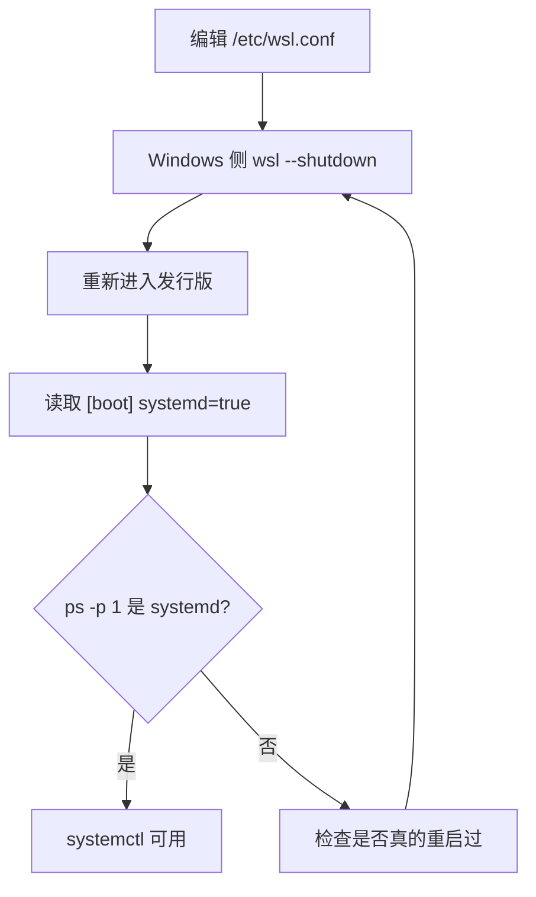
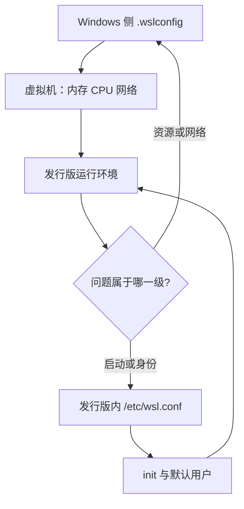

# 发行版启动与 systemd

装好 WSL 之后的第一个实际问题通常是「服务起不来」：脚本里写了 `systemctl enable`，执行完却提示找不到 systemd 或者命令不存在。原因是 WSL 的发行版默认用一个 init 进程直接拉起登录 shell，systemd 并没有作为 1 号进程运行。这个问题靠发行版内的配置文件解决。

这台机器上的配置只有四行（`/etc/wsl.conf`），分成两段：`[boot]` 段里写 `systemd=true`，`[user]` 段里写 `default=tc63`。两项各自解决一个问题，也各有自己的生效条件与验证办法。

判断自己是否遇到这个问题，最省事的办法是直接执行 `systemctl` 看返回：报「命令不存在」或「systemd 未启动」就是没启用。

## 1. 为什么要打开 systemd

WSL 的早期做法是让发行版自己启动一个 init，随后直接进入用户 shell。这种模式下 `systemctl` 不可用，依赖 systemd 的软件（Docker、snap、部分数据库服务）都装不起来或者起不来。

把 `systemd=true` 写进 `[boot]` 段之后（`/etc/wsl.conf:2`），发行版启动时实际拉起的 1 号进程就是 systemd，`systemctl` 与 `journalctl` 随之可用。代价是启动稍慢，内存占用略增，对本地开发来说可以接受。

这两个字段虽然在同一份文件里，解决的问题完全不同：一个管 init 进程，一个管登录身份。排查时可以分开看，互不干扰。

## 2. 默认用户为什么也要写

WSL 默认以安装时创建的用户登录，但如果发行版是通过导入镜像或复制的方式得到的，默认用户可能变成 root。以 root 登录会让后续所有文件都带上 root 属主，在 `/mnt/` 下尤其容易留下权限问题。

配置里把 `default=tc63` 固定下来（`/etc/wsl.conf:5`），每次启动都进入这个用户。这一项与 systemd 无关，属于顺手把环境固定住。

重启的成本很低：发行版内没有常驻任务时，几秒钟就能回来。改配置前把正在进行的工作保存好即可。

## 3. 改完要重启发行版

这两个字段在发行版启动时读取一次，因此在发行版内部改完文件不会立刻生效。标准做法是在 Windows 侧执行 `wsl --shutdown` 再重新进入；只关掉终端窗口不算重启。

判断是否重启过，可以直接看 1 号进程的归属：

| 现象 | 含义 |
| --- | --- |
| `ps -p 1 -o comm=` 输出 `systemd` | 配置已生效 |
| 输出 `init` 或其他 | 还是旧模式，需要 `wsl --shutdown` |
| `systemctl status` 报找不到命令 | 同上 |

对日常开发影响最大的是日志：`journalctl` 能按服务与时间过滤，比在终端里翻滚动输出省事。

## 4. 打开 systemd 之后多出来的东西

最直接的变化是 `systemctl`、`journalctl` 与 `systemd-*` 系列命令可用。随之而来的是发行版里开始出现由 systemd 托管的后台服务：网络、日志与用户级服务都可以用统一方式管理。

副作用有两个：一是 `/etc/resolv.conf` 可能由 `systemd-resolved` 接管，与 WSL 默认的自动生成方式并存时要注意解析顺序；二是关机行为变成 systemd 的流程，个别在 `.bashrc` 里写的清理逻辑不再被执行。

WSL 的配置项远不止这两段，例如网络模式与内存上限写在 Windows 侧的 `.wslconfig` 里，与本文件不在一处；这一层只管发行版自己的启动行为。

本仓库把 WSL 既当开发环境也当实验环境使用，两类用途对配置的要求不同：开发环境关注服务管理与端口互访，实验环境更关注 GPU 与内存。这一层配置对所有用途同时生效。

## 5. 与仓库里其他文档的关系

这台机器的 WSL 不只是开发前端与文档，还承担 JAX、MuJoCo 这些需要 GPU 的实验。CUDA 驱动如何从 Windows 侧透传到发行版、渲染后端为什么在 WSL 下有额外的通路，这两条在本仓库的 `docs/12-JAX 与 Brax/05-环境搭建与依赖锁定/02-CUDA-驱动与WSL的装配关系.md` 与 `docs/15-仿真查看器与性能/02-渲染后端/01-WSL下的GPU通路.md` 里写过，这里不重复。

发行版启动这一层只包含三件事：systemd 是否启用、默认用户是谁、改完怎么生效。

日常用得到的命令在两侧各有一套，容易记混的是查看发行版列表与关停：

| 目的 | 在 Windows 侧 | 在发行版内 |
| --- | --- | --- |
| 列出已安装发行版 | `wsl -l -v` | 不适用 |
| 关停全部发行版 | `wsl --shutdown` | 不适用 |
| 查看 1 号进程 | 不适用 | `ps -p 1 -o comm=` |
| 查服务状态 | 不适用 | `systemctl status <name>` |
| 改默认登录用户 | `wsl -d <distro> -u <user>` 可临时覆盖 | 改 `/etc/wsl.conf` 持久生效 |

发行版级配置里还有 `[automount]` 与 `[interop]` 两段，分别管 Windows 盘的自动挂载与两侧命令互调。这台机器都没有显式配置，因此挂载与互操作都走默认值。

内存上限、CPU 核数与交换文件属于虚拟机级设置，写在 Windows 侧的 `.wslconfig` 里（见 02-镜像网络模式与两侧互访）。两级配置的分工是：虚拟机级决定「给多少资源」，发行版级决定「起来之后怎么跑」。

与 `wsl.conf` 相关的另一个变量是 WSL 版本本身。不同版本支持的配置项不同，版本过低时新增项会被静默忽略，因此每次加配置都要按第 3 节的判据验证一次。

配置改动本身没有版本控制：`/etc/wsl.conf` 不在本仓库里，换机器时要手动搬。仓库里能查到的只有结论与验证方法，值本身需要现场确认。

两级配置的分工可以画成一张图：虚拟机级决定资源与网络，发行版级决定初始化与登录身份。排查时先确定问题属于哪一级，再去看对应的文件。

## 6. 易错点

- 改完 `wsl.conf` 只关终端窗口。需要 `wsl --shutdown` 才算重启。
- 把 `default` 写成用户名之外的路径。这里写的是用户名字符串。
- 认为 `systemd=true` 会影响 `/mnt/` 的权限。两件事互不相干。
- 用 `service` 命令验证 systemd。`service` 在部分发行版里是兼容包装，判据要看 1 号进程。
- 在多台机器间复制 `wsl.conf` 时忘了改用户名。默认用户是机器相关的。
- 把 `wsl --shutdown` 当成关闭单个发行版。它关的是所有发行版。
- 在发行版内用 `wsl` 命令。它只在 Windows 侧的终端里可用。
- 把 `wsl.conf` 提交进仓库当作可部署配置。它属于本机状态。
- 认为 `systemd=true` 会让所有旧脚本继续可用。`.bashrc` 里的清理逻辑不再自动执行。
- 忘记两级配置的存在。资源问题要去 `.wslconfig` 找。

## 小结

核心概念：

| 概念 | 内容 |
| --- | --- |
| 配置文件 | `/etc/wsl.conf` |
| 启动段 | `[boot]` 里的 `systemd=true` |
| 用户段 | `[user]` 里的 `default=tc63` |
| 生效条件 | 发行版重启（`wsl --shutdown`） |
| 验证判据 | 1 号进程是 `systemd` |
| 影响范围 | 服务管理方式，不含挂载权限 |
| 配置文件位置 | 发行版内，不在仓库 |

设计权衡：

| 决策 | 选择 | 收益 | 代价 |
| --- | --- | --- | --- |
| 启用 systemd | 打开 | 服务工具链完整 | 启动变慢、内存略增 |
| 默认用户 | 固定为普通用户 | 文件属主干净 | 多机复制时需要改 |
| 配置位置 | 发行版内 `wsl.conf` | 随发行版走 | 不能从 Windows 侧统一管理 |
| 重启粒度 | 关停全部发行版 | 一条命令覆盖 | 其他发行版也被中断 |
| 配置粒度 | 发行版级 | 不同发行版可各配一份 | 多发行版时要逐个维护 |
| 验证方式 | 看 1 号进程 | 判据明确 | 需要重启一次 |

## 练习

### 基础题

1. 这台机器的 `wsl.conf` 里有哪两段配置？各自的值是什么？
2. 改完 `wsl.conf` 之后要执行什么才算重启？
3. 用哪条命令可以判断 systemd 是否已经作为 1 号进程运行？
4. 本机的 `[automount]` 与 `[interop]` 段有没有显式配置？走的是哪套取值？

### 挑战题

4. 如果你需要在一台新机器上复用这份配置，需要改哪一处？为什么？
5. 打开 systemd 之后 `resolv.conf` 的生成方式可能变化。给出一个验证解析顺序的办法。

### 附：本页引用的路径

| 路径 | 作用 |
| --- | --- |
| `/etc/wsl.conf` | 发行版启动配置（本机） |
| `docs/12-JAX 与 Brax/05-环境搭建与依赖锁定/02-CUDA-驱动与WSL的装配关系.md` | GPU 透传的上游说明 |
| `docs/15-仿真查看器与性能/02-渲染后端/01-WSL下的GPU通路.md` | 渲染通路的上游说明 |
