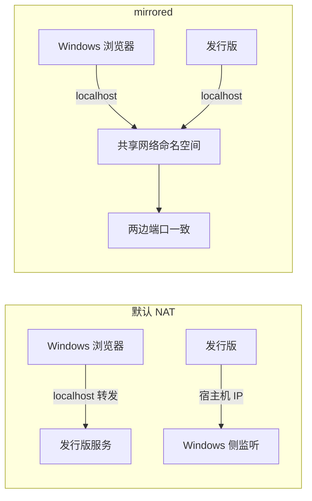
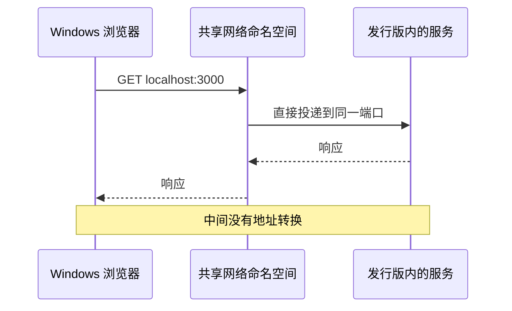

# 镜像网络模式与两侧互访

本地起一个前端开发服务器，然后想在 Windows 的浏览器里打开它，这是 WSL 里最常见的网络需求。默认配置下发行版有自己的虚拟网卡与 IP，Windows 通过 `localhost` 转发能访问进去，但反过来从发行版访问 Windows 侧的监听端口就要先查宿主机地址，端口一多很容易记混。

这台机器换了另一种模式：Windows 侧的 `.wslconfig` 里只有两行，`[wsl2]` 段下写 `networkingMode=mirrored`（`/mnt/c/Users/TC63/.wslconfig`）。镜像模式下两边共享网络视图，地址与端口不再分属两个网段。两种模式的差别在于网络视图与访问地址的写法，地址写错时的症状往往落在「连不上」这一侧。

```ini
[wsl2]
networkingMode=mirrored
```

## 1. 默认 NAT 模式的行为

不配置 `networkingMode` 时，WSL2 走 NAT（网络地址转换）：用一个虚拟交换机给发行版分配独立 IP，Windows 侧负责在两侧地址之间改写。从 Windows 访问发行版的服务因此有两条路：一条是 WSL 提供的 `localhost` 转发，把 Windows 的 `localhost` 流量转进发行版；另一条是直接用发行版的虚拟网卡地址。

从发行版访问 Windows 侧的监听端口则需要宿主机地址。它随每次启动可能变化，早期做法是从 `/etc/resolv.conf` 里取，现在也有专门的环境变量与命令可用。地址不稳定是这套模式的日常麻烦。

## 2. 镜像模式改变了什么

`networkingMode=mirrored` 让发行版复用主机的网络接口，两边看到的是同一组地址。于是「Windows 的 `localhost`」与「发行版的 `localhost`」指向同一处，端口也共享：主机上监听 3000，发行版里连 `localhost:3000` 就是同一个服务。

这种模式的直接收益是地址写法统一，不需要为「从哪一侧访问」准备两套地址。代价是端口占用的冲突面变大：主机上已有服务占用某个端口时，发行版里再起一个同样的端口会直接失败。



浏览器里访问 `localhost` 之所以省事，是因为它不依赖任何一处具体地址；这也是把服务绑定到 `127.0.0.1` 仍然可行的原因。

## 3. 实际访问地址怎么写

镜像模式下可以直接用 `localhost`：浏览器里打开 `http://localhost:3000`，终端里对同一个地址发起请求，得到的是同一个服务。仓库里的前端开发服务器与文档预览都按这个写法使用。

排查时先确认监听地址：服务如果只绑定 `127.0.0.1`，镜像模式下依然能被主机访问；如果绑定 `0.0.0.0`，两种模式都能通。绑定到具体网卡地址是最容易出问题的一种写法，因为地址在两种模式下并不相同。

| 场景 | 默认 NAT | mirrored |
| --- | --- | --- |
| Windows 访问发行版服务 | `localhost:port` 或虚拟网卡 IP | `localhost:port` |
| 发行版访问 Windows 服务 | 宿主机 IP | `localhost:port` |
| 地址是否随重启变化 | 发行版 IP 可能变 | 两边一致 |
| 端口冲突面 | 两侧各自独立 | 两侧共享 |

## 4. 与防火墙和容器的关系

镜像模式下，主机防火墙规则会同时作用到发行版发起的连接上，因此「发行版里连不通、主机上能连通」这类现象要先看防火墙，而不是先怀疑 WSL。反过来，发行版里监听的服务也会体现在主机的端口占用视图里，便于用同一套工具排查。

容器如果跑在发行版内，端口映射的写法不变，但要注意映射到主机端口时可能与主机上已有服务冲突。这是共享端口视图带来的直接后果。



验证时最好固定一个可复现的服务：例如在发行版里用 Python 起一个静态服务器，再在浏览器打开同一端口。这样切换模式前后的差别一眼就能看出。

配置文件是用户级的：同一台机器上的多个 Windows 用户各有一份，互不影响。

## 5. 验证与切换

验证当前模式的办法有三个：看 Windows 侧的 `.wslconfig` 内容；在发行版里执行 `ip addr` 观察接口数量与地址；直接在两侧各起一个监听服务互连一次。

```bash
# 发行版内：接口数量与地址是否与主机同一组
ip addr
# 发行版内起一个临时服务，再从 Windows 浏览器访问同一个端口
python3 -m http.server 8000
```

切换模式同样是改 `.wslconfig` 后执行 `wsl --shutdown` 再进入。镜像模式需要较新的 WSL 版本，版本过低时该配置会被忽略；表现为配置写了但行为仍是 NAT，因此改完必须验证一次，不能只看文件。

## 6. 这份配置的边界

`.wslconfig` 是用户级配置，只影响 WSL2 虚拟机本身，与发行版内的 `wsl.conf` 分工不同：前者管虚拟机（网络、内存、CPU），后者管发行版（init、用户）。本机上 `.wslconfig` 只写了网络模式一项，内存与 CPU 上限都按默认值走，仓库内未见与之相关的调优记录。

虚拟机级配置里常见的还有内存上限、处理器个数与交换文件设置，本机上都没有显式写出，`.wslconfig` 只有网络模式两行。仓库内也未见与这些项相关的工作记录，因此这里不给出取值建议。

`[experimental]` 段下的若干开关（例如内存回收策略）同样没有出现在本机配置里。需要时应当先查当前 WSL 版本支持的项，再逐项验证，而不是照抄外部示例。

两种模式之间不存在绝对的优劣：默认 NAT 端口隔离更彻底，镜像模式的地址写法更省心。本机选择镜像模式，原因与用途有关——本地服务多、需要频繁从浏览器与终端两侧访问同一端口。

切换模式后如果行为与预期不符，先确认三件事：配置文件是否被读取、WSL 版本是否支持该选项、虚拟机是否真的重启过。三件事里任何一件不成立，表现都会与「配置没生效」完全一样。

验证时建议固定一个服务与一个端口，改动前后各测一次，把结论写下来。

## 7. 易错点

- 改完 `.wslconfig` 不重启虚拟机。配置在虚拟机启动时读取。
- 把 `.wslconfig` 与 `wsl.conf` 混为一谈。前者在 Windows 侧、管虚拟机。
- 认为镜像模式下端口也隔离。两侧共享端口视图，冲突更明显。
- 服务只绑定到具体网卡地址。换模式后该地址可能不存在。
- 只看配置文件不验证行为。版本不支持时配置会被忽略。
- 把内存与 CPU 设置写进 `wsl.conf`。它们属于 `.wslconfig`。
- 认为镜像模式下两侧端口互不影响。端口是共享的。
- 混淆浏览器与命令行工具的连通性。两者的放行规则可能不同。

## 小结

核心概念：

| 概念 | 内容 |
| --- | --- |
| 配置文件 | Windows 侧 `.wslconfig` |
| 本机取值 | `[wsl2]` 段下 `networkingMode=mirrored` |
| 默认模式 | NAT，两侧地址不同 |
| 镜像模式 | 共享网络视图，`localhost` 通用 |
| 生效条件 | `wsl --shutdown` 后重进 |
| 验证方式 | 配置文件、`ip addr`、互连测试 |
| 本机其余项 | 内存与 CPU 均按默认 |
| 配置归属 | 用户级 |

设计权衡：

| 决策 | 选择 | 收益 | 代价 |
| --- | --- | --- | --- |
| 网络模式 | 镜像 | 地址统一，互访简单 | 端口冲突面变大 |
| 服务绑定 | 视服务而定 | `127.0.0.1` 最省事 | 绑定具体网卡易失效 |
| 配置层级 | 虚拟机级 | 一次配置全体发行版 | 与发行版配置分处两地 |
| 验证方式 | 实际互连一次 | 结果最可靠 | 需要两侧各起服务 |
| 端口分配 | 沿用主机习惯 | 记忆成本低 | 冲突时需让位 |

## 练习

### 基础题

1. 本机的 `.wslconfig` 写了哪一项配置？它在哪一段下？
2. 默认 NAT 模式下，从 Windows 访问发行版服务有哪两种地址写法？
3. 镜像模式下为什么推荐用 `localhost`？
4. 本机的 `.wslconfig` 有没有写内存或 CPU 上限？

### 挑战题

4. 给出一套判断「当前实际生效的是哪种网络模式」的最小验证步骤。
5. 镜像模式下端口冲突更明显。设计一个为多个本地服务分配端口的命名约定。

### 附：本页引用的路径

| 路径 | 作用 |
| --- | --- |
| `/mnt/c/Users/TC63/.wslconfig` | 虚拟机级网络配置（本机） |
| `/etc/wsl.conf` | 发行版级启动配置 |
