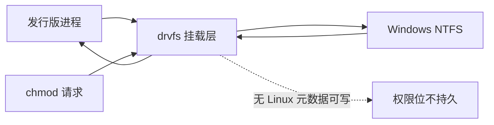
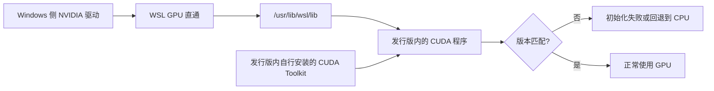

# Windows 挂载盘与 GPU 通路

在本仓库里执行 `ls -la` 会看到一个不太像 Linux 的现象：文件权限是 `-rwxrwxrwx`，属主是 `tc63`，但改权限位似乎没有作用。原因是这些文件根本不在 Linux 文件系统上——`/mnt/d` 只是 Windows 的 D 盘在发行版里的挂载点，权限由挂载选项统一决定，不来自文件本身。

同一台机器还要承担需要 GPU 的实验，例如 JAX 与渲染后端。发行版里看不到 NVIDIA 的安装包，但 `nvidia-smi` 能跑、CUDA 库也存在，库文件在 `/usr/lib/wsl/lib` 下。这两件事都属于「WSL 与主机的交界」，它们的工作方式与代价都来自挂载与驱动在两侧的分工。

## 1. /mnt/d 是怎么挂上来的

WSL 启动时会把 Windows 盘按固定规则挂到 `/mnt/<盘符>`，不需要手工写 `/etc/fstab`。这台机器上仓库位于 `/mnt/d/TC63PersonalWebsite`，因此在发行版里对仓库的所有读写实际都发生在 Windows 的 NTFS 分区上。

```bash
$ mount | grep '/mnt/d'
D:\ on /mnt/d type 9p (rw,noatime,aname=drvfs;path=D:\;uid=1000;gid=1000;...)
```

WSL2 通过 9p 协议把盘挂进来，`aname=drvfs` 保留了旧版 drvfs 的标识，`uid=1000;gid=1000` 是挂载时统一指定的属主，这也说明权限位由挂载层给出，不来自文件本身。

挂载点与选项由 WSL 默认提供，本仓库未见对 `[automount]` 段的自定义配置（见 01-发行版启动与systemd 的说明）。也就是说，挂载行为完全跟随 WSL 版本的默认值。

## 2. 权限位为什么是 777

drvfs 这类跨系统挂载默认不带 Linux 元数据：NTFS 的文件没有 UID/GID/权限位三段信息，挂载层用一组固定值顶替。本机看到的 `-rwxrwxrwx` 就是这组默认值。

因此 `chmod` 的结果不能按 Linux 语义理解：有时看似生效（挂载层改了展示值），有时完全无效（写回 NTFS 失败）。需要严格权限的场景（例如 `ssh` 私钥、`git` 的 `core.fileMode`）应当把文件放在发行版自己的 ext4 文件系统里，而不是 `/mnt` 下。



## 3. 跨文件系统访问的代价

跨系统访问要经过一层转换，单次读写延迟高于本地 ext4，大量小文件的场景差距最明显。前端项目安装依赖时产生的 `node_modules` 就是典型：几万个小文件，每个都走一遍转换。

经验做法是把「频繁读写的构建产物与依赖目录」放在 ext4 侧（例如 `~/work` 下的副本），源码可以继续留在 `/mnt/d`。仓库本身在 `/mnt/d` 上，这属于既定布局，代价体现在安装与构建耗时上。

| 操作 | 位置在 /mnt/d（NTFS） | 位置在 ~（ext4） |
| --- | --- | --- |
| 读取单个大文件 | 差别不大 | 略快 |
| 安装依赖（大量小文件） | 明显更慢 | 明显更快 |
| 文件监听（热更新） | 事件可能滞后 | 事件及时 |
| 与 Windows 工具协作 | 直接可见 | 需要跨系统访问 |

## 4. 大小写敏感与符号链接

NTFS 默认不区分大小写，ext4 区分。仓库在 `/mnt/d` 下时，`Foo.ts` 与 `foo.ts` 会被视为同一个文件；把同一份代码复制到 ext4 侧后，这种依赖大小写的导入会立刻报错。跨系统复制代码时这是最容易被忽略的一类差异。

符号链接也有边界：Windows 侧的链接需要相应权限才能创建，发行版里对 `/mnt` 下的链接操作因此不一定成功。仓库里如果需要链接，建议在 ext4 侧建。

## 5. GPU 通路

WSL2 的 GPU 走 GPU 直通：Windows 侧的驱动把设备暴露成 `/dev/dxg`，发行版里的程序通过这个设备把图形与计算调用交回主机驱动，不用在发行版里再装一份 Linux 版 NVIDIA 驱动。用户态库集中在 `/usr/lib/wsl/lib`，`libcuda.so` 对应 CUDA 运行时，`libd3d12.so` 是 Direct3D 12 的转发层。

```bash
$ ls /usr/lib/wsl/lib
libcuda.so
libcuda.so.1
libd3d12.so
...
$ nvidia-smi -L
GPU 0: NVIDIA GeForce RTX 5060 Laptop GPU (UUID: ...)
```

这套安排的好处是驱动版本只在 Windows 侧维护一份；代价是发行版内的 CUDA Toolkit 版本仍要自己装，并且必须与 Windows 驱动支持的版本匹配。CUDA 驱动与 WSL 的装配关系、渲染后端在 WSL 下的额外通路，本仓库已有两篇文档写过，见本页末尾的引用表。



挂载与 GPU 之外，WSL 与主机的交界还有两处：网络（见 02-镜像网络模式与两侧互访）与进程互调（`interop` 段，本机未配置）。把这几处放在一起看，能理解发行版并不是一台独立的机器。

## 6. 这套安排没覆盖的部分

本仓库未见针对 `/mnt` 的性能调优记录，也没有自定义 `/etc/fstab` 的痕迹；挂载完全走默认值。GPU 侧同样没有版本清单之类的工程文件，只有上游两篇文档中的结论。需要精确到版本的装配信息时，应当以那两篇与现场命令输出为准。

两类问题的共同点是「现象发生在发行版里，原因却可能在主机侧」。判断归属的办法是看路径与设备：路径以 `/mnt` 开头就属于挂载层，设备能力看 `/usr/lib/wsl/lib` 是否存在。

## 7. 排查顺序

遇到「文件读写异常」或「GPU 不可用」时，先分清问题属于哪一层：路径以 `/mnt` 开头就按跨系统挂载排查（权限位、大小写、符号链接），路径在 `~` 下就按普通 Linux 文件排查；GPU 则先看 `nvidia-smi` 是否可用，再看 `/usr/lib/wsl/lib` 是否存在，最后核对 CUDA 版本。

两个常见错误的对照如下，写下来是为了在排查时先按路径分流，而不是先怀疑代码：

| 现象 | 常见误判 | 实际原因 |
| --- | --- | --- |
| `chmod` 后权限不变 | 文件系统坏了 | drvfs 没有可写的权限元数据 |
| 同一份代码在另一台机器上报导入错误 | 代码有问题 | 大小写敏感性不同 |
| 构建明显变慢 | 依赖版本问题 | 大量小文件跨系统访问 |
| `nvidia-smi` 可用但没有 GPU 结果 | GPU 坏了 | CUDA Toolkit 与驱动版本不匹配 |
| 链接创建失败 | 权限不足 | Windows 侧链接权限限制 |

把结论写成「路径决定语义」比记住具体差异更好用：`/mnt` 下按跨系统挂载理解，`~` 下按 Linux 语义理解，两条规则能覆盖这里绝大多数现象。

## 8. 易错点

- 在 `/mnt` 下依赖权限位。这里没有可持久化的 Linux 元数据。
- 忽略大小写差异。同一份代码在 NTFS 与 ext4 下行为可能不同。
- 在 `/mnt` 下安装依赖并抱怨构建慢。跨系统访问大量小文件本身就慢。
- 在发行版里装 Linux 版 NVIDIA 驱动。驱动由 Windows 侧提供。
- 只看 CUDA Toolkit 版本不看驱动支持范围。两者必须匹配。
- 把跨系统挂载当成本地文件系统。元数据与性能都不是一套语义。
- 在报错时先怀疑代码。先按路径与设备分层排查。
- 认为链接在两侧等价。Windows 侧的链接有额外权限要求。
- 把热更新失效当成编辑器问题。文件监听的及时性受挂载层影响。

## 小结

核心概念：

| 概念 | 内容 |
| --- | --- |
| 挂载点 | `/mnt/<盘符>`，本机仓库在 `/mnt/d` |
| 权限位 | 由挂载层统一给出，本机显示 777 |
| 性能差异 | 大量小文件跨系统访问更慢 |
| 元数据差异 | NTFS 不区分大小写 |
| GPU 库 | `/usr/lib/wsl/lib` 下的 `libcuda.so` 等 |
| 驱动来源 | Windows 侧，发行版不装 Linux 驱动 |

设计权衡：

| 决策 | 选择 | 收益 | 代价 |
| --- | --- | --- | --- |
| 代码位置 | 留在 `/mnt/d` | Windows 工具直接可见 | 构建与小文件操作变慢 |
| 依赖位置 | 视项目而定 | 可放到 ext4 提速 | 两侧并存需要同步 |
| GPU 驱动 | 由 Windows 提供 | 只维护一份 | 版本受宿主限制 |
| 挂载配置 | 全默认 | 无维护成本 | 无针对性优化 |
| 排查入口 | 按路径分层 | 定位快 | 需要知道两侧差异 |

## 练习

### 基础题

1. 为什么 `/mnt/d` 下的文件权限显示为 777？
2. 哪一类操作在跨系统挂载上开销最明显？举一个例子。
3. 发行版里要不要安装 Linux 版 NVIDIA 驱动？为什么？

### 挑战题

4. 给出一套把仓库「源码留在 `/mnt/d`、依赖放到 ext4」的工作流，并说明同步策略。
5. 大小写差异会潜伏到什么时候才暴露？设计一个能在提交前发现它的检查办法。

### 附：本页引用的路径

| 路径 | 作用 |
| --- | --- |
| `/mnt/d/TC63PersonalWebsite` | 本仓库在 Windows 盘上的位置 |
| `/usr/lib/wsl/lib` | WSL 直通提供的 CUDA 与图形库 |
| `docs/12-JAX 与 Brax/05-环境搭建与依赖锁定/02-CUDA-驱动与WSL的装配关系.md` | CUDA 与驱动的装配说明 |
| `docs/15-仿真查看器与性能/02-渲染后端/01-WSL下的GPU通路.md` | 渲染通路说明 |
